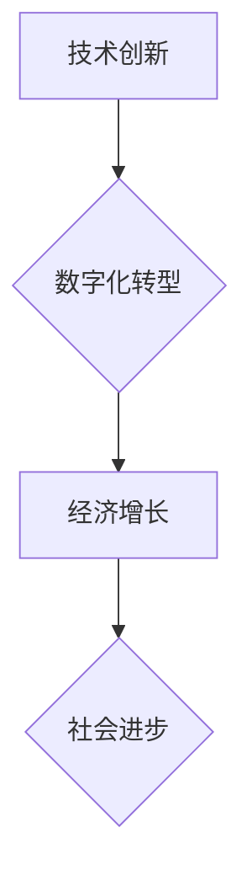

> 经济增速、放缓、技术创新、数字化转型、人工智能、大数据、云计算、网络安全、可持续发展

## 1. 背景介绍

全球经济近年来呈现出放缓的趋势，许多发达国家和新兴市场国家都面临着经济增长乏力的挑战。经济增速放缓的原因复杂多变，涉及到宏观经济、微观经济、技术创新、社会结构等多个方面。本文将从技术创新和数字化转型等角度出发，分析经济增速放缓的原因，并探讨应对措施。

## 2. 核心概念与联系

**2.1 技术创新与经济增长的关系**

技术创新是推动经济增长的关键动力。新技术、新产品、新服务不断涌现，提高生产效率、降低生产成本、创造新的市场需求，从而促进经济增长。

**2.2 数字化转型与经济增长的关系**

数字化转型是指利用信息技术和互联网技术，对企业、行业、社会进行数字化改造，提升效率、降低成本、创造新的价值。数字化转型是推动经济增长的重要引擎，可以促进产业升级、优化资源配置、提升竞争力。

**2.3 核心概念架构**



## 3. 核心算法原理 & 具体操作步骤

**3.1 算法原理概述**

经济增速放缓是一个复杂系统问题，需要运用多种算法和模型进行分析和预测。常见的算法包括：

* **时间序列分析:** 用于分析经济指标随时间变化的趋势和模式。
* **回归分析:** 用于研究经济指标之间的关系和影响因素。
* **机器学习:** 用于从大数据中识别经济增速放缓的潜在原因和预测未来趋势。

**3.2 算法步骤详解**

1. **数据收集:** 收集相关经济指标数据，例如GDP增长率、消费支出、投资额、就业率等。
2. **数据预处理:** 对数据进行清洗、转换、标准化等处理，以确保数据质量和算法的准确性。
3. **模型选择:** 根据具体问题和数据特点选择合适的算法模型。
4. **模型训练:** 使用训练数据训练模型，调整模型参数，使其能够准确预测经济增速。
5. **模型评估:** 使用测试数据评估模型的预测精度和可靠性。
6. **模型部署:** 将训练好的模型部署到实际应用场景中，用于预测经济增速和分析经济趋势。

**3.3 算法优缺点**

* **时间序列分析:** 优点是简单易懂，易于实现；缺点是只能分析历史数据，难以预测未来趋势。
* **回归分析:** 优点是能够识别经济指标之间的关系和影响因素；缺点是假设数据服从线性关系，难以处理复杂非线性关系。
* **机器学习:** 优点是能够从大数据中识别复杂模式，预测未来趋势；缺点是需要大量数据训练，模型解释性较差。

**3.4 算法应用领域**

经济增速预测算法广泛应用于以下领域：

* **宏观经济政策制定:** 帮助政府制定经济政策，促进经济稳定增长。
* **企业战略决策:** 帮助企业预测市场需求、制定生产计划、优化资源配置。
* **金融投资:** 帮助投资者分析市场风险、做出投资决策。

## 4. 数学模型和公式 & 详细讲解 & 举例说明

**4.1 数学模型构建**

经济增速可以表示为GDP增长率，可以用以下数学模型表示：

$$
\text{GDP增长率} = \frac{\text{GDP}_{t} - \text{GDP}_{t-1}}{\text{GDP}_{t-1}} \times 100\%
$$

其中：

* $\text{GDP}_{t}$ 表示t时期GDP
* $\text{GDP}_{t-1}$ 表示t-1时期GDP

**4.2 公式推导过程**

该公式的推导过程很简单，就是将GDP的增量除以前一期的GDP，再乘以100%，得到GDP增长率。

**4.3 案例分析与讲解**

假设2022年GDP为1000亿元，2023年GDP为1050亿元，则2023年的GDP增长率为：

$$
\text{GDP增长率} = \frac{1050 - 1000}{1000} \times 100\% = 5\%
$$

## 5. 项目实践：代码实例和详细解释说明

**5.1 开发环境搭建**

可以使用Python语言和相关库进行经济增速预测项目开发。需要安装Python环境，并安装以下库：

* NumPy: 用于数值计算
* Pandas: 用于数据处理和分析
* Scikit-learn: 用于机器学习算法

**5.2 源代码详细实现**

```python
import numpy as np
from sklearn.linear_model import LinearRegression

# 数据加载
data = pd.read_csv('economic_data.csv')

# 数据预处理
X = data[['消费支出', '投资额']]
y = data['GDP增长率']

# 模型训练
model = LinearRegression()
model.fit(X, y)

# 模型预测
new_data = pd.DataFrame({'消费支出': [1000], '投资额': [2000]})
predicted_growth = model.predict(new_data)

# 结果展示
print(f'预测的GDP增长率为: {predicted_growth[0]:.2f}%')
```

**5.3 代码解读与分析**

* 代码首先加载经济数据，并进行数据预处理，将相关特征作为输入变量，GDP增长率作为输出变量。
* 然后使用线性回归模型进行模型训练，训练模型能够从数据中学习出经济指标之间的关系。
* 最后使用训练好的模型对新的数据进行预测，并输出预测结果。

**5.4 运行结果展示**

运行代码后，会输出预测的GDP增长率。

## 6. 实际应用场景

经济增速预测算法在以下实际应用场景中发挥着重要作用：

* **宏观经济政策制定:** 政府可以使用经济增速预测模型，分析经济形势，制定相应的宏观经济政策，例如调整税收政策、货币政策等，以促进经济稳定增长。
* **企业战略决策:** 企业可以使用经济增速预测模型，预测未来市场需求，制定生产计划、投资决策，优化资源配置，提高企业竞争力。
* **金融投资:** 投资者可以使用经济增速预测模型，分析市场风险，做出投资决策，例如判断股票市场是否处于上涨趋势，选择合适的投资标的。

**6.4 未来应用展望**

随着人工智能、大数据等技术的不断发展，经济增速预测算法将更加精准、高效。未来，经济增速预测算法将应用于更广泛的领域，例如：

* **区域经济发展规划:** 帮助政府制定区域经济发展规划，促进区域经济协调发展。
* **产业结构调整:** 帮助企业进行产业结构调整，适应市场变化，提高产业竞争力。
* **个人财务规划:** 帮助个人进行财务规划，制定理财策略，实现财富增值。

## 7. 工具和资源推荐

**7.1 学习资源推荐**

* **书籍:**
    * 《经济学原理》
    * 《时间序列分析》
    * 《机器学习》
* **在线课程:**
    * Coursera: 经济学、数据科学、机器学习课程
    * edX: 经济学、数据分析、编程课程

**7.2 开发工具推荐**

* **Python:** 编程语言
* **NumPy:** 数值计算库
* **Pandas:** 数据处理和分析库
* **Scikit-learn:** 机器学习库
* **Jupyter Notebook:** 数据分析和可视化工具

**7.3 相关论文推荐**

* **经济增速预测模型研究**
* **机器学习在经济增速预测中的应用**
* **大数据分析在经济增速预测中的应用**

## 8. 总结：未来发展趋势与挑战

**8.1 研究成果总结**

本文分析了经济增速放缓的原因，并探讨了技术创新和数字化转型在经济增长的作用。介绍了经济增速预测算法的原理、步骤、应用场景，并推荐了相关学习资源和开发工具。

**8.2 未来发展趋势**

未来，经济增速预测算法将更加精准、高效，应用于更广泛的领域。人工智能、大数据、云计算等技术的不断发展将推动经济增速预测算法的进步。

**8.3 面临的挑战**

经济增速预测算法仍然面临一些挑战，例如：

* 数据质量问题: 经济数据往往存在缺失、错误、不完整等问题，需要进行有效的数据清洗和处理。
* 模型复杂性问题: 经济系统是一个复杂系统，需要使用更加复杂的模型来进行预测。
* 预测精度问题: 经济增速预测是一个具有不确定性的问题，预测精度仍然存在局限性。

**8.4 研究展望**

未来研究方向包括：

* 开发更加精准、高效的经济增速预测算法。
* 研究如何利用人工智能技术提高经济增速预测的准确性。
* 探索经济增速预测算法在更多领域的应用。


## 9. 附录：常见问题与解答

**9.1 如何选择合适的经济增速预测算法？**

选择合适的经济增速预测算法需要根据具体问题和数据特点进行选择。

* 如果数据量较小，可以使用时间序列分析或回归分析。
* 如果数据量较大，可以使用机器学习算法，例如支持向量机、神经网络等。

**9.2 如何评估经济增速预测模型的精度？**

可以使用多种指标来评估经济增速预测模型的精度，例如均方误差、平均绝对误差、R平方等。

**9.3 如何处理经济数据中的缺失值？**

可以采用多种方法处理经济数据中的缺失值，例如插值法、平均值法、最小二乘法等。

作者：禅与计算机程序设计艺术 / Zen and the Art of Computer Programming


<end_of_turn>