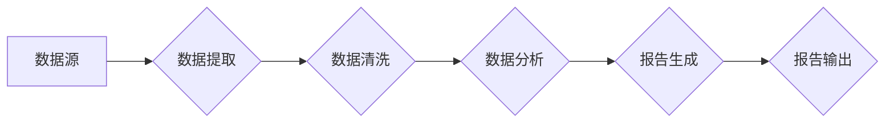

> 自动化报告生成, AI, 自然语言处理, 机器学习, 数据可视化, 编程自动化, 软件开发

## 1. 背景介绍

在当今数据爆炸的时代，企业和组织每天都会产生海量的业务数据。这些数据蕴藏着宝贵的洞察力和价值，但如何有效地提取、分析和呈现这些数据却是一个巨大的挑战。传统的报告生成方式往往耗时费力，难以满足快速发展的业务需求。

自动化报告生成技术应运而生，它利用人工智能（AI）和机器学习（ML）等先进技术，自动提取、分析和生成高质量的报告，极大地提高了效率和准确性。

## 2. 核心概念与联系

自动化报告生成的核心概念包括：

* **数据提取:** 从各种数据源（如数据库、文件、API等）中提取相关数据。
* **数据清洗:** 对提取的数据进行清洗和预处理，去除噪声和不完整的数据。
* **数据分析:** 使用统计分析、机器学习等方法对数据进行分析，发现趋势和模式。
* **报告生成:** 将分析结果以可读、可理解的方式呈现，生成报告文档。

**Mermaid 流程图:**



## 3. 核心算法原理 & 具体操作步骤

### 3.1  算法原理概述

自动化报告生成通常采用以下几种算法原理：

* **规则引擎:** 基于预定义的规则和模板，自动生成报告。
* **机器学习:** 使用机器学习算法，从历史数据中学习生成报告的模式。
* **深度学习:** 使用深度神经网络，对数据进行更深入的理解和分析，生成更精准的报告。

### 3.2  算法步骤详解

**规则引擎:**

1. 定义规则模板，指定报告的结构和内容。
2. 根据数据源提取数据，并进行清洗和转换。
3. 使用规则引擎匹配数据与模板，生成报告内容。
4. 将报告内容格式化并输出。

**机器学习:**

1. 收集历史报告数据和对应的数据源。
2. 使用机器学习算法，训练模型，学习生成报告的模式。
3. 将新数据输入模型，预测报告内容。
4. 格式化报告内容并输出。

**深度学习:**

1. 使用深度神经网络，对数据进行多层特征提取和学习。
2. 训练模型，学习生成报告的结构和内容。
3. 将新数据输入模型，生成报告内容。
4. 格式化报告内容并输出。

### 3.3  算法优缺点

| 算法类型 | 优点 | 缺点 |
|---|---|---|
| 规则引擎 | 易于理解和维护，可控制性强 | 难以处理复杂场景，规则维护成本高 |
| 机器学习 | 可自动学习复杂模式，适应性强 | 需要大量训练数据，模型解释性差 |
| 深度学习 | 表现力强，可处理更复杂的数据 | 训练成本高，模型复杂度高 |

### 3.4  算法应用领域

自动化报告生成技术广泛应用于以下领域：

* **金融行业:** 生成财务报表、风险报告、客户分析报告等。
* **医疗行业:** 生成病历报告、诊断结果、患者追踪报告等。
* **电商行业:** 生成销售报表、客户行为分析报告、商品推荐报告等。
* **教育行业:** 生成学生成绩报告、学习进度分析报告、教学效果评估报告等。

## 4. 数学模型和公式 & 详细讲解 & 举例说明

### 4.1  数学模型构建

在自动化报告生成中，可以使用数学模型来描述数据之间的关系，并进行预测和分析。例如，可以使用线性回归模型来预测销售额，或者使用聚类算法来将客户进行分组。

### 4.2  公式推导过程

假设我们想要使用线性回归模型来预测销售额。线性回归模型的公式如下：

$$y = mx + c$$

其中：

* $y$ 是销售额
* $x$ 是广告投入
* $m$ 是斜率
* $c$ 是截距

为了确定 $m$ 和 $c$ 的值，我们需要使用最小二乘法。最小二乘法的目标是找到一条直线，使得直线与数据点的距离最小。

### 4.3  案例分析与讲解

假设我们有以下数据：

| 广告投入 (x) | 销售额 (y) |
|---|---|
| 1000 | 5000 |
| 2000 | 10000 |
| 3000 | 15000 |

我们可以使用最小二乘法来计算 $m$ 和 $c$ 的值。

通过计算，我们可以得到 $m = 5$ 和 $c = 0$。因此，线性回归模型的方程为：

$$y = 5x$$

这意味着，每增加 1000 元的广告投入，销售额就会增加 5000 元。

## 5. 项目实践：代码实例和详细解释说明

### 5.1  开发环境搭建

为了实现自动化报告生成，我们可以使用 Python 语言和相关的库，例如：

* **Pandas:** 用于数据处理和分析。
* **NumPy:** 用于数值计算。
* **Matplotlib:** 用于数据可视化。
* **ReportLab:** 用于生成 PDF 报告。

### 5.2  源代码详细实现

```python
import pandas as pd
import matplotlib.pyplot as plt

# 读取数据
data = pd.read_csv('sales_data.csv')

# 计算销售额趋势
sales_trend = data['Sales'].rolling(window=3).mean()

# 生成图表
plt.plot(data['Date'], sales_trend)
plt.title('销售额趋势')
plt.xlabel('日期')
plt.ylabel('销售额')
plt.show()

# 生成报告
from reportlab.pdfgen import canvas

c = canvas.Canvas('sales_report.pdf')

c.drawString(100, 750, '销售额报告')

c.drawString(100, 700, '日期')
c.drawString(200, 700, '销售额')

for i in range(len(data)):
    c.drawString(100, 650 - i * 20, data['Date'][i])
    c.drawString(200, 650 - i * 20, data['Sales'][i])

c.save()
```

### 5.3  代码解读与分析

这段代码首先使用 Pandas 库读取销售数据，然后使用 NumPy 库计算销售额趋势。接着，使用 Matplotlib 库生成图表，并使用 ReportLab 库生成 PDF 报告。

### 5.4  运行结果展示

运行这段代码后，会生成一个名为 `sales_report.pdf` 的 PDF 报告文件，其中包含销售额趋势图表和销售数据表格。

## 6. 实际应用场景

自动化报告生成技术在各个行业都有广泛的应用场景：

### 6.1  金融行业

* **风险管理:** 自动生成风险报告，分析投资组合风险，帮助金融机构进行风险控制。
* **客户分析:** 自动生成客户画像报告，分析客户行为和偏好，帮助金融机构进行精准营销。
* **财务报表:** 自动生成财务报表，提高财务报表生成效率，降低人工成本。

### 6.2  医疗行业

* **病历分析:** 自动生成病历摘要报告，帮助医生快速了解患者病情。
* **诊断结果:** 自动生成诊断结果报告，提高诊断效率和准确性。
* **患者追踪:** 自动生成患者追踪报告，帮助医院进行患者管理和 follow-up。

### 6.3  电商行业

* **销售分析:** 自动生成销售报表，分析商品销售情况，帮助电商平台进行商品管理和促销策略制定。
* **客户行为分析:** 自动生成客户行为分析报告，分析客户购买习惯和偏好，帮助电商平台进行精准营销。
* **物流追踪:** 自动生成物流追踪报告，帮助电商平台进行物流管理和优化。

### 6.4  未来应用展望

随着人工智能技术的不断发展，自动化报告生成技术将更加智能化、个性化和自动化。未来，我们可以期待以下应用场景：

* **智能报告生成:** 基于自然语言处理技术，用户可以口头或文字描述需要生成的内容，系统自动生成符合要求的报告。
* **个性化报告:** 根据用户的需求和偏好，生成个性化的报告，例如，可以根据用户的角色和权限，生成不同的报告内容。
* **实时报告:** 基于实时数据流，可以生成实时更新的报告，帮助用户及时了解最新的情况。

## 7. 工具和资源推荐

### 7.1  学习资源推荐

* **书籍:**
    * "Python for Data Analysis" by Wes McKinney
    * "Hands-On Machine Learning with Scikit-Learn, Keras & TensorFlow" by Aurélien Géron
* **在线课程:**
    * Coursera: Machine Learning
    * edX: Artificial Intelligence
* **博客和网站:**
    * Towards Data Science
    * Machine Learning Mastery

### 7.2  开发工具推荐

* **Python:** 
    * Pandas
    * NumPy
    * Matplotlib
    * ReportLab
* **Jupyter Notebook:** 用于数据分析和可视化
* **Git:** 用于代码版本控制

### 7.3  相关论文推荐

* "Automated Report Generation Using Deep Learning"
* "A Survey of Automated Report Generation Techniques"

## 8. 总结：未来发展趋势与挑战

### 8.1  研究成果总结

自动化报告生成技术取得了显著的进展，能够有效地提高报告生成效率和准确性。

### 8.2  未来发展趋势

未来，自动化报告生成技术将朝着以下方向发展：

* **更智能化:** 利用更先进的人工智能算法，实现更智能的报告生成，例如，能够理解用户需求，自动生成个性化的报告。
* **更自动化:** 通过自动化流程，实现端到端的报告生成，从数据提取到报告输出，无需人工干预。
* **更可视化:** 利用更丰富的可视化技术，生成更直观、易懂的报告，帮助用户更好地理解数据。

### 8.3  面临的挑战

自动化报告生成技术也面临一些挑战：

* **数据质量:** 报告生成质量取决于数据质量，如果数据不准确或不完整，生成的报告也会存在问题。
* **复杂场景:** 对于复杂场景，例如需要进行多维度分析或生成多类型报告，自动化生成仍然存在困难。
* **解释性:** 一些人工智能算法的决策过程难以解释，这可能会导致用户对报告结果缺乏信任。

### 8.4  研究展望

未来，我们需要继续研究以下问题：

* 如何提高数据质量，确保报告生成准确性。
* 如何处理复杂场景，实现更智能的报告生成。
* 如何提高人工智能算法的解释性，增强用户对报告结果的信任。


## 9. 附录：常见问题与解答

**Q1: 自动化报告生成技术是否会取代人工报告生成？**

**A1:** 自动化报告生成技术可以提高报告生成效率和准确性，但它并不会完全取代人工报告生成。对于需要进行深入分析、解释和决策的报告，人工仍然是不可替代的。

**Q2: 如何选择合适的自动化报告生成工具？**

**A2:** 选择合适的工具需要根据具体的需求和场景进行考虑。例如，对于需要生成图表和可视化报告的场景，可以选择使用 Matplotlib 或 ReportLab 等工具。对于需要进行复杂数据分析的场景，可以选择使用 Pandas 或 Scikit-learn 等工具。

**Q3: 如何保证自动化报告生成的准确性？**

**A3:** 确保报告准确性需要从多个方面入手，例如：

* 使用高质量的数据源。
* 选择合适的算法和模型。
* 对生成的报告进行人工审核和校对。


作者：禅与计算机程序设计艺术 / Zen and the Art of Computer Programming 
<end_of_turn>