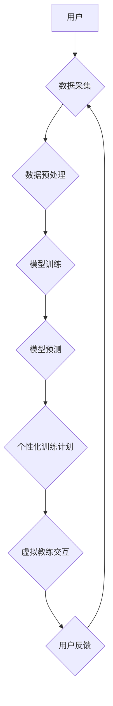

> AI，虚拟健身教练，个性化训练，机器学习，深度学习，计算机视觉，自然语言处理，健康科技

## 1. 背景介绍

近年来，健身行业蓬勃发展，人们对健康和健身意识不断提高。然而，传统健身模式存在诸多局限性，例如：

* **缺乏个性化：** 传统的健身课程往往无法满足不同用户的个性化需求，导致训练效果不佳。
* **成本高昂：** 私人教练费用昂贵，难以普及。
* **时间限制：** 传统的健身课程时间固定，难以满足用户灵活的训练需求。

人工智能技术的快速发展为健身行业带来了新的机遇。虚拟健身教练作为一种基于人工智能的创新健身模式，正在逐渐改变人们的健身方式。

## 2. 核心概念与联系

虚拟健身教练是一种利用人工智能技术，模拟真人教练功能的智能系统。它可以根据用户的健身目标、身体状况、训练历史等信息，制定个性化的训练计划，并实时提供指导和反馈。

**核心概念：**

* **人工智能 (AI)：** 指能够模拟人类智能行为的计算机系统。
* **机器学习 (ML)：** 一种人工智能技术，通过算法从数据中学习，不断提高预测和决策能力。
* **深度学习 (DL)：** 一种更高级的机器学习技术，利用多层神经网络模拟人类大脑的学习过程。
* **计算机视觉 (CV)：** 使计算机能够“看”和理解图像和视频的技术。
* **自然语言处理 (NLP)：** 使计算机能够理解和处理人类语言的技术。

**架构图：**



## 3. 核心算法原理 & 具体操作步骤

### 3.1  算法原理概述

虚拟健身教练的核心算法主要包括：

* **个性化训练计划生成算法：** 根据用户的健身目标、身体状况、训练历史等信息，生成个性化的训练计划。
* **动作识别算法：** 利用计算机视觉技术识别用户的动作，并提供反馈和指导。
* **语音交互算法：** 利用自然语言处理技术，实现虚拟教练与用户的语音交互。

### 3.2  算法步骤详解

**个性化训练计划生成算法：**

1. 收集用户数据：包括用户的健身目标、身体状况、训练历史、饮食习惯等信息。
2. 数据预处理：对收集到的数据进行清洗、转换和特征提取。
3. 模型训练：利用机器学习算法，训练一个个性化训练计划生成模型。
4. 生成训练计划：根据用户的个人信息，模型生成个性化的训练计划，包括训练动作、训练强度、训练时间等。

**动作识别算法：**

1. 视频采集：利用摄像头采集用户的训练视频。
2. 视频预处理：对视频进行降噪、去模糊等处理。
3. 特征提取：提取视频中的关键特征，例如人体关键点、动作轨迹等。
4. 动作识别：利用深度学习算法，识别用户的动作类型。
5. 提供反馈：根据动作识别结果，提供用户的动作指导和反馈。

**语音交互算法：**

1. 语音采集：利用麦克风采集用户的语音输入。
2. 语音识别：利用自然语言处理技术，将语音识别为文本。
3. 语义理解：理解用户的语音指令和需求。
4. 语音合成：利用语音合成技术，生成虚拟教练的语音回复。

### 3.3  算法优缺点

**优点：**

* **个性化：** 可以根据用户的个人信息，生成个性化的训练计划。
* **可访问性：** 随时随地都可以进行训练，不受时间和地点限制。
* **成本效益：** 相比于私人教练，虚拟健身教练的成本更低。

**缺点：**

* **技术限制：** 目前动作识别和语音交互技术还存在一定的局限性。
* **缺乏人际互动：** 虚拟健身教练无法提供真人教练的鼓励和支持。
* **安全风险：** 用户在进行训练时，存在一定的安全风险。

### 3.4  算法应用领域

虚拟健身教练的应用领域非常广泛，包括：

* **个人健身：** 为个人用户提供个性化的健身训练计划和指导。
* **健身房：** 为健身房提供智能化的健身服务，例如自动生成训练计划、实时监控用户训练状态等。
* **医疗保健：** 为康复患者提供个性化的康复训练计划。
* **体育训练：** 为运动员提供个性化的训练计划和数据分析。

## 4. 数学模型和公式 & 详细讲解 & 举例说明

### 4.1  数学模型构建

虚拟健身教练的个性化训练计划生成算法通常采用基于机器学习的模型，例如回归模型、分类模型或推荐模型。

**回归模型：** 用于预测连续型变量，例如用户的训练强度、训练时间等。

**分类模型：** 用于分类离散型变量，例如用户的健身目标、训练类型等。

**推荐模型：** 用于推荐用户可能感兴趣的训练动作或训练计划。

### 4.2  公式推导过程

具体的数学公式和推导过程取决于所选用的机器学习模型。

例如，对于回归模型，常用的损失函数是均方误差 (MSE)：

$$MSE = \frac{1}{n} \sum_{i=1}^{n} (y_i - \hat{y}_i)^2$$

其中：

* $y_i$ 是真实值
* $\hat{y}_i$ 是预测值
* $n$ 是样本数量

模型训练的目标是通过优化损失函数，找到最优的模型参数。

### 4.3  案例分析与讲解

假设我们想要构建一个预测用户训练强度的回归模型。我们可以收集用户的训练历史数据，包括训练动作、训练时间、训练强度等信息。然后，我们可以使用线性回归模型来预测用户的训练强度。

线性回归模型的公式如下：

$$\hat{y} = \beta_0 + \beta_1 x_1 + \beta_2 x_2 + ... + \beta_n x_n$$

其中：

* $\hat{y}$ 是预测的训练强度
* $\beta_0$ 是截距
* $\beta_1, \beta_2, ..., \beta_n$ 是模型参数
* $x_1, x_2, ..., x_n$ 是用户的训练历史数据

通过训练模型，我们可以得到最优的模型参数，从而预测用户的训练强度。

## 5. 项目实践：代码实例和详细解释说明

### 5.1  开发环境搭建

虚拟健身教练的开发环境通常包括：

* **操作系统：** Windows、macOS、Linux
* **编程语言：** Python、C++、Java
* **深度学习框架：** TensorFlow、PyTorch、Keras
* **计算机视觉库：** OpenCV、Dlib
* **自然语言处理库：** NLTK、spaCy

### 5.2  源代码详细实现

以下是一个使用 Python 和 TensorFlow 实现动作识别的简单代码示例：

```python
import tensorflow as tf

# 加载预训练的模型
model = tf.keras.applications.MobileNetV2(weights='imagenet')

# 预处理图像
def preprocess_image(image):
  image = tf.image.resize(image, (224, 224))
  image = tf.keras.applications.mobilenet_v2.preprocess_input(image)
  return image

# 预测动作
def predict_action(image):
  preprocessed_image = preprocess_image(image)
  predictions = model.predict(preprocessed_image[tf.newaxis, ...])
  # ... (将预测结果转换为动作类别)

# ... (加载图像并预测动作)
```

### 5.3  代码解读与分析

这段代码首先加载了一个预训练的 MobileNetV2 模型，该模型已经训练好了图像分类任务。然后，它定义了一个 `preprocess_image` 函数，用于预处理输入图像，使其符合模型的输入要求。

`predict_action` 函数则负责预测图像中的动作类别。它首先预处理图像，然后使用模型进行预测，并将预测结果转换为动作类别。

### 5.4  运行结果展示

运行这段代码后，可以得到预测的动作类别。例如，如果输入图像是一个人举重，则预测结果可能是 "举重"。

## 6. 实际应用场景

### 6.1  个人健身

虚拟健身教练可以为个人用户提供个性化的健身训练计划和指导，帮助用户实现健身目标。

### 6.2  健身房

虚拟健身教练可以为健身房提供智能化的健身服务，例如自动生成训练计划、实时监控用户训练状态等，提高健身房的运营效率和用户体验。

### 6.3  医疗保健

虚拟健身教练可以为康复患者提供个性化的康复训练计划，帮助他们恢复健康。

### 6.4  未来应用展望

虚拟健身教练的应用场景还在不断扩展，未来可能会应用于更多领域，例如：

* **远程医疗：** 为远程患者提供个性化的健身指导。
* **教育培训：** 为健身教练提供培训和学习资源。
* **智能家居：** 与智能家居设备集成，提供更智能化的健身体验。

## 7. 工具和资源推荐

### 7.1  学习资源推荐

* **在线课程：** Coursera、edX、Udacity 等平台提供人工智能、机器学习、计算机视觉等方面的在线课程。
* **书籍：** 《深度学习》、《机器学习实战》等书籍可以帮助你深入了解人工智能相关知识。
* **开源项目：** TensorFlow、PyTorch 等开源项目可以帮助你实践人工智能技术。

### 7.2  开发工具推荐

* **编程语言：** Python、C++、Java
* **深度学习框架：** TensorFlow、PyTorch、Keras
* **计算机视觉库：** OpenCV、Dlib
* **自然语言处理库：** NLTK、spaCy

### 7.3  相关论文推荐

* **动作识别：** "Two-Stream Convolutional Networks for Action Recognition"
* **语音交互：** "Sequence to Sequence Learning with Neural Networks"
* **个性化推荐：** "Collaborative Filtering for Recommender Systems"

## 8. 总结：未来发展趋势与挑战

### 8.1  研究成果总结

虚拟健身教练作为一种基于人工智能的创新健身模式，取得了显著的成果。

* **个性化训练：** 能够根据用户的个人信息，生成个性化的训练计划。
* **可访问性：** 随时随地都可以进行训练，不受时间和地点限制。
* **成本效益：** 相比于私人教练，虚拟健身教练的成本更低。

### 8.2  未来发展趋势

虚拟健身教练的未来发展趋势包括：

* **更智能化的训练计划生成：** 利用更先进的机器学习算法，生成更精准、更有效的训练计划。
* **更逼真的虚拟教练：** 利用虚拟现实 (VR) 和增强现实 (AR) 技术，打造更逼真的虚拟教练体验。
* **更丰富的健身内容：** 提供更多样的健身内容，例如瑜伽、普拉提、舞蹈等。

### 8.3  面临的挑战

虚拟健身教练也面临一些挑战：

* **技术限制：** 目前动作识别和语音交互技术还存在一定的局限性。
* **缺乏人际互动：** 虚拟健身教练无法提供真人教练的鼓励和支持。
* **安全风险：** 用户在进行训练时，存在一定的安全风险。

### 8.4  研究展望

未来，虚拟健身教练的研究方向将集中在以下几个方面：

* **提高动作识别和语音交互的准确性。**
* **开发更智能化的训练计划生成算法。**
* **打造更逼真的虚拟教练体验。**
* **解决虚拟健身教练的安全风险问题。**

## 9. 附录：常见问题与解答

**常见问题：**

* **虚拟健身教练是否安全？**

**解答：** 虚拟健身教练的安全性取决于用户的