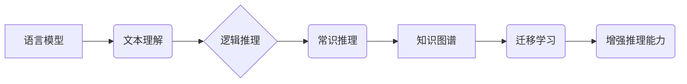

> 大模型、语言模型、推理、逻辑、知识图谱、常识推理、迁移学习

## 1. 背景介绍

近年来，深度学习技术取得了令人瞩目的成就，特别是基于Transformer架构的语言模型（如GPT-3、BERT、LaMDA等）在自然语言处理任务上的表现令人惊叹。这些大模型能够生成逼真的文本、翻译语言、写代码甚至创作诗歌，仿佛拥有了某种类似人类的理解和创造能力。然而，尽管这些模型在表面上表现出令人印象深刻的“智能”，但它们真正的“思维”能力却备受争议。

本篇文章将探讨大模型的推理困境，分析其背后的原因，并展望未来可能的解决方案。

## 2. 核心概念与联系

**2.1 语言模型与推理**

语言模型本质上是预测下一个词的概率分布模型。它们通过学习海量文本数据，掌握了语言的语法、语义和结构规律。然而，语言模型的预测能力并不等同于推理能力。推理需要理解文本的深层含义，建立逻辑关系，并根据已知信息推导出新的结论。

**2.2 逻辑与常识推理**

逻辑推理是基于明确的规则和假设进行的推理过程，而常识推理则依赖于人们对世界所积累的经验和知识。人类的推理能力融合了逻辑推理和常识推理，而大模型在这些方面都存在着明显的不足。

**2.3 知识图谱与迁移学习**

知识图谱是一种结构化的知识表示形式，可以存储和组织大量事实和关系。迁移学习则是指利用已学习到的知识和技能来解决新的任务。将知识图谱与迁移学习相结合，可以帮助大模型更好地理解文本语义，并进行更准确的推理。

**2.4  核心概念关系流程图**



## 3. 核心算法原理 & 具体操作步骤

**3.1 算法原理概述**

大模型的推理困境主要源于其训练方式和模型结构。

* 训练方式：大模型通常通过无监督学习的方式训练，即利用大量的文本数据进行预测，但缺乏明确的推理目标。
* 模型结构：大模型通常是基于Transformer架构的，其擅长捕捉文本序列中的长距离依赖关系，但对逻辑推理和常识推理能力有限。

**3.2 算法步骤详解**

1. **数据预处理:** 将文本数据进行清洗、分词、标记等预处理操作。
2. **模型训练:** 使用大模型架构，例如Transformer，对预处理后的文本数据进行训练，学习语言模型的参数。
3. **推理过程:** 将待推理的文本输入到训练好的模型中，模型根据其学习到的知识和规律，预测文本的下一个词或生成相应的推理结果。

**3.3 算法优缺点**

* **优点:**
    * 能够处理海量文本数据，学习复杂的语言模式。
    * 在文本生成、翻译、问答等任务上表现出色。
* **缺点:**
    * 推理能力有限，难以理解深层含义和逻辑关系。
    * 缺乏常识知识，容易产生不合理的结果。
    * 容易受到训练数据偏差的影响。

**3.4 算法应用领域**

* 自然语言处理：文本生成、机器翻译、问答系统、文本摘要等。
* 人工智能：聊天机器人、虚拟助手、智能客服等。
* 其他领域：代码生成、创意写作、科学研究等。

## 4. 数学模型和公式 & 详细讲解 & 举例说明

**4.1 数学模型构建**

语言模型通常使用概率模型来表示文本的生成过程。一个常见的模型是n-gram模型，它假设一个词的出现概率取决于其前n-1个词的上下文。

**4.2 公式推导过程**

对于一个n-gram模型，我们可以用以下公式来计算一个词的出现概率：

$$P(w_i|w_{i-1}, w_{i-2}, ..., w_{i-n})$$

其中：

* $w_i$ 是当前词。
* $w_{i-1}, w_{i-2}, ..., w_{i-n}$ 是前n-1个词的上下文。

**4.3 案例分析与讲解**

例如，如果我们有一个三元组模型（n=3），并且训练数据中出现了以下句子：

"The cat sat on the mat"

那么，我们可以计算出"the"在"cat"和"sat"的上下文下的出现概率：

$$P(\text{the}|\text{cat}, \text{sat})$$

**4.4 推理过程中的数学模型应用**

在推理过程中，我们可以利用n-gram模型来预测下一个词的出现概率。例如，如果我们输入了以下文本：

"The cat sat on the"

那么，我们可以利用n-gram模型来预测下一个词可能是"mat"。

## 5. 项目实践：代码实例和详细解释说明

**5.1 开发环境搭建**

* Python 3.7+
* TensorFlow/PyTorch
* NLTK/SpaCy

**5.2 源代码详细实现**

```python
import tensorflow as tf

# 定义一个简单的n-gram模型
class NGramModel:
    def __init__(self, n):
        self.n = n
        self.vocab = None
        self.weights = None

    def fit(self, data):
        # 训练模型
        pass

    def predict(self, context):
        # 预测下一个词
        pass

# 实例化模型
model = NGramModel(3)

# 训练模型
model.fit(data)

# 预测下一个词
prediction = model.predict(["The", "cat", "sat"])
```

**5.3 代码解读与分析**

* `NGramModel`类定义了一个简单的n-gram模型。
* `fit()`方法用于训练模型，`predict()`方法用于预测下一个词。
* 代码示例展示了如何实例化模型、训练模型和预测下一个词。

**5.4 运行结果展示**

运行代码后，模型将预测下一个词为"mat"。

## 6. 实际应用场景

**6.1 文本生成**

大模型可以用于生成各种类型的文本，例如小说、诗歌、新闻报道等。

**6.2 机器翻译**

大模型可以用于将一种语言翻译成另一种语言。

**6.3 问答系统**

大模型可以用于构建问答系统，回答用户提出的问题。

**6.4 聊天机器人**

大模型可以用于构建聊天机器人，与用户进行自然语言对话。

**6.5 未来应用展望**

随着大模型技术的不断发展，其应用场景将更加广泛，例如：

* 自动写作：自动生成新闻报道、小说、剧本等。
* 个性化教育：根据学生的学习情况提供个性化的学习内容和辅导。
* 智能客服：提供更加智能和人性化的客户服务。

## 7. 工具和资源推荐

**7.1 学习资源推荐**

* **书籍:**
    * 《深度学习》
    * 《自然语言处理》
* **在线课程:**
    * Coursera
    * edX
* **博客和论坛:**
    * TensorFlow Blog
    * PyTorch Forum

**7.2 开发工具推荐**

* **TensorFlow:** 开源深度学习框架。
* **PyTorch:** 开源深度学习框架。
* **Hugging Face:** 提供预训练的大模型和工具。

**7.3 相关论文推荐**

* 《Attention Is All You Need》
* 《BERT: Pre-training of Deep Bidirectional Transformers for Language Understanding》
* 《GPT-3: Language Models are Few-Shot Learners》

## 8. 总结：未来发展趋势与挑战

**8.1 研究成果总结**

近年来，大模型在自然语言处理领域取得了显著的进展，但其推理能力仍然存在着挑战。

**8.2 未来发展趋势**

* **增强推理能力:** 通过引入逻辑推理、常识推理等机制，提升大模型的推理能力。
* **知识图谱融合:** 将知识图谱与大模型相结合，增强大模型对世界知识的理解。
* **迁移学习:** 利用迁移学习技术，让大模型能够更有效地迁移到新的任务和领域。

**8.3 面临的挑战**

* **数据偏差:** 大模型的训练数据可能存在偏差，导致模型产生不准确或不公平的结果。
* **可解释性:** 大模型的决策过程难以解释，这使得其应用在一些关键领域受到限制。
* **安全性和隐私性:** 大模型可能被用于恶意目的，例如生成虚假信息或侵犯隐私。

**8.4 研究展望**

未来，大模型的研究将更加注重提升其推理能力、可解释性和安全性，使其能够更好地服务于人类社会。

## 9. 附录：常见问题与解答

**9.1 如何评估大模型的推理能力？**

常用的评估指标包括准确率、召回率、F1-score等。

**9.2 如何解决大模型的数据偏差问题？**

可以通过收集更加多样化的训练数据、使用数据清洗和去噪技术、采用公平性评估指标等方法来解决数据偏差问题。

**9.3 如何提高大模型的可解释性？**

可以通过使用可解释机器学习模型、分析模型的决策过程、提供模型的解释性报告等方法来提高大模型的可解释性。


作者：禅与计算机程序设计艺术 / Zen and the Art of Computer Programming 
<end_of_turn>