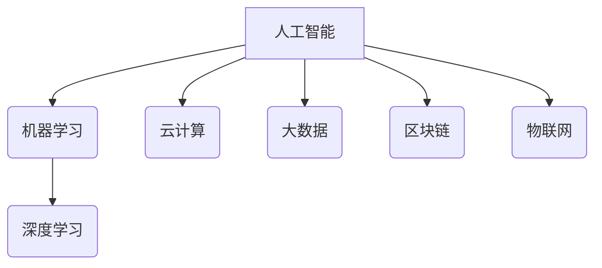

>  人工智能、机器学习、深度学习、云计算、大数据、区块链、物联网

## 1. 背景介绍

科技行业发展日新月异，新技术层出不穷，对企业发展的影响越来越深远。为了保持竞争优势，企业需要紧跟科技发展趋势，及时把握机遇，进行技术创新。然而，科技发展趋势错综复杂，企业难以独立进行全面跟踪和分析。因此，建立一个有效的科技趋势跟踪和分析体系，为企业决策提供支持，显得尤为重要。

## 2. 核心概念与联系

科技发展趋势的跟踪和分析涉及多个核心概念，包括人工智能、机器学习、深度学习、云计算、大数据、区块链、物联网等。这些概念相互关联，共同推动着科技的进步。

**2.1 人工智能 (AI)**

人工智能是指模拟人类智能的计算机系统。它涵盖了多个领域，例如机器学习、自然语言处理、计算机视觉等。

**2.2 机器学习 (ML)**

机器学习是人工智能的一个子领域，它通过算法使计算机能够从数据中学习，并根据学习到的知识进行预测或决策。

**2.3 深度学习 (DL)**

深度学习是机器学习的一个子领域，它使用多层神经网络来模拟人类大脑的学习过程。深度学习在图像识别、语音识别、自然语言处理等领域取得了突破性进展。

**2.4 云计算**

云计算是指通过互联网提供计算资源、存储资源和软件服务的模式。它具有弹性、可扩展性和成本效益等特点，为企业提供了灵活的 IT 基础设施。

**2.5 大数据**

大数据是指海量、高速度、高多样性的数据。大数据分析可以帮助企业挖掘数据中的价值，洞察市场趋势，优化运营策略。

**2.6 区块链**

区块链是一种分布式账本技术，它可以记录和验证交易信息，并确保数据的安全性和不可篡改性。区块链技术在金融、供应链管理、身份认证等领域具有广泛的应用前景。

**2.7 物联网 (IoT)**

物联网是指通过传感器、网络和数据分析技术，将物理设备连接到互联网，实现设备之间的互联互通。物联网可以收集海量设备数据，为企业提供实时监控、远程控制和智能决策等功能。

**2.8 核心概念联系**

这些核心概念相互关联，共同推动着科技的进步。例如，人工智能可以利用大数据进行训练，深度学习可以提高人工智能的性能，云计算可以提供人工智能的计算资源，区块链可以保障人工智能数据的安全性和隐私性，物联网可以为人工智能提供数据来源。

## 3. 核心算法原理 & 具体操作步骤

### 3.1  算法原理概述

选择一个具体的算法，例如深度学习中的卷积神经网络 (CNN)，并对其原理进行概述。

**3.1.1 卷积神经网络 (CNN)**

卷积神经网络 (CNN) 是一种专门用于处理图像数据的深度学习算法。它模仿了人类视觉系统的工作原理，通过卷积操作和池化操作来提取图像特征。

**3.1.2 卷积操作**

卷积操作是指将一个小的滤波器 (kernel) 在图像上滑动，并计算滤波器与图像像素之间的乘积和。卷积操作可以提取图像中的局部特征，例如边缘、纹理等。

**3.1.3 池化操作**

池化操作是指对卷积操作的结果进行降维，可以减少计算量，提高模型的鲁棒性。常见的池化操作包括最大池化和平均池化。

### 3.2  算法步骤详解

详细描述 CNN 算法的具体操作步骤，例如：

1. **输入图像:** 将图像输入到 CNN 模型中。
2. **卷积层:** 使用多个卷积核对图像进行卷积操作，提取图像特征。
3. **激活函数:** 使用激活函数 (例如 ReLU) 对卷积层的输出进行非线性变换，提高模型的表达能力。
4. **池化层:** 对卷积层的输出进行池化操作，减少计算量。
5. **全连接层:** 将池化层的输出连接到全连接层，进行分类或回归。
6. **输出层:** 输出分类结果或回归值。

### 3.3  算法优缺点

**优点:**

* 能够有效地提取图像特征。
* 具有较高的准确率。
* 可以处理大规模图像数据。

**缺点:**

* 计算量较大。
* 需要大量的训练数据。
* 训练过程比较复杂。

### 3.4  算法应用领域

CNN 算法广泛应用于图像识别、物体检测、图像分类、图像分割等领域。

## 4. 数学模型和公式 & 详细讲解 & 举例说明

### 4.1  数学模型构建

选择一个具体的数学模型，例如 CNN 中的卷积操作，并构建其数学模型。

**4.1.1 卷积操作数学模型**

设输入图像为 $I$, 卷积核为 $K$, 输出图像为 $O$. 卷积操作的数学模型如下:

$$
O(i,j) = \sum_{m=0}^{M-1} \sum_{n=0}^{N-1} I(i+m,j+n) \cdot K(m,n)
$$

其中，$M$ 和 $N$ 分别是卷积核的大小。

### 4.2  公式推导过程

详细推导卷积操作的数学模型，并解释每个变量的含义。

### 4.3  案例分析与讲解

使用一个具体的例子，例如对一张图像进行卷积操作，并解释卷积操作的结果。

## 5. 项目实践：代码实例和详细解释说明

### 5.1  开发环境搭建

介绍项目开发所需的软件环境，例如 Python、TensorFlow 等。

### 5.2  源代码详细实现

提供一个 CNN 模型的源代码示例，并详细解释代码的含义。

### 5.3  代码解读与分析

对代码进行详细解读，解释每个函数、类和变量的作用。

### 5.4  运行结果展示

展示 CNN 模型的运行结果，例如图像分类结果、物体检测结果等。

## 6. 实际应用场景

### 6.1  图像识别

CNN 算法广泛应用于图像识别领域，例如人脸识别、物体识别、场景识别等。

### 6.2  医疗诊断

CNN 算法可以用于辅助医疗诊断，例如病灶检测、疾病分类等。

### 6.3  自动驾驶

CNN 算法可以用于自动驾驶汽车的视觉感知，例如道路识别、行人检测等。

### 6.4  未来应用展望

CNN 算法在未来将有更广泛的应用前景，例如虚拟现实、增强现实、机器人等领域。

## 7. 工具和资源推荐

### 7.1  学习资源推荐

推荐一些学习 CNN 算法的在线课程、书籍和网站。

### 7.2  开发工具推荐

推荐一些用于开发 CNN 模型的开发工具，例如 TensorFlow、PyTorch 等。

### 7.3  相关论文推荐

推荐一些关于 CNN 算法的经典论文。

## 8. 总结：未来发展趋势与挑战

### 8.1  研究成果总结

总结 CNN 算法的研究成果，包括算法的改进、应用领域的拓展等。

### 8.2  未来发展趋势

展望 CNN 算法的未来发展趋势，例如模型的更深层化、训练数据的更丰富化、应用场景的更广泛化等。

### 8.3  面临的挑战

分析 CNN 算法面临的挑战，例如计算资源的限制、数据标注的困难、模型解释性的缺乏等。

### 8.4  研究展望

展望未来对 CNN 算法的研究方向，例如模型的效率提升、模型的鲁棒性增强、模型的解释性提高等。

## 9. 附录：常见问题与解答

解答一些关于 CNN 算法的常见问题，例如如何选择合适的卷积核大小、如何防止过拟合等。

<end_of_turn>