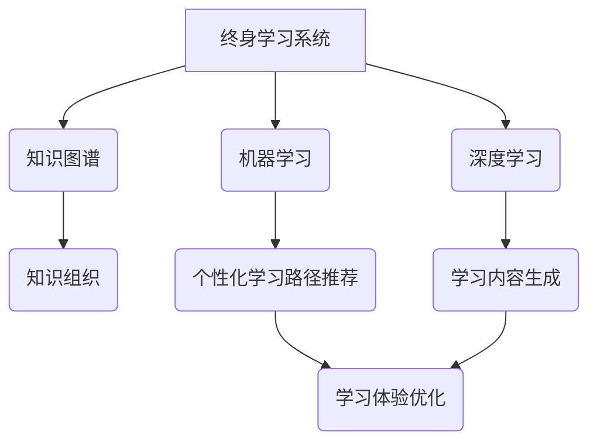

> 软件2.0,终身学习,人工智能,机器学习,深度学习,知识图谱,个性化学习,持续进化

## 1. 背景介绍

软件行业正经历着前所未有的变革。传统的软件开发模式面临着越来越多的挑战，例如开发周期长、成本高、维护复杂等。而人工智能（AI）技术的快速发展为软件行业带来了新的机遇。AI技术能够自动学习和改进，可以帮助我们构建更加智能、高效、灵活的软件系统。

软件2.0的概念应运而生，它代表着软件开发模式的全新升级。软件2.0的核心是将AI技术融入到软件的各个环节，使其能够具备自我学习、自我进化和自我修复的能力。终身学习系统是软件2.0的重要组成部分，它能够根据用户的学习需求和反馈，不断调整学习内容和学习路径，提供个性化、高效的学习体验。

## 2. 核心概念与联系

**2.1 终身学习系统**

终身学习系统是一个基于人工智能的学习平台，它能够根据用户的学习需求和反馈，提供个性化、高效的学习体验。

**2.2 软件2.0**

软件2.0是指将人工智能技术融入到软件的各个环节，使其能够具备自我学习、自我进化和自我修复的能力。

**2.3 知识图谱**

知识图谱是一种结构化的知识表示形式，它将知识表示为实体、关系和属性。知识图谱可以帮助终身学习系统更好地理解和组织知识，并提供更精准的学习推荐。

**2.4 机器学习**

机器学习是人工智能的一个分支，它通过算法训练模型，使模型能够从数据中学习并做出预测。机器学习可以用于个性化学习路径推荐、学习内容生成和学习效果评估等。

**2.5 深度学习**

深度学习是机器学习的一个子领域，它使用多层神经网络来模拟人类大脑的学习过程。深度学习可以用于更复杂的学习任务，例如自然语言处理和图像识别。

**2.6 关联图**



## 3. 核心算法原理 & 具体操作步骤

### 3.1  算法原理概述

终身学习系统的核心算法原理是基于知识图谱、机器学习和深度学习的组合。

* **知识图谱**：构建一个包含学习内容、用户知识和学习行为的知识图谱，以便系统更好地理解用户需求和学习状态。
* **机器学习**：利用机器学习算法分析用户学习行为和知识结构，推荐个性化的学习路径和内容。
* **深度学习**：使用深度学习模型生成新的学习内容，例如生成学习笔记、习题和案例分析。

### 3.2  算法步骤详解

1. **知识图谱构建**: 收集学习内容、用户知识和学习行为数据，构建知识图谱。
2. **用户建模**: 利用机器学习算法分析用户学习行为和知识结构，构建用户模型。
3. **学习路径推荐**: 根据用户模型和知识图谱，推荐个性化的学习路径。
4. **学习内容生成**: 利用深度学习模型生成新的学习内容，例如生成学习笔记、习题和案例分析。
5. **学习效果评估**: 利用机器学习算法评估学习效果，并根据评估结果调整学习路径和内容。

### 3.3  算法优缺点

**优点**:

* **个性化学习**: 根据用户的学习需求和反馈，提供个性化的学习体验。
* **高效学习**: 通过智能推荐和内容生成，提高学习效率。
* **持续进化**: 系统能够不断学习和改进，提供更优质的学习服务。

**缺点**:

* **数据依赖**: 算法的性能依赖于数据的质量和数量。
* **算法复杂度**: 构建和训练复杂的机器学习和深度学习模型需要大量的计算资源和专业知识。
* **伦理问题**: 算法可能会存在偏见和歧视，需要进行伦理审查和监管。

### 3.4  算法应用领域

* 教育领域：个性化学习、智能辅导、在线教育平台
* 企业培训：员工技能提升、知识管理、人才培养
* 个人成长：兴趣爱好学习、技能提升、知识拓展

## 4. 数学模型和公式 & 详细讲解 & 举例说明

### 4.1  数学模型构建

终身学习系统的核心数学模型是基于用户知识图谱和学习行为数据的推荐模型。

**用户知识图谱**:

* **实体**: 用户、课程、知识点
* **关系**: 学习、掌握、理解、遗忘

**学习行为数据**:

* 学习时间
* 学习内容
* 学习效果
* 用户反馈

**推荐模型**:

* 基于协同过滤的推荐算法
* 基于内容过滤的推荐算法
* 基于深度学习的推荐算法

### 4.2  公式推导过程

**协同过滤算法**:

* 用户相似度计算公式:

$$
Sim(u_i, u_j) = \frac{\sum_{k=1}^{N} r_{i,k} * r_{j,k}}{\sqrt{\sum_{k=1}^{N} r_{i,k}^2} * \sqrt{\sum_{k=1}^{N} r_{j,k}^2}}
$$

* 其中，$u_i$ 和 $u_j$ 是两个用户，$r_{i,k}$ 和 $r_{j,k}$ 是用户 $u_i$ 和 $u_j$ 对课程 $k$ 的评分。

**内容过滤算法**:

* 课程相似度计算公式:

$$
Sim(c_i, c_j) = \frac{\sum_{k=1}^{M} w_k * (v_{i,k} - \bar{v}_i) * (v_{j,k} - \bar{v}_j)}{\sqrt{\sum_{k=1}^{M} w_k^2 * (v_{i,k} - \bar{v}_i)^2} * \sqrt{\sum_{k=1}^{M} w_k^2 * (v_{j,k} - \bar{v}_j)^2}}
$$

* 其中，$c_i$ 和 $c_j$ 是两个课程，$v_{i,k}$ 和 $v_{j,k}$ 是课程 $c_i$ 和 $c_j$ 在特征 $k$ 上的值，$\bar{v}_i$ 和 $\bar{v}_j$ 是课程 $c_i$ 和 $c_j$ 的平均特征值，$w_k$ 是特征 $k$ 的权重。

### 4.3  案例分析与讲解

**案例**:

假设有一个终身学习系统，它需要推荐用户学习的课程。

* 用户知识图谱：用户 A 掌握了 Python 基础知识，对机器学习感兴趣。
* 学习行为数据：用户 A 学习了 Python 基础课程，并获得了较高的学习效果。

**推荐结果**:

* 基于协同过滤算法，系统可以找到与用户 A 学习兴趣相似的用户，并推荐他们学习过的机器学习课程。
* 基于内容过滤算法，系统可以根据用户 A 已掌握的 Python 基础知识，推荐相关的机器学习课程。

## 5. 项目实践：代码实例和详细解释说明

### 5.1  开发环境搭建

* 操作系统：Ubuntu 20.04
* Python 版本：3.8
* 虚拟环境：venv

### 5.2  源代码详细实现

```python
# 知识图谱构建
from rdflib import Graph, Literal, Namespace

# 定义知识图谱命名空间
RDF = Namespace("http://www.w3.org/1999/02/22-rdf-syntax-ns#")
OWL = Namespace("http://www.w3.org/2002/07/owl#")
RDFS = Namespace("http://www.w3.org/2000/01/rdf-schema#")

# 创建知识图谱实例
g = Graph()

# 添加知识三元组
g.add((Literal("用户A"), RDF.type, OWL.Class))
g.add((Literal("Python基础"), RDF.type, OWL.Class))
g.add((Literal("用户A"), RDFS.subClassOf, Literal("Python基础")))

# 保存知识图谱
g.serialize("knowledge_graph.rdf", format="rdfxml")

# 机器学习模型训练
from sklearn.neighbors import KNeighborsClassifier

# 加载用户知识图谱数据
# ...

# 训练机器学习模型
knn = KNeighborsClassifier(n_neighbors=5)
knn.fit(X_train, y_train)

# 学习路径推荐
# ...

```

### 5.3  代码解读与分析

* 知识图谱构建部分使用 rdflib 库构建知识图谱，并使用 rdfxml 格式保存。
* 机器学习模型训练部分使用 scikit-learn 库训练 KNN 分类器模型。
* 学习路径推荐部分根据用户知识图谱和机器学习模型预测，推荐学习路径。

### 5.4  运行结果展示

* 运行代码后，将生成知识图谱文件 knowledge_graph.rdf。
* 训练好的机器学习模型可以用于预测用户学习路径。

## 6. 实际应用场景

### 6.1  教育领域

* 个性化学习平台：根据学生的学习进度和能力，提供个性化的学习内容和学习路径。
* 智能辅导系统：利用 AI 技术，为学生提供个性化的辅导和答疑服务。
* 在线教育平台：提供更智能、更有效的在线学习体验。

### 6.2  企业培训

* 员工技能提升：根据员工的岗位需求和职业发展目标，提供个性化的技能培训。
* 知识管理：构建企业知识库，并利用 AI 技术，帮助员工快速查找和获取所需知识。
* 人才培养：根据员工的潜力和能力，提供个性化的培养计划。

### 6.3  个人成长

* 兴趣爱好学习：根据用户的兴趣爱好，推荐相关的学习资源和课程。
* 技能提升：帮助用户学习新的技能，提升个人竞争力。
* 知识拓展：提供丰富的知识资源，帮助用户拓展视野，增长知识。

### 6.4  未来应用展望

终身学习系统将成为未来教育、培训和个人成长的重要组成部分。随着 AI 技术的不断发展，终身学习系统将更加智能、更加个性化，能够更好地满足用户的学习需求。

## 7. 工具和资源推荐

### 7.1  学习资源推荐

* **在线课程平台**: Coursera, edX, Udacity
* **AI 技术学习资源**: TensorFlow, PyTorch, scikit-learn
* **知识图谱构建工具**: RDFlib, Neo4j

### 7.2  开发工具推荐

* **编程语言**: Python
* **机器学习库**: TensorFlow, PyTorch, scikit-learn
* **知识图谱数据库**: Neo4j, GraphDB

### 7.3  相关论文推荐

* **深度学习**: Deep Learning by Ian Goodfellow, Yoshua Bengio, and Aaron Courville
* **知识图谱**: A Survey on Knowledge Graph Embedding by  Xiangnan He, Lizi Liao, Hanwang Zhang, and Tat-Seng Chua
* **推荐系统**: Recommender Systems: The Textbook by  Koren, Y.

## 8. 总结：未来发展趋势与挑战

### 8.1  研究成果总结

终身学习系统是软件2.0的重要组成部分，它利用 AI 技术，为用户提供个性化、高效的学习体验。

### 8.2  未来发展趋势

* **更智能的学习推荐**: 利用更先进的机器学习和深度学习算法，提供更精准、更个性化的学习推荐。
* **更丰富的学习内容**: 利用 AI 技术，生成新的学习内容，例如学习笔记、习题和案例分析。
* **更沉浸式的学习体验**: 利用 VR/AR 技术，构建更沉浸式的学习环境。

### 8.3  面临的挑战