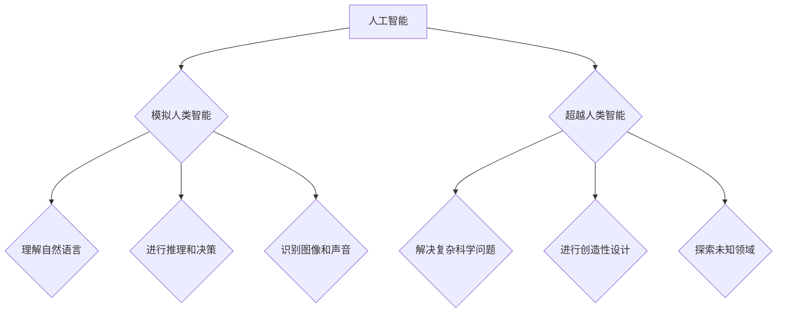

> 达特茅斯会议，人工智能，机器学习，深度学习，计算机科学，学科发展

## 1. 背景介绍

20世纪50年代，随着计算机技术的快速发展，人们开始对机器能否像人类一样思考和学习产生了浓厚的兴趣。这一时期，人工智能（Artificial Intelligence，简称AI）的概念应运而生。1956年，麻省理工学院的约翰·麦卡锡（John McCarthy）组织了达特茅斯会议（Dartmouth Summer Research Project on Artificial Intelligence），被广泛认为是人工智能学科正式诞生的标志性事件。

达特茅斯会议汇集了当时人工智能领域的众多先驱，包括艾伦·图灵（Alan Turing）、马文·明斯基（Marvin Minsky）、克莱夫·肖恩（Claude Shannon）等。会议期间，他们讨论了人工智能的定义、目标、方法以及未来的发展方向。

## 2. 核心概念与联系

达特茅斯会议的核心概念是“人工智能”的定义和目标。

* **人工智能的定义:**  人工智能是指使机器能够像人类一样思考、学习和解决问题的能力。

* **人工智能的目标:**  

    * **模拟人类智能:**  创造能够执行人类智能任务的机器，例如理解自然语言、进行推理和决策、识别图像和声音等。
    * **超越人类智能:**  开发能够超越人类能力的智能系统，例如解决复杂科学问题、进行创造性设计、探索未知领域等。

**核心概念与联系的Mermaid流程图:**



## 3. 核心算法原理 & 具体操作步骤

### 3.1  算法原理概述

人工智能算法是实现人工智能目标的关键技术。这些算法可以分为以下几类：

* **机器学习算法:**  通过学习数据，使机器能够从经验中不断改进其性能。
* **深度学习算法:**  一种更高级的机器学习算法，利用多层神经网络来模拟人类大脑的学习过程。
* **自然语言处理算法:**  用于处理和理解人类语言的算法。
* **计算机视觉算法:**  用于处理和理解图像和视频的算法。

### 3.2  算法步骤详解

以机器学习算法为例，其基本步骤如下：

1. **数据收集和预处理:**  收集相关数据并进行清洗、转换和特征提取等预处理工作。
2. **模型选择:**  根据任务需求选择合适的机器学习模型。
3. **模型训练:**  利用训练数据训练模型，调整模型参数以达到最佳性能。
4. **模型评估:**  使用测试数据评估模型的性能，并进行调整和优化。
5. **模型部署:**  将训练好的模型部署到实际应用场景中。

### 3.3  算法优缺点

不同的机器学习算法具有不同的优缺点，需要根据具体任务选择合适的算法。

* **优点:**  能够自动学习数据模式，无需人工编程，具有较高的自动化程度。
* **缺点:**  需要大量的数据进行训练，训练时间较长，对数据质量要求较高。

### 3.4  算法应用领域

机器学习算法已广泛应用于各个领域，例如：

* **图像识别:**  人脸识别、物体检测、图像分类等。
* **自然语言处理:**  机器翻译、文本摘要、情感分析等。
* **推荐系统:**  商品推荐、音乐推荐、电影推荐等。
* **医疗诊断:**  疾病预测、影像分析、药物研发等。

## 4. 数学模型和公式 & 详细讲解 & 举例说明

### 4.1  数学模型构建

机器学习算法通常基于数学模型进行构建。例如，线性回归模型可以表示为：

$$y = w_0 + w_1x_1 + w_2x_2 + ... + w_nx_n + \epsilon$$

其中：

* $y$ 是预测值
* $x_1, x_2, ..., x_n$ 是输入特征
* $w_0, w_1, w_2, ..., w_n$ 是模型参数
* $\epsilon$ 是误差项

### 4.2  公式推导过程

模型参数的学习过程通常使用梯度下降算法进行优化。梯度下降算法的目标是找到使误差最小化的模型参数。

梯度下降算法的更新公式为：

$$w_i = w_i - \alpha \frac{\partial Loss}{\partial w_i}$$

其中：

* $w_i$ 是模型参数
* $\alpha$ 是学习率
* $\frac{\partial Loss}{\partial w_i}$ 是损失函数对模型参数的梯度

### 4.3  案例分析与讲解

例如，假设我们想要预测房价，输入特征包括房屋面积、房间数量、地理位置等。我们可以使用线性回归模型进行预测。通过训练数据，模型会学习到房屋面积、房间数量等特征与房价之间的关系，并最终得到一个预测房价的公式。

## 5. 项目实践：代码实例和详细解释说明

### 5.1  开发环境搭建

为了实现人工智能项目，需要搭建相应的开发环境。常用的开发环境包括：

* **Python:**  人工智能领域最常用的编程语言。
* **TensorFlow:**  谷歌开发的开源深度学习框架。
* **PyTorch:**  Facebook开发的开源深度学习框架。
* **Jupyter Notebook:**  交互式编程环境，方便进行代码调试和实验。

### 5.2  源代码详细实现

以下是一个使用TensorFlow实现线性回归模型的代码示例：

```python
import tensorflow as tf

# 定义模型
model = tf.keras.Sequential([
    tf.keras.layers.Dense(units=1, input_shape=[1])
])

# 编译模型
model.compile(optimizer='sgd', loss='mean_squared_error')

# 训练模型
model.fit(x_train, y_train, epochs=100)

# 预测
predictions = model.predict(x_test)
```

### 5.3  代码解读与分析

* `tf.keras.Sequential` 创建一个顺序模型，即层级结构的模型。
* `tf.keras.layers.Dense` 创建一个全连接层，输入特征维度为1，输出维度为1。
* `model.compile` 编译模型，指定优化器、损失函数等参数。
* `model.fit` 训练模型，输入训练数据和训练轮数。
* `model.predict` 使用训练好的模型进行预测。

### 5.4  运行结果展示

训练完成后，可以评估模型的性能，例如使用均方误差（Mean Squared Error，MSE）来衡量预测值与真实值的差异。

## 6. 实际应用场景

人工智能技术已广泛应用于各个领域，例如：

### 6.1  医疗保健

* **疾病诊断:**  利用机器学习算法分析患者的医疗影像、病史和基因信息，辅助医生进行疾病诊断。
* **药物研发:**  加速药物研发过程，预测药物的疗效和安全性。

### 6.2  金融服务

* **欺诈检测:**  识别和预防金融欺诈行为。
* **风险管理:**  评估投资风险，优化资产配置。

### 6.3  制造业

* **预测性维护:**  预测设备故障，减少停机时间。
* **质量控制:**  自动检测产品缺陷，提高产品质量。

### 6.4  未来应用展望

人工智能技术的发展将继续推动各个领域的创新和变革。未来，人工智能将可能在以下领域发挥更重要的作用：

* **个性化教育:**  根据学生的学习情况提供个性化的学习方案。
* **自动驾驶:**  实现无人驾驶汽车，提高交通安全和效率。
* **智能家居:**  打造更加智能和便捷的家庭生活环境。

## 7. 工具和资源推荐

### 7.1  学习资源推荐

* **在线课程:**  Coursera、edX、Udacity 等平台提供丰富的机器学习和深度学习课程。
* **书籍:**  《深度学习》、《机器学习实战》等书籍是学习人工智能的经典教材。
* **博客和论坛:**  机器学习和人工智能领域的博客和论坛可以获取最新的技术资讯和交流经验。

### 7.2  开发工具推荐

* **TensorFlow:**  开源深度学习框架，支持多种硬件平台。
* **PyTorch:**  开源深度学习框架，以其灵活性和易用性而闻名。
* **Keras:**  高层深度学习API，可以方便地构建和训练深度学习模型。

### 7.3  相关论文推荐

* **《人工神经网络》:**  Geoffrey Hinton 等人撰写的经典论文，介绍了人工神经网络的基本原理。
* **《深度学习》:**  Ian Goodfellow 等人撰写的深度学习教材，涵盖了深度学习的各个方面。
* **《Attention Is All You Need》:**  Ashish Vaswani 等人撰写的论文，介绍了Transformer模型，该模型在自然语言处理领域取得了突破性进展。

## 8. 总结：未来发展趋势与挑战

### 8.1  研究成果总结

达特茅斯会议标志着人工智能学科的正式诞生，人工智能技术在过去几十年取得了长足的进步。机器学习算法的不断发展，深度学习技术的突破，以及计算能力的提升，使得人工智能技术在各个领域得到了广泛应用。

### 8.2  未来发展趋势

人工智能技术的发展趋势包括：

* **更强大的计算能力:**  人工智能算法的训练和运行需要大量的计算资源，未来将会有更强大的计算硬件和软件平台支持人工智能的发展。
* **更丰富的算法和模型:**  人工智能算法和模型将更加复杂和智能，能够解决更复杂的问题。
* **更广泛的应用场景:**  人工智能技术将应用于更多领域，例如医疗保健、教育、金融、制造业等。

### 8.3  面临的挑战

人工智能技术的发展也面临着一些挑战：

* **数据安全和隐私保护:**  人工智能算法需要大量的数据进行训练，如何保证数据的安全和隐私是重要的挑战。
* **算法偏见:**  人工智能算法可能存在偏见，导致不公平的结果。如何解决算法偏见是重要的研究课题。
* **伦理问题:**  人工智能技术的应用可能引发一些伦理问题，例如人工智能的责任和义务、人工智能的控制等。

### 8.4  研究展望

未来，人工智能研究将继续深入，探索人工智能的本质，开发更安全、更可靠、更智能的人工智能技术，并将其应用于人类社会各个方面，为人类创造更加美好的未来。

## 9. 附录：常见问题与解答

### 9.1  什么是人工智能？

人工智能是指使机器能够像人类一样思考、学习和解决问题的能力。

### 9.2  人工智能有哪些应用场景？

人工智能已广泛应用于各个领域，例如医疗保健、金融服务、制造业、交通运输等。

### 9.3  如何学习人工智能？

可以通过在线课程、书籍、博客和论坛等方式学习人工智能。

### 9.4  人工智能的未来发展趋势是什么？

人工智能技术将更加强大、智能和广泛应用于各个领域。

### 9.5  人工智能面临哪些挑战？

人工智能技术面临着数据安全、算法偏见、伦理问题等挑战。


作者：禅与计算机程序设计艺术 / Zen and the Art of Computer Programming 
<end_of_turn>