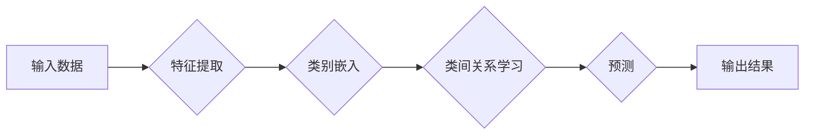

> 零射学习，ZSL，图像分类，迁移学习，特征嵌入，知识蒸馏，代码实例

## 1. 背景介绍

随着深度学习技术的飞速发展，计算机视觉领域取得了令人瞩目的成就。然而，传统的深度学习模型通常需要大量的 labeled 数据进行训练，这在现实世界中往往难以实现。例如，在识别新物种或新物体时，往往缺乏足够的 labeled 数据。

零射学习 (Zero-Shot Learning，ZSL) 应运而生，它旨在让模型能够识别从未在训练数据中见过的新类别。ZSL 的核心思想是利用类别的语义信息，例如文本描述或属性，来帮助模型学习新的类别。

## 2. 核心概念与联系

**2.1 零射学习的定义**

零射学习是指在训练阶段从未见过目标类别的模型，在测试阶段仍然能够识别这些目标类别。

**2.2 零射学习与迁移学习的关系**

零射学习可以看作是迁移学习的一种特殊情况。迁移学习是指利用已训练好的模型，在新的任务或领域上进行训练。在零射学习中，源任务和目标任务的类别之间没有重叠，即源任务的类别和目标任务的类别是互斥的。

**2.3 零射学习的挑战**

* **类别的语义表示:** 如何有效地表示类别的语义信息，以便模型能够理解和学习。
* **类间关系的学习:** 如何学习类别之间的关系，以便模型能够泛化到新的类别。
* **数据稀疏性:** 目标类别的数据往往非常稀疏，这使得模型难以学习到有效的特征表示。

**2.4 零射学习的应用场景**

* **图像分类:** 识别从未见过的新物种或新物体。
* **自然语言处理:** 理解新的词汇或短语。
* **推荐系统:** 推荐用户可能感兴趣的新商品或服务。

**2.5 零射学习的流程图**



## 3. 核心算法原理 & 具体操作步骤

### 3.1  算法原理概述

零射学习算法的核心思想是利用类别的语义信息来帮助模型学习新的类别。常见的零射学习算法包括：

* **基于属性的零射学习:** 利用类别的属性信息来进行分类。
* **基于嵌入的零射学习:** 将类别和样本映射到一个共同的嵌入空间，然后利用距离度量进行分类。
* **基于知识蒸馏的零射学习:** 利用预训练模型的知识来训练零射学习模型。

### 3.2  算法步骤详解

以基于嵌入的零射学习为例，其具体步骤如下：

1. **特征提取:** 使用预训练的模型提取样本的特征表示。
2. **类别嵌入:** 将类别的语义信息嵌入到一个向量空间中。
3. **类间关系学习:** 学习类别之间的关系，例如类别之间的相似度或依赖关系。
4. **预测:** 利用学习到的类别嵌入和类间关系，对新的样本进行分类。

### 3.3  算法优缺点

**优点:**

* 可以识别从未见过的新类别。
* 不需要大量的 labeled 数据。

**缺点:**

* 类别语义信息的表示仍然是一个挑战。
* 类间关系的学习仍然是一个开放问题。

### 3.4  算法应用领域

* **图像分类:** 识别新物种或新物体。
* **自然语言处理:** 理解新的词汇或短语。
* **推荐系统:** 推荐用户可能感兴趣的新商品或服务。

## 4. 数学模型和公式 & 详细讲解 & 举例说明

### 4.1  数学模型构建

假设我们有 $N$ 个类别，每个类别都有 $M$ 个样本。我们用 $x_i$ 表示第 $i$ 个样本的特征向量，用 $y_i$ 表示第 $i$ 个样本的类别标签。

我们用 $c_j$ 表示第 $j$ 个类别的嵌入向量。我们的目标是学习一个函数 $f(x_i, c_j)$，它可以预测样本 $x_i$ 属于类别 $j$ 的概率。

### 4.2  公式推导过程

我们可以使用以下公式来计算 $f(x_i, c_j)$:

$$
f(x_i, c_j) = \frac{exp(sim(x_i, c_j))}{\sum_{k=1}^{N} exp(sim(x_i, c_k))}
$$

其中，$sim(x_i, c_j)$ 是样本 $x_i$ 和类别 $c_j$ 之间的相似度度量，例如余弦相似度。

### 4.3  案例分析与讲解

假设我们有一个图像分类任务，需要识别猫、狗和鸟三种类别。我们使用预训练的模型提取图像的特征向量，然后将类别嵌入到一个向量空间中。

当我们输入一张新的图像时，我们首先提取它的特征向量，然后计算它与每个类别的嵌入向量的相似度。最后，我们使用公式 (1) 计算每个类别的概率，并选择概率最高的类别作为预测结果。

## 5. 项目实践：代码实例和详细解释说明

### 5.1  开发环境搭建

* Python 3.6+
* TensorFlow 2.0+
* PyTorch 1.0+
* 其他必要的库，例如 NumPy、Scikit-learn 等

### 5.2  源代码详细实现

```python
import tensorflow as tf

# 定义类别嵌入层
class EmbeddingLayer(tf.keras.layers.Layer):
    def __init__(self, embedding_dim):
        super(EmbeddingLayer, self).__init__()
        self.embedding_dim = embedding_dim

    def build(self, input_shape):
        self.embeddings = self.add_weight(
            shape=(input_shape[1], self.embedding_dim),
            initializer='random_normal',
            trainable=True
        )

    def call(self, inputs):
        return tf.nn.embedding_lookup(self.embeddings, inputs)

# 定义零射学习模型
class ZeroShotLearningModel(tf.keras.Model):
    def __init__(self, embedding_dim, num_classes):
        super(ZeroShotLearningModel, self).__init__()
        self.feature_extractor = tf.keras.applications.ResNet50(include_top=False, weights='imagenet')
        self.embedding_layer = EmbeddingLayer(embedding_dim)
        self.classifier = tf.keras.layers.Dense(num_classes, activation='softmax')

    def call(self, inputs):
        features = self.feature_extractor(inputs)
        embeddings = self.embedding_layer(features)
        logits = self.classifier(embeddings)
        return logits

# 训练模型
model = ZeroShotLearningModel(embedding_dim=128, num_classes=3)
model.compile(optimizer='adam', loss='categorical_crossentropy', metrics=['accuracy'])
model.fit(train_data, train_labels, epochs=10)

# 预测结果
predictions = model.predict(test_data)
```

### 5.3  代码解读与分析

* **EmbeddingLayer:** 定义了一个类别嵌入层，用于将类别信息嵌入到一个向量空间中。
* **ZeroShotLearningModel:** 定义了一个零射学习模型，包含特征提取层、类别嵌入层和分类层。
* **训练模型:** 使用训练数据和标签训练模型。
* **预测结果:** 使用训练好的模型对测试数据进行预测。

### 5.4  运行结果展示

运行代码后，可以得到模型的训练精度和测试精度。

## 6. 实际应用场景

### 6.1  图像分类

零射学习可以用于识别从未见过的新物种或新物体。例如，可以训练一个模型识别各种鸟类，即使模型在训练过程中没有见过某些鸟类的图片。

### 6.2  自然语言处理

零射学习可以用于理解新的词汇或短语。例如，可以训练一个模型识别新的医学术语，即使模型在训练过程中没有见过这些术语。

### 6.3  推荐系统

零射学习可以用于推荐用户可能感兴趣的新商品或服务。例如，可以训练一个模型推荐用户可能感兴趣的新电影，即使模型在训练过程中没有见过这些电影。

### 6.4  未来应用展望

零射学习在未来将有更广泛的应用场景，例如：

* **自动驾驶:** 识别道路上的新物体，例如交通标志或行人。
* **医疗诊断:** 识别新的疾病或症状。
* **机器人控制:** 识别新的环境或物体。

## 7. 工具和资源推荐

### 7.1  学习资源推荐

* **书籍:**
    * Zero-Shot Learning: A Comprehensive Survey
    * Deep Learning for Computer Vision with Python
* **论文:**
    * Zero-Shot Learning with Semantic Embeddings
    * A Survey on Zero-Shot Learning

### 7.2  开发工具推荐

* **TensorFlow:** https://www.tensorflow.org/
* **PyTorch:** https://pytorch.org/
* **Keras:** https://keras.io/

### 7.3  相关论文推荐

* **Zero-Shot Learning with Semantic Embeddings:** https://arxiv.org/abs/1406.2857
* **A Survey on Zero-Shot Learning:** https://arxiv.org/abs/1806.03747

## 8. 总结：未来发展趋势与挑战

### 8.1  研究成果总结

零射学习是一个快速发展的领域，取得了显著的进展。

### 8.2  未来发展趋势

* **更有效的类别嵌入方法:** 探索新的方法来更好地表示类别的语义信息。
* **更强大的类间关系学习方法:** 学习更复杂的类间关系，例如类别之间的依赖关系或层次关系。
* **跨模态零射学习:** 将零射学习应用于多模态数据，例如图像和文本。

### 8.3  面临的挑战

* **数据稀疏性:** 目标类别的数据往往非常稀疏，这使得模型难以学习到有效的特征表示。
* **类别语义表示:** 如何有效地表示类别的语义信息仍然是一个挑战。
* **类间关系的学习:** 学习类别之间的关系仍然是一个开放问题。

### 8.4  研究展望

零射学习是一个充满挑战和机遇的领域，未来将会有更多的研究成果涌现。


## 9. 附录：常见问题与解答

### 9.1  零射学习和迁移学习有什么区别？

零射学习和迁移学习都是利用已有的知识来学习新的任务，但它们的区别在于目标类别的关系。

* **迁移学习:** 源任务和目标任务的类别之间可能存在重叠。
* **零射学习:** 源任务和目标任务的类别之间没有重叠。

### 9.2  零射学习的应用场景有哪些？

零射学习的应用场景非常广泛，例如：

* **图像分类:** 识别从未见过的新物种或新物体。
* **自然语言处理:** 理解新的词汇或短语。
* **推荐系统:** 推荐用户可能感兴趣的新商品或服务。

### 9.3  零射学习的未来发展趋势是什么？

零射学习的未来发展趋势包括：

* **更有效的类别嵌入方法:** 探索新的方法来更好地表示类别的语义信息。
* **更强大的类间关系学习方法:** 学习更复杂的类间关系，例如类别之间的依赖关系或层次关系。
* **跨模态零射学习:** 将零射学习应用于多模态数据，例如图像和文本。


作者：禅与计算机程序设计艺术 / Zen and the Art of Computer Programming 
<end_of_turn>