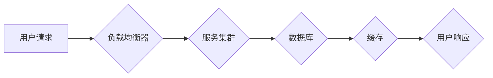

> 高可用性、高吞吐量、高扩展性、分布式系统、微服务架构、容错机制、负载均衡、缓存机制、数据库设计

## 1. 背景介绍

在当今数字化时代，系统的高可用性、高吞吐量和高扩展性已成为企业核心业务的关键保障。随着互联网技术的飞速发展，用户对系统性能和服务的期望值不断提升，对系统稳定性和可靠性的要求也越来越高。

高可用性系统是指能够在发生故障或异常情况时，能够持续提供服务，保证业务的正常运行。高吞吐量系统是指能够处理大量请求，并快速响应用户需求的系统。高扩展性系统是指能够随着业务规模的增长，灵活地增加资源，以满足不断增长的用户需求的系统。

构建高可用性、高吞吐量、高扩展性系统是一个复杂而具有挑战性的任务，需要综合考虑多种因素，并采用多种技术手段。本文将深入探讨这些最佳实践，帮助读者理解并应用这些技术，构建可靠、高效、可扩展的系统。

## 2. 核心概念与联系

高可用性、高吞吐量和高扩展性是相互关联的三个关键概念，它们共同构成了一个系统整体的性能和可靠性。

**2.1 高可用性**

高可用性系统的设计目标是确保系统在任何情况下都能持续运行，并提供服务。

**2.2 高吞吐量**

高吞吐量系统是指能够处理大量请求，并快速响应用户需求的系统。

**2.3 高扩展性**

高扩展性系统是指能够随着业务规模的增长，灵活地增加资源，以满足不断增长的用户需求的系统。

**2.4 核心概念联系**

高可用性、高吞吐量和高扩展性相互关联，共同影响着系统的整体性能和可靠性。

* 高可用性系统通常需要采用冗余机制，以确保在发生故障时，系统能够继续运行。
* 高吞吐量系统需要优化系统性能，并采用并行处理技术，以提高处理请求的速度。
* 高扩展性系统需要采用分布式架构，并采用弹性伸缩机制，以适应不断变化的业务需求。

**2.5 架构图**



## 3. 核心算法原理 & 具体操作步骤

### 3.1 算法原理概述

在构建高可用性、高吞吐量、高扩展性系统时，需要采用多种算法和技术手段来实现这些目标。

* **负载均衡算法:** 用于将用户请求分配到不同的服务器上，以避免单个服务器过载，提高系统的吞吐量和可用性。常见的负载均衡算法包括轮询算法、加权轮询算法、最小连接数算法等。
* **容错算法:** 用于检测和处理系统故障，确保系统能够继续运行。常见的容错算法包括心跳机制、故障转移机制、重试机制等。
* **缓存算法:** 用于将 frequently accessed 数据存储在高速缓存中，以减少数据库访问次数，提高系统的响应速度。常见的缓存算法包括LRU算法、FIFO算法、LFU算法等。

### 3.2 算法步骤详解

**3.2.1 负载均衡算法步骤**

1. 用户发送请求到负载均衡器。
2. 负载均衡器根据负载均衡算法，选择一个合适的服务器处理请求。
3. 服务器处理请求，并返回响应给用户。

**3.2.2 容错算法步骤**

1. 监控系统状态，检测是否有故障发生。
2. 如果检测到故障，则触发容错机制。
3. 容错机制根据具体情况，采取相应的措施，例如将故障服务器移除，将请求转发到其他服务器，或者重启故障服务器。

**3.2.3 缓存算法步骤**

1. 用户发送请求到系统。
2. 系统首先检查缓存中是否已经存在该数据。
3. 如果存在，则直接从缓存中返回数据。
4. 如果不存在，则从数据库中获取数据，并存储到缓存中。
5. 返回数据给用户。

### 3.3 算法优缺点

**3.3.1 负载均衡算法**

* **优点:** 提高系统吞吐量，提高系统可用性，均衡服务器负载。
* **缺点:** 可能会增加网络延迟，需要配置和维护。

**3.3.2 容错算法**

* **优点:** 提高系统可靠性，减少服务中断时间。
* **缺点:** 可能会增加系统复杂度，需要额外的资源和维护成本。

**3.3.3 缓存算法**

* **优点:** 提高系统响应速度，减少数据库访问次数，提高系统性能。
* **缺点:** 需要维护缓存数据，可能会导致缓存一致性问题。

### 3.4 算法应用领域

* **负载均衡算法:** 应用于网站、电商平台、游戏服务器等高并发场景。
* **容错算法:** 应用于金融系统、医疗系统、工业控制系统等高可靠性场景。
* **缓存算法:** 应用于网站、电商平台、社交媒体等需要快速响应的场景。

## 4. 数学模型和公式 & 详细讲解 & 举例说明

### 4.1 数学模型构建

**4.1.1 吞吐量模型**

吞吐量模型可以用来评估系统的处理能力，通常以每秒处理的请求数（QPS）来衡量。

$$
QPS = \frac{N}{T}
$$

其中：

* $N$：处理的请求数
* $T$：处理时间

**4.1.2 可用性模型**

可用性模型可以用来评估系统的可靠性，通常以系统运行时间与总时间的比值来衡量。

$$
Availability = \frac{Uptime}{Total Time}
$$

其中：

* $Uptime$：系统运行的时间
* $Total Time$：总的时间

### 4.2 公式推导过程

**4.2.1 吞吐量优化**

为了提高吞吐量，可以采用并行处理技术，将请求分配到多个服务器上处理。假设系统有 $n$ 个服务器，每个服务器的处理能力为 $p$，则系统的吞吐量为：

$$
QPS_{total} = n * p
$$

**4.2.2 可用性提升**

为了提高可用性，可以采用冗余机制，例如将服务器部署在多个数据中心，并使用故障转移机制。

### 4.3 案例分析与讲解

**4.3.1 淘宝网的吞吐量优化**

淘宝网是一个高并发电商平台，每天处理数亿笔交易。为了应对巨大的流量压力，淘宝网采用了多种技术手段来优化吞吐量，例如：

* 使用分布式架构，将系统拆分成多个独立的服务，每个服务负责特定的功能。
* 使用缓存机制，将 frequently accessed 数据存储在高速缓存中，减少数据库访问次数。
* 使用并行处理技术，将请求分配到多个服务器上处理。

**4.3.2 Netflix 的可用性提升**

Netflix 是一个全球性的视频流媒体平台，需要保证其服务的稳定性和可靠性。为了提高可用性，Netflix 采用了多种技术手段，例如：

* 将服务器部署在多个数据中心，并使用故障转移机制。
* 使用容错算法，检测和处理系统故障。
* 使用监控系统，实时监控系统的运行状态。

## 5. 项目实践：代码实例和详细解释说明

### 5.1 开发环境搭建

* 操作系统：Linux
* 编程语言：Python
* 框架：Flask

### 5.2 源代码详细实现

```python
from flask import Flask, request, jsonify

app = Flask(__name__)

# 模拟数据库
data = {}

@app.route('/data/<key>', methods=['GET'])
def get_data(key):
    if key in data:
        return jsonify({'data': data[key]})
    else:
        return jsonify({'error': 'Key not found'}), 404

@app.route('/data/<key>', methods=['POST'])
def set_data(key):
    data[key] = request.json['value']
    return jsonify({'message': 'Data set successfully'}), 201

if __name__ == '__main__':
    app.run(debug=True)
```

### 5.3 代码解读与分析

* 该代码实现了一个简单的 RESTful API，用于存储和获取数据。
* 使用 Flask 框架简化了开发过程。
* 使用字典 `data` 模拟数据库，存储键值对数据。
* `get_data` 路由用于获取指定键的数据。
* `set_data` 路由用于设置指定键的数据。

### 5.4 运行结果展示

* 启动服务后，可以使用 curl 或 Postman 等工具访问 API。
* 例如，使用 curl 命令获取数据：

```
curl http://localhost:5000/data/key1
```

## 6. 实际应用场景

### 6.1 高可用性系统

* **金融系统:** 银行、支付平台等需要保证系统的高可用性，以确保交易安全和可靠。
* **医疗系统:** 医院、诊所等需要保证系统的高可用性，以确保患者信息安全和医疗服务连续性。
* **电商平台:** 淘宝、京东等电商平台需要保证系统的高可用性，以确保用户购物体验和交易安全。

### 6.2 高吞吐量系统

* **游戏服务器:** 游戏服务器需要处理大量的玩家请求，以保证游戏流畅运行。
* **社交媒体平台:** Twitter、Facebook 等社交媒体平台需要处理大量的用户数据和消息，以保证用户体验。
* **视频流媒体平台:** Netflix、YouTube 等视频流媒体平台需要处理大量的视频流数据，以保证视频播放流畅。

### 6.3 高扩展性系统

* **云计算平台:** AWS、Azure 等云计算平台需要能够根据用户需求灵活扩展资源。
* **大数据平台:** Hadoop、Spark 等大数据平台需要能够处理海量数据，并根据数据规模灵活扩展资源。
* **物联网平台:** 物联网平台需要能够连接和管理大量的设备，并根据设备数量灵活扩展资源。

### 6.4 未来应用展望

随着技术的不断发展，高可用性、高吞吐量、高扩展性系统将应用于更多领域，例如：

* **人工智能:** 人工智能系统需要处理大量的计算任务，需要高性能的计算资源和高扩展性架构。
* **区块链:** 区块链技术需要保证数据安全和可靠性，需要高可用性和高吞吐量的系统。
* **边缘计算:** 边缘计算需要将计算资源部署到靠近数据源的位置，需要高扩展性和低延迟的系统。

## 7. 工具和资源推荐

### 7.1 学习资源推荐

* **书籍:**
    * 《Designing Data-Intensive Applications》 by Martin Kleppmann
    * 《Building Microservices》 by Sam Newman
    * 《Site Reliability Engineering》 by Google SRE Team
* **在线课程:**
    * Coursera: Distributed Systems
    * Udemy: Microservices Architecture
    * edX: Cloud Computing

### 7.2 开发工具推荐

* **容器化平台:** Docker, Kubernetes
* **云平台:** AWS, Azure, GCP
* **监控工具:** Prometheus, Grafana
* **日志工具:** ELK Stack, Splunk

### 7.3 相关论文推荐

* **论文:**
    * The Twelve-Factor App
    * Microservices Patterns
    * Building Resilient Distributed Systems

## 8. 总结：未来发展趋势与挑战

### 8.1 研究成果总结

* 高可用性、高吞吐量、高扩展性系统设计已经取得了显著的成果，为现代互联网应用提供了坚实的基础。
* 各种分布式架构、容错机制、缓存算法等技术手段不断发展，提高了系统的性能和可靠性。

### 8.2 未来发展趋势

* **Serverless 架构:** 无服务器架构将进一步简化系统部署和管理，提高系统弹性和可扩展性。
*