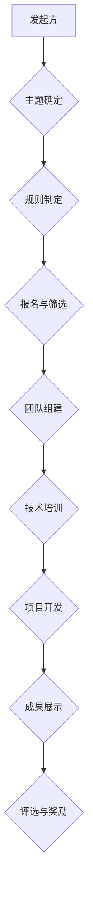

> AI hackathon,人工智能,创新,技术发展,社区合作,人才培养

## 1. 背景介绍

在人工智能（AI）领域蓬勃发展的今天，AI hackathon 作为一种独特的创新平台，正逐渐成为推动技术进步和人才培养的重要力量。AI hackathon 是一种以时间为限的编程竞赛，参赛者需要在短时间内利用人工智能技术解决特定问题，并展示他们的解决方案。近年来，AI hackathon 的规模和影响力不断扩大，吸引了来自全球各地的开发者、研究人员和企业参与。

## 2. 核心概念与联系

**2.1 AI hackathon 的核心概念**

AI hackathon 的核心概念是将人工智能技术与快速迭代、协作创新相结合，激发参与者的创造力和解决问题的能力。

**2.2 AI hackathon 与技术发展的联系**

AI hackathon 作为一种实践导向的创新平台，能够有效促进人工智能技术的快速发展。

* **加速技术迭代:**  AI hackathon 的时间限制和挑战性目标，促使参赛者不断探索新的算法、模型和应用场景，加速技术迭代。
* **促进技术交流:**  AI hackathon 为开发者和研究人员提供了一个交流学习的平台，分享经验、探讨技术难题，促进技术交流和合作。
* **推动技术落地:**  AI hackathon 的解决方案往往具有实际应用价值，能够推动人工智能技术的落地应用，解决现实问题。

**2.3 AI hackathon 与人才培养的联系**

AI hackathon 对于培养人工智能人才具有重要意义。

* **锻炼实践能力:**  AI hackathon 要求参赛者在短时间内完成项目开发，锻炼了他们的实践能力、团队合作能力和解决问题的能力。
* **拓宽知识面:**  AI hackathon 涵盖了人工智能领域的多个方向，例如机器学习、深度学习、自然语言处理等，能够帮助参赛者拓宽知识面，了解最新的技术趋势。
* **建立人脉关系:**  AI hackathon 为参赛者提供了与行业专家、企业代表和同行交流的机会，建立人脉关系，为未来的职业发展打下基础。

**2.4  AI hackathon 的架构**



## 3. 核心算法原理 & 具体操作步骤

**3.1 算法原理概述**

AI hackathon 中常用的算法包括机器学习、深度学习、自然语言处理等。

* **机器学习:**  机器学习算法能够从数据中学习，并根据学习到的知识进行预测或分类。常见的机器学习算法包括线性回归、逻辑回归、决策树、支持向量机等。
* **深度学习:**  深度学习算法是一种更高级的机器学习算法，它使用多层神经网络来模拟人类大脑的学习过程。深度学习算法在图像识别、语音识别、自然语言处理等领域取得了突破性的进展。
* **自然语言处理:**  自然语言处理算法能够理解和处理人类语言。常见的自然语言处理算法包括词嵌入、文本分类、机器翻译等。

**3.2 算法步骤详解**

**3.2.1 机器学习算法步骤详解**

1. **数据收集和预处理:**  收集相关数据，并进行清洗、转换、特征提取等预处理工作。
2. **模型选择:**  根据具体问题选择合适的机器学习算法。
3. **模型训练:**  使用训练数据训练模型，调整模型参数，使模型能够准确地预测或分类。
4. **模型评估:**  使用测试数据评估模型的性能，例如准确率、召回率、F1-score等。
5. **模型部署:**  将训练好的模型部署到实际应用场景中。

**3.2.2 深度学习算法步骤详解**

1. **数据收集和预处理:**  与机器学习算法类似，深度学习算法也需要收集和预处理数据。
2. **网络结构设计:**  设计深度神经网络的结构，包括层数、节点数、激活函数等。
3. **模型训练:**  使用训练数据训练深度神经网络，调整网络参数，使网络能够准确地完成任务。
4. **模型评估:**  使用测试数据评估模型的性能，例如准确率、损失函数等。
5. **模型调优:**  根据评估结果，调整网络结构、训练参数等，进一步提高模型性能。
6. **模型部署:**  将训练好的深度神经网络部署到实际应用场景中。

**3.3 算法优缺点**

**3.3.1 机器学习算法优缺点**

* **优点:**  相对简单易于理解和实现，能够处理结构化数据，应用广泛。
* **缺点:**  对数据质量要求较高，难以处理非结构化数据，泛化能力有限。

**3.3.2 深度学习算法优缺点**

* **优点:**  能够处理非结构化数据，泛化能力强，在某些领域取得了突破性进展。
* **缺点:**  训练成本高，对数据量要求高，难以解释模型决策过程。

**3.4 算法应用领域**

机器学习和深度学习算法广泛应用于各个领域，例如：

* **图像识别:**  自动识别图像中的物体、场景、人物等。
* **语音识别:**  将语音转换为文本。
* **自然语言处理:**  理解和处理人类语言，例如机器翻译、文本摘要、情感分析等。
* **推荐系统:**  根据用户的历史行为推荐相关商品或内容。
* **医疗诊断:**  辅助医生诊断疾病，预测患者的健康状况。

## 4. 数学模型和公式 & 详细讲解 & 举例说明

**4.1 数学模型构建**

在 AI hackathon 中，数学模型通常用于描述算法的逻辑和行为，并进行性能评估。常见的数学模型包括线性回归模型、逻辑回归模型、神经网络模型等。

**4.2 公式推导过程**

例如，线性回归模型的目标是找到一条直线，能够最佳地拟合数据点。线性回归模型的数学公式如下：

$$y = mx + c$$

其中，$y$ 是预测值，$x$ 是输入特征，$m$ 是斜率，$c$ 是截距。

**4.3 案例分析与讲解**

假设我们有一个数据集，包含房屋面积和房屋价格的信息。我们可以使用线性回归模型来预测房屋价格。

* **数据预处理:**  将数据清洗、转换，并将房屋面积作为输入特征，房屋价格作为输出目标。
* **模型训练:**  使用训练数据训练线性回归模型，找到最佳的斜率和截距。
* **模型评估:**  使用测试数据评估模型的性能，例如计算预测值与实际值的均方误差。

## 5. 项目实践：代码实例和详细解释说明

**5.1 开发环境搭建**

AI hackathon 项目的开发环境通常包括以下软件：

* **编程语言:**  Python 是 AI hackathon 中最常用的编程语言，因为它拥有丰富的 AI 库和工具。
* **深度学习框架:**  TensorFlow、PyTorch 是常用的深度学习框架，用于构建和训练深度神经网络。
* **数据处理工具:**  Pandas、NumPy 是常用的数据处理工具，用于处理和分析数据。

**5.2 源代码详细实现**

以下是一个简单的使用 Python 和 TensorFlow 实现的图像分类模型的代码示例：

```python
import tensorflow as tf

# 定义模型结构
model = tf.keras.models.Sequential([
    tf.keras.layers.Conv2D(32, (3, 3), activation='relu', input_shape=(28, 28, 1)),
    tf.keras.layers.MaxPooling2D((2, 2)),
    tf.keras.layers.Conv2D(64, (3, 3), activation='relu'),
    tf.keras.layers.MaxPooling2D((2, 2)),
    tf.keras.layers.Flatten(),
    tf.keras.layers.Dense(10, activation='softmax')
])

# 编译模型
model.compile(optimizer='adam',
              loss='sparse_categorical_crossentropy',
              metrics=['accuracy'])

# 训练模型
model.fit(x_train, y_train, epochs=5)

# 评估模型
loss, accuracy = model.evaluate(x_test, y_test)
print('Test loss:', loss)
print('Test accuracy:', accuracy)
```

**5.3 代码解读与分析**

这段代码定义了一个简单的卷积神经网络模型，用于图像分类任务。

* **模型结构:**  模型包含两层卷积层、两层最大池化层、一层全连接层和一层输出层。
* **激活函数:**  ReLU 激活函数用于卷积层和全连接层，softmax 激活函数用于输出层。
* **损失函数:**  sparse_categorical_crossentropy 是用于多分类问题的损失函数。
* **优化器:**  adam 是常用的优化器，用于更新模型参数。

**5.4 运行结果展示**

训练完成后，模型可以用来预测新的图像类别。

## 6. 实际应用场景

AI hackathon 的解决方案在各个领域都有着广泛的应用场景。

* **医疗保健:**  AI hackathon 可以用于开发医疗诊断系统、疾病预测系统、药物研发系统等。
* **金融科技:**  AI hackathon 可以用于开发欺诈检测系统、风险评估系统、个性化金融服务系统等。
* **教育科技:**  AI hackathon 可以用于开发智能辅导系统、个性化学习系统、自动批改系统等。
* **智能家居:**  AI hackathon 可以用于开发智能语音助手、智能家居控制系统、智能安防系统等。

**6.4 未来应用展望**

随着人工智能技术的不断发展，AI hackathon 的应用场景将更加广泛。

* **更智能的应用:**  AI hackathon 将推动人工智能技术的应用更加智能化，例如能够理解和响应自然语言的智能助手、能够自主学习和适应环境的智能机器人等。
* **更个性化的服务:**  AI hackathon 将推动人工智能技术的应用更加个性化，例如能够根据用户的需求定制的学习方案、能够根据用户的喜好推荐的商品等。
* **更广泛的应用领域:**  AI hackathon 将推动人工智能技术的应用更加广泛，例如在农业、制造业、交通运输等领域。

## 7. 工具和资源推荐

**7.1 学习资源推荐**

* **在线课程:**  Coursera、edX、Udacity 等平台提供丰富的 AI 课程。
* **书籍:**  《深度学习》、《机器学习实战》等书籍是学习 AI 的经典教材。
* **开源项目:**  TensorFlow、PyTorch 等开源项目提供了丰富的代码示例和学习资源。

**7.2 开发工具推荐**

* **编程语言:**  Python 是 AI 开发最常用的编程语言。
* **深度学习框架:**  TensorFlow、PyTorch 是常用的深度学习框架。
* **数据处理工具:**  Pandas、NumPy 是常用的数据处理工具。

**7.3 相关论文推荐**

* **ImageNet Classification with Deep Convolutional Neural Networks**
* **Attention Is All You Need**
* **BERT: Pre-training of Deep Bidirectional Transformers for Language Understanding**

## 8. 总结：未来发展趋势与挑战

**8.1 研究成果总结**

AI hackathon 已经取得了显著的成果，推动了人工智能技术的快速发展，并培养了一批优秀的 AI 人才。

**8.2 未来发展趋势**

* **更强大的算法:**  未来 AI hackathon 将会看到更强大的算法的出现，例如能够解决更复杂问题的算法、能够学习更多类型数据的算法等。
* **更广泛的应用场景:**  AI hackathon 的应用场景将更加广泛，例如在医疗保健、金融科技、教育科技等领域。
* **更注重伦理和社会影响:**  未来 AI hackathon 将更加注重人工智能技术的伦理和社会影响，例如如何避免算法偏见、如何确保数据隐私等。

**8.3 面临的挑战**

* **数据获取和隐私保护:**  AI hackathon 需要大量的数据进行