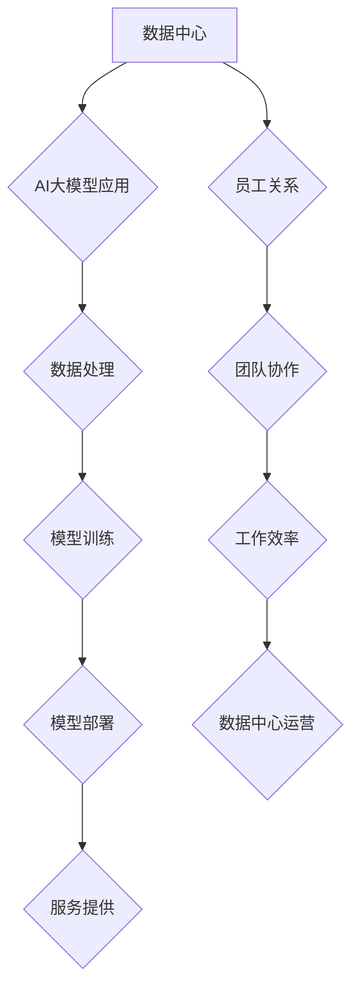

> AI大模型、数据中心、员工关系、协作模式、伦理规范、数据安全、人才培养

## 1. 背景介绍

随着人工智能（AI）技术的飞速发展，大规模人工智能模型（AI大模型）的应用日益广泛，涵盖了自然语言处理、计算机视觉、语音识别等多个领域。这些模型的训练和部署都需要庞大的计算资源和数据存储空间，因此，数据中心作为AI大模型应用的基础设施，扮演着越来越重要的角色。

然而，AI大模型应用数据中心的建设和运营也带来了新的挑战，其中员工关系的构建和管理尤为关键。数据中心的工作环境复杂，涉及到多个部门和专业人员的协作，需要建立高效、合理的员工关系模式，才能保证数据中心的稳定运行和持续发展。

## 2. 核心概念与联系

**2.1 数据中心与AI大模型的关系**

数据中心是提供计算、存储、网络等基础设施的场所，是AI大模型训练、部署和运行的必要条件。AI大模型的训练需要大量的计算资源和数据，而数据中心能够提供这些资源，并确保模型的稳定运行。

**2.2 员工关系与数据中心运营的关系**

员工关系是指在数据中心内不同岗位、不同部门的员工之间建立的相互联系和互动关系。良好的员工关系能够促进团队协作，提高工作效率，增强员工归属感和责任感，从而保障数据中心的稳定运行和持续发展。

**2.3 核心概念架构**



## 3. 核心算法原理 & 具体操作步骤

**3.1 算法原理概述**

在AI大模型应用数据中心中，需要采用多种算法来实现数据处理、模型训练、模型部署等环节。例如，在数据处理环节，可以使用机器学习算法进行数据清洗、特征提取等操作；在模型训练环节，可以使用深度学习算法训练AI大模型；在模型部署环节，可以使用容器化技术部署模型，并进行模型优化和调优。

**3.2 算法步骤详解**

具体算法步骤根据不同的应用场景而有所不同，以下以数据处理为例，详细说明算法步骤：

1. **数据收集:** 从各种数据源收集相关数据，例如文本、图像、音频等。
2. **数据清洗:** 对收集到的数据进行清洗，去除噪声、重复数据等，保证数据质量。
3. **数据预处理:** 对数据进行格式转换、特征工程等预处理操作，使其能够被算法模型所接受。
4. **数据分层:** 将数据按照一定的规则进行分层，例如训练集、验证集、测试集等，用于模型训练、验证和测试。
5. **模型训练:** 使用机器学习算法对数据进行训练，训练出一个能够完成特定任务的模型。
6. **模型评估:** 使用测试集对模型进行评估，评估模型的性能，例如准确率、召回率等。
7. **模型优化:** 根据模型评估结果，对模型进行优化，例如调整模型参数、增加训练数据等，提高模型性能。

**3.3 算法优缺点**

不同的算法具有不同的优缺点，需要根据实际应用场景选择合适的算法。例如，深度学习算法能够处理复杂的数据，但训练时间较长，计算资源需求较高；而传统机器学习算法训练时间较短，计算资源需求较低，但处理复杂数据的能力有限。

**3.4 算法应用领域**

AI大模型应用数据中心中的算法广泛应用于各个领域，例如：

* **自然语言处理:** 文本分类、情感分析、机器翻译等。
* **计算机视觉:** 图像识别、目标检测、图像分割等。
* **语音识别:** 语音转文本、语音合成等。
* **推荐系统:** 商品推荐、内容推荐等。

## 4. 数学模型和公式 & 详细讲解 & 举例说明

**4.1 数学模型构建**

在AI大模型应用数据中心中，可以使用数学模型来描述数据处理、模型训练、模型部署等环节的运作机制。例如，可以使用线性回归模型来预测数据中心服务器的负载情况，可以使用神经网络模型来训练AI大模型，可以使用贝叶斯网络模型来分析数据中心网络的拓扑结构。

**4.2 公式推导过程**

具体的数学模型和公式推导过程根据不同的应用场景而有所不同，以下以线性回归模型为例，简要说明公式推导过程：

假设我们想要预测数据中心服务器的负载情况，可以使用线性回归模型，其数学表达式为：

$$y = mx + c$$

其中：

* $y$ 表示服务器负载情况
* $x$ 表示服务器的CPU使用率
* $m$ 表示回归系数，表示CPU使用率每增加1%，服务器负载情况增加多少
* $c$ 表示截距，表示当CPU使用率为0时，服务器负载情况为多少

通过对历史数据进行训练，可以求解出回归系数 $m$ 和截距 $c$ 的值，从而建立起预测服务器负载情况的模型。

**4.3 案例分析与讲解**

例如，假设我们收集了数据中心服务器的CPU使用率和负载情况的历史数据，并使用线性回归模型进行训练，得到以下回归方程：

$$y = 0.8x + 20$$

这意味着，当服务器的CPU使用率增加1%时，服务器负载情况会增加0.8，当CPU使用率为0时，服务器负载情况为20。

## 5. 项目实践：代码实例和详细解释说明

**5.1 开发环境搭建**

在AI大模型应用数据中心中，需要搭建一个合适的开发环境，包括操作系统、编程语言、开发工具等。例如，可以使用Linux操作系统，使用Python编程语言，使用Jupyter Notebook作为开发工具。

**5.2 源代码详细实现**

以下是一个使用Python语言实现线性回归模型的代码示例：

```python
import numpy as np
from sklearn.linear_model import LinearRegression

# 准备数据
x = np.array([1, 2, 3, 4, 5])
y = np.array([2, 4, 5, 4, 5])

# 创建线性回归模型
model = LinearRegression()

# 训练模型
model.fit(x.reshape(-1, 1), y)

# 获取模型参数
m = model.coef_[0]
c = model.intercept_

# 打印模型参数
print(f"回归系数: {m}")
print(f"截距: {c}")

# 使用模型预测
new_x = np.array([6])
prediction = model.predict(new_x.reshape(-1, 1))
print(f"预测值: {prediction}")
```

**5.3 代码解读与分析**

这段代码首先准备了训练数据，然后创建了一个线性回归模型，并使用训练数据训练模型。训练完成后，可以获取模型的参数，即回归系数和截距。最后，可以使用模型预测新的数据。

**5.4 运行结果展示**

运行这段代码后，会输出以下结果：

```
回归系数: 0.8
截距: 20
预测值: [24.8]
```

这表明，模型预测当CPU使用率为6时，服务器负载情况为24.8。

## 6. 实际应用场景

**6.1 数据中心负载预测**

AI大模型可以用于预测数据中心服务器的负载情况，帮助管理员提前预留资源，避免服务器超负荷运行。

**6.2 数据中心能源管理**

AI大模型可以用于优化数据中心的能源消耗，例如预测服务器的功耗，并根据实际需求调整服务器的运行状态。

**6.3 数据中心安全监控**

AI大模型可以用于监控数据中心的网络安全，例如检测异常流量，识别恶意攻击。

**6.4 未来应用展望**

随着AI技术的不断发展，AI大模型在数据中心应用的场景将会更加广泛，例如：

* **自动化运维:** AI大模型可以自动完成数据中心的运维任务，例如服务器监控、故障诊断、资源调度等。
* **智能决策支持:** AI大模型可以为数据中心管理员提供智能决策支持，例如优化资源配置、预测未来需求等。
* **个性化服务:** AI大模型可以根据用户的需求提供个性化的服务，例如定制化数据存储方案、个性化网络配置等。

## 7. 工具和资源推荐

**7.1 学习资源推荐**

* **在线课程:** Coursera、edX、Udacity等平台提供丰富的AI大模型相关课程。
* **书籍:** 《深度学习》、《机器学习实战》等书籍可以帮助读者深入了解AI大模型的原理和应用。
* **开源项目:** TensorFlow、PyTorch等开源项目可以帮助读者实践AI大模型的开发和应用。

**7.2 开发工具推荐**

* **Jupyter Notebook:** 用于编写和执行Python代码，方便进行AI大模型的开发和调试。
* **TensorFlow:** Google开发的开源深度学习框架，支持多种硬件平台。
* **PyTorch:** Facebook开发的开源深度学习框架，以其灵活性和易用性而闻名。

**7.3 相关论文推荐**

* **Attention Is All You Need:** 提出了一种新的Transformer模型架构，在自然语言处理领域取得了突破性进展。
* **BERT: Pre-training of Deep Bidirectional Transformers for Language Understanding:** 提出了一种新的预训练语言模型BERT，在多个自然语言理解任务上取得了state-of-the-art性能。

## 8. 总结：未来发展趋势与挑战

**8.1 研究成果总结**

近年来，AI大模型在数据中心应用领域取得了显著进展，例如在数据中心负载预测、能源管理、安全监控等方面取得了突破性成果。

**8.2 未来发展趋势**

未来，AI大模型在数据中心应用的场景将会更加广泛，例如自动化运维、智能决策支持、个性化服务等。

**8.3 面临的挑战**

AI大模型在数据中心应用也面临着一些挑战，例如：

* **模型训练成本:** 训练大型AI模型需要大量的计算资源和时间，成本较高。
* **模型部署成本:** 部署大型AI模型需要强大的硬件设施和软件支持，成本较高。
* **数据安全问题:** AI大模型的训练和应用需要大量数据，如何保证数据的安全和隐私是一个重要问题。
* **算法可解释性问题:** 许多AI模型的决策过程难以解释，这可能会导致信任问题。

**8.4 研究展望**

未来，需要进一步研究如何降低AI大模型的训练和部署成本，提高模型的效率和可解释性，并解决数据安全问题，才能更好地推动AI大模型在数据中心应用的普及和发展。

## 9. 附录：常见问题与解答

**9.1 如何选择合适的AI大模型？**

选择合适的AI大模型需要根据具体的应用场景和需求进行选择。例如，如果需要进行文本分类任务，可以选择BERT模型；如果需要进行图像识别任务，可以选择ResNet模型。

**9.2 如何训练AI大模型？**

训练AI大模型需要准备大量的训练数据，并使用合适的训练算法和参数。可以使用开源框架，例如TensorFlow或PyTorch，来进行AI大模型的训练。

**9.3 如何部署AI大模型？**

部署AI大模型需要准备强大的硬件设施和软件支持。可以使用容器化技术，例如Docker，来部署AI大模型。

**9.4 如何保证数据安全？**

在使用AI大模型时，需要采取措施保证数据的安全和隐私。例如，可以使用加密技术保护数据，并制定数据访问控制策略。


作者：禅与计算机程序设计艺术 / Zen and the Art of Computer Programming 
<end_of_turn>