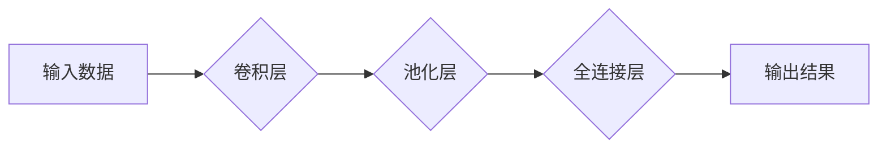

> 人工智能，深度学习，机器学习，自然语言处理，计算机视觉，强化学习，神经网络

## 1. 背景介绍

人工智能（AI）作为一项跨学科研究领域，近年来取得了令人瞩目的进展，深刻地改变了我们生活的方方面面。从智能语音助手到自动驾驶汽车，从医疗诊断到金融风险评估，AI技术正在不断突破传统技术边界，为人类社会带来前所未有的机遇和挑战。

### 1.1 AI发展历程回顾

AI的发展历程可以追溯到20世纪50年代，早期研究主要集中于符号人工智能和专家系统。然而，由于计算能力的限制和算法的局限性，早期AI技术难以实现真正的人工智能。

20世纪80年代，机器学习（ML）的概念应运而生，它赋予了AI系统从数据中学习和改进的能力。随着大数据时代的到来，机器学习算法取得了显著的进展，例如支持向量机、决策树和随机森林等。

21世纪初，深度学习（DL）的兴起标志着AI领域进入了一个新的黄金时代。深度学习算法能够学习复杂的特征表示，并取得了在图像识别、语音识别、自然语言处理等领域突破性的成果。

### 1.2 AI技术现状与趋势

目前，AI技术已经广泛应用于各个领域，并呈现出以下趋势：

* **泛化能力增强:** AI模型的泛化能力不断提升，能够应用于更广泛的场景和任务。
* **解释性增强:** 研究者致力于开发更可解释的AI模型，以便更好地理解AI系统的决策过程。
* **边缘计算:** AI计算将逐渐向边缘设备转移，实现更低延迟和更高效率的应用。
* **跨模态学习:** AI系统将能够处理多种数据类型，例如文本、图像、音频和视频，实现更全面的理解和交互。

## 2. 核心概念与联系

### 2.1 深度学习概述

深度学习是一种机器学习的子领域，它利用多层神经网络来学习数据的复杂特征表示。与传统机器学习算法不同，深度学习算法不需要人工特征工程，能够自动从数据中提取特征。

### 2.2 神经网络结构

神经网络由多个层组成，每一层包含多个神经元。神经元之间通过连接进行信息传递，每个连接都有一个权重。通过训练神经网络，可以调整这些权重，使得神经网络能够学习数据的模式和规律。

### 2.3 常见深度学习架构

常见的深度学习架构包括卷积神经网络（CNN）、循环神经网络（RNN）和Transformer等。

* **CNN:** 擅长处理图像数据，能够学习图像的局部特征和全局结构。
* **RNN:** 擅长处理序列数据，例如文本和语音，能够捕捉序列中的时间依赖关系。
* **Transformer:** 是一种新型的深度学习架构，能够处理任意长度的序列数据，并具有强大的并行计算能力。

**Mermaid 流程图**



## 3. 核心算法原理 & 具体操作步骤

### 3.1 算法原理概述

深度学习算法的核心原理是通过多层神经网络学习数据的特征表示。

* **前向传播:** 将输入数据通过神经网络传递，计算每个神经元的输出值。
* **反向传播:** 计算输出值与真实值的误差，并根据误差调整神经网络的权重。
* **梯度下降:** 使用梯度下降算法来更新神经网络的权重，使得误差最小化。

### 3.2 算法步骤详解

1. **数据预处理:** 将原始数据转换为深度学习算法可以处理的格式，例如归一化、编码等。
2. **模型构建:** 选择合适的深度学习架构，并定义神经网络的层数、神经元数量等参数。
3. **模型训练:** 使用训练数据训练神经网络，通过前向传播和反向传播算法调整神经网络的权重。
4. **模型评估:** 使用测试数据评估模型的性能，例如准确率、召回率等。
5. **模型调优:** 根据评估结果，调整模型参数，例如学习率、正则化参数等，以提高模型性能。

### 3.3 算法优缺点

**优点:**

* 能够学习复杂的特征表示。
* 泛化能力强，能够应用于多种场景。
* 自动特征工程，减少人工干预。

**缺点:**

* 训练数据量大，需要大量的计算资源。
* 模型解释性差，难以理解模型的决策过程。
* 容易过拟合，需要进行正则化处理。

### 3.4 算法应用领域

深度学习算法已广泛应用于以下领域:

* **计算机视觉:** 图像识别、物体检测、图像分割、人脸识别等。
* **自然语言处理:** 文本分类、情感分析、机器翻译、文本生成等。
* **语音识别:** 语音转文本、语音合成等。
* **医疗诊断:** 病理图像分析、疾病预测等。
* **金融风险评估:** 欺诈检测、信用评分等。

## 4. 数学模型和公式 & 详细讲解 & 举例说明

### 4.1 数学模型构建

深度学习算法的核心是神经网络，神经网络可以看作是一个复杂的数学模型。

* **激活函数:** 激活函数用于引入非线性，使得神经网络能够学习复杂的特征表示。常见的激活函数包括ReLU、Sigmoid和Tanh等。

* **损失函数:** 损失函数用于衡量模型预测结果与真实值的差异。常见的损失函数包括均方误差（MSE）、交叉熵损失等。

* **优化算法:** 优化算法用于调整神经网络的权重，使得损失函数最小化。常见的优化算法包括梯度下降、Adam等。

### 4.2 公式推导过程

**ReLU激活函数:**

$$f(x) = max(0, x)$$

**均方误差损失函数:**

$$L = \frac{1}{N} \sum_{i=1}^{N} (y_i - \hat{y}_i)^2$$

其中，$y_i$为真实值，$\hat{y}_i$为模型预测值，$N$为样本数量。

**梯度下降算法:**

$$\theta = \theta - \alpha \nabla L(\theta)$$

其中，$\theta$为模型参数，$\alpha$为学习率，$\nabla L(\theta)$为损失函数对参数的梯度。

### 4.3 案例分析与讲解

**图像分类任务:**

假设我们有一个图像分类任务，目标是将图像分类为不同的类别，例如猫、狗、鸟等。

我们可以使用CNN模型进行图像分类。CNN模型的结构包括多个卷积层、池化层和全连接层。

* **卷积层:** 用于提取图像的局部特征。
* **池化层:** 用于降低图像的维度，提高模型的鲁棒性。
* **全连接层:** 用于将提取的特征映射到不同的类别。

训练CNN模型时，我们会使用大量的图像数据，并使用交叉熵损失函数和Adam优化算法。

## 5. 项目实践：代码实例和详细解释说明

### 5.1 开发环境搭建

* **操作系统:** Ubuntu 20.04
* **编程语言:** Python 3.8
* **深度学习框架:** TensorFlow 2.0

### 5.2 源代码详细实现

```python
import tensorflow as tf

# 定义模型结构
model = tf.keras.models.Sequential([
    tf.keras.layers.Conv2D(32, (3, 3), activation='relu', input_shape=(28, 28, 1)),
    tf.keras.layers.MaxPooling2D((2, 2)),
    tf.keras.layers.Conv2D(64, (3, 3), activation='relu'),
    tf.keras.layers.MaxPooling2D((2, 2)),
    tf.keras.layers.Flatten(),
    tf.keras.layers.Dense(10, activation='softmax')
])

# 编译模型
model.compile(optimizer='adam',
              loss='sparse_categorical_crossentropy',
              metrics=['accuracy'])

# 训练模型
model.fit(x_train, y_train, epochs=5)

# 评估模型
loss, accuracy = model.evaluate(x_test, y_test)
print('Test loss:', loss)
print('Test accuracy:', accuracy)
```

### 5.3 代码解读与分析

* **模型结构:** 该代码定义了一个简单的CNN模型，包含两个卷积层、两个池化层和一个全连接层。
* **激活函数:** 使用ReLU激活函数，引入非线性，提高模型的表达能力。
* **损失函数:** 使用交叉熵损失函数，用于分类任务。
* **优化算法:** 使用Adam优化算法，用于更新模型参数。
* **训练过程:** 使用训练数据训练模型，并设置训练轮数（epochs）。
* **评估过程:** 使用测试数据评估模型的性能，计算测试损失和测试准确率。

### 5.4 运行结果展示

训练完成后，我们可以查看模型的测试损失和测试准确率。

## 6. 实际应用场景

### 6.1 医疗诊断

深度学习算法可以用于分析医学图像，例如X光片、CT扫描和MRI扫描，辅助医生诊断疾病。例如，深度学习算法可以用于检测肺癌、脑肿瘤和心脏病等。

### 6.2 金融风险评估

深度学习算法可以用于分析金融数据，例如交易记录、客户信息和市场数据，识别欺诈行为和评估风险。例如，深度学习算法可以用于检测信用卡欺诈、信用评分和投资决策。

### 6.3 自动驾驶

深度学习算法是自动驾驶汽车的核心技术之一。深度学习算法可以用于处理摄像头、雷达和激光雷达等传感器数据，感知周围环境，并做出驾驶决策。

### 6.4 未来应用展望

随着人工智能技术的不断发展，深度学习算法将在更多领域得到应用，例如：

* **个性化教育:** 根据学生的学习情况，提供个性化的学习内容和教学方法。
* **智能制造:** 自动化生产流程，提高生产效率和产品质量。
* **精准医疗:** 根据患者的基因信息和病史，提供个性化的治疗方案。

## 7. 工具和资源推荐

### 7.1 学习资源推荐

* **书籍:**
    * 深度学习 (Deep Learning) - Ian Goodfellow, Yoshua Bengio, Aaron Courville
    * 构建深度学习模型 (Hands-On Machine Learning with Scikit-Learn, Keras & TensorFlow) - Aurélien Géron
* **在线课程:**
    * 深度学习 Specialization - Andrew Ng (Coursera)
    * fast.ai - Practical Deep Learning for Coders
* **博客和网站:**
    * TensorFlow Blog
    * PyTorch Blog
    * Towards Data Science

### 7.2 开发工具推荐

* **深度学习框架:** TensorFlow, PyTorch, Keras
* **编程语言:** Python
* **数据处理工具:** Pandas, NumPy
* **可视化工具:** Matplotlib, Seaborn

### 7.3 相关论文推荐

* **ImageNet Classification with Deep Convolutional Neural Networks** - Alex Krizhevsky, Ilya Sutskever, Geoffrey E. Hinton
* **Attention Is All You Need** - Ashish Vaswani, Noam Shazeer, Niki Parmar, Jakob Uszkoreit, Llion Jones, Aidan N. Gomez, Łukasz Kaiser, Illia Polosukhin
* **BERT: Pre-training of Deep Bidirectional Transformers for Language Understanding** - Jacob Devlin, Ming-Wei Chang, Kenton Lee, Kristina Toutanova

## 8. 总结：未来发展趋势与挑战

### 8.1 研究成果总结

近年来，深度学习算法取得了令人瞩目的进展，在计算机视觉、自然语言处理等领域取得了突破性的成果。

### 8.2 未来发展趋势

* **模型规模和效率:** 研究者将继续探索更大规模的深度学习模型，并开发更有效的训练和推理算法。
* **可解释性:** 研究者将致力于开发更可解释的深度学习模型，以便更好地理解模型的