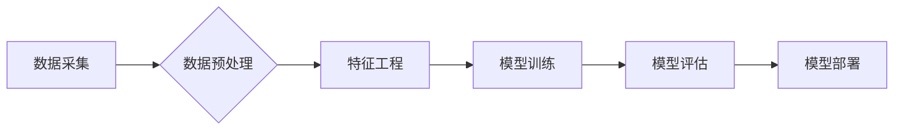

> 数据科学，机器学习，深度学习，算法原理，代码实战，案例分析，数据可视化，Python

## 1. 背景介绍

数据科学作为近年来蓬勃发展的领域，已成为各行各业的重要驱动力。它利用统计学、计算机科学、领域知识等多学科交叉融合，从海量数据中挖掘有价值的信息，并将其转化为可操作的洞察和决策支持。随着数据量的爆炸式增长和计算能力的不断提升，数据科学的应用范围不断拓展，在商业、金融、医疗、教育等领域发挥着越来越重要的作用。

## 2. 核心概念与联系

数据科学的核心概念包括数据采集、数据预处理、特征工程、模型训练、模型评估、模型部署等环节。这些环节相互关联，共同构成了数据科学的完整流程。

**数据科学流程图**



## 3. 核心算法原理 & 具体操作步骤

### 3.1  算法原理概述

机器学习算法是数据科学的核心，它通过学习数据中的模式和规律，自动构建模型，并对新数据进行预测或分类。常见的机器学习算法包括：

* **监督学习:** 利用标记数据训练模型，例如分类和回归问题。
* **无监督学习:**  探索未标记数据中的结构和模式，例如聚类和降维。
* **强化学习:**  通过试错学习，在环境中获得最大奖励。

### 3.2  算法步骤详解

以线性回归为例，详细说明其算法步骤：

1. **数据准备:** 收集并预处理数据，包括数据清洗、特征选择和数据标准化。
2. **模型构建:**  建立线性回归模型，假设目标变量与特征变量之间存在线性关系。
3. **模型训练:** 使用训练数据训练模型，通过最小化损失函数来调整模型参数。
4. **模型评估:** 使用测试数据评估模型性能，例如计算均方误差 (MSE) 或 R-squared 值。
5. **模型部署:** 将训练好的模型部署到实际应用场景中，用于预测或分类新数据。

### 3.3  算法优缺点

**线性回归算法的优点:**

* 算法简单易懂，易于实现。
* 计算效率高，适合处理大规模数据。
* 可解释性强，模型参数具有直观意义。

**线性回归算法的缺点:**

* 只能处理线性关系，对于非线性关系的预测效果较差。
* 对异常值敏感，容易受到异常值的影响。
* 假设特征变量之间相互独立，实际应用中可能存在特征变量之间的相关性。

### 3.4  算法应用领域

线性回归算法广泛应用于各个领域，例如：

* **预测分析:** 预测销售额、房价、股票价格等。
* **风险评估:** 评估贷款风险、信用风险等。
* **市场营销:** 分析客户行为、预测客户流失等。

## 4. 数学模型和公式 & 详细讲解 & 举例说明

### 4.1  数学模型构建

线性回归模型的数学模型如下：

$$
y = \beta_0 + \beta_1 x_1 + \beta_2 x_2 + ... + \beta_n x_n + \epsilon
$$

其中：

* $y$ 是目标变量。
* $x_1, x_2, ..., x_n$ 是特征变量。
* $\beta_0, \beta_1, \beta_2, ..., \beta_n$ 是模型参数。
* $\epsilon$ 是误差项。

### 4.2  公式推导过程

模型参数的估计可以通过最小二乘法来实现。最小二乘法旨在最小化模型预测值与实际值之间的平方误差。

### 4.3  案例分析与讲解

假设我们想要预测房屋价格，特征变量包括房屋面积、房间数量、地理位置等。我们可以使用线性回归模型来建立房屋价格与特征变量之间的关系。通过训练模型，我们可以得到模型参数，并利用这些参数预测新房子的价格。

## 5. 项目实践：代码实例和详细解释说明

### 5.1  开发环境搭建

本项目使用 Python 语言进行开发，需要安装以下软件包：

* NumPy
* Pandas
* Scikit-learn

### 5.2  源代码详细实现

```python
import numpy as np
from sklearn.linear_model import LinearRegression
from sklearn.model_selection import train_test_split

# 加载数据
data = pd.read_csv('house_price.csv')

# 划分训练集和测试集
X = data[['area', 'rooms']]
y = data['price']
X_train, X_test, y_train, y_test = train_test_split(X, y, test_size=0.2, random_state=42)

# 创建线性回归模型
model = LinearRegression()

# 训练模型
model.fit(X_train, y_train)

# 预测测试集数据
y_pred = model.predict(X_test)

# 评估模型性能
mse = mean_squared_error(y_test, y_pred)
r2 = r2_score(y_test, y_pred)

print(f'均方误差 (MSE): {mse}')
print(f'R-squared (R2): {r2}')
```

### 5.3  代码解读与分析

* 首先，我们加载数据并划分训练集和测试集。
* 然后，我们创建线性回归模型并使用训练集进行模型训练。
* 训练完成后，我们使用测试集数据进行模型预测，并计算模型性能指标，例如均方误差 (MSE) 和 R-squared 值。

### 5.4  运行结果展示

运行代码后，会输出模型的 MSE 和 R-squared 值，这些指标可以用来评估模型的预测精度。

## 6. 实际应用场景

数据科学在各个领域都有广泛的应用场景，例如：

* **商业领域:** 预测销售额、客户流失、市场趋势等。
* **金融领域:** 风险评估、欺诈检测、投资决策等。
* **医疗领域:** 疾病诊断、药物研发、患者风险预测等。
* **教育领域:** 学生成绩预测、个性化学习推荐等。

### 6.4  未来应用展望

随着人工智能技术的不断发展，数据科学的应用场景将更加广泛，例如：

* **自动驾驶:** 利用数据科学技术，训练自动驾驶汽车的决策模型。
* **个性化推荐:** 基于用户行为数据，提供个性化的商品、服务和内容推荐。
* **智能医疗:** 利用数据科学技术，辅助医生诊断疾病、制定治疗方案。

## 7. 工具和资源推荐

### 7.1  学习资源推荐

* **在线课程:** Coursera、edX、Udacity 等平台提供丰富的机器学习和数据科学课程。
* **书籍:** 《Python机器学习》、《数据挖掘：概念与技术》、《深入理解机器学习》等书籍。
* **博客和论坛:** Kaggle、Towards Data Science 等平台提供大量数据科学相关的博客文章和论坛讨论。

### 7.2  开发工具推荐

* **Python:** 数据科学的常用编程语言。
* **Jupyter Notebook:** 用于数据分析和可视化的交互式笔记本环境。
* **Pandas:** 用于数据处理和分析的 Python 库。
* **Scikit-learn:** 用于机器学习算法的 Python 库。

### 7.3  相关论文推荐

* **《机器学习》:** Tom Mitchell 著
* **《深入理解机器学习》:**  李宏毅 著
* **《Pattern Recognition and Machine Learning》:** Christopher M. Bishop 著

## 8. 总结：未来发展趋势与挑战

### 8.1  研究成果总结

数据科学领域取得了显著的进展，例如：

* **深度学习:** 深度学习算法在图像识别、自然语言处理等领域取得了突破性进展。
* **强化学习:** 强化学习算法在游戏、机器人控制等领域取得了成功应用。
* **联邦学习:** 联邦学习技术可以保护用户隐私，同时实现模型训练。

### 8.2  未来发展趋势

* **更强大的算法:** 研究更强大的机器学习算法，例如图神经网络、生成对抗网络等。
* **更广泛的应用:** 将数据科学技术应用到更多领域，例如医疗、教育、能源等。
* **更注重可解释性:** 研究更可解释的机器学习模型，提高模型的透明度和信任度。

### 8.3  面临的挑战

* **数据质量:** 数据质量问题是数据科学领域面临的重大挑战。
* **算法可解释性:** 许多机器学习算法难以解释，这限制了其在一些领域的应用。
* **伦理问题:** 数据科学技术可能带来一些伦理问题，例如数据隐私、算法偏见等。

### 8.4  研究展望

未来，数据科学领域将继续朝着更智能、更安全、更可解释的方向发展。


## 9. 附录：常见问题与解答

**常见问题:**

* **什么是数据科学？**
* **机器学习算法有哪些？**
* **如何选择合适的机器学习算法？**
* **如何评估机器学习模型的性能？**

**解答:**

* 数据科学是利用统计学、计算机科学、领域知识等多学科交叉融合，从海量数据中挖掘有价值的信息，并将其转化为可操作的洞察和决策支持。
* 机器学习算法包括监督学习、无监督学习和强化学习。
* 选择合适的机器学习算法需要根据具体问题和数据特点进行选择。
* 机器学习模型的性能可以通过均方误差 (MSE)、R-squared 值等指标进行评估。


作者：禅与计算机程序设计艺术 / Zen and the Art of Computer Programming 
<end_of_turn>