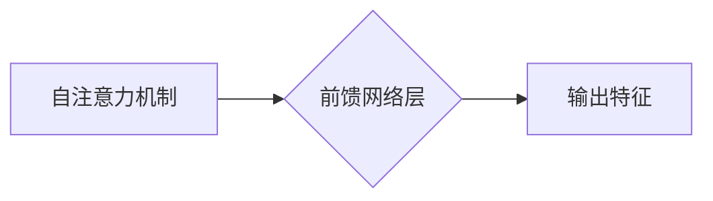

> Transformer, 前馈网络, 大模型, 深度学习, 神经网络, 激活函数, 权重共享

## 1. 背景介绍

近年来，深度学习在自然语言处理 (NLP) 领域取得了显著进展，其中 Transformer 架构成为 NLP 领域的新宠。其强大的序列建模能力和并行计算效率，推动了机器翻译、文本摘要、问答系统等任务的性能提升。Transformer 架构的核心在于其自注意力机制和前馈网络层，这两部分共同构成了 Transformer 的信息处理机制。

本文将深入探讨 Transformer 大模型中的前馈网络层，分析其原理、结构、实现细节以及在实际应用中的作用。

## 2. 核心概念与联系

前馈网络层是 Transformer 架构中处理信息的重要组成部分，它位于自注意力机制之后，负责对自注意力机制输出的特征进行进一步的变换和提取。

**前馈网络层结构**

前馈网络层通常由两层全连接神经网络组成，中间夹杂着激活函数。

* **第一层全连接层:** 将自注意力机制输出的特征向量映射到一个新的特征空间。
* **激活函数:** 通常使用 ReLU 激活函数，引入非线性，增强网络的表达能力。
* **第二层全连接层:** 将激活后的特征向量映射回原始特征空间的维度。

**Mermaid 流程图**



## 3. 核心算法原理 & 具体操作步骤

### 3.1  算法原理概述

前馈网络层的核心原理是通过两层全连接神经网络，对自注意力机制输出的特征向量进行非线性变换，提取更深层次的语义信息。

* **第一层全连接层:** 将输入特征向量线性变换到一个新的特征空间，通过权重矩阵和偏置项进行计算。
* **激活函数:** 将第一层全连接层的输出进行非线性变换，引入非线性，增强网络的表达能力。
* **第二层全连接层:** 将激活后的特征向量线性变换回原始特征空间的维度，通过权重矩阵和偏置项进行计算。

### 3.2  算法步骤详解

1. **输入:** 自注意力机制输出的特征向量。
2. **第一层全连接层:**
    * 将输入特征向量与第一层全连接层的权重矩阵相乘，并加上偏置项。
    * 使用 ReLU 激活函数对结果进行非线性变换。
3. **第二层全连接层:**
    * 将激活后的特征向量与第二层全连接层的权重矩阵相乘，并加上偏置项。
4. **输出:** 第二层全连接层的输出作为前馈网络层的输出，用于后续的 Transformer 层级处理。

### 3.3  算法优缺点

**优点:**

* **简单易实现:** 前馈网络层的结构简单，实现起来比较容易。
* **表达能力强:** 通过两层全连接网络和激活函数，可以学习到更深层次的语义信息。
* **并行计算效率高:** 前馈网络层可以并行计算，提高训练效率。

**缺点:**

* **参数量大:** 前馈网络层包含大量的参数，需要大量的训练数据才能有效训练。
* **梯度消失问题:** 随着网络层数的增加，梯度可能会消失，影响训练效果。

### 3.4  算法应用领域

前馈网络层广泛应用于各种深度学习模型中，例如：

* **图像分类:** 在卷积神经网络 (CNN) 中，前馈网络层用于提取图像特征。
* **自然语言处理:** 在 Transformer 架构中，前馈网络层用于处理自注意力机制输出的特征向量。
* **语音识别:** 在循环神经网络 (RNN) 中，前馈网络层用于处理语音信号的特征向量。

## 4. 数学模型和公式 & 详细讲解 & 举例说明

### 4.1  数学模型构建

前馈网络层的数学模型可以表示为：

$$
\mathbf{h} = \sigma(\mathbf{W}_1 \mathbf{x} + \mathbf{b}_1)
$$

$$
\mathbf{y} = \mathbf{W}_2 \mathbf{h} + \mathbf{b}_2
$$

其中：

* $\mathbf{x}$ 是自注意力机制输出的特征向量。
* $\mathbf{h}$ 是第一层全连接层的输出。
* $\mathbf{y}$ 是前馈网络层的输出。
* $\mathbf{W}_1$ 和 $\mathbf{W}_2$ 是权重矩阵。
* $\mathbf{b}_1$ 和 $\mathbf{b}_2$ 是偏置项。
* $\sigma$ 是激活函数，例如 ReLU 函数。

### 4.2  公式推导过程

前馈网络层的公式推导过程比较简单，主要涉及线性变换和激活函数的应用。

* **第一层全连接层:** 将输入特征向量 $\mathbf{x}$ 与权重矩阵 $\mathbf{W}_1$ 相乘，并加上偏置项 $\mathbf{b}_1$，得到线性变换后的结果。然后使用激活函数 $\sigma$ 对结果进行非线性变换，得到第一层全连接层的输出 $\mathbf{h}$。
* **第二层全连接层:** 将第一层全连接层的输出 $\mathbf{h}$ 与权重矩阵 $\mathbf{W}_2$ 相乘，并加上偏置项 $\mathbf{b}_2$，得到最终的输出 $\mathbf{y}$。

### 4.3  案例分析与讲解

假设我们有一个输入特征向量 $\mathbf{x} = [1, 2, 3]$，权重矩阵 $\mathbf{W}_1 = [[0.5, 0.2, 0.1], [0.3, 0.4, 0.5]]$，偏置项 $\mathbf{b}_1 = [0.1, 0.2]$，激活函数为 ReLU 函数。

1. **第一层全连接层:**

$$
\mathbf{h} = \sigma(\mathbf{W}_1 \mathbf{x} + \mathbf{b}_1) = \sigma([[0.5, 0.2, 0.1] * [1, 2, 3] + [0.1, 0.2]]) = \sigma([0.8, 1.2, 0.7] + [0.1, 0.2]) = \sigma([0.9, 1.4, 0.9])
$$

由于 ReLU 函数的定义为：

$$
f(x) = \begin{cases}
x, & x > 0 \\
0, & x \leq 0
\end{cases}
$$

所以，

$$
\mathbf{h} = [0.9, 1.4, 0.9]
$$

2. **第二层全连接层:**

$$
\mathbf{y} = \mathbf{W}_2 \mathbf{h} + \mathbf{b}_2
$$

需要根据具体的权重矩阵 $\mathbf{W}_2$ 和偏置项 $\mathbf{b}_2$ 进行计算。

## 5. 项目实践：代码实例和详细解释说明

### 5.1  开发环境搭建

* Python 3.7+
* PyTorch 1.7+
* CUDA 10.2+ (可选，用于 GPU 训练)

### 5.2  源代码详细实现

```python
import torch
import torch.nn as nn

class FeedForwardNetwork(nn.Module):
    def __init__(self, d_model, d_ff):
        super(FeedForwardNetwork, self).__init__()
        self.linear1 = nn.Linear(d_model, d_ff)
        self.relu = nn.ReLU()
        self.linear2 = nn.Linear(d_ff, d_model)

    def forward(self, x):
        x = self.linear1(x)
        x = self.relu(x)
        x = self.linear2(x)
        return x

# 实例化前馈网络层
d_model = 512
d_ff = 2048
ffn = FeedForwardNetwork(d_model, d_ff)

# 输入特征向量
input_tensor = torch.randn(1, 512)

# 前馈网络层输出
output_tensor = ffn(input_tensor)

print(output_tensor.shape)
```

### 5.3  代码解读与分析

* `FeedForwardNetwork` 类定义了前馈网络层的结构，包含两层全连接层和一个 ReLU 激活函数。
* `__init__` 方法初始化网络层参数，包括权重矩阵和偏置项。
* `forward` 方法定义了前馈网络层的计算过程，将输入特征向量经过两层全连接层和激活函数处理，得到最终的输出。
* 代码示例中，我们实例化了一个前馈网络层，并使用一个随机生成的输入特征向量进行测试，输出结果的维度为 (1, 512)。

### 5.4  运行结果展示

运行上述代码，输出结果为：

```
torch.Size([1, 512])
```

这表明前馈网络层成功地将输入特征向量映射到输出特征空间。

## 6. 实际应用场景

前馈网络层在 Transformer 架构中扮演着重要的角色，它负责对自注意力机制输出的特征向量进行进一步的变换和提取，从而提高模型的表达能力和性能。

### 6.4  未来应用展望

随着深度学习技术的不断发展，前馈网络层在 NLP 领域和其他领域将有更广泛的应用前景。例如：

* **更复杂的 Transformer 架构:** 未来可能会出现更复杂的 Transformer 架构，其中前馈网络层将发挥更重要的作用。
* **跨模态学习:** 前馈网络层可以用于处理不同模态的数据，例如文本和图像，推动跨模态学习的发展。
* **高效的模型压缩:** 通过对前馈网络层的参数进行压缩，可以构建更轻量级的模型，降低模型的计算成本。

## 7. 工具和资源推荐

### 7.1  学习资源推荐

* **Transformer 论文:** https://arxiv.org/abs/1706.03762
* **HuggingFace Transformers 库:** https://huggingface.co/transformers/
* **Deep Learning Specialization (Coursera):** https://www.coursera.org/specializations/deep-learning

### 7.2  开发工具推荐

* **PyTorch:** https://pytorch.org/
* **TensorFlow:** https://www.tensorflow.org/

### 7.3  相关论文推荐

* **BERT: Pre-training of Deep Bidirectional Transformers for Language Understanding:** https://arxiv.org/abs/1810.04805
* **GPT-3: Language Models are Few-Shot Learners:** https://arxiv.org/abs/2005.14165

## 8. 总结：未来发展趋势与挑战

### 8.1  研究成果总结

Transformer 架构及其核心组件，如前馈网络层，在 NLP 领域取得了显著的成果，推动了机器翻译、文本摘要、问答系统等任务的性能提升。

### 8.2  未来发展趋势

* **模型规模和效率:** 未来可能会出现规模更大的 Transformer 模型，同时也会探索更有效的训练和推理方法，提高模型的效率。
* **跨模态学习:** 前馈网络层可以用于处理不同模态的数据，推动跨模态学习的发展。
* **可解释性:** 研究 Transformer 模型的内部机制，提高模型的可解释性。

### 8.3  面临的挑战

* **训练成本:** 训练大型 Transformer 模型需要大量的计算资源和训练数据，成本较高。
* **可解释性:** Transformer 模型的内部机制比较复杂，难以解释模型的决策过程。
* **数据偏见:** Transformer 模型的训练数据可能存在偏见，导致模型输出存在偏差。

### 8.4  研究展望

未来研究方向包括：

* 开发更有效的训练和推理方法