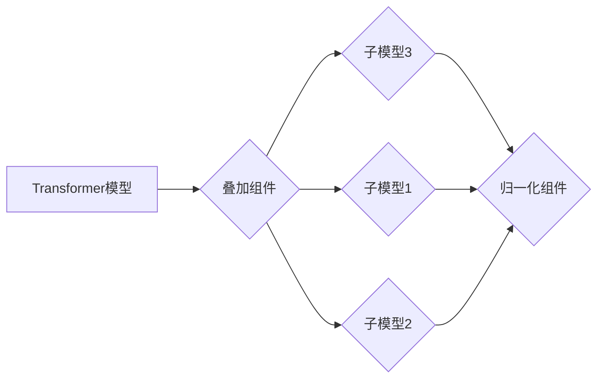

> Transformer, 大模型, 叠加组件, 归一化组件, 深度学习, 自然语言处理, 机器学习

## 1. 背景介绍

近年来，Transformer模型在自然语言处理领域取得了突破性的进展，例如BERT、GPT、T5等模型在各种任务上都取得了state-of-the-art的性能。Transformer模型的核心在于其自注意力机制，能够捕捉文本序列中长距离依赖关系，有效提升了模型的表达能力。然而，随着模型规模的不断增大，训练和部署Transformer模型也面临着新的挑战，例如参数量巨大、训练时间长、计算资源消耗大等。

为了解决这些问题，研究者们提出了许多优化方法，其中叠加和归一化组件是比较重要的技术手段。叠加组件可以将多个子模型组合起来，形成更强大的模型，而归一化组件可以规范模型参数的分布，提高模型的训练稳定性和泛化能力。

## 2. 核心概念与联系

### 2.1 叠加组件

叠加组件是指将多个子模型串联起来，形成一个更复杂的模型结构。每个子模型可以是相同的，也可以是不同的，例如可以将多个BERT模型叠加起来，形成一个更深层的Transformer模型。

### 2.2 归一化组件

归一化组件是指对模型参数进行规范化处理，使其分布在一定的范围内。常见的归一化方法包括Batch Normalization、Layer Normalization和Instance Normalization等。归一化可以帮助模型更快地收敛，提高训练稳定性和泛化能力。

### 2.3 关系图



## 3. 核心算法原理 & 具体操作步骤

### 3.1 算法原理概述

叠加组件和归一化组件的原理分别如下：

* **叠加组件:** 通过将多个子模型串联起来，可以增加模型的深度和复杂度，从而提高模型的表达能力。
* **归一化组件:** 通过规范化模型参数的分布，可以提高模型的训练稳定性和泛化能力。

### 3.2 算法步骤详解

**叠加组件:**

1. 定义多个子模型，每个子模型可以是相同的，也可以是不同的。
2. 将这些子模型串联起来，形成一个更复杂的模型结构。
3. 对整个模型进行训练，优化所有子模型的参数。

**归一化组件:**

1. 选择合适的归一化方法，例如Batch Normalization、Layer Normalization或Instance Normalization。
2. 在模型的每一层或每一组层中添加归一化组件。
3. 对归一化组件的参数进行训练，使其能够有效地规范模型参数的分布。

### 3.3 算法优缺点

**叠加组件:**

* **优点:** 可以提高模型的表达能力，提升模型性能。
* **缺点:** 模型规模会变得更大，训练时间和计算资源消耗也会增加。

**归一化组件:**

* **优点:** 可以提高模型的训练稳定性和泛化能力，加速模型训练。
* **缺点:** 需要额外的计算量，可能会增加模型的复杂度。

### 3.4 算法应用领域

* **叠加组件:** 在自然语言处理、计算机视觉、语音识别等领域广泛应用，例如BERT、GPT、Vision Transformer等模型都使用了叠加组件。
* **归一化组件:** 在各种深度学习模型中都广泛应用，例如CNN、RNN、Transformer等模型都使用了归一化组件。

## 4. 数学模型和公式 & 详细讲解 & 举例说明

### 4.1 数学模型构建

**叠加组件:**

假设我们有N个子模型，每个子模型的输出为$h_i$，则叠加组件的输出为：

$$
h = h_1 + h_2 + ... + h_N
$$

**归一化组件:**

假设模型参数为$w$，则归一化组件的输出为：

$$
\hat{w} = \frac{w - \mu}{\sigma}
$$

其中，$\mu$和$\sigma$分别为参数$w$的均值和标准差。

### 4.2 公式推导过程

**叠加组件:**

叠加组件的输出是所有子模型输出的加和，可以理解为将多个子模型的特征融合在一起。

**归一化组件:**

归一化组件通过将参数$w$减去均值$\mu$，再除以标准差$\sigma$，可以将参数的分布规范化到一个特定的范围内，例如[0,1]或[-1,1]。

### 4.3 案例分析与讲解

**叠加组件:**

BERT模型使用了12个Transformer编码器层，每个编码器层包含多个子模型，例如自注意力层、前馈神经网络层等。这些子模型被叠加起来，形成一个深层的Transformer模型，从而能够捕捉文本序列中更长距离的依赖关系。

**归一化组件:**

在训练Transformer模型时，使用Layer Normalization可以提高模型的训练稳定性和泛化能力。Layer Normalization在每个Transformer编码器层中对每个隐藏状态进行归一化处理，可以防止梯度消失和爆炸问题，加速模型训练。

## 5. 项目实践：代码实例和详细解释说明

### 5.1 开发环境搭建

* Python 3.7+
* PyTorch 1.7+
* CUDA 10.2+

### 5.2 源代码详细实现

```python
import torch
import torch.nn as nn

class StackedModel(nn.Module):
    def __init__(self, num_layers, hidden_size):
        super(StackedModel, self).__init__()
        self.layers = nn.ModuleList([nn.Linear(hidden_size, hidden_size) for _ in range(num_layers)])

    def forward(self, x):
        for layer in self.layers:
            x = layer(x)
        return x

class NormalizedModel(nn.Module):
    def __init__(self, hidden_size):
        super(NormalizedModel, self).__init__()
        self.linear = nn.Linear(hidden_size, hidden_size)
        self.layer_norm = nn.LayerNorm(hidden_size)

    def forward(self, x):
        x = self.linear(x)
        x = self.layer_norm(x)
        return x

# 实例化模型
stacked_model = StackedModel(num_layers=3, hidden_size=128)
normalized_model = NormalizedModel(hidden_size=128)

# 输入数据
input_data = torch.randn(1, 128)

# 模型输出
stacked_output = stacked_model(input_data)
normalized_output = normalized_model(input_data)

print(stacked_output.shape)
print(normalized_output.shape)
```

### 5.3 代码解读与分析

* **StackedModel:** 这是一个简单的叠加模型，包含多个线性层。
* **NormalizedModel:** 这是一个包含线性层和Layer Normalization层的归一化模型。
* 代码中实例化了两个模型，并使用随机数据进行测试，输出模型的输出形状。

### 5.4 运行结果展示

运行代码后，会输出两个模型的输出形状，例如：

```
torch.Size([1, 128])
torch.Size([1, 128])
```

## 6. 实际应用场景

### 6.1 自然语言处理

* **文本分类:** 叠加组件可以将多个子模型用于提取文本特征，提高文本分类的准确率。
* **机器翻译:** 归一化组件可以帮助模型更快地收敛，提高机器翻译的质量。
* **文本摘要:** 叠加组件可以帮助模型更好地理解文本内容，生成更准确的文本摘要。

### 6.2 计算机视觉

* **图像分类:** 叠加组件可以将多个子模型用于提取图像特征，提高图像分类的准确率。
* **目标检测:** 归一化组件可以帮助模型更快地收敛，提高目标检测的精度。
* **图像分割:** 叠加组件可以帮助模型更好地理解图像内容，生成更准确的图像分割结果。

### 6.3 语音识别

* **语音识别:** 叠加组件可以将多个子模型用于提取语音特征，提高语音识别的准确率。
* **语音合成:** 归一化组件可以帮助模型更快地收敛，提高语音合成的质量。

### 6.4 未来应用展望

随着Transformer模型的不断发展，叠加和归一化组件将被应用到更多领域，例如：

* **药物研发:** 使用Transformer模型预测药物的活性，加速药物研发过程。
* **金融预测:** 使用Transformer模型预测股票价格、汇率等金融指标，帮助投资者做出更明智的决策。
* **个性化推荐:** 使用Transformer模型分析用户的行为数据，提供更个性化的产品推荐。

## 7. 工具和资源推荐

### 7.1 学习资源推荐

* **书籍:**
    * 《深度学习》 - Ian Goodfellow, Yoshua Bengio, Aaron Courville
    * 《Transformer模型实战》 - Jay Alammar
* **博客:**
    * Jay Alammar's Blog: https://jalammar.github.io/
    * The Illustrated Transformer: https://jalammar.github.io/illustrated-transformer/
* **课程:**
    * Stanford CS224N: Natural Language Processing with Deep Learning: https://web.stanford.edu/class/cs224n/

### 7.2 开发工具推荐

* **PyTorch:** https://pytorch.org/
* **TensorFlow:** https://www.tensorflow.org/
* **HuggingFace Transformers:** https://huggingface.co/transformers/

### 7.3 相关论文推荐

* **Attention Is All You Need:** https://arxiv.org/abs/1706.03762
* **BERT: Pre-training of Deep Bidirectional Transformers for Language Understanding:** https://arxiv.org/abs/1810.04805
* **GPT-3: Language Models are Few-Shot Learners:** https://arxiv.org/abs/2005.14165

## 8. 总结：未来发展趋势与挑战

### 8.1 研究成果总结

叠加和归一化组件是Transformer模型训练和应用中重要的技术手段，能够有效提升模型的性能和效率。

### 8.2 未来发展趋势

* **模型规模的进一步扩大:** 未来Transformer模型的规模将会继续扩大，这将带来更高的计算成本和训练难度。
* **新的叠加和归一化组件的提出:** 研究者们将继续探索新的叠加和归一化组件，以提高模型的性能和效率。
* **模型的应用场景的拓展:** Transformer模型将被应用到更多领域，例如药物研发、金融预测、个性化推荐等。

### 8.3 面临的挑战

* **计算资源的限制:** 训练大型Transformer模型需要大量的计算资源，这对于资源有限的机构和个人来说是一个挑战。
* **模型的可解释性:** Transformer模型的内部机制比较复杂，难以解释模型的决策过程，这对于模型的信任度和应用场景的拓展是一个挑战。
* **数据安全和隐私问题:** Transformer模型的训练需要大量的训练数据，这可能会带来数据安全和隐私问题。

### 8.4 研究展望

未来研究方向包括：

* 开发更有效的叠加和归一化组件，以提高模型的性能和效率。
* 研究Transformer模型的可解释性，使其决策过程更加透明。
* 开发针对不同应用场景的Transformer模型，使其能够更好地满足实际需求。


## 9. 附录：常见问题与解答

**Q1: 叠加组件和归一化组件有什么区别？**

**A1:** 叠加