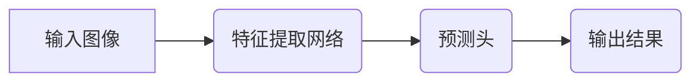

> YOLO,目标检测,深度学习,计算机视觉,物体识别,YOLOv5,PyTorch

## 1. 背景介绍

在当今人工智能蓬勃发展的时代，目标检测技术作为计算机视觉领域的核心应用之一，在安防监控、自动驾驶、医疗诊断等众多领域发挥着至关重要的作用。目标检测的目标是识别图像或视频中存在的物体，并对其进行定位和分类。

传统的目标检测方法通常依赖于手工设计的特征提取器和分类器，其性能受限于特征工程的复杂性和分类器的训练难度。随着深度学习技术的兴起，基于深度神经网络的目标检测算法取得了显著的进展。其中，YOLO (You Only Look Once) 系列算法凭借其速度快、精度高、易于训练的特点，成为目标检测领域备受关注的代表性算法。

YOLOv5是YOLO系列算法的最新版本，它在算法架构、训练策略和模型规模等方面进行了进一步的优化，取得了更高的检测精度和更快的检测速度。本文将深入讲解YOLOv5的原理、算法流程、代码实现以及实际应用场景，帮助读者全面理解YOLOv5的目标检测技术。

## 2. 核心概念与联系

YOLOv5的核心思想是将目标检测任务转化为回归问题，即直接预测目标的边界框坐标和类别概率。它采用了一种端到端的训练方式，将特征提取、目标定位和分类整合到一个统一的网络结构中，从而简化了模型训练过程。

**YOLOv5的架构主要包含以下几个部分：**

* **特征提取网络:** YOLOv5采用CSPDarknet53作为特征提取网络，该网络结构具有较高的特征提取能力和较低的计算复杂度。
* **预测头:** 预测头负责根据特征图上的特征信息预测目标的边界框坐标和类别概率。
* **损失函数:** YOLOv5使用改进的IoU损失函数来衡量预测边界框与真实边界框之间的重叠程度，并使用交叉熵损失函数来计算类别概率的误差。

**YOLOv5的流程图如下:**

## 3. 核心算法原理 & 具体操作步骤

### 3.1  算法原理概述

YOLOv5的核心算法原理是将图像划分为多个网格单元，每个网格单元负责预测该区域内是否存在目标，以及目标的边界框坐标和类别概率。

**具体步骤如下:**

1. 将输入图像划分为S x S个网格单元。
2. 每个网格单元负责预测B个边界框和C个类别。
3. 每个边界框由(x, y, w, h)四个参数表示，其中(x, y)为边界框中心点坐标，w和h为边界框宽度和高度。
4. 每个类别由一个概率值表示，该值代表该边界框属于该类别的概率。
5. 使用损失函数计算预测结果与真实结果之间的误差，并通过反向传播算法更新网络参数。

### 3.2  算法步骤详解

1. **特征提取:** 将输入图像输入到特征提取网络中，提取图像的特征表示。
2. **预测:** 将特征图输入到预测头中，预测每个网格单元内存在的目标信息，包括边界框坐标和类别概率。
3. **非极大值抑制:** 对每个网格单元内的预测边界框进行非极大值抑制，保留置信度最高的边界框。
4. **后处理:** 对保留的边界框进行坐标调整和类别筛选，最终输出检测结果。

### 3.3  算法优缺点

**优点:**

* **速度快:** YOLOv5采用并行计算的方式，可以实现实时的目标检测。
* **精度高:** YOLOv5的算法架构和训练策略都经过了优化，可以达到较高的检测精度。
* **易于训练:** YOLOv5的训练过程相对简单，只需要少量的数据就可以进行训练。

**缺点:**

* **对小目标检测效果较差:** YOLOv5的网格划分方式可能会导致对小目标的检测效果较差。
* **容易受到背景干扰:** YOLOv5的检测结果可能会受到背景干扰的影响。

### 3.4  算法应用领域

YOLOv5在目标检测领域具有广泛的应用前景，例如:

* **安防监控:** 人脸识别、入侵检测、行为分析等。
* **自动驾驶:** 车辆识别、行人检测、交通标志识别等。
* **医疗诊断:** 病灶检测、器官识别、疾病诊断等。
* **零售业:** 商品识别、库存管理、顾客行为分析等。

## 4. 数学模型和公式 & 详细讲解 & 举例说明

### 4.1  数学模型构建

YOLOv5的目标检测模型可以看作是一个多层神经网络，其输入是图像，输出是每个网格单元内存在的目标信息，包括边界框坐标和类别概率。

**模型结构可以概括为以下几个部分:**

* **卷积层:** 用于提取图像特征。
* **池化层:** 用于降低特征图的尺寸，提高模型的鲁棒性。
* **激活函数:** 用于引入非线性，提高模型的表达能力。
* **全连接层:** 用于将特征映射到输出空间。

### 4.2  公式推导过程

YOLOv5的损失函数由边界框损失和类别损失两部分组成。

**边界框损失:**

$$
L_{bbox} = \sum_{i=1}^{N} \sum_{j=1}^{B} \lambda_{coord} \cdot \text{IoU}(b_i, b_j) + \lambda_{noobj} \cdot \text{IoU}(b_i, b_j)
$$

其中:

* $N$ 是图像中所有目标的数量。
* $B$ 是每个网格单元预测的边界框数量。
* $\lambda_{coord}$ 和 $\lambda_{noobj}$ 是权重参数。
* $\text{IoU}(b_i, b_j)$ 是预测边界框 $b_j$ 与真实边界框 $b_i$ 之间的交并比。

**类别损失:**

$$
L_{class} = -\sum_{i=1}^{N} \sum_{c=1}^{C} p_i^c \cdot \log(p_i^c)
$$

其中:

* $C$ 是目标类别数量。
* $p_i^c$ 是预测边界框 $i$ 属于类别 $c$ 的概率。

### 4.3  案例分析与讲解

假设我们有一个图像，其中包含一个猫和一个狗。YOLOv5模型会将图像划分为多个网格单元，每个网格单元负责预测该区域内存在的目标信息。

对于包含猫的网格单元，模型会预测出猫的边界框坐标和类别概率，例如(x, y, w, h) = (0.2, 0.3, 0.5, 0.4) 和 $p_{cat} = 0.9$.

对于包含狗的网格单元，模型会预测出狗的边界框坐标和类别概率，例如(x, y, w, h) = (0.7, 0.8, 0.3, 0.2) 和 $p_{dog} = 0.8$.

最终，YOLOv5模型会输出所有预测的边界框和类别概率，并根据置信度进行筛选，最终输出检测结果。

## 5. 项目实践：代码实例和详细解释说明

### 5.1  开发环境搭建

YOLOv5的开发环境搭建相对简单，主要需要安装Python、PyTorch和必要的库。

**具体步骤如下:**

1. 安装Python 3.7 或更高版本。
2. 安装PyTorch。
3. 安装必要的库，例如NumPy、OpenCV等。

### 5.2  源代码详细实现

YOLOv5的源代码开源在GitHub上，可以方便地下载和使用。

**具体步骤如下:**

1. 下载YOLOv5的源代码。
2. 进入源代码目录。
3. 使用命令 `python train.py` 开始训练模型。

### 5.3  代码解读与分析

YOLOv5的代码实现主要包含以下几个部分:

* **数据加载:** 加载训练数据，并进行数据预处理。
* **模型定义:** 定义YOLOv5的网络结构。
* **训练:** 使用反向传播算法训练模型。
* **评估:** 使用测试数据评估模型的性能。

### 5.4  运行结果展示

训练完成后，可以将模型应用于实际图像进行目标检测，并展示检测结果。

## 6. 实际应用场景

YOLOv5在目标检测领域具有广泛的应用场景，例如:

### 6.1  安防监控

YOLOv5可以用于人脸识别、入侵检测、行为分析等安防监控任务。

### 6.2  自动驾驶

YOLOv5可以用于车辆识别、行人检测、交通标志识别等自动驾驶任务。

### 6.3  医疗诊断

YOLOv5可以用于病灶检测、器官识别、疾病诊断等医疗诊断任务。

### 6.4  未来应用展望

随着深度学习技术的不断发展，YOLOv5的应用场景将会更加广泛，例如:

* **智能零售:** 商品识别、库存管理、顾客行为分析等。
* **智慧城市:** 交通管理、环境监测、公共安全等。
* **工业自动化:** 机器视觉、缺陷检测、质量控制等。

## 7. 工具和资源推荐

### 7.1  学习资源推荐

* **YOLOv5官方文档:** https://github.com/ultralytics/yolov5
* **PyTorch官方文档:** https://pytorch.org/docs/stable/index.html
* **深度学习书籍:** 《深度学习》、《动手学深度学习》等。

### 7.2  开发工具推荐

* **PyCharm:** Python开发环境。
* **VS Code:** 代码编辑器。
* **Jupyter Notebook:** 数据分析和可视化工具。

### 7.3  相关论文推荐

* **YOLO: Real-Time Object Detection:** https://arxiv.org/abs/1506.02640
* **YOLOv3: An Incremental Improvement:** https://arxiv.org/abs/1804.02767
* **YOLOv5: A Unified, Ultra-Fast, and Accurate Object Detection System:** https://arxiv.org/abs/2005.10986

## 8. 总结：未来发展趋势与挑战

### 8.1  研究成果总结

YOLOv5在目标检测领域取得了显著的进展，其速度快、精度高、易于训练的特点使其成为目标检测领域的一款热门算法。

### 8.2  未来发展趋势

未来目标检测技术的发展趋势包括:

* **更高效的算法:** 研究更快的目标检测算法，以满足实时应用的需求。
* **更强的泛化能力:** 研究能够适应不同场景和数据集的目标检测算法。
* **更强的解释性:** 研究能够解释目标检测结果的算法，提高算法的可信度。

### 8.3  面临的挑战

目标检测技术还面临着一些挑战，例如:

* **小目标检测:** 对于小目标的检测效果仍然需要进一步提升。
* **场景变化:** 目标检测算法在面对场景变化时仍然存在一定的鲁棒性问题。
* **数据标注:** 目标检测算法需要大量的标注数据，数据标注成本较高。

### 8.4  研究展望

未来目标检测技术的研究方向包括:

* **探索新的网络架构:** 研究更深、更宽、更有效的网络架构。
* **利用多模态信息:** 利用图像、视频、音频等多模态信息进行目标检测。
* **发展无监督学习:** 研究无需标注数据即可进行目标检测的算法。

## 9. 附录：常见问题与解答

### 9.1  常见问题

* **YOLOv5的训练速度如何？**

Y