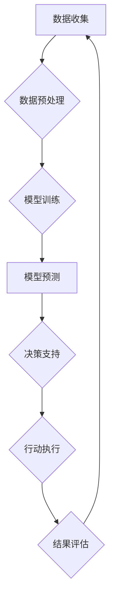

>  人工智能、可持续发展目标、映射、数据驱动、优化算法、环境保护、社会发展、经济增长

## 1. 背景介绍

全球面临着严峻的挑战，包括气候变化、资源枯竭、贫困和不平等。联合国提出的可持续发展目标（SDGs）为解决这些挑战提供了路线图，旨在到2030年实现一个更加包容、公正和可持续的世界。

人工智能（AI）作为一项颠覆性的技术，正在迅速发展，并展现出巨大的潜力，可以为实现SDGs做出重要贡献。AI能够通过分析海量数据、识别模式和做出预测，为制定更有效的政策、提高资源利用效率和促进社会公平提供支持。

## 2. 核心概念与联系

**2.1  可持续发展目标（SDGs）**

SDGs 是联合国于2015年制定的17个全球性目标，旨在解决全球性挑战，包括消除贫困、保护环境和促进和平与正义。

**2.2  人工智能（AI）**

AI 是一种模拟人类智能的计算机科学领域，旨在开发能够学习、推理、解决问题和做出决策的智能系统。

**2.3  映射与应用**

AI 可以通过“映射”的方式将数据与SDGs目标联系起来。

* **数据映射:** 将来自不同来源的数据（例如人口统计数据、环境监测数据、经济指标等）映射到SDGs目标指标。
* **模型映射:** 使用AI模型预测SDGs目标的进展情况，并识别潜在的风险和机遇。
* **行动映射:** 根据AI模型的预测结果，制定针对性的政策和行动方案，以实现SDGs目标。

**2.4  AI应用架构**



## 3. 核心算法原理 & 具体操作步骤

**3.1  算法原理概述**

在AI应用SDGs领域，常用的算法包括：

* **机器学习（ML）:** 训练模型从数据中学习模式，并进行预测。
* **深度学习（DL）:** 使用多层神经网络进行更复杂的模式识别。
* **强化学习（RL）:** 通过试错学习，找到最佳的行动策略。

**3.2  算法步骤详解**

以机器学习为例，其步骤如下：

1. **数据收集:** 收集与SDGs目标相关的各种数据。
2. **数据预处理:** 清洗、转换和格式化数据，使其适合模型训练。
3. **特征工程:** 从原始数据中提取有意义的特征，用于模型训练。
4. **模型选择:** 根据任务需求选择合适的机器学习模型。
5. **模型训练:** 使用训练数据训练模型，并调整模型参数。
6. **模型评估:** 使用测试数据评估模型的性能，并进行调整。
7. **模型部署:** 将训练好的模型部署到实际应用场景中。

**3.3  算法优缺点**

* **优点:** 能够从数据中发现隐藏的模式，并进行精准预测。
* **缺点:** 需要大量的数据进行训练，且模型解释性较差。

**3.4  算法应用领域**

* **环境保护:** 预测气候变化趋势、监测污染物排放、优化资源利用。
* **社会发展:** 预测人口增长趋势、识别贫困人口、评估社会福利政策。
* **经济增长:** 预测经济增长率、识别市场趋势、优化投资决策。

## 4. 数学模型和公式 & 详细讲解 & 举例说明

**4.1  数学模型构建**

在AI应用SDGs领域，常用的数学模型包括：

* **线性回归模型:** 用于预测连续变量，例如经济增长率。
* **逻辑回归模型:** 用于预测分类变量，例如贫困人口比例。
* **支持向量机（SVM）模型:** 用于分类和回归任务，具有较强的泛化能力。

**4.2  公式推导过程**

以线性回归模型为例，其目标是找到一条直线，使得预测值与实际值之间的误差最小。

* **目标函数:** 
$$
J(\theta) = \frac{1}{2m} \sum_{i=1}^{m} (h_\theta(x^{(i)}) - y^{(i)})^2
$$

其中：

* $J(\theta)$ 是目标函数，表示模型预测误差的平方和。
* $\theta$ 是模型参数。
* $m$ 是训练样本数量。
* $h_\theta(x^{(i)})$ 是模型预测值。
* $y^{(i)}$ 是实际值。

* **梯度下降算法:** 用于优化模型参数，使得目标函数最小化。

$$
\theta_j := \theta_j - \alpha \frac{\partial J(\theta)}{\partial \theta_j}
$$

其中：

* $\alpha$ 是学习率。
* $\frac{\partial J(\theta)}{\partial \theta_j}$ 是目标函数对参数 $\theta_j$ 的偏导数。

**4.3  案例分析与讲解**

可以使用线性回归模型预测某个国家的经济增长率，根据历史数据和相关因素（例如人口增长率、投资水平等）进行训练。

## 5. 项目实践：代码实例和详细解释说明

**5.1  开发环境搭建**

使用Python语言和相关库（例如TensorFlow、PyTorch等）进行开发。

**5.2  源代码详细实现**

```python
import tensorflow as tf

# 定义模型
model = tf.keras.Sequential([
    tf.keras.layers.Dense(64, activation='relu', input_shape=(n_features,)),
    tf.keras.layers.Dense(1)
])

# 编译模型
model.compile(optimizer='adam', loss='mse')

# 训练模型
model.fit(X_train, y_train, epochs=10)

# 评估模型
loss = model.evaluate(X_test, y_test)
```

**5.3  代码解读与分析**

* 使用TensorFlow框架构建一个简单的线性回归模型。
* 模型包含两层全连接神经网络，第一层有64个神经元，激活函数为ReLU，输入特征数量为n_features。
* 模型使用Adam优化器和均方误差损失函数进行训练。
* 模型在训练集上训练10个epochs。
* 使用测试集评估模型的性能。

**5.4  运行结果展示**

根据训练结果，可以评估模型的预测精度，并进行可视化展示。

## 6. 实际应用场景

**6.1  环境保护**

* **气候变化预测:** 使用AI模型分析气候数据，预测未来气候变化趋势，为制定应对措施提供依据。
* **污染物监测:** 使用AI模型分析传感器数据，实时监测空气、水和土壤污染物浓度，及时采取措施控制污染。
* **资源管理:** 使用AI模型优化资源分配和利用，减少资源浪费，促进可持续发展。

**6.2  社会发展**

* **贫困人口识别:** 使用AI模型分析社会经济数据，识别贫困人口，为精准扶贫提供支持。
* **教育公平:** 使用AI模型分析学生学习数据，个性化推荐学习资源，促进教育公平。
* **医疗保健:** 使用AI模型分析医疗数据，辅助诊断疾病，提高医疗服务质量。

**6.3  经济增长**

* **市场预测:** 使用AI模型分析市场数据，预测市场趋势，帮助企业制定决策。
* **投资优化:** 使用AI模型分析投资数据，识别投资机会，优化投资组合。
* **供应链管理:** 使用AI模型优化供应链流程，提高效率，降低成本。

**6.4  未来应用展望**

随着AI技术的不断发展，其在SDGs领域的应用将更加广泛和深入。例如：

* **更精准的预测:** 使用更先进的AI算法，进行更精准的预测，为制定更有效的政策提供支持。
* **更个性化的服务:** 使用AI技术，提供更个性化的服务，例如个性化教育、个性化医疗等。
* **更智能的决策:** 使用AI技术，辅助决策者做出更智能的决策，例如优化资源分配、制定应对气候变化的策略等。

## 7. 工具和资源推荐

**7.1  学习资源推荐**

* **在线课程:** Coursera、edX、Udacity等平台提供丰富的AI课程。
* **书籍:** 《深度学习》、《机器学习实战》等书籍介绍了AI的基础知识和应用。
* **开源项目:** TensorFlow、PyTorch等开源项目提供了丰富的代码示例和工具。

**7.2  开发工具推荐**

* **Python:** 作为AI开发的主要语言，Python拥有丰富的库和工具。
* **Jupyter Notebook:** 用于编写和运行Python代码，并进行可视化展示。
* **TensorFlow/PyTorch:** 用于构建和训练AI模型的框架。

**7.3  相关论文推荐**

* **《人工智能在可持续发展目标中的应用》**
* **《深度学习在环境保护中的应用》**
* **《机器学习在社会发展中的应用》**

## 8. 总结：未来发展趋势与挑战

**8.1  研究成果总结**

AI技术在SDGs领域的应用取得了显著成果，例如：

* **预测气候变化趋势:** AI模型能够更准确地预测气候变化趋势，为制定应对措施提供依据。
* **识别贫困人口:** AI模型能够识别贫困人口，为精准扶贫提供支持。
* **优化资源利用:** AI模型能够优化资源分配和利用，减少资源浪费。

**8.2  未来发展趋势**

* **更精准的预测:** 使用更先进的AI算法，进行更精准的预测，为制定更有效的政策提供支持。
* **更个性化的服务:** 使用AI技术，提供更个性化的服务，例如个性化教育、个性化医疗等。
* **更智能的决策:** 使用AI技术，辅助决策者做出更智能的决策，例如优化资源分配、制定应对气候变化的策略等。

**8.3  面临的挑战**

* **数据获取和质量:** AI模型需要大量的数据进行训练，而获取高质量的数据仍然是一个挑战。
* **算法解释性:** 许多AI模型的决策过程难以解释，这可能会导致信任问题。
* **伦理问题:** AI技术的发展也带来了伦理问题，例如算法偏见、隐私保护等。

**8.4  研究展望**

未来研究方向包括：

* **开发更鲁棒和解释性强的AI算法。**
* **解决数据获取和质量问题。**
* **研究AI技术的伦理问题，并制定相应的规范和政策。**

## 9. 附录：常见问题与解答

**9.1  AI技术是否能够完全解决SDGs问题？**

AI技术可以为解决SDGs问题提供强大的工具，但它不是万能的。解决SDGs问题需要多方面的努力，包括政策制定、社会行动和技术创新。

**9.2  AI技术在SDGs领域的应用有哪些伦理风险？**

AI技术的应用可能带来一些伦理风险，例如算法偏见、隐私保护等。需要在开发和应用AI技术时，充分考虑伦理问题，并制定相应的规范和政策。

**9.3  如何获取更多关于AI在SDGs领域的应用信息？**

可以参考相关书籍、论文、在线课程和开源项目，也可以关注相关组织和机构的活动和研究成果。

作者：禅与计算机程序设计艺术 / Zen and the Art of Computer Programming


<end_of_turn>