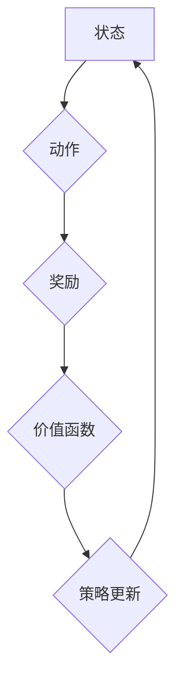

# 一切皆是映射：DQN超参数调优指南：实验与心得

> 关键词：

> Deep Q-Network (DQN), 超参数调优, 实验设计, 策略梯度, 价值函数, 强化学习

## 1. 背景介绍

强化学习 (Reinforcement Learning, RL) 近年来在人工智能领域取得了显著进展，其核心思想是通过智能体与环境的交互，学习最优策略以最大化累积奖励。Deep Q-Network (DQN) 作为一种深度强化学习算法，将深度神经网络与 Q-learning 算法相结合，成功应用于各种复杂任务，例如游戏、机器人控制和自动驾驶等。

然而，DQN 的性能很大程度上依赖于超参数的设置。超参数的调优是一个复杂且耗时的过程，需要大量的实验和经验积累。本文将深入探讨 DQN 超参数调优的策略、方法和经验，并通过实际案例分析，帮助读者更好地理解和掌握 DQN 超参数调优的技巧。

## 2. 核心概念与联系

DQN 算法的核心概念包括：

* **状态 (State):** 智能体感知的环境信息。
* **动作 (Action):** 智能体可以执行的操作。
* **奖励 (Reward):** 智能体执行动作后获得的反馈。
* **价值函数 (Value Function):** 评估智能体在特定状态下执行特定动作的长期奖励价值。
* **Q-表 (Q-table):** 存储每个状态-动作对的价值函数估计。
* **深度神经网络 (Deep Neural Network):** 用于逼近价值函数的非线性模型。

DQN 算法通过深度神经网络来逼近价值函数，并利用 Q-learning 算法进行策略更新。

**Mermaid 流程图:**



## 3. 核心算法原理 & 具体操作步骤

### 3.1  算法原理概述

DQN 算法的核心思想是利用深度神经网络逼近价值函数，并通过 Q-learning 算法进行策略更新。

* **价值函数逼近:** DQN 使用深度神经网络来逼近价值函数，将状态作为输入，输出对应动作的价值估计。
* **Q-learning 算法:** Q-learning 算法是一种基于价值函数的强化学习算法，通过最大化预期奖励来更新策略。

DQN 算法结合了深度神经网络和 Q-learning 算法的优势，能够学习复杂环境下的最优策略。

### 3.2  算法步骤详解

1. **初始化:** 初始化深度神经网络权重，设置学习率、折扣因子等超参数。
2. **环境交互:** 智能体与环境交互，获取当前状态、执行动作并获得奖励。
3. **价值函数估计:** 将当前状态作为输入，通过深度神经网络获取对应动作的价值估计。
4. **目标值计算:** 计算目标值，即最大化未来奖励的期望值。
5. **损失函数计算:** 计算深度神经网络的损失函数，即预测值与目标值之间的差值。
6. **参数更新:** 使用梯度下降算法更新深度神经网络的权重，以最小化损失函数。
7. **策略更新:** 根据更新后的价值函数，选择最优动作，并执行该动作。
8. **重复步骤 2-7:** 重复上述步骤，直到智能体学习到最优策略。

### 3.3  算法优缺点

**优点:**

* 能够学习复杂环境下的最优策略。
* 能够处理高维状态空间。
* 具有较强的泛化能力。

**缺点:**

* 训练过程可能比较耗时。
* 超参数调优较为复杂。
* 容易陷入局部最优解。

### 3.4  算法应用领域

DQN 算法已成功应用于以下领域:

* **游戏:** 围棋、Go、Atari 游戏等。
* **机器人控制:** 机器人导航、抓取、运动控制等。
* **自动驾驶:** 车辆路径规划、避障、决策控制等。
* **推荐系统:** 用户个性化推荐、商品推荐等。

## 4. 数学模型和公式 & 详细讲解 & 举例说明

### 4.1  数学模型构建

DQN 算法的核心数学模型是价值函数，其目标是估计在特定状态下执行特定动作的长期奖励价值。

**价值函数定义:**

$$
V^{\pi}(s) = E_{\pi}[R_{t+1} + \gamma R_{t+2} + \gamma^2 R_{t+3} + ... | S_t = s]
$$

其中:

* $V^{\pi}(s)$ 表示在状态 $s$ 下，按照策略 $\pi$ 获得的长期奖励价值。
* $R_{t+1}, R_{t+2}, ...$ 表示从时间步 $t+1$ 开始的奖励序列。
* $\gamma$ 表示折扣因子，控制未来奖励的权重。
* $E_{\pi}[...]$ 表示根据策略 $\pi$ 的期望值。

### 4.2  公式推导过程

DQN 算法使用深度神经网络来逼近价值函数，其输出为每个动作的价值估计。

**Q-函数定义:**

$$
Q^{\pi}(s, a) = E_{\pi}[R_{t+1} + \gamma \max_{a'} Q^{\pi}(S_{t+1}, a') | S_t = s, A_t = a]
$$

其中:

* $Q^{\pi}(s, a)$ 表示在状态 $s$ 下执行动作 $a$ 的价值估计。
* $S_{t+1}$ 表示时间步 $t+1$ 的状态。
* $A_t$ 表示时间步 $t$ 的动作。

### 4.3  案例分析与讲解

假设我们有一个简单的游戏环境，智能体可以执行两种动作：向上和向下。

* 状态 $s$ 表示智能体的当前位置。
* 动作 $a$ 可以是向上或向下。
* 奖励 $R$ 为 1，如果智能体到达目标位置，否则为 0。

DQN 算法可以学习到在不同状态下执行不同动作的价值估计，并选择最优动作以最大化累积奖励。

## 5. 项目实践：代码实例和详细解释说明

### 5.1  开发环境搭建

* Python 3.x
* TensorFlow 或 PyTorch 深度学习框架
* OpenAI Gym 游戏环境

### 5.2  源代码详细实现

```python
import tensorflow as tf
import numpy as np
from tensorflow.keras.models import Sequential
from tensorflow.keras.layers import Dense

# 定义 DQN 模型
model = Sequential()
model.add(Dense(64, activation='relu', input_shape=(state_size,)))
model.add(Dense(64, activation='relu'))
model.add(Dense(action_size))

# 定义损失函数和优化器
optimizer = tf.keras.optimizers.Adam(learning_rate=0.001)
loss_fn = tf.keras.losses.MeanSquaredError()

# 定义训练循环
def train_dqn(state, action, reward, next_state, done):
    with tf.GradientTape() as tape:
        # 获取 Q-值估计
        q_values = model(state)
        # 计算目标值
        target_q_values = reward + gamma * tf.reduce_max(model(next_state), axis=1)
        # 计算损失
        loss = loss_fn(target_q_values, q_values[0, action])
    # 更新模型参数
    gradients = tape.gradient(loss, model.trainable_variables)
    optimizer.apply_gradients(zip(gradients, model.trainable_variables))

# 训练 DQN 模型
for episode in range(num_episodes):
    state = env.reset()
    done = False
    while not done:
        # 选择动作
        action = env.action_space.sample()
        # 执行动作并获取奖励
        next_state, reward, done, _ = env.step(action)
        # 训练 DQN 模型
        train_dqn(state, action, reward, next_state, done)
        state = next_state

```

### 5.3  代码解读与分析

* 代码首先定义了 DQN 模型，使用深度神经网络来逼近价值函数。
* 然后定义了损失函数和优化器，用于训练模型。
* 训练循环中，智能体与环境交互，获取状态、动作、奖励和下一个状态。
* 使用训练函数 `train_dqn` 更新模型参数。

### 5.4  运行结果展示

训练完成后，可以评估 DQN 模型的性能，例如在游戏环境中获得的得分。

## 6. 实际应用场景

DQN 算法已成功应用于以下实际场景:

* **AlphaGo:** DeepMind 使用 DQN 算法训练 AlphaGo，战胜了世界围棋冠军。
* **自动驾驶:** Waymo 使用 DQN 算法训练自动驾驶汽车，实现无人驾驶功能。
* **机器人控制:** Boston Dynamics 使用 DQN 算法训练机器人，实现复杂动作控制。

### 6.4  未来应用展望

DQN 算法在未来将有更广泛的应用，例如:

* **个性化推荐:** 根据用户的行为数据，推荐个性化的商品或服务。
* **医疗诊断:** 辅助医生进行疾病诊断，提高诊断准确率。
* **金融交易:** 自动化股票交易，实现更高效的投资策略。

## 7. 工具和资源推荐

### 7.1  学习资源推荐

* **书籍:**
    * Reinforcement Learning: An Introduction by Sutton and Barto
    * Deep Reinforcement Learning Hands-On by Maxim Lapan
* **在线课程:**
    * Deep Reinforcement Learning Specialization by DeepLearning.AI
    * Reinforcement Learning by David Silver

### 7.2  开发工具推荐

* **TensorFlow:** 开源深度学习框架，支持 DQN 算法的实现。
* **PyTorch:** 开源深度学习框架，支持 DQN 算法的实现。
* **OpenAI Gym:** 游戏环境库，提供各种标准游戏环境。

### 7.3  相关论文推荐

* Deep Q-Network (DQN) by Mnih et al. (2015)
* Dueling Network Architectures for Deep Reinforcement Learning by Wang et al. (2015)
* Prioritized Experience Replay by Schaul et al. (2015)

## 8. 总结：未来发展趋势与挑战

### 8.1  研究成果总结

DQN 算法取得了显著的成果，成功应用于各种复杂任务，推动了强化学习的发展。

### 8.2  未来发展趋势

* **模型架构:** 研究更深、更复杂的深度神经网络架构，提高 DQN 的学习能力。
* **算法优化:** 研究更有效的算法优化策略，加速 DQN 的训练速度。
* **样本效率:** 研究提高 DQN 的样本效率，减少训练数据需求。
* **安全性和鲁棒性:** 研究提高 DQN 的安全性和鲁棒性，使其能够应对更复杂和不确定环境。

### 8.3  面临的挑战

* **训练效率:** DQN 的训练过程仍然比较耗时，需要更高效的训练算法。
* **样本需求:** DQN 需要大量的训练数据，这在某些领域可能难以获取。
* **可解释性:** DQN 的决策过程难以解释，这限制了其在某些应用场景中的应用。

### 8.4  研究展望

未来，DQN 算法将继续发展，并应用于更多领域。研究者将致力于解决 DQN 的挑战，使其成为更强大、更可靠的强化学习算法。

## 9. 附录：常见问题与解答

* **Q: DQN 的超参数如何调优？**

A: DQN 的超参数调优是一个复杂的过程，需要根据具体任务和环境进行调整。一些常用的超参数包括学习率、折扣因子、经验回放缓冲池大小等。

* **Q: DQN 的训练过程为什么需要经验回放？**