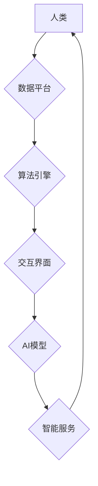

> 人工智能，协作，人类潜能，深度学习，自然语言处理，计算机视觉，机器学习，自动化

## 1. 背景介绍

人类文明的进步离不开对自身潜能的不断挖掘和提升。随着科技的飞速发展，人工智能（AI）技术已成为推动人类社会进步的强大引擎。AI技术的不断突破，为人类提供了前所未有的机遇，让我们能够更有效地解决复杂问题，提高工作效率，并探索更广阔的知识领域。

然而，AI技术本身并非万能的，它需要与人类智慧相结合，才能发挥最大的价值。人类拥有创造力、批判性思维、情感智能等独特的优势，而AI则擅长处理海量数据、识别模式、进行精准计算等方面。因此，人类-AI协作成为未来发展的重要趋势，也是实现人类潜能最大化的一条重要路径。

## 2. 核心概念与联系

**2.1 人类-AI协作模式**

人类-AI协作并非简单的“人代替机器”或“机器代替人”，而是指人类和AI在相互补充、协同工作中实现共同目标。常见的协作模式包括：

* **人类在回路中：** AI提供辅助决策支持，人类最终做出最终决策。
* **人类与AI共同决策：** 人类和AI共同参与决策过程，权衡利弊，最终达成共识。
* **AI自主执行，人类监督：** AI负责执行任务，人类负责监督和评估结果，并及时进行调整。

**2.2 协作优势**

人类-AI协作能够带来诸多优势：

* **提高效率和准确性：** AI可以快速处理大量数据，帮助人类更快地发现问题和解决方案，提高工作效率和决策准确性。
* **增强创造力和创新能力：** AI可以提供新的视角和灵感，激发人类的创造力和创新能力，推动科技进步。
* **释放人类潜能：** AI可以承担重复性、繁琐性工作，释放人类精力，让他们专注于更具创造性和挑战性的工作。

**2.3 协作架构**

人类-AI协作需要建立完善的架构，包括：

* **数据平台：** 提供海量数据支撑，为AI模型训练和应用提供基础。
* **算法引擎：** 包含各种AI算法，例如深度学习、自然语言处理、计算机视觉等，为人类提供智能服务。
* **交互界面：** 提供用户友好的交互方式，方便人类与AI模型进行沟通和协作。
* **安全保障机制：** 保护数据安全和隐私，确保协作过程的可靠性和安全性。



## 3. 核心算法原理 & 具体操作步骤

**3.1 算法原理概述**

深度学习是人工智能领域的重要分支，其核心是构建多层神经网络，通过训练学习数据中的复杂模式和关系。深度学习算法能够自动提取特征，无需人工特征工程，具有强大的学习能力和泛化能力。

**3.2 算法步骤详解**

1. **数据预处理：** 将原始数据清洗、转换、规范化，使其适合深度学习模型训练。
2. **网络结构设计：** 根据任务需求设计神经网络的层数、节点数、激活函数等参数。
3. **模型训练：** 使用训练数据训练神经网络模型，通过反向传播算法不断调整模型参数，使其能够准确预测目标输出。
4. **模型评估：** 使用测试数据评估模型的性能，例如准确率、召回率、F1-score等指标。
5. **模型调优：** 根据评估结果，调整模型参数、网络结构等，进一步提高模型性能。
6. **模型部署：** 将训练好的模型部署到实际应用场景中，用于预测、分类、识别等任务。

**3.3 算法优缺点**

**优点：**

* 强大的学习能力，能够自动提取特征，无需人工特征工程。
* 泛化能力强，能够应用于多种任务和领域。
* 性能优异，在许多任务上取得了人类水平甚至超越人类水平的成绩。

**缺点：**

* 训练数据量大，需要大量数据才能训练出高质量的模型。
* 计算资源消耗大，训练深度学习模型需要强大的计算能力。
* 模型解释性差，难以理解模型的决策过程。

**3.4 算法应用领域**

深度学习算法已广泛应用于各个领域，例如：

* **计算机视觉：** 图像识别、物体检测、图像分割、人脸识别等。
* **自然语言处理：** 文本分类、情感分析、机器翻译、对话系统等。
* **语音识别：** 语音转文本、语音合成等。
* **推荐系统：** 商品推荐、内容推荐等。
* **医疗诊断：** 疾病诊断、影像分析等。

## 4. 数学模型和公式 & 详细讲解 & 举例说明

**4.1 数学模型构建**

深度学习模型本质上是一个复杂的数学模型，其核心是神经网络。神经网络由多个层组成，每一层包含多个神经元。每个神经元接收来自上一层的输入信号，经过激活函数处理后，输出到下一层。

**4.2 公式推导过程**

深度学习模型的训练过程基于梯度下降算法。梯度下降算法的目标是找到一个模型参数集，使得模型的损失函数最小化。损失函数衡量模型预测结果与真实结果之间的差异。

梯度下降算法通过计算损失函数对模型参数的梯度，并根据梯度方向更新模型参数，逐步逼近损失函数的最小值。

**4.3 案例分析与讲解**

假设我们有一个简单的线性回归模型，其目标是预测房价。模型的输入特征包括房屋面积和房间数量，输出为房价。

模型的数学表达式为：

```latex
y = w_1 * x_1 + w_2 * x_2 + b
```

其中：

* $y$ 为房价
* $x_1$ 为房屋面积
* $x_2$ 为房间数量
* $w_1$ 和 $w_2$ 为模型参数
* $b$ 为偏置项

损失函数为均方误差：

```latex
Loss = \frac{1}{n} \sum_{i=1}^{n} (y_i - \hat{y}_i)^2
```

其中：

* $n$ 为样本数量
* $y_i$ 为真实房价
* $\hat{y}_i$ 为模型预测的房价

梯度下降算法会计算损失函数对每个参数的梯度，并根据梯度方向更新参数值，直到损失函数最小化。

## 5. 项目实践：代码实例和详细解释说明

**5.1 开发环境搭建**

* 操作系统：Windows/macOS/Linux
* Python 版本：3.6+
* 深度学习框架：TensorFlow/PyTorch

**5.2 源代码详细实现**

```python
import tensorflow as tf

# 定义模型
model = tf.keras.models.Sequential([
    tf.keras.layers.Dense(64, activation='relu', input_shape=(2,)),
    tf.keras.layers.Dense(1)
])

# 编译模型
model.compile(optimizer='adam', loss='mse')

# 训练模型
model.fit(x_train, y_train, epochs=10)

# 评估模型
loss = model.evaluate(x_test, y_test)
print('Loss:', loss)

# 预测房价
new_house = [[100, 2]]
prediction = model.predict(new_house)
print('Predicted price:', prediction)
```

**5.3 代码解读与分析**

* 代码首先定义了一个简单的线性回归模型，包含两层神经元。
* 然后使用Adam优化器和均方误差损失函数编译模型。
* 接着使用训练数据训练模型，训练epochs设置为10。
* 训练完成后，使用测试数据评估模型的性能。
* 最后，使用训练好的模型预测新房子的价格。

**5.4 运行结果展示**

运行代码后，会输出模型的训练损失和测试损失，以及对新房子的价格预测。

## 6. 实际应用场景

**6.1 医疗诊断**

深度学习算法可以用于分析医学影像，例如X光片、CT扫描、MRI等，辅助医生诊断疾病。例如，深度学习模型可以用于识别肺结核、乳腺癌、脑肿瘤等疾病。

**6.2 金融风险管理**

深度学习算法可以用于分析金融数据，例如股票价格、交易记录、客户行为等，识别潜在的金融风险。例如，深度学习模型可以用于预测股票市场波动、识别欺诈交易、评估客户信用风险。

**6.3 自动驾驶**

深度学习算法是自动驾驶汽车的核心技术之一，用于处理车载传感器数据，例如摄像头、雷达、激光雷达等，感知周围环境，并做出驾驶决策。例如，深度学习模型可以用于识别道路标线、交通信号灯、行人、车辆等。

**6.4 未来应用展望**

随着人工智能技术的不断发展，人类-AI协作将在更多领域得到应用，例如：

* **个性化教育：** AI可以根据学生的学习进度和特点，提供个性化的学习方案和辅导。
* **智能制造：** AI可以帮助工厂实现自动化生产，提高生产效率和产品质量。
* **精准农业：** AI可以帮助农民优化种植方案，提高农作物产量和质量。

## 7. 工具和资源推荐

**7.1 学习资源推荐**

* **在线课程：** Coursera、edX、Udacity等平台提供丰富的深度学习课程。
* **书籍：** 《深度学习》、《动手学深度学习》等书籍是深度学习学习的经典教材。
* **开源项目：** TensorFlow、PyTorch等开源深度学习框架提供了丰富的学习资源和示例代码。

**7.2 开发工具推荐**

* **Python：** 深度学习开发的主要编程语言。
* **TensorFlow：** Google开发的开源深度学习框架。
* **PyTorch：** Facebook开发的开源深度学习框架。
* **Jupyter Notebook：** 用于深度学习代码开发和可视化分析的工具。

**7.3 相关论文推荐**

* **AlexNet：** 《ImageNet Classification with Deep Convolutional Neural Networks》
* **VGGNet：** 《Very Deep Convolutional Networks for Large-Scale Image Recognition》
* **ResNet：** 《Deep Residual Learning for Image Recognition》

## 8. 总结：未来发展趋势与挑战

**8.1 研究成果总结**

近年来，深度学习算法取得了显著的进展，在计算机视觉、自然语言处理、语音识别等领域取得了突破性成果。人类-AI协作模式也逐渐得到认可和应用，为推动人类社会进步提供了新的动力。

**8.2 未来发展趋势**

* **模型规模和复杂度提升：** 未来深度学习模型将更加庞大，包含更多层级和参数，从而提升模型的学习能力和泛化能力。
* **跨模态学习：** 深度学习模型将能够处理多种模态数据，例如文本、图像、音频、视频等，实现跨模态理解和交互。
* **可解释性增强：** 研究人员将致力于提高深度学习模型的可解释性，使模型的决策过程更加透明和可理解。

**8.3 面临的挑战**

* **数据获取和隐私保护：** 深度学习模型需要大量数据进行训练，如何获取高质量数据并保护数据隐私是一个重要的挑战。
* **计算资源需求：** 训练大型深度学习模型需要大量的计算资源，如何降低计算成本和能源消耗是一个重要的研究方向。
* **伦理和社会影响：** 人工智能技术的快速发展引发了伦理和社会影响方面的担忧，需要制定相应的规范和政策，确保人工智能技术安全、可控和可持续发展。

**8.4 研究展望**

未来，人工智能技术将继续发展，人类-AI协作将更加深入和广泛。我们需要不断探索新的算法、模型和应用场景，并积极应对