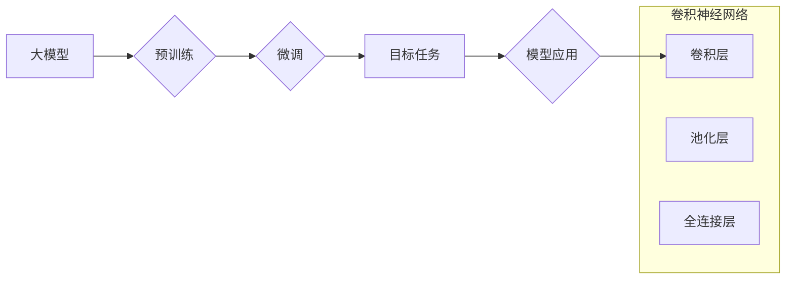

> 大模型开发, 微调, 卷积神经网络, MNIST, 手写体识别, 深度学习, 机器学习

## 1. 背景介绍

在当今数据爆炸的时代，深度学习作为机器学习领域最前沿的技术，在图像识别、自然语言处理、语音识别等领域取得了突破性的进展。大模型的出现，进一步推动了深度学习的发展，其强大的学习能力和泛化能力，为解决复杂问题提供了新的思路。

然而，大模型的训练成本高昂，对硬件资源要求极高，对于个人开发者和小型团队来说，难以负担。因此，如何高效地利用现有的预训练大模型，进行针对性任务的微调，成为了一个重要的研究方向。

本篇文章将以MNIST手写体识别任务为例，从零开始讲解大模型开发与微调的流程，帮助读者理解大模型的原理和应用，并掌握实际操作技能。

## 2. 核心概念与联系

### 2.1  大模型

大模型是指参数量巨大、训练数据量庞大、计算资源消耗高的深度学习模型。其强大的学习能力和泛化能力，使其能够在各种任务中取得优异的性能。

### 2.2  微调

微调是指在预训练的大模型基础上，针对特定任务进行参数调整的过程。通过微调，可以将预训练模型的通用知识迁移到目标任务，提高模型的性能，同时降低训练成本和时间。

### 2.3  卷积神经网络 (CNN)

卷积神经网络是一种专门用于处理图像数据的深度学习模型。其核心结构是卷积层和池化层，能够自动学习图像特征，并进行分类或识别。

**核心概念与联系流程图:**



## 3. 核心算法原理 & 具体操作步骤

### 3.1  算法原理概述

卷积神经网络 (CNN) 是一种专门用于处理图像数据的深度学习模型。其核心结构是卷积层和池化层，能够自动学习图像特征，并进行分类或识别。

* **卷积层:** 卷积层通过卷积核对输入图像进行卷积运算，提取图像局部特征。卷积核是一个小的矩阵，在图像上滑动，进行卷积运算，生成特征图。

* **池化层:** 池化层对特征图进行降维操作，减少计算量，提高模型的鲁棒性。常见的池化方法有最大池化和平均池化。

* **全连接层:** 全连接层将特征图展平，连接到全连接层，进行分类或识别。

### 3.2  算法步骤详解

1. **数据预处理:** 将MNIST手写体数据集进行归一化处理，将像素值范围调整到0-1之间。

2. **模型构建:** 使用深度学习框架 (如TensorFlow或PyTorch)构建卷积神经网络模型。模型结构可以包含多个卷积层、池化层和全连接层。

3. **模型训练:** 使用训练数据训练模型，通过反向传播算法更新模型参数，使模型的预测结果与真实标签尽可能接近。

4. **模型评估:** 使用测试数据评估模型的性能，常用的指标包括准确率、召回率和F1-score。

5. **模型微调:** 如果模型性能不理想，可以对模型进行微调，例如调整学习率、增加训练轮数或修改模型结构。

### 3.3  算法优缺点

**优点:**

* 能够自动学习图像特征，无需人工特征工程。
* 性能优异，在图像识别任务中取得了突破性进展。

**缺点:**

* 训练成本高昂，对硬件资源要求极高。
* 模型解释性差，难以理解模型的决策过程。

### 3.4  算法应用领域

* **图像识别:** 人脸识别、物体检测、场景理解等。
* **自然语言处理:** 文本分类、情感分析、机器翻译等。
* **语音识别:** 语音转文本、语音助手等。
* **医疗诊断:** 病灶检测、疾病预测等。

## 4. 数学模型和公式 & 详细讲解 & 举例说明

### 4.1  数学模型构建

卷积神经网络的数学模型主要包括卷积运算、池化运算和激活函数。

* **卷积运算:**

$$
y_{i,j} = \sum_{m=0}^{M-1} \sum_{n=0}^{N-1} x_{i+m,j+n} * w_{m,n} + b
$$

其中：

* $y_{i,j}$ 是卷积输出的特征图元素。
* $x_{i+m,j+n}$ 是输入图像的像素值。
* $w_{m,n}$ 是卷积核的权重。
* $b$ 是偏置项。

* **池化运算:**

$$
y_{i,j} = \max(x_{i,j}, x_{i+1,j}, x_{i,j+1}, x_{i+1,j+1})
$$

其中：

* $y_{i,j}$ 是池化输出的特征图元素。
* $x_{i,j}$ 是输入特征图的像素值。

* **激活函数:**

$$
y = f(x)
$$

其中：

* $y$ 是激活函数的输出。
* $x$ 是输入值。

常见的激活函数有ReLU、Sigmoid和Tanh等。

### 4.2  公式推导过程

卷积运算的公式推导过程可以参考相关深度学习教材或论文。

### 4.3  案例分析与讲解

以MNIST手写体识别为例，卷积神经网络模型可以包含多个卷积层、池化层和全连接层。

* **卷积层:** 用于提取图像局部特征，例如边缘、角点等。
* **池化层:** 用于降维，减少计算量，提高模型的鲁棒性。
* **全连接层:** 用于将特征图展平，连接到全连接层，进行分类或识别。

## 5. 项目实践：代码实例和详细解释说明

### 5.1  开发环境搭建

* **操作系统:** Linux或Windows
* **深度学习框架:** TensorFlow或PyTorch
* **编程语言:** Python

### 5.2  源代码详细实现

```python
import tensorflow as tf

# 定义卷积神经网络模型
model = tf.keras.models.Sequential([
    tf.keras.layers.Conv2D(32, (3, 3), activation='relu', input_shape=(28, 28, 1)),
    tf.keras.layers.MaxPooling2D((2, 2)),
    tf.keras.layers.Conv2D(64, (3, 3), activation='relu'),
    tf.keras.layers.MaxPooling2D((2, 2)),
    tf.keras.layers.Flatten(),
    tf.keras.layers.Dense(10, activation='softmax')
])

# 编译模型
model.compile(optimizer='adam',
              loss='sparse_categorical_crossentropy',
              metrics=['accuracy'])

# 训练模型
model.fit(x_train, y_train, epochs=5)

# 评估模型
loss, accuracy = model.evaluate(x_test, y_test)
print('Test loss:', loss)
print('Test accuracy:', accuracy)
```

### 5.3  代码解读与分析

* **模型定义:** 使用`tf.keras.models.Sequential`定义一个顺序模型，包含多个卷积层、池化层和全连接层。
* **卷积层:** 使用`tf.keras.layers.Conv2D`定义卷积层，参数包括卷积核大小、激活函数和输入形状。
* **池化层:** 使用`tf.keras.layers.MaxPooling2D`定义最大池化层，参数包括池化窗口大小。
* **全连接层:** 使用`tf.keras.layers.Dense`定义全连接层，参数包括输出节点数和激活函数。
* **模型编译:** 使用`model.compile`编译模型，指定优化器、损失函数和评估指标。
* **模型训练:** 使用`model.fit`训练模型，参数包括训练数据、训练轮数等。
* **模型评估:** 使用`model.evaluate`评估模型，参数包括测试数据和真实标签。

### 5.4  运行结果展示

训练完成后，可以打印测试集上的损失值和准确率，评估模型的性能。

## 6. 实际应用场景

MNIST手写体识别任务可以应用于以下场景：

* **邮件分类:** 自动识别邮件中的手写地址，提高邮件投递效率。
* **表单识别:** 自动识别表单中的手写信息，提高数据录入效率。
* **金融领域:** 自动识别银行支票上的手写金额，提高金融交易效率。

### 6.4  未来应用展望

随着深度学习技术的不断发展，卷积神经网络在图像识别领域将有更广泛的应用，例如：

* **自动驾驶:** 用于识别道路标志、交通信号灯等。
* **医疗诊断:** 用于识别病灶、辅助医生诊断疾病。
* **安防监控:** 用于人脸识别、行为识别等。

## 7. 工具和资源推荐

### 7.1  学习资源推荐

* **书籍:**
    * 深度学习
    * 深度学习实践
* **在线课程:**
    * Coursera深度学习课程
    * Udacity深度学习课程

### 7.2  开发工具推荐

* **深度学习框架:** TensorFlow、PyTorch
* **编程语言:** Python
* **数据可视化工具:** Matplotlib、Seaborn

### 7.3  相关论文推荐

* **AlexNet: ImageNet Classification with Deep Convolutional Neural Networks**
* **VGGNet: Very Deep Convolutional Networks for Large-Scale Image Recognition**
* **ResNet: Deep Residual Learning for Image Recognition**

## 8. 总结：未来发展趋势与挑战

### 8.1  研究成果总结

卷积神经网络在图像识别领域取得了突破性的进展，其强大的学习能力和泛化能力，为解决复杂问题提供了新的思路。

### 8.2  未来发展趋势

* **模型更深更广:** 探索更深层次的网络结构，以及更广泛的应用场景。
* **模型更轻更省:** 研究更轻量级的模型，降低模型的计算成本和存储成本。
* **模型更解释:** 提高模型的解释性，使得模型的决策过程更加透明。

### 8.3  面临的挑战

* **数据获取和标注:** 训练高质量的卷积神经网络模型需要大量的标注数据，数据获取和标注成本较高。
* **计算资源:** 训练大型卷积神经网络模型需要大量的计算资源，成本较高。
* **模型解释:** 卷积神经网络的决策过程较为复杂，难以解释模型的决策结果。

### 8.4  研究展望

未来，卷积神经网络将继续朝着更深、更广、更轻、更解释的方向发展，并应用于更多领域，为人类社会带来更多福祉。

## 9. 附录：常见问题与解答

* **Q1: 如何选择合适的卷积核大小？**

* **A1:** 卷积核大小的选择取决于图像分辨率和特征提取的层次。一般来说，较小的卷积核可以提取局部特征，较大的卷积核可以提取全局特征。

* **Q2: 如何选择合适的激活函数？**

* **A2:** 常见的激活函数有ReLU、Sigmoid和Tanh等，不同的激活函数具有不同的特性，需要根据具体任务选择合适的激活函数。

* **Q3: 如何防止过拟合