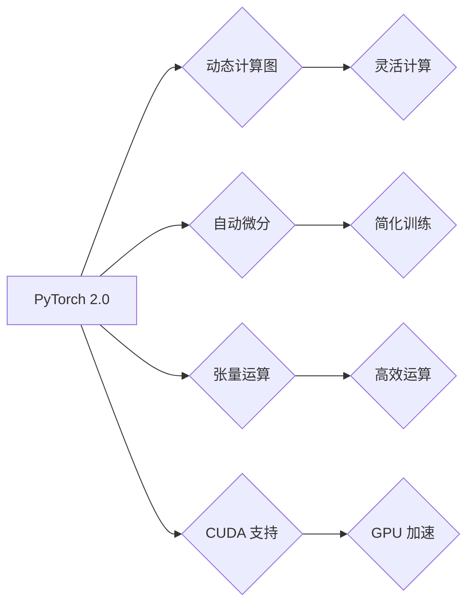

> PyTorch 2.0, 深度学习, 大模型, 环境搭建, 安装指南, CUDA, GPU

## 1. 背景介绍

在深度学习领域，PyTorch 已经成为最受欢迎的框架之一，其灵活的计算图、强大的自动微分和活跃的社区使其成为研究和开发大模型的理想选择。PyTorch 2.0 作为最新版本，带来了许多改进和新功能，例如更强大的性能、更易于使用的 API 和更完善的生态系统。

随着大模型的兴起，对计算资源和框架性能的要求越来越高。PyTorch 2.0 通过对底层架构的优化和新功能的引入，能够更好地应对大模型训练和推理的挑战。

## 2. 核心概念与联系

PyTorch 2.0 的核心概念包括：

* **动态计算图:** PyTorch 采用动态计算图，这意味着计算图是在运行时构建的，而不是预先定义的。这使得 PyTorch 更灵活，能够处理各种复杂的计算任务。
* **自动微分:** PyTorch 支持自动微分，可以自动计算梯度，从而简化模型训练过程。
* **张量运算:** PyTorch 的核心数据结构是张量，它可以高效地进行各种数学运算。
* **CUDA 支持:** PyTorch 支持 CUDA，可以利用 GPU 加速计算，从而大幅提升训练速度。

**Mermaid 流程图:**



## 3. 核心算法原理 & 具体操作步骤

### 3.1  算法原理概述

PyTorch 2.0 的核心算法原理基于深度学习的基本原理，包括前馈神经网络、反向传播算法和梯度下降法。

* **前馈神经网络:** 将输入数据通过多层神经元进行处理，最终输出预测结果。
* **反向传播算法:** 计算模型预测结果与真实值的误差，并根据误差反向传播梯度，更新模型参数。
* **梯度下降法:** 使用梯度信息更新模型参数，使得模型预测结果逐渐逼近真实值。

### 3.2  算法步骤详解

1. **数据预处理:** 将原始数据转换为模型可以理解的格式，例如归一化、编码等。
2. **模型构建:** 使用 PyTorch 的 API 定义模型结构，包括神经网络层、激活函数等。
3. **损失函数定义:** 选择合适的损失函数来衡量模型预测结果与真实值的误差。
4. **优化器选择:** 选择合适的优化器来更新模型参数，例如 Adam、SGD 等。
5. **训练模型:** 使用训练数据训练模型，通过反向传播算法更新模型参数，降低损失函数值。
6. **模型评估:** 使用测试数据评估模型性能，例如准确率、召回率等。
7. **模型部署:** 将训练好的模型部署到实际应用场景中。

### 3.3  算法优缺点

**优点:**

* **灵活:** 动态计算图和丰富的 API 使 PyTorch 能够处理各种复杂的计算任务。
* **易于使用:** PyTorch 的 API 设计简洁易懂，上手难度较低。
* **强大的社区支持:** PyTorch 拥有活跃的社区，提供丰富的学习资源和技术支持。

**缺点:**

* **性能:** 相比于一些静态计算图框架，PyTorch 的性能可能略逊一筹。
* **部署:** PyTorch 的模型部署相对复杂，需要额外的工具和配置。

### 3.4  算法应用领域

PyTorch 广泛应用于各种深度学习领域，例如：

* **计算机视觉:** 图像分类、目标检测、图像分割等。
* **自然语言处理:** 文本分类、机器翻译、文本生成等。
* **语音识别:** 语音转文本、语音合成等。
* **推荐系统:** 商品推荐、用户画像等。

## 4. 数学模型和公式 & 详细讲解 & 举例说明

### 4.1  数学模型构建

PyTorch 2.0 的数学模型构建基于张量运算和神经网络结构。

* **张量:** 张量是 PyTorch 的核心数据结构，可以表示多维数组。
* **神经网络:** 神经网络由多个层组成，每层包含多个神经元。每个神经元接收来自上一层的输入，经过激活函数处理后输出到下一层。

### 4.2  公式推导过程

PyTorch 2.0 使用反向传播算法来更新模型参数。反向传播算法的核心公式包括：

* **损失函数:** $L(y, \hat{y})$，其中 $y$ 是真实值，$\hat{y}$ 是模型预测值。
* **梯度:** $\frac{\partial L}{\partial w}$，其中 $w$ 是模型参数。
* **参数更新:** $w = w - \eta \frac{\partial L}{\partial w}$，其中 $\eta$ 是学习率。

### 4.3  案例分析与讲解

假设我们有一个简单的线性回归模型，目标是预测房价。模型输入特征包括房屋面积和房间数量，输出房价。

* **损失函数:** 使用均方误差作为损失函数，即 $L(y, \hat{y}) = \frac{1}{n} \sum_{i=1}^{n} (y_i - \hat{y}_i)^2$，其中 $n$ 是样本数量。
* **梯度:** 使用链式法则计算梯度，例如 $\frac{\partial L}{\partial w_1} = \frac{2}{n} \sum_{i=1}^{n} (y_i - \hat{y}_i) x_{i1}$，其中 $w_1$ 是模型参数，$x_{i1}$ 是第 $i$ 个样本的房屋面积。
* **参数更新:** 使用梯度下降法更新模型参数，例如 $w_1 = w_1 - \eta \frac{2}{n} \sum_{i=1}^{n} (y_i - \hat{y}_i) x_{i1}$。

## 5. 项目实践：代码实例和详细解释说明

### 5.1  开发环境搭建

1. **安装 Python:** 下载并安装 Python 3.7 或更高版本。
2. **安装 CUDA:** 如果要使用 GPU 加速，需要安装 CUDA Toolkit。
3. **安装 PyTorch:** 使用 pip 安装 PyTorch，例如 `pip install torch torchvision torchaudio --index-url https://download.pytorch.org/whl/cu117`。

### 5.2  源代码详细实现

```python
import torch
import torch.nn as nn

# 定义一个简单的线性回归模型
class LinearRegression(nn.Module):
    def __init__(self, input_size, output_size):
        super(LinearRegression, self).__init__()
        self.linear = nn.Linear(input_size, output_size)

    def forward(self, x):
        return self.linear(x)

# 创建模型实例
model = LinearRegression(input_size=2, output_size=1)

# 定义损失函数和优化器
criterion = nn.MSELoss()
optimizer = torch.optim.SGD(model.parameters(), lr=0.01)

# 训练模型
for epoch in range(100):
    # 前向传播
    outputs = model(inputs)
    loss = criterion(outputs, targets)

    # 反向传播
    optimizer.zero_grad()
    loss.backward()

    # 参数更新
    optimizer.step()

    # 打印损失值
    print(f'Epoch [{epoch+1}/{100}], Loss: {loss.item():.4f}')
```

### 5.3  代码解读与分析

* **模型定义:** 使用 `nn.Module` 类定义模型结构，包含一个线性层 `nn.Linear`。
* **损失函数和优化器:** 使用均方误差损失函数 `nn.MSELoss` 和随机梯度下降优化器 `torch.optim.SGD`。
* **训练循环:** 训练模型 100 个 epoch，每次 epoch 遍历整个训练数据集。
* **前向传播:** 将输入数据传递到模型，得到预测结果。
* **反向传播:** 计算梯度，并根据梯度更新模型参数。
* **参数更新:** 使用优化器更新模型参数。

### 5.4  运行结果展示

训练完成后，模型可以用于预测新的数据。

## 6. 实际应用场景

PyTorch 2.0 在各种实际应用场景中发挥着重要作用，例如：

* **图像识别:** 用于识别图像中的物体、场景和人物。
* **自然语言处理:** 用于机器翻译、文本摘要、情感分析等。
* **语音识别:** 用于将语音转换为文本。
* **推荐系统:** 用于推荐商品、电影、音乐等。

### 6.4  未来应用展望

随着深度学习技术的不断发展，PyTorch 2.0 将在更多领域得到应用，例如：

* **自动驾驶:** 用于感知环境、规划路径和控制车辆。
* **医疗诊断:** 用于辅助医生诊断疾病、预测患者风险。
* **药物研发:** 用于发现新的药物和治疗方法。

## 7. 工具和资源推荐

### 7.1  学习资源推荐

* **PyTorch 官方文档:** https://pytorch.org/docs/stable/
* **PyTorch Tutorials:** https://pytorch.org/tutorials/
* **Deep Learning with PyTorch:** https://www.manning.com/books/deep-learning-with-pytorch

### 7.2  开发工具推荐

* **Jupyter Notebook:** https://jupyter.org/
* **VS Code:** https://code.visualstudio.com/
* **PyCharm:** https://www.jetbrains.com/pycharm/

### 7.3  相关论文推荐

* **Attention Is All You Need:** https://arxiv.org/abs/1706.03762
* **BERT: Pre-training of Deep Bidirectional Transformers for Language Understanding:** https://arxiv.org/abs/1810.04805

## 8. 总结：未来发展趋势与挑战

### 8.1  研究成果总结

PyTorch 2.0 的发布标志着深度学习框架的不断发展和进步。其更强大的性能、更易于使用的 API 和更完善的生态系统将推动深度学习技术的应用和发展。

### 8.2  未来发展趋势

* **模型效率:** 研究更高效的模型架构和训练方法，降低模型训练和推理成本。
* **模型可解释性:** 研究更可解释的深度学习模型，帮助人们理解模型的决策过程。
* **联邦学习:** 研究联邦学习技术，允许在不共享数据的情况下训练模型，保护用户隐私。

### 8.3  面临的挑战

* **数据获取和标注:** 深度学习模型需要大量的训练数据，数据获取和标注成本较高。
* **模型训练时间:** 训练大型深度学习模型需要很长时间，需要更高效的训练方法。
* **模型部署:** 将深度学习模型部署到实际应用场景中存在技术挑战。

### 8.4  研究展望

未来，深度学习技术将继续发展，PyTorch 2.0 将继续扮演重要的角色，推动深度学习技术在更多领域得到应用。


## 9. 附录：常见问题与解答

**Q1: 如何选择合适的 PyTorch 版本？**

**A1:** PyTorch 的版本选择取决于您的硬件环境和项目需求。建议使用最新稳定版本，以获得最新的功能和性能改进。

**Q2: 如何安装 PyTorch 的 CUDA 版本？**

**A2:** 在安装 PyTorch 时，可以使用 `--index-url` 参数指定 CUDA 版本的安装源。例如，要安装 CUDA 11.7 版本的 PyTorch，可以使用以下命令：

```
pip install torch