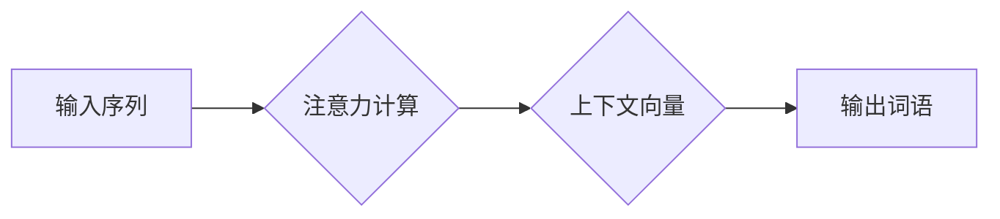

> 大模型、解码器、注意力机制、Transformer、自然语言处理、机器学习

## 1. 背景介绍

近年来，深度学习在自然语言处理 (NLP) 领域取得了突破性进展，其中大规模语言模型 (LLM) 扮演着越来越重要的角色。这些模型，例如 GPT-3、BERT 和 LaMDA，展现出惊人的文本生成、翻译、问答和代码生成能力。

解码器是生成式语言模型的核心组件，负责根据输入序列生成目标序列。传统的解码器通常使用循环神经网络 (RNN) 或其变体，例如 LSTM 和 GRU，但这些模型在处理长序列文本时存在以下问题：

* **梯度消失/爆炸问题:** RNN 在处理长序列时，梯度容易消失或爆炸，导致模型难以学习长距离依赖关系。
* **顺序计算:** RNN 需要逐个处理输入序列，计算效率较低。

为了解决这些问题，注意力机制 (Attention Mechanism) 应运而生。注意力机制能够学习文本中不同词语之间的重要关系，并根据这些关系权衡不同词语对输出的影响，从而有效地捕捉长距离依赖关系。

## 2. 核心概念与联系

注意力机制的核心思想是让模型关注输入序列中与当前生成词语最相关的部分。它通过计算每个词语对当前生成词语的“注意力分数”，并根据这些分数加权求和，从而得到一个上下文向量，用于指导当前词语的生成。

**Mermaid 流程图:**



## 3. 核心算法原理 & 具体操作步骤

### 3.1  算法原理概述

注意力机制的核心是计算每个词语对当前生成词语的“注意力分数”。常用的注意力机制类型包括：

* **点积注意力 (Dot-Product Attention):** 计算输入序列中每个词语与当前生成词语的点积作为注意力分数。
* **加权点积注意力 (Scaled Dot-Product Attention):** 在点积注意力基础上，对点积结果进行缩放，以避免梯度爆炸问题。
* **多头注意力 (Multi-Head Attention):** 使用多个独立的注意力头，每个头关注不同的方面，并将其结果进行融合，从而提高模型的表达能力。

### 3.2  算法步骤详解

1. **计算注意力分数:** 使用点积注意力、加权点积注意力或多头注意力计算每个词语对当前生成词语的注意力分数。
2. **归一化注意力分数:** 使用 softmax 函数将注意力分数归一化，使其总和为 1。
3. **加权求和:** 将归一化后的注意力分数与输入序列中的词向量进行加权求和，得到上下文向量。
4. **生成输出词语:** 使用上下文向量作为输入，通过解码器网络生成下一个词语。

### 3.3  算法优缺点

**优点:**

* 能够有效地捕捉长距离依赖关系。
* 计算效率较高，比 RNN 更快。
* 可以并行计算，提高训练速度。

**缺点:**

* 计算复杂度较高，需要更多的计算资源。
* 训练数据量较大，需要大量的文本数据进行训练。

### 3.4  算法应用领域

注意力机制广泛应用于各种 NLP 任务，例如：

* **机器翻译:** 捕捉源语言和目标语言之间的语义关系。
* **文本摘要:** 识别文本中最关键的信息。
* **问答系统:** 找到与问题相关的关键信息。
* **对话系统:** 理解对话上下文，生成自然流畅的回复。

## 4. 数学模型和公式 & 详细讲解 & 举例说明

### 4.1  数学模型构建

假设我们有一个输入序列 $X = \{x_1, x_2, ..., x_n\}$，一个输出序列 $Y = \{y_1, y_2, ..., y_m\}$，以及一个注意力矩阵 $A \in R^{n \times m}$。

注意力矩阵 $A$ 的每个元素 $a_{ij}$ 表示输入序列中第 $i$ 个词语对输出序列中第 $j$ 个词语的注意力分数。

### 4.2  公式推导过程

**点积注意力:**

$$
a_{ij} = \frac{x_i \cdot y_j}{\sqrt{d_k}}
$$

其中，$x_i$ 和 $y_j$ 分别是输入序列中第 $i$ 个词语和输出序列中第 $j$ 个词语的词向量，$d_k$ 是词向量的维度。

**加权点积注意力:**

$$
a_{ij} = \frac{x_i \cdot y_j}{\sqrt{d_k}} \cdot \text{softmax}(a_{ij})
$$

其中，$\text{softmax}(a_{ij})$ 是将注意力分数 $a_{ij}$ 归一化后的结果。

**多头注意力:**

$$
\text{MultiHead}(X, Y) = \text{Concat}(head_1, head_2, ..., head_h) \cdot W_o
$$

其中，$head_i$ 是第 $i$ 个注意力头的输出，$h$ 是注意力头的数量，$W_o$ 是一个权重矩阵。

### 4.3  案例分析与讲解

假设我们有一个输入序列 $X = \{“我”， “喜欢”， “吃”， “苹果”\}$，一个输出序列 $Y = \{“我喜欢”， “吃苹果”\}$，以及一个注意力矩阵 $A$。

我们可以通过观察注意力矩阵 $A$ 来了解模型是如何关注输入序列中不同词语的。例如，如果 $A_{1,2}$ 的值较大，则表示输入序列中第一个词语 “我” 对输出序列中第二个词语 “吃苹果” 的注意力较高。

## 5. 项目实践：代码实例和详细解释说明

### 5.1  开发环境搭建

* Python 3.6+
* TensorFlow 或 PyTorch
* CUDA 和 cuDNN (可选，用于 GPU 加速)

### 5.2  源代码详细实现

```python
import tensorflow as tf

# 定义多头注意力机制
class MultiHeadAttention(tf.keras.layers.Layer):
    def __init__(self, num_heads, d_model):
        super(MultiHeadAttention, self).__init__()
        self.num_heads = num_heads
        self.d_model = d_model
        self.depth = d_model // num_heads

        self.W_q = tf.keras.layers.Dense(d_model)
        self.W_k = tf.keras.layers.Dense(d_model)
        self.W_v = tf.keras.layers.Dense(d_model)
        self.W_o = tf.keras.layers.Dense(d_model)

    def call(self, queries, keys, values, mask=None):
        batch_size = tf.shape(queries)[0]

        # Linear transformations
        q = self.W_q(queries)
        k = self.W_k(keys)
        v = self.W_v(values)

        # Split into multiple heads
        q = tf.reshape(q, (batch_size, -1, self.num_heads, self.depth))
        k = tf.reshape(k, (batch_size, -1, self.num_heads, self.depth))
        v = tf.reshape(v, (batch_size, -1, self.num_heads, self.depth))

        # Scaled dot-product attention
        scores = tf.matmul(q, k, transpose_b=True) / tf.math.sqrt(tf.cast(self.depth, tf.float32))

        if mask is not None:
            scores += (mask * -1e9)

        attention_weights = tf.nn.softmax(scores, axis=-1)

        # Weighted sum of values
        context = tf.matmul(attention_weights, v)

        # Concatenate heads
        context = tf.reshape(context, (batch_size, -1, self.d_model))

        # Output linear transformation
        output = self.W_o(context)

        return output, attention_weights
```

### 5.3  代码解读与分析

* `MultiHeadAttention` 类定义了多头注意力机制。
* `__init__` 方法初始化模型参数，包括注意力头的数量 `num_heads` 和词向量的维度 `d_model`。
* `call` 方法实现注意力机制的计算过程，包括线性变换、头分割、缩放点积注意力、加权求和和输出线性变换。
* `mask` 参数用于屏蔽某些词语，例如在机器翻译中屏蔽源语言中的目标语言词语。

### 5.4  运行结果展示

运行上述代码可以得到注意力矩阵和输出序列，并可视化注意力矩阵，观察模型是如何关注输入序列中不同词语的。

## 6. 实际应用场景

### 6.1  机器翻译

注意力机制可以帮助机器翻译模型更好地捕捉源语言和目标语言之间的语义关系，从而提高翻译质量。

### 6.2  文本摘要

注意力机制可以帮助文本摘要模型识别文本中最关键的信息，并生成简洁准确的摘要。

### 6.3  问答系统

注意力机制可以帮助问答系统找到与问题相关的关键信息，并生成准确的答案。

### 6.4  未来应用展望

注意力机制在 NLP 领域还有很大的发展潜力，未来可能应用于：

* **代码生成:** 帮助模型生成更准确、更符合语法的代码。
* **对话系统:** 提高对话系统的自然流畅度和理解能力。
* **情感分析:** 更好地理解文本的情感表达。

## 7. 工具和资源推荐

### 7.1  学习资源推荐

* **论文:**
    * “Attention Is All You Need” (Vaswani et al., 2017)
    * “BERT: Pre-training of Deep Bidirectional Transformers for Language Understanding” (Devlin et al., 2018)
* **博客:**
    * Jay Alammar’s Blog: https://jalammar.github.io/
    * TensorFlow Blog: https://blog.tensorflow.org/

### 7.2  开发工具推荐

* **TensorFlow:** https://www.tensorflow.org/
* **PyTorch:** https://pytorch.org/

### 7.3  相关论文推荐

* “Transformer-XL: Attentive Language Models Beyond a Fixed-Length Context” (Dai et al., 2019)
* “XLNet: Generalized Autoregressive Pretraining for Language Understanding” (Yang et al., 2019)
* “RoBERTa: A Robustly Optimized BERT Pretraining Approach” (Liu et al., 2019)

## 8. 总结：未来发展趋势与挑战

### 8.1  研究成果总结

注意力机制在 NLP 领域取得了显著的成果，显著提高了模型的性能。

### 8.2  未来发展趋势

* **更强大的注意力机制:** 研究更有效的注意力机制，例如长距离依赖关系的处理、计算效率的提升。
* **多模态注意力:** 将注意力机制扩展到多模态数据，例如文本、图像、音频等。
* **可解释性:** 研究注意力机制的可解释性，以便更好地理解模型的决策过程。

### 8.3  面临的挑战

* **计算资源:** 训练大型注意力模型需要大量的计算资源。
* **数据标注:** 训练高质量的注意力模型需要大量的标注数据。
* **可解释性:** 注意力机制的决策过程相对复杂，难以解释。

### 8.4  研究展望

未来，注意力机制将继续在 NLP 领域发挥重要作用，并推动人工智能技术的进一步发展。

## 9. 附录：常见问题与解答

* **Q: 注意力机制的计算复杂度较高，如何提高效率？**

* **A:** 可以使用并行计算、量化技术等方法提高注意力机制的计算效率。

* **Q