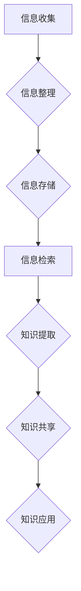

> 信息过载，知识管理，信息组织，信息检索，知识库，数据可视化，人工智能，机器学习

## 1. 背景介绍

在当今信息爆炸的时代，我们每天都会接触到海量的数字信息，从新闻报道到社交媒体，从学术论文到商业报告，信息无处不在。然而，这庞大的信息量也带来了一个新的挑战：信息过载。信息过载是指个体或组织在处理大量信息时，由于信息量过大、信息更新速度快、信息类型繁多等原因，导致难以有效地获取、理解和利用信息，从而影响工作效率和决策能力。

信息过载不仅影响个人，也对企业和社会造成严重影响。企业面临着信息孤岛、知识流失、决策迟缓等问题，而社会则可能出现信息茧房、认知偏差、群体极化等现象。因此，如何有效地管理和组织信息，从信息过载中脱身，成为当今社会面临的重大挑战。

## 2. 核心概念与联系

**2.1 信息过载的本质**

信息过载并非仅仅是信息量的增加，更重要的是信息处理能力的不足。当信息量超过个体或组织的处理能力时，就会产生信息过载。

**2.2 知识管理的意义**

知识管理是指组织收集、存储、共享和利用知识的系统化过程。它旨在通过建立知识体系、促进知识交流、提高知识利用效率，帮助组织更好地应对信息过载，提升竞争力。

**2.3 信息管理与知识管理的关系**

信息管理和知识管理是相互关联、相互补充的两个概念。信息管理侧重于信息的收集、存储、检索和传输，而知识管理则更注重信息的理解、应用和创造。两者共同构成了一个完整的知识管理体系。

**2.4 信息管理与知识管理的流程图**



## 3. 核心算法原理 & 具体操作步骤

**3.1 算法原理概述**

信息检索算法是信息管理的核心技术之一，它通过对信息进行分析和处理，帮助用户快速找到所需的信息。常见的算法包括：

* **关键词匹配算法:** 根据用户输入的关键词，在信息库中查找包含这些关键词的信息。
* **TF-IDF算法:** 基于信息词频和逆向文档频率，对信息进行权重排序，提高检索结果的准确性。
* **向量空间模型:** 将信息和查询转换为向量，通过向量之间的相似度计算，找到相关信息。

**3.2 算法步骤详解**

以关键词匹配算法为例，其具体操作步骤如下：

1. **预处理:** 对用户输入的关键词和信息库中的文本进行预处理，例如去除停用词、转换词形等。
2. **关键词提取:** 从预处理后的文本中提取关键词。
3. **信息匹配:** 将关键词与信息库中的文本进行匹配，找到包含所有关键词的信息。
4. **排序:** 根据匹配结果的得分，对信息进行排序，将最相关的信息排在前面。

**3.3 算法优缺点**

* **优点:** 简单易实现，效率高。
* **缺点:** 无法处理语义相关的查询，容易受到关键词选择的影响。

**3.4 算法应用领域**

关键词匹配算法广泛应用于搜索引擎、信息检索系统、文本分析等领域。

## 4. 数学模型和公式 & 详细讲解 & 举例说明

**4.1 数学模型构建**

假设我们有一个信息库包含N个文档，每个文档包含M个词。用户输入一个查询Q，包含K个关键词。我们可以用以下数学模型来表示信息检索问题：

* **文档向量:** 将每个文档表示为一个词频向量，每个元素代表该词在该文档中出现的频率。
* **查询向量:** 将用户查询表示为一个词频向量，每个元素代表该词在查询中出现的频率。
* **相似度度量:** 使用余弦相似度等度量来计算文档向量和查询向量的相似度。

**4.2 公式推导过程**

余弦相似度公式如下：

$$
\text{相似度} = \frac{\mathbf{d} \cdot \mathbf{q}}{||\mathbf{d}|| ||\mathbf{q}||}
$$

其中：

* $\mathbf{d}$ 是文档向量
* $\mathbf{q}$ 是查询向量
* $\cdot$ 表示向量点积
* $||\mathbf{d}||$ 和 $||\mathbf{q}||$ 分别表示文档向量和查询向量的模长

**4.3 案例分析与讲解**

假设我们有一个信息库包含三个文档，每个文档包含三个词，用户输入一个查询包含两个关键词。我们可以使用上述数学模型和公式来计算文档向量和查询向量的相似度，并找到与查询最相关的文档。

## 5. 项目实践：代码实例和详细解释说明

**5.1 开发环境搭建**

* 操作系统: Ubuntu 20.04
* 编程语言: Python 3.8
* 相关库: NLTK, Scikit-learn

**5.2 源代码详细实现**

```python
import nltk
from sklearn.feature_extraction.text import TfidfVectorizer

# 下载停用词列表
nltk.download('stopwords')

# 定义信息库
documents = [
    "This is the first document.",
    "This document is the second document.",
    "And this is the third one.",
]

# 预处理文本
stop_words = nltk.corpus.stopwords.words('english')
processed_documents = [
    [word for word in nltk.word_tokenize(doc) if word.lower() not in stop_words]
    for doc in documents
]

# 使用TF-IDF算法构建词向量
vectorizer = TfidfVectorizer()
tfidf_matrix = vectorizer.fit_transform(processed_documents)

# 用户输入查询
query = "This is a query"

# 预处理查询
processed_query = [word for word in nltk.word_tokenize(query) if word.lower() not in stop_words]

# 将查询转换为词向量
query_vector = vectorizer.transform(processed_query)

# 计算查询与文档的相似度
cosine_similarities = query_vector.dot(tfidf_matrix.T) / (
    (query_vector.norm() * tfidf_matrix.norm(axis=1))
)

# 打印相似度排序结果
print(cosine_similarities)
```

**5.3 代码解读与分析**

这段代码实现了基于TF-IDF算法的信息检索。首先，我们预处理了信息库中的文档和用户查询，去除停用词等。然后，使用TF-IDF算法构建了词向量，并将查询转换为词向量。最后，我们计算了查询与文档的余弦相似度，并根据相似度排序结果。

**5.4 运行结果展示**

运行代码后，会输出查询与每个文档的相似度值。相似度值越高，表示文档与查询越相关。

## 6. 实际应用场景

**6.1 企业知识管理**

企业可以利用信息管理和知识管理技术，建立内部知识库，方便员工查找和共享知识，提高工作效率。

**6.2 学术研究**

学者可以利用信息检索技术，快速查找相关文献，进行文献综述和研究。

**6.3 个人学习**

个人可以利用信息管理工具，整理学习资料，方便查阅和复习。

**6.4 未来应用展望**

随着人工智能和机器学习技术的不断发展，信息管理和知识管理将更加智能化和自动化。未来，我们可以期待看到：

* 基于深度学习的智能信息检索系统，能够理解用户意图，提供更精准的检索结果。
* 自动化的知识提取和组织系统，能够自动从海量文本中提取知识，并将其组织成可用的知识库。
* 个性化的知识推荐系统，能够根据用户的兴趣和需求，推荐相关的知识资源。

## 7. 工具和资源推荐

**7.1 学习资源推荐**

* **书籍:**
    * 《信息管理与知识管理》
    * 《信息检索导论》
* **在线课程:**
    * Coursera: Information Retrieval
    * edX: Knowledge Management

**7.2 开发工具推荐**

* **Elasticsearch:** 一个开源的搜索和分析引擎。
* **Solr:** 另一个开源的搜索引擎，基于Lucene。
* **Apache Kafka:** 一个分布式流处理平台，可以用于处理海量数据流。

**7.3 相关论文推荐**

* **Information Retrieval: A Brief History**
* **The TF-IDF Measure in Information Retrieval**
* **Deep Learning for Information Retrieval**

## 8. 总结：未来发展趋势与挑战

**8.1 研究成果总结**

信息管理和知识管理领域取得了显著的进展，从传统的关键词匹配算法到基于深度学习的智能信息检索系统，技术不断迭代升级。

**8.2 未来发展趋势**

未来，信息管理和知识管理将更加智能化、个性化和自动化。人工智能、机器学习、大数据等技术的融合将推动该领域的快速发展。

**8.3 面临的挑战**

* **数据质量问题:** 信息管理和知识管理依赖于高质量的数据，而现实中存在大量的数据噪声、不完整和矛盾。
* **知识表示问题:** 如何有效地表示和组织知识，使其能够被机器理解和利用，仍然是一个挑战。
* **隐私保护问题:** 信息管理和知识管理涉及到大量个人信息，如何保护用户隐私，是一个需要认真考虑的问题。

**8.4 研究展望**

未来，我们需要继续探索新的算法和技术，解决信息管理和知识管理面临的挑战，推动该领域的发展。


## 9. 附录：常见问题与解答

**9.1 如何选择合适的算法？**

选择合适的算法取决于具体的应用场景和数据特点。例如，对于简单的关键词搜索，可以使用关键词匹配算法；而对于语义相关的查询，可以使用向量空间模型或深度学习算法。

**9.2 如何提高信息检索的准确性？**

可以通过以下方法提高信息检索的准确性：

* 完善信息预处理步骤，去除停用词、转换词形等。
* 使用更 sophisticated 的算法，例如TF-IDF算法、向量空间模型或深度学习算法。
* 构建更精准的知识图谱，帮助系统理解语义关系。

**9.3 如何保护用户隐私？**

在信息管理和知识管理系统中，需要采取以下措施保护用户隐私：

* 采用数据加密技术，保护用户敏感信息。
* 设置访问权限控制，限制对用户数据的访问。
* 遵守相关法律法规，保护用户个人信息。


作者：禅与计算机程序设计艺术 / Zen and the Art of Computer Programming 
<end_of_turn>