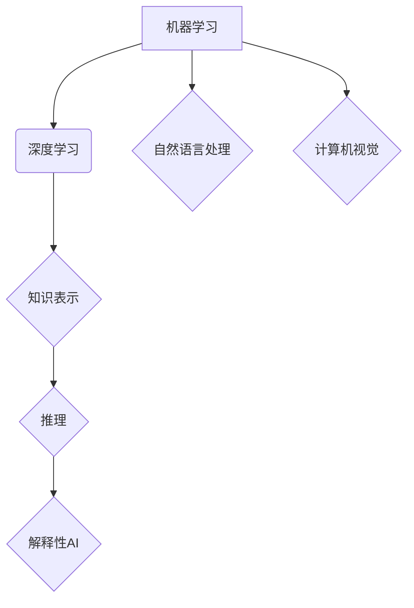

> 人工智能，深度学习，机器学习，自然语言处理，计算机视觉，知识表示，推理，解释性AI，伦理

## 1. 背景介绍

人工智能（AI）作为一项前沿科技，近年来取得了令人瞩目的进展。从语音识别到图像识别，从自动驾驶到医疗诊断，AI技术已渗透到各个领域，深刻地改变着我们的生活。然而，尽管取得了如此巨大的成就，现有的AI技术仍然存在着一些关键问题，例如缺乏泛化能力、难以解释决策过程、对数据依赖性强等。这些问题限制了AI技术的进一步发展和应用。

为了解决这些问题，发展科学完备的人工智能理论至关重要。一个完备的人工智能理论不仅需要解释现有的AI技术，更需要为未来AI的发展指明方向，构建一个更加智能、安全、可解释的AI系统。

## 2. 核心概念与联系

**2.1  人工智能的定义**

人工智能是指模拟和扩展人类智能的计算机系统。它涵盖了多个子领域，例如机器学习、深度学习、自然语言处理、计算机视觉等。

**2.2  核心概念**

* **机器学习:**  使机器从数据中学习，无需明确编程，自动发现模式和规律。
* **深度学习:**  一种基于多层神经网络的机器学习方法，能够学习更复杂的特征表示。
* **自然语言处理:**  使计算机能够理解和处理人类语言。
* **计算机视觉:**  使计算机能够“看”图像和视频，并从中提取信息。
* **知识表示:**  将知识以计算机可理解的形式表示，例如知识图谱。
* **推理:**  根据已有的知识和规则，推导出新的结论。
* **解释性AI:**  使AI系统的决策过程更加透明和可解释。

**2.3  核心概念关系图**



## 3. 核心算法原理 & 具体操作步骤

**3.1  算法原理概述**

深度学习算法的核心是多层神经网络。神经网络由多个层组成，每层包含多个神经元。每个神经元接收来自上一层的输入，并通过激活函数进行处理，输出到下一层。通过训练，神经网络能够学习到数据的特征表示，并完成各种任务。

**3.2  算法步骤详解**

1. **数据预处理:**  将原始数据转换为深度学习算法可以处理的形式，例如归一化、编码等。
2. **网络结构设计:**  根据任务需求设计神经网络的结构，包括层数、神经元数量、激活函数等。
3. **参数初始化:**  随机初始化神经网络的参数，例如权重和偏置。
4. **前向传播:**  将输入数据通过神经网络进行前向传播，得到输出结果。
5. **损失函数计算:**  计算输出结果与真实值的差异，即损失函数的值。
6. **反向传播:**  根据损失函数的梯度，反向传播更新神经网络的参数。
7. **迭代训练:**  重复步骤4-6，直到损失函数达到预设的阈值。

**3.3  算法优缺点**

**优点:**

* 能够学习到复杂的特征表示。
* 泛化能力强，能够应用于不同的任务。

**缺点:**

* 训练数据量大，需要大量的计算资源。
* 训练过程黑盒化，难以解释决策过程。

**3.4  算法应用领域**

* **图像识别:**  人脸识别、物体检测、图像分类等。
* **语音识别:**  语音转文本、语音助手等。
* **自然语言处理:**  机器翻译、文本摘要、情感分析等。
* **医疗诊断:**  疾病预测、影像分析等。

## 4. 数学模型和公式 & 详细讲解 & 举例说明

**4.1  数学模型构建**

深度学习算法的核心是神经网络，其数学模型可以表示为：

$$
y = f(W x + b)
$$

其中：

* $y$ 是输出结果。
* $x$ 是输入数据。
* $W$ 是权重矩阵。
* $b$ 是偏置向量。
* $f$ 是激活函数。

**4.2  公式推导过程**

深度学习算法的训练过程是通过优化损失函数来实现的。损失函数衡量预测结果与真实值的差异。常用的损失函数包括均方误差（MSE）和交叉熵损失（Cross-Entropy Loss）。

**4.3  案例分析与讲解**

**均方误差（MSE）**

$$
MSE = \frac{1}{n} \sum_{i=1}^{n} (y_i - \hat{y}_i)^2
$$

其中：

* $n$ 是样本数量。
* $y_i$ 是真实值。
* $\hat{y}_i$ 是预测值。

**交叉熵损失（Cross-Entropy Loss）**

$$
Cross-Entropy Loss = -\sum_{i=1}^{n} y_i \log(\hat{y}_i)
$$

其中：

* $n$ 是样本数量。
* $y_i$ 是真实值（one-hot编码）。
* $\hat{y}_i$ 是预测值（概率分布）。

## 5. 项目实践：代码实例和详细解释说明

**5.1  开发环境搭建**

* Python 3.x
* TensorFlow 或 PyTorch

**5.2  源代码详细实现**

```python
import tensorflow as tf

# 定义模型
model = tf.keras.models.Sequential([
    tf.keras.layers.Dense(128, activation='relu', input_shape=(784,)),
    tf.keras.layers.Dense(10, activation='softmax')
])

# 编译模型
model.compile(optimizer='adam',
              loss='sparse_categorical_crossentropy',
              metrics=['accuracy'])

# 训练模型
model.fit(x_train, y_train, epochs=10)

# 评估模型
loss, accuracy = model.evaluate(x_test, y_test)
print('Loss:', loss)
print('Accuracy:', accuracy)
```

**5.3  代码解读与分析**

* 代码定义了一个简单的深度学习模型，包含两层全连接层。
* 激活函数使用ReLU和softmax。
* 优化器使用Adam，损失函数使用sparse_categorical_crossentropy，评估指标为准确率。
* 模型训练10个epoch，并使用测试集评估模型性能。

**5.4  运行结果展示**

训练完成后，可以打印模型的损失值和准确率。

## 6. 实际应用场景

**6.1  医疗诊断**

* 疾病预测：根据患者的病史、症状和检查结果，预测患病风险。
* 影像分析：自动识别和分析医学影像，辅助医生诊断。

**6.2  金融服务**

* 风险评估：评估贷款申请者的信用风险。
* 欺诈检测：识别金融交易中的欺诈行为。

**6.3  自动驾驶**

* 路径规划：规划车辆行驶路线。
* 障碍物检测：识别道路上的障碍物。

**6.4  未来应用展望**

* 人机交互：开发更加自然、智能的人机交互方式。
* 个性化教育：提供个性化的学习方案和教学内容。
* 科学研究：加速科学发现和技术创新。

## 7. 工具和资源推荐

**7.1  学习资源推荐**

* **书籍:**
    * 深度学习
    * 人工智能：一个现代方法
* **在线课程:**
    * Coursera: 深度学习
    * Udacity: 
    * fast.ai: 深度学习课程

**7.2  开发工具推荐**

* TensorFlow
* PyTorch
* Keras

**7.3  相关论文推荐**

* ImageNet Classification with Deep Convolutional Neural Networks
* Attention Is All You Need

## 8. 总结：未来发展趋势与挑战

**8.1  研究成果总结**

近年来，人工智能取得了令人瞩目的进展，特别是深度学习算法在图像识别、语音识别等领域取得了突破性成果。

**8.2  未来发展趋势**

* **解释性AI:**  开发能够解释自身决策过程的AI系统。
* **联邦学习:**  在不共享原始数据的情况下，训练模型。
* **跨模态学习:**  学习不同模态数据（例如文本、图像、音频）之间的关系。

**8.3  面临的挑战**

* **数据安全和隐私:**  保护用户数据安全和隐私。
* **算法偏见:**  解决算法中潜在的偏见问题。
* **伦理问题:**  人工智能的伦理问题，例如责任归属、算法透明度等。

**8.4  研究展望**

未来，人工智能研究将继续朝着更加智能、安全、可解释的方向发展。我们需要加强基础理论研究，解决算法的局限性，并关注人工智能的伦理和社会影响。


## 9. 附录：常见问题与解答

**9.1  什么是深度学习？**

深度学习是一种基于多层神经网络的机器学习方法，能够学习到更复杂的特征表示。

**9.2  深度学习算法有哪些？**

常见的深度学习算法包括卷积神经网络（CNN）、循环神经网络（RNN）、生成对抗网络（GAN）等。

**9.3  如何训练深度学习模型？**

深度学习模型的训练过程是通过优化损失函数来实现的，常用的优化器包括Adam、SGD等。

**9.4  深度学习的应用领域有哪些？**

深度学习的应用领域非常广泛，包括图像识别、语音识别、自然语言处理、医疗诊断、金融服务等。


作者：禅与计算机程序设计艺术 / Zen and the Art of Computer Programming 
<end_of_turn>