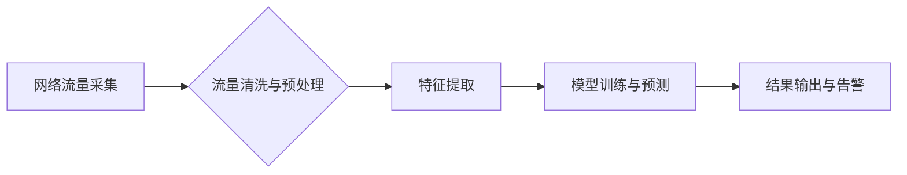

> 网络流量分析，恶意应用检测，机器学习，深度学习，网络安全

## 1. 背景介绍

随着互联网的快速发展和数字化转型进程的加速，网络安全问题日益突出。恶意应用的泛滥给用户和企业带来了巨大的安全风险，例如数据泄露、系统崩溃、勒索攻击等。因此，及时、准确地检测恶意应用成为网络安全领域的重要课题。

传统的恶意应用检测方法主要依赖于静态分析和特征库匹配，存在以下问题：

* **静态分析的局限性:** 静态分析只能分析应用程序的代码结构和文件内容，无法检测到动态行为和运行时异常。
* **特征库的更新困难:** 恶意应用的攻击手法不断变化，特征库难以及时更新，导致检测效果下降。
* **误报率高:**  一些合法应用程序可能与恶意应用程序的特征相似，导致误报。

基于网络流量的在线恶意应用检测系统能够克服上述问题，通过分析应用程序的网络行为特征，实时检测恶意应用。

## 2. 核心概念与联系

### 2.1 网络流量分析

网络流量分析是指通过采集、分析和处理网络流量数据，以获取网络活动信息的技术。网络流量数据包含了应用程序的网络连接、数据包大小、协议类型、发送和接收地址等信息。

### 2.2 恶意应用检测

恶意应用检测是指通过分析应用程序的网络行为特征，识别和过滤恶意应用程序的技术。恶意应用的网络行为特征通常与合法应用程序不同，例如：

* **异常的网络连接模式:** 频繁连接未知服务器、使用非标准端口、发送大量数据包等。
* **数据泄露行为:** 向外部服务器发送敏感数据、窃取用户密码等。
* **恶意代码执行:** 下载和执行恶意代码、控制其他应用程序等。

### 2.3 系统架构

基于网络流量的在线恶意应用检测系统通常采用以下架构：



**系统流程:**

1. **网络流量采集:** 从网络设备中采集网络流量数据。
2. **流量清洗与预处理:** 去除无效数据、格式化数据、提取关键信息等。
3. **特征提取:** 从网络流量数据中提取应用程序的网络行为特征。
4. **模型训练与预测:** 使用机器学习或深度学习模型对特征进行训练，并预测应用程序是否为恶意应用。
5. **结果输出与告警:** 将检测结果输出到监控平台，并对恶意应用发出告警。

## 3. 核心算法原理 & 具体操作步骤

### 3.1 算法原理概述

本系统采用基于机器学习的恶意应用检测算法，主要包括以下步骤：

1. **数据收集与预处理:** 收集网络流量数据，并进行清洗、格式化和特征提取。
2. **模型训练:** 使用机器学习算法对训练数据进行训练，建立恶意应用检测模型。
3. **模型评估:** 使用测试数据对模型进行评估，并调整模型参数以提高检测精度。
4. **在线检测:** 将实时网络流量数据输入到训练好的模型中，预测应用程序是否为恶意应用。

### 3.2 算法步骤详解

1. **数据收集与预处理:**

   * 收集网络流量数据：可以使用网络监控工具或网络设备的日志文件收集网络流量数据。
   * 数据清洗：去除无效数据，例如重复数据、错误数据等。
   * 数据格式化：将数据转换为机器可读的格式，例如CSV、JSON等。
   * 特征提取：从网络流量数据中提取应用程序的网络行为特征，例如：
      * **连接特征:** 连接次数、连接持续时间、连接目标地址等。
      * **数据包特征:** 数据包大小、数据包频率、数据包协议类型等。
      * **应用程序特征:** 应用程序名称、应用程序端口、应用程序版本等。

2. **模型训练:**

   * 选择机器学习算法：常用的机器学习算法包括支持向量机（SVM）、决策树、随机森林、神经网络等。
   * 划分训练集和测试集：将数据划分为训练集和测试集，用于训练模型和评估模型性能。
   * 训练模型：使用训练集数据训练选择的机器学习算法，得到恶意应用检测模型。

3. **模型评估:**

   * 使用测试集数据对模型进行评估，计算模型的准确率、召回率、F1-score等指标。
   * 根据评估结果，调整模型参数以提高检测精度。

4. **在线检测:**

   * 将实时网络流量数据输入到训练好的模型中，预测应用程序是否为恶意应用。
   * 根据预测结果，采取相应的措施，例如：阻止恶意应用程序连接网络、隔离恶意应用程序、发出告警等。

### 3.3 算法优缺点

**优点:**

* **实时检测:** 可以实时检测网络流量中的恶意应用。
* **动态检测:** 可以检测到动态行为和运行时异常。
* **适应性强:** 可以根据网络环境和攻击手法不断调整模型，提高检测精度。

**缺点:**

* **数据依赖:** 需要大量的网络流量数据进行训练，否则模型性能会下降。
* **计算复杂度高:** 训练和预测模型需要大量的计算资源。
* **误报率:** 仍然存在一定的误报率，需要不断优化模型以降低误报率。

### 3.4 算法应用领域

基于网络流量的在线恶意应用检测算法广泛应用于以下领域：

* **网络安全:** 检测网络攻击、恶意软件和钓鱼网站。
* **云计算:** 检测云平台上的恶意应用和攻击行为。
* **移动安全:** 检测移动设备上的恶意应用程序。
* **工业控制系统:** 检测工业控制系统中的恶意行为。

## 4. 数学模型和公式 & 详细讲解 & 举例说明

### 4.1 数学模型构建

本系统采用基于支持向量机的恶意应用检测模型，其数学模型可以表示为：

$$
f(x) = \text{sign}(\sum_{i=1}^{n} \alpha_i y_i K(x_i, x) + b)
$$

其中：

* $x$ 是输入特征向量，代表应用程序的网络行为特征。
* $y_i$ 是训练样本 $x_i$ 的标签，为 1 表示恶意应用，为 -1 表示合法应用。
* $\alpha_i$ 是拉格朗日乘子，用于权衡不同样本的贡献。
* $K(x_i, x)$ 是核函数，用于计算特征向量之间的相似度。
* $b$ 是偏置项。

### 4.2 公式推导过程

支持向量机模型的训练过程是通过求解以下优化问题：

$$
\min_{\alpha, b} \frac{1}{2} \sum_{i=1}^{n} \alpha_i y_i \alpha_j y_j K(x_i, x_j) - \sum_{i=1}^{n} \alpha_i
$$

约束条件：

* $0 \leq \alpha_i \leq C$
* $\sum_{i=1}^{n} \alpha_i y_i = 0$

其中 $C$ 是惩罚参数，用于控制模型的复杂度。

通过求解上述优化问题，可以得到模型参数 $\alpha$ 和 $b$，从而得到恶意应用检测模型。

### 4.3 案例分析与讲解

假设我们收集到以下网络流量数据：

| 应用名称 | 连接次数 | 数据包大小 |
|---|---|---|
| 应用 A | 10 | 1024 |
| 应用 B | 50 | 512 |
| 应用 C | 200 | 1024 |

其中，应用 A 和应用 B 是合法应用程序，应用 C 是恶意应用程序。

我们可以将这些数据作为训练数据，使用支持向量机算法训练模型。

训练完成后，我们可以使用新的网络流量数据进行预测。例如，如果一个应用程序的连接次数为 150，数据包大小为 1024，那么模型可以预测该应用程序为恶意应用程序。

## 5. 项目实践：代码实例和详细解释说明

### 5.1 开发环境搭建

本系统使用 Python 语言开发，需要安装以下软件包：

* Python 3.x
* scikit-learn
* pandas
* numpy

### 5.2 源代码详细实现

```python
import pandas as pd
from sklearn.model_selection import train_test_split
from sklearn.svm import SVC
from sklearn.metrics import accuracy_score

# 加载网络流量数据
data = pd.read_csv('network_traffic.csv')

# 提取特征和标签
X = data[['连接次数', '数据包大小']]
y = data['恶意应用']

# 将数据划分为训练集和测试集
X_train, X_test, y_train, y_test = train_test_split(X, y, test_size=0.2, random_state=42)

# 创建支持向量机模型
model = SVC(kernel='linear')

# 训练模型
model.fit(X_train, y_train)

# 对测试集进行预测
y_pred = model.predict(X_test)

# 计算模型精度
accuracy = accuracy_score(y_test, y_pred)
print('模型精度:', accuracy)
```

### 5.3 代码解读与分析

* **数据加载:** 使用 pandas 库加载网络流量数据。
* **特征提取:** 从网络流量数据中提取连接次数和数据包大小作为特征。
* **数据划分:** 使用 train_test_split 函数将数据划分为训练集和测试集。
* **模型创建:** 使用 scikit-learn 库创建支持向量机模型。
* **模型训练:** 使用 fit 函数训练模型。
* **模型预测:** 使用 predict 函数对测试集进行预测。
* **模型评估:** 使用 accuracy_score 函数计算模型精度。

### 5.4 运行结果展示

运行上述代码后，可以得到模型的精度值。

## 6. 实际应用场景

### 6.1 企业网络安全

基于网络流量的在线恶意应用检测系统可以部署在企业网络中，实时检测网络流量中的恶意应用，保护企业网络安全。

### 6.2 云计算平台安全

云计算平台可以部署该系统，检测云平台上的恶意应用和攻击行为，保障云平台安全。

### 6.3 移动设备安全

移动设备可以安装该系统，检测移动设备上的恶意应用程序，保护用户隐私和数据安全。

### 6.4 未来应用展望

随着人工智能技术的不断发展，基于网络流量的在线恶意应用检测系统将更加智能化、自动化和精准化。未来，该系统可以应用于更多领域，例如：

* **工业控制系统安全:** 检测工业控制系统中的恶意行为，防止工业事故。
* **物联网安全:** 检测物联网设备上的恶意应用，保障物联网安全。
* **金融安全:** 检测金融系统中的恶意应用，防止金融诈骗。

## 7. 工具和资源推荐

### 7.1 学习资源推荐

* **书籍:**
    * 《机器学习》 - 周志华
    * 《深度学习》 - Ian Goodfellow
* **在线课程:**
    * Coursera: Machine Learning
    * edX: Deep Learning

### 7.2 开发工具推荐

* **Python:** 
* **scikit-learn:** 机器学习库
* **pandas:** 数据分析库
* **numpy:** 数值计算库

### 7.3 相关论文推荐

* **Detecting Malicious Applications Using Network Traffic Analysis**
* **A Survey of Machine Learning Techniques for Malware Detection**

## 8. 总结：未来发展趋势与挑战

### 8.1 研究成果总结

基于网络流量的在线恶意应用检测系统是一种有效的网络安全技术，能够实时检测恶意应用，保护网络安全。

### 8.2 未来发展趋势

* **人工智能技术融合:** 将深度学习、强化学习等人工智能技术与网络流量分析相结合，提高检测精度和自动化程度