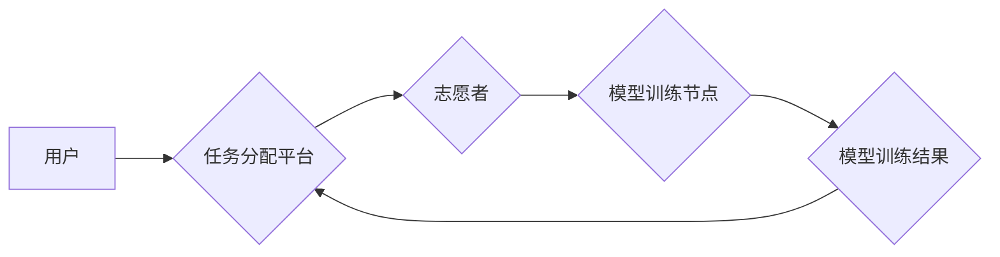

> 基础模型、志愿计算、分布式训练、开源社区、人工智能、可持续发展

## 1. 背景介绍

近年来，人工智能（AI）技术取得了飞速发展，基础模型作为AI领域的核心技术，在自然语言处理、计算机视觉、语音识别等领域展现出强大的应用潜力。然而，训练大型基础模型需要海量的计算资源和时间，这给模型开发和应用带来了巨大的成本和技术门槛。

志愿计算作为一种新型的计算模式，通过将分散的计算任务分配给全球范围内的志愿者，有效利用了闲置计算资源，为解决大规模计算问题提供了新的思路。将志愿计算与基础模型训练相结合，可以降低模型训练成本，促进基础模型的开源和普及，推动AI技术的可持续发展。

## 2. 核心概念与联系

**2.1 基础模型**

基础模型是指在大量数据上预训练的通用模型，具有强大的泛化能力和迁移学习能力。它们可以作为其他特定任务的模型基础，通过微调实现高效的模型训练。

**2.2 志愿计算**

志愿计算是指利用全球范围内的个人电脑、服务器等闲置计算资源，为科学研究、工程项目等需要大量计算能力的任务提供支持。志愿者通过参与计算任务，为科学研究和技术进步贡献自己的力量。

**2.3 核心概念联系**

将志愿计算应用于基础模型训练，可以有效解决基础模型训练成本高、资源紧张的问题。通过将模型训练任务分解成多个小任务，分配给全球范围内的志愿者进行计算，可以充分利用闲置计算资源，降低模型训练成本，并促进基础模型的开源和普及。

**2.4 架构图**



## 3. 核心算法原理 & 具体操作步骤

**3.1 算法原理概述**

志愿计算方案的核心算法原理是将大型基础模型训练任务分解成多个小任务，并通过分布式训练技术在多个计算节点上并行执行。每个计算节点负责训练模型的一部分参数，最终将所有节点的训练结果合并，得到完整的模型。

**3.2 算法步骤详解**

1. **任务分解:** 将大型基础模型训练任务分解成多个小任务，每个任务负责训练模型的一部分参数。
2. **数据分配:** 将训练数据均匀分配给各个计算节点，每个节点负责训练其分配的数据。
3. **并行训练:** 各个计算节点分别训练其分配的数据，并根据预设的算法更新模型参数。
4. **结果汇总:** 各个计算节点将训练结果汇总到任务分配平台，平台将所有结果合并，得到完整的模型。
5. **模型评估:** 对合并后的模型进行评估，并根据评估结果进行模型优化和迭代。

**3.3 算法优缺点**

**优点:**

* **降低训练成本:** 通过利用志愿者的闲置计算资源，有效降低模型训练成本。
* **提高训练效率:** 通过分布式训练技术，可以显著提高模型训练效率。
* **促进开源和普及:** 通过志愿计算方案，可以更容易地将基础模型开源和普及。

**缺点:**

* **数据安全:** 需要确保训练数据安全，防止数据泄露。
* **任务协调:** 需要有效的任务协调机制，确保各个计算节点的协作效率。
* **结果可靠性:** 需要保证各个计算节点的训练结果可靠性，防止错误结果影响最终模型。

**3.4 算法应用领域**

* **自然语言处理:** 语义理解、机器翻译、文本生成等。
* **计算机视觉:** 图像识别、目标检测、图像分割等。
* **语音识别:** 语音转文本、语音合成等。
* **其他领域:** 药物研发、材料科学、金融预测等。

## 4. 数学模型和公式 & 详细讲解 & 举例说明

**4.1 数学模型构建**

假设我们有一个包含N个参数的深度学习模型，训练数据为D，损失函数为L。志愿计算方案的目标是找到模型参数W，使得在训练数据D上损失函数L最小化。

我们可以使用梯度下降算法来优化模型参数。梯度下降算法的基本思想是通过计算损失函数对模型参数的梯度，并根据梯度方向更新模型参数，直到损失函数达到最小值。

**4.2 公式推导过程**

梯度下降算法的更新公式为：

$$W_{t+1} = W_t - \eta \nabla_W L(W_t, D)$$

其中：

* $W_t$ 是模型参数在第t次迭代的值。
* $W_{t+1}$ 是模型参数在第t+1次迭代的值。
* $\eta$ 是学习率，控制着参数更新的步长。
* $\nabla_W L(W_t, D)$ 是损失函数L对模型参数W的梯度。

**4.3 案例分析与讲解**

假设我们有一个包含100个参数的深度学习模型，训练数据为1000个样本，损失函数为均方误差。我们使用梯度下降算法进行模型训练，学习率设置为0.01。

在训练过程中，我们会计算损失函数对模型参数的梯度，并根据梯度方向更新模型参数。每次更新模型参数后，我们会计算新的损失值，并比较与之前损失值的变化情况。如果损失值下降，则继续更新模型参数；如果损失值上升，则需要调整学习率或其他超参数。

## 5. 项目实践：代码实例和详细解释说明

**5.1 开发环境搭建**

* 操作系统：Linux
* Python版本：3.7+
* 深度学习框架：TensorFlow或PyTorch
* 其他依赖库：NumPy、pandas、scikit-learn等

**5.2 源代码详细实现**

```python
# 导入必要的库
import tensorflow as tf

# 定义模型结构
model = tf.keras.models.Sequential([
    tf.keras.layers.Dense(64, activation='relu', input_shape=(10,)),
    tf.keras.layers.Dense(10, activation='softmax')
])

# 定义损失函数和优化器
loss_fn = tf.keras.losses.CategoricalCrossentropy()
optimizer = tf.keras.optimizers.Adam(learning_rate=0.01)

# 定义训练函数
def train_step(images, labels):
    with tf.GradientTape() as tape:
        predictions = model(images)
        loss = loss_fn(labels, predictions)
    gradients = tape.gradient(loss, model.trainable_variables)
    optimizer.apply_gradients(zip(gradients, model.trainable_variables))
    return loss

# 加载训练数据
(x_train, y_train), (x_test, y_test) = tf.keras.datasets.mnist.load_data()

# 数据预处理
x_train = x_train.astype('float32') / 255.0
x_test = x_test.astype('float32') / 255.0

# 训练模型
epochs = 10
for epoch in range(epochs):
    for batch in range(x_train.shape[0] // 32):
        loss = train_step(x_train[batch * 32:(batch + 1) * 32], y_train[batch * 32:(batch + 1) * 32])
    print(f'Epoch {epoch+1}/{epochs}, Loss: {loss.numpy()}')

# 模型评估
loss, accuracy = model.evaluate(x_test, y_test, verbose=0)
print(f'Test Loss: {loss}, Test Accuracy: {accuracy}')
```

**5.3 代码解读与分析**

这段代码实现了使用TensorFlow框架训练一个简单的深度学习模型。

* 首先，我们定义了模型结构，这是一个包含两层全连接层的模型。
* 然后，我们定义了损失函数和优化器，损失函数是均方误差，优化器是Adam优化器。
* 接着，我们定义了训练函数，该函数计算模型的损失值，并根据梯度更新模型参数。
* 接下来，我们加载训练数据，并对数据进行预处理。
* 最后，我们训练模型，并评估模型的性能。

**5.4 运行结果展示**

运行这段代码后，会输出训练过程中的损失值，以及模型在测试集上的损失值和准确率。

## 6. 实际应用场景

**6.1 自然语言处理**

* **机器翻译:** 基于志愿计算训练的机器翻译模型可以翻译不同语言的文本，提高跨语言沟通效率。
* **文本生成:** 基于志愿计算训练的文本生成模型可以生成高质量的文本内容，例如新闻报道、小说、诗歌等。
* **情感分析:** 基于志愿计算训练的情感分析模型可以分析文本的情感倾向，用于市场调研、用户反馈分析等。

**6.2 计算机视觉**

* **图像识别:** 基于志愿计算训练的图像识别模型可以识别图像中的物体、场景等，用于自动驾驶、医疗诊断等领域。
* **目标检测:** 基于志愿计算训练的目标检测模型可以定位图像中的目标，用于安防监控、无人零售等领域。
* **图像分割:** 基于志愿计算训练的图像分割模型可以将图像分割成不同的区域，用于医学图像分析、遥感图像处理等领域。

**6.3 其他领域**

* **语音识别:** 基于志愿计算训练的语音识别模型可以将语音转为文本，用于语音助手、语音搜索等领域。
* **药物研发:** 基于志愿计算训练的药物研发模型可以预测药物的活性，加速药物研发过程。
* **材料科学:** 基于志愿计算训练的材料科学模型可以预测材料的性能，用于材料设计、材料筛选等领域。

**6.4 未来应用展望**

随着计算资源的不断发展和人工智能技术的进步，志愿计算方案在基础模型训练中的应用前景十分广阔。未来，志愿计算方案将能够支持训练更加大型、更加复杂的模型，并应用于更多领域，推动人工智能技术的进一步发展。

## 7. 工具和资源推荐

**7.1 学习资源推荐**

* **在线课程:** Coursera、edX、Udacity等平台提供丰富的深度学习课程。
* **书籍:** 《深度学习》、《动手学深度学习》等书籍对深度学习有深入的讲解。
* **博客和论坛:** TensorFlow、PyTorch等深度学习框架的官方博客和论坛提供大量学习资源和技术支持。

**7.2 开发工具推荐**

* **深度学习框架:** TensorFlow、PyTorch、Keras等深度学习框架提供丰富的工具和功能，方便模型开发和训练。
* **云计算平台:** AWS、Google Cloud、Azure等云计算平台提供强大的计算资源和服务，方便模型训练和部署。
* **数据处理工具:** NumPy、pandas等数据处理工具方便数据预处理和分析。

**7.3 相关论文推荐**

* **分布式深度学习:** Dean, J., et al. (2012). Large scale distributed deep networks.
* **志愿计算:**  Anderson, J. (2004). Grid computing: Utility computing for the masses.
* **基础模型:** Brown, T. B., et al. (2020). Language models are few-shot learners.

## 8. 总结：未来发展趋势与挑战

**8.1 研究成果总结**

志愿计算方案为基础模型训练提供了新的思路和方法，有效降低了模型训练成本，并促进了基础模型的开源和普及。

**8.2 未来发展趋势**

* **模型规模的进一步扩大:** 未来，志愿计算方案将支持训练更加大型、更加复杂的模型，例如千亿参数甚至万亿参数的模型。
* **算法效率的提升:** 研究人员将继续探索更加高效的分布式训练算法，提高模型训练效率。
* **应用场景的拓展:** 基于志愿计算训练的基础模型将应用于更多领域，例如医疗、教育、金融等。

**8.3 面临的挑战**

* **数据安全:** 需要确保训练数据安全，防止数据泄露。
* **任务