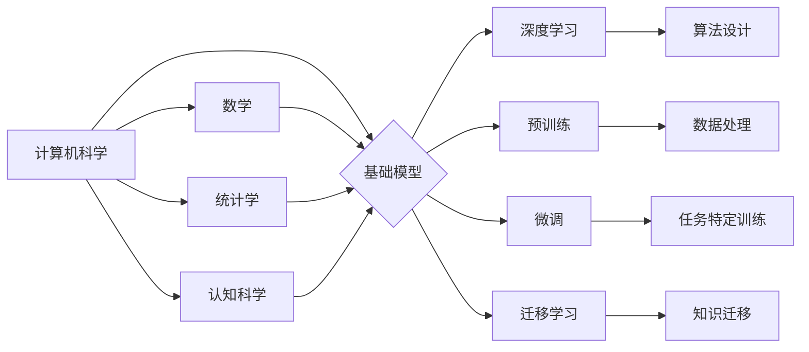

> 基础模型、跨学科合作、人工智能、机器学习、深度学习、自然语言处理、计算机视觉、科学发现

## 1. 背景介绍

基础模型（Foundation Models）是近年来人工智能领域备受关注的热点话题。它们是指在海量数据上预训练的大规模模型，能够在多种下游任务中表现出强大的泛化能力。与传统模型相比，基础模型具有以下特点：

* **规模庞大:** 基础模型通常拥有数十亿甚至数千亿个参数，远超传统模型的规模。
* **预训练能力:** 基础模型在海量数据上进行预训练，学习了丰富的语义和知识表示。
* **泛化能力强:** 基础模型能够在多种下游任务中表现出良好的泛化能力，无需针对每个任务进行专门的训练。

基础模型的出现，标志着人工智能领域迈向一个新的阶段。它们为解决更复杂、更具挑战性的问题提供了新的可能性。

## 2. 核心概念与联系

基础模型的构建和应用涉及到多个学科领域，包括计算机科学、数学、统计学、认知科学等。这些学科领域的交叉融合，推动了基础模型的快速发展。

**2.1 核心概念**

* **深度学习:** 深度学习是基础模型的核心技术之一，它利用多层神经网络来学习数据中的复杂模式。
* **预训练:** 预训练是指在大量无标注数据上训练模型，学习通用知识和表示。
* **微调:** 微调是指在特定任务数据上对预训练模型进行进一步训练，以提高其在该任务上的性能。
* **迁移学习:** 迁移学习是指将预训练模型在一种任务上的知识迁移到另一种任务上，以提高新任务的学习效率。

**2.2 跨学科合作**

基础模型的开发和应用需要跨学科合作。

* **计算机科学家:** 负责设计和实现基础模型的算法和架构。
* **数学家:** 为基础模型的理论分析和优化提供数学工具和方法。
* **统计学家:** 为基础模型的训练和评估提供统计学方法和模型。
* **认知科学家:** 为基础模型的理解和解释提供认知科学的视角。

**2.3 架构图**

## 3. 核心算法原理 & 具体操作步骤

### 3.1 算法原理概述

基础模型的核心算法是深度学习算法，其中包括卷积神经网络（CNN）、循环神经网络（RNN）和Transformer等。这些算法通过多层神经网络结构，学习数据中的复杂模式和关系。

### 3.2 算法步骤详解

1. **数据预处理:** 将原始数据转换为模型可以理解的格式，例如文本数据转换为词向量。
2. **模型构建:** 根据任务需求选择合适的深度学习模型架构，并设置模型参数。
3. **预训练:** 在海量无标注数据上训练模型，学习通用知识和表示。
4. **微调:** 在特定任务数据上对预训练模型进行进一步训练，以提高其在该任务上的性能。
5. **评估:** 使用测试数据评估模型的性能，并根据评估结果进行模型优化。

### 3.3 算法优缺点

**优点:**

* 泛化能力强
* 训练效率高
* 可迁移性强

**缺点:**

* 训练成本高
* 数据依赖性强
* 可解释性差

### 3.4 算法应用领域

基础模型在多个领域都有广泛的应用，例如：

* **自然语言处理:** 文本分类、机器翻译、问答系统等。
* **计算机视觉:** 图像识别、目标检测、图像生成等。
* **语音识别:** 语音转文本、语音合成等。
* **科学发现:** 蛋白质结构预测、药物研发等。

## 4. 数学模型和公式 & 详细讲解 & 举例说明

### 4.1 数学模型构建

基础模型的训练过程可以看作是一个优化问题，目标是找到模型参数，使得模型在训练数据上的损失函数最小。损失函数通常是模型预测值与真实值的差值，例如均方误差（MSE）或交叉熵损失（Cross-Entropy Loss）。

### 4.2 公式推导过程

假设模型的输出为 $y$，真实值是 $t$，损失函数为 $L(y,t)$，则模型的训练目标是：

$$
\min_{\theta} \mathcal{L}(\theta) = \frac{1}{N} \sum_{i=1}^{N} L(y_i, t_i)
$$

其中，$\theta$ 是模型参数，$N$ 是训练数据的数量。

为了找到最优参数，可以使用梯度下降算法。梯度下降算法的基本思想是：沿着梯度方向更新模型参数，直到损失函数达到最小值。

梯度下降算法的更新公式为：

$$
\theta = \theta - \eta \nabla_{\theta} \mathcal{L}(\theta)
$$

其中，$\eta$ 是学习率，$\nabla_{\theta} \mathcal{L}(\theta)$ 是损失函数对模型参数的梯度。

### 4.3 案例分析与讲解

例如，在图像分类任务中，模型的输出是一个概率分布，表示图像属于不同类别的概率。损失函数可以使用交叉熵损失，计算模型预测概率与真实类别概率之间的差异。

## 5. 项目实践：代码实例和详细解释说明

### 5.1 开发环境搭建

基础模型的开发通常需要强大的计算资源，例如GPU。可以使用云计算平台，例如AWS、Google Cloud、Azure等，搭建开发环境。

### 5.2 源代码详细实现

基础模型的源代码通常开源，例如BERT、GPT-3等。可以使用这些开源代码作为基础，进行修改和扩展。

### 5.3 代码解读与分析

开源代码通常包含模型架构、训练脚本、评估脚本等部分。需要仔细阅读代码，理解模型的结构和训练过程。

### 5.4 运行结果展示

训练完成后，可以使用测试数据评估模型的性能，并展示模型的预测结果。

## 6. 实际应用场景

基础模型在多个实际应用场景中发挥着重要作用。

### 6.1 自然语言处理

* **机器翻译:** 基于基础模型的机器翻译系统能够实现更高质量的翻译，例如Google Translate。
* **文本摘要:** 基于基础模型的文本摘要系统能够自动生成文本的简要概述，例如新闻摘要、会议记录摘要等。
* **对话系统:** 基于基础模型的对话系统能够进行更自然、更流畅的对话，例如聊天机器人、虚拟助手等。

### 6.2 计算机视觉

* **图像识别:** 基于基础模型的图像识别系统能够识别图像中的物体、场景等，例如自动驾驶、安防监控等。
* **目标检测:** 基于基础模型的目标检测系统能够定位图像中的目标，例如人脸识别、物体跟踪等。
* **图像生成:** 基于基础模型的图像生成系统能够生成逼真的图像，例如艺术作品、产品设计等。

### 6.3 其他领域

* **语音识别:** 基于基础模型的语音识别系统能够将语音转换为文本，例如语音助手、语音搜索等。
* **科学发现:** 基于基础模型的科学发现系统能够分析海量数据，发现新的科学规律，例如药物研发、基因组学研究等。

### 6.4 未来应用展望

基础模型的应用前景广阔，未来将应用于更多领域，例如：

* **个性化教育:** 基于基础模型的个性化教育系统能够根据学生的学习情况，提供个性化的学习内容和教学方法。
* **医疗诊断:** 基于基础模型的医疗诊断系统能够辅助医生进行诊断，提高诊断准确率。
* **智能制造:** 基于基础模型的智能制造系统能够提高生产效率，降低生产成本。

## 7. 工具和资源推荐

### 7.1 学习资源推荐

* **书籍:**
    * Deep Learning by Ian Goodfellow, Yoshua Bengio, and Aaron Courville
    * Hands-On Machine Learning with Scikit-Learn, Keras & TensorFlow by Aurélien Géron
* **在线课程:**
    * Stanford CS231n: Convolutional Neural Networks for Visual Recognition
    * Deep Learning Specialization by Andrew Ng
* **博客和网站:**
    * Towards Data Science
    * Machine Learning Mastery

### 7.2 开发工具推荐

* **深度学习框架:** TensorFlow, PyTorch, Keras
* **编程语言:** Python
* **云计算平台:** AWS, Google Cloud, Azure

### 7.3 相关论文推荐

* BERT: Pre-training of Deep Bidirectional Transformers for Language Understanding
* GPT-3: Language Models are Few-Shot Learners
* DALL-E: Creating Images from Text

## 8. 总结：未来发展趋势与挑战

### 8.1 研究成果总结

基础模型的出现，标志着人工智能领域迈向一个新的阶段。它们具有强大的泛化能力和应用潜力，在多个领域取得了显著的成果。

### 8.2 未来发展趋势

* **模型规模的进一步扩大:** 未来基础模型的规模将继续扩大，拥有更多的参数和更强的能力。
* **多模态学习:** 未来基础模型将能够处理多种模态数据，例如文本、图像、音频等，实现跨模态的理解和生成。
* **可解释性增强:** 未来基础模型的可解释性将得到增强，能够更好地解释模型的决策过程。

### 8.3 面临的挑战

* **训练成本:** 基础模型的训练成本很高，需要大量的计算资源和数据。
* **数据安全:** 基础模型的训练需要大量的敏感数据，需要解决数据安全问题。
* **伦理问题:** 基础模型的应用可能带来一些伦理问题，例如偏见、歧视等，需要进行伦理规范的制定和监管。

### 8.4 研究展望

基础模型的研究是一个充满挑战和机遇的领域。未来，我们将继续探索基础模型的潜力，解决其面临的挑战，推动人工智能技术的发展。

## 9. 附录：常见问题与解答

### 9.1 什么是基础模型？

基础模型是指在海量数据上预训练的大规模模型，能够在多种下游任务中表现出强大的泛化能力。

### 9.2 基础模型有什么优势？

基础模型具有以下优势：

* 泛化能力强
* 训练效率高
* 可迁移性强

### 9.3 如何训练基础模型？

基础模型的训练通常使用深度学习算法，例如卷积神经网络、循环神经网络和Transformer等。

### 9.4 基础模型有哪些应用场景？

基础模型在多个领域都有广泛的应用，例如自然语言处理、计算机视觉、语音识别等。

### 9.5 基础模型的未来发展趋势是什么？

未来基础模型将朝着以下方向发展：

* 模型规模的进一步扩大
* 多模态学习
* 可解释性增强

作者：禅与计算机程序设计艺术 / Zen and the Art of Computer Programming 
<end_of_turn>