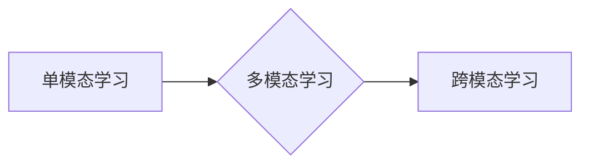

> 多模态大模型, 单模态学习, 多模态学习, 跨模态学习, 深度学习, Transformer, 图像识别, 自然语言处理, 语音识别

## 1. 背景介绍

近年来，人工智能（AI）技术取得了飞速发展，其中大模型在自然语言处理（NLP）、计算机视觉（CV）等领域展现出强大的能力。然而，现实世界的信息往往是多模态的，例如文本、图像、音频、视频等多种形式的混合。单一模态模型难以捕捉到这些多模态信息之间的复杂关系，因此，多模态大模型应运而生。

多模态大模型是指能够处理多种模态数据并进行理解、生成和推理的强大AI模型。它可以学习不同模态之间的关联性，从而获得更全面的信息表示，并完成更复杂的任务。例如，一个多模态大模型可以理解图像中的场景并生成相应的文字描述，或者根据语音指令控制机器人动作。

## 2. 核心概念与联系

### 2.1 单模态学习

单模态学习是指模型只处理一种类型的模态数据，例如文本、图像或音频。这些模型通常使用专门的架构和训练方法，例如卷积神经网络（CNN）用于图像识别，循环神经网络（RNN）用于自然语言处理。

### 2.2 多模态学习

多模态学习是指模型同时处理多种模态数据，并学习不同模态之间的关系。常见的多模态学习方法包括：

* **特征融合:** 将不同模态的特征进行融合，例如将图像特征和文本特征进行拼接或融合。
* **共享表示:** 使用共享的隐藏层来学习不同模态的表示，从而捕捉到模态之间的关系。
* **注意力机制:** 使用注意力机制来学习不同模态之间的重要性，并根据重要性进行加权融合。

### 2.3 跨模态学习

跨模态学习是指模型能够将一种模态的数据映射到另一种模态的数据，例如将图像转换为文本描述或将文本转换为图像。跨模态学习通常需要更复杂的模型架构和训练方法，例如生成对抗网络（GAN）和变分自编码器（VAE）。



## 3. 核心算法原理 & 具体操作步骤

### 3.1 算法原理概述

多模态大模型的训练通常基于深度学习框架，例如TensorFlow和PyTorch。常用的模型架构包括Transformer、CNN和RNN等。

Transformer是一种基于注意力机制的深度学习模型，能够有效地捕捉序列数据之间的长距离依赖关系。它在自然语言处理领域取得了显著的成果，也逐渐应用于多模态学习领域。

CNN擅长于处理图像数据，能够提取图像特征。RNN擅长于处理序列数据，例如文本和音频。

### 3.2 算法步骤详解

1. **数据预处理:** 将多模态数据进行预处理，例如图像裁剪、文本分词、音频降噪等。
2. **特征提取:** 使用CNN、RNN等模型提取不同模态的数据特征。
3. **特征融合:** 将不同模态的特征进行融合，例如使用注意力机制、拼接或融合等方法。
4. **模型训练:** 使用深度学习框架训练多模态大模型，例如使用交叉熵损失函数和梯度下降算法。
5. **模型评估:** 使用测试数据评估模型的性能，例如使用准确率、召回率、F1-score等指标。

### 3.3 算法优缺点

**优点:**

* 能够处理多种模态数据，获得更全面的信息表示。
* 能够学习不同模态之间的关系，提高模型的理解能力。
* 在多模态任务中，例如图像字幕生成、视频问答等方面表现出色。

**缺点:**

* 数据收集和预处理难度较大。
* 模型训练成本高，需要大量的计算资源。
* 模型解释性较差，难以理解模型的决策过程。

### 3.4 算法应用领域

多模态大模型在多个领域都有广泛的应用，例如：

* **计算机视觉:** 图像识别、目标检测、图像字幕生成、视频理解等。
* **自然语言处理:** 文本分类、情感分析、机器翻译、对话系统等。
* **语音识别:** 语音转文本、语音合成、语音情感分析等。
* **人机交互:** 语音控制、手势识别、虚拟现实等。

## 4. 数学模型和公式 & 详细讲解 & 举例说明

### 4.1 数学模型构建

多模态大模型的数学模型通常基于深度学习框架，例如TensorFlow和PyTorch。模型的结构通常包括多个层，例如卷积层、池化层、全连接层和注意力层。

### 4.2 公式推导过程

多模态大模型的训练目标通常是最大化模型的似然函数，即预测正确的输出概率。

假设模型的输出为y，输入为x，则似然函数为：

$$P(y|x) = \prod_{i=1}^{N} P(y_i|x_i)$$

其中，N为样本数量，$y_i$为第i个样本的输出，$x_i$为第i个样本的输入。

模型的训练目标是最大化似然函数，可以使用梯度下降算法进行优化。

### 4.3 案例分析与讲解

例如，在图像字幕生成任务中，模型的输入为图像，输出为文本描述。

模型可以使用CNN提取图像特征，使用RNN生成文本描述。

模型的训练目标是最大化图像和文本描述之间的匹配度，可以使用BLEU等指标进行评估。

## 5. 项目实践：代码实例和详细解释说明

### 5.1 开发环境搭建

* Python 3.7+
* TensorFlow 2.0+
* PyTorch 1.0+
* CUDA 10.0+

### 5.2 源代码详细实现

```python
# 使用TensorFlow构建多模态大模型
import tensorflow as tf

# 定义图像特征提取模型
image_model = tf.keras.applications.ResNet50(include_top=False, weights='imagenet')

# 定义文本特征提取模型
text_model = tf.keras.Sequential([
    tf.keras.layers.Embedding(vocab_size, embedding_dim),
    tf.keras.layers.LSTM(units),
])

# 定义特征融合层
fusion_layer = tf.keras.layers.Concatenate()

# 定义输出层
output_layer = tf.keras.layers.Dense(units, activation='softmax')

# 构建多模态大模型
model = tf.keras.Model(
    inputs=[image_input, text_input],
    outputs=output_layer(fusion_layer([image_model(image_input), text_model(text_input)])),
)

# 编译模型
model.compile(optimizer='adam', loss='categorical_crossentropy', metrics=['accuracy'])

# 训练模型
model.fit(
    x=[image_data, text_data],
    y=labels,
    epochs=10,
    batch_size=32,
)

```

### 5.3 代码解读与分析

* 代码首先定义了图像特征提取模型和文本特征提取模型。
* 然后定义了特征融合层，将图像特征和文本特征进行拼接。
* 最后定义了输出层，用于预测最终的输出结果。
* 代码使用TensorFlow框架构建了多模态大模型，并使用梯度下降算法进行训练。

### 5.4 运行结果展示

训练完成后，可以使用测试数据评估模型的性能。

## 6. 实际应用场景

### 6.1 图像字幕生成

多模态大模型可以将图像转换为文本描述，例如将一张图片描述为“一只小狗在公园里玩耍”。

### 6.2 视频问答

多模态大模型可以理解视频内容并回答问题，例如根据视频回答“视频中发生了什么事件”。

### 6.3 多模态搜索

多模态大模型可以根据图像、文本或语音进行搜索，例如根据一张图片搜索相关的商品信息。

### 6.4 未来应用展望

多模态大模型在未来将有更广泛的应用，例如：

* **增强现实（AR）和虚拟现实（VR）:** 提供更沉浸式的体验。
* **医疗诊断:** 辅助医生进行诊断。
* **教育:** 提供个性化的学习体验。

## 7. 工具和资源推荐

### 7.1 学习资源推荐

* **书籍:**
    * 《深度学习》
    * 《多模态学习》
* **在线课程:**
    * Coursera: 深度学习
    * Udacity: 自然语言处理
* **博客:**
    * TensorFlow Blog
    * PyTorch Blog

### 7.2 开发工具推荐

* **TensorFlow:** 开源深度学习框架
* **PyTorch:** 开源深度学习框架
* **HuggingFace:** 多模态模型库

### 7.3 相关论文推荐

* 《Attention Is All You Need》
* 《BERT: Pre-training of Deep Bidirectional Transformers for Language Understanding》
* 《CLIP: Contrastive Language-Image Pre-training》

## 8. 总结：未来发展趋势与挑战

### 8.1 研究成果总结

多模态大模型在过去几年取得了显著的进展，在多个领域取得了突破性成果。

### 8.2 未来发展趋势

* **模型规模和能力的提升:** 未来多模态大模型将更加庞大，拥有更强的学习能力和推理能力。
* **跨模态理解和生成能力的增强:** 模型将能够更好地理解和生成不同模态之间的关联性。
* **个性化和可解释性:** 模型将更加个性化，并提供更清晰的解释性。

### 8.3 面临的挑战

* **数据获取和标注:** 多模态数据的获取和标注难度较大。
* **模型训练成本:** 多模态大模型的训练成本很高，需要大量的计算资源。
* **模型解释性:** 多模态大模型的决策过程难以理解，缺乏可解释性。

### 8.4 研究展望

未来研究将集中在解决上述挑战，例如开发新的数据标注方法、降低模型训练成本、提高模型解释性等方面。


## 9. 附录：常见问题与解答

### 9.1 什么是多模态数据？

多模态数据是指包含多种模态信息的集合，例如文本、图像、音频、视频等。

### 9.2 多模态大模型有什么优势？

多模态大模型能够处理多种模态数据，获得更全面的信息表示，并学习不同模态之间的关系，从而提高模型的理解能力和应用范围。

### 9.3 如何训练多模态大模型？

多模态大模型的训练通常基于深度学习框架，例如TensorFlow和PyTorch。模型的训练目标是最大化模型的似然函数，可以使用梯度下降算法进行优化。

### 9.4 多模态大模型有哪些应用场景？

多模态大模型在多个领域都有广泛的应用，例如计算机视觉、自然语言处理、语音识别、人机交互等。

### 9.5 未来多模态大模型的发展趋势是什么？

未来多模态大模型将更加庞大，拥有更强的学习能力和推理能力，并能够更好地理解和生成不同模态之间的关联性。


作者：禅与计算机程序设计艺术 / Zen and the Art of Computer Programming 
<end_of_turn>