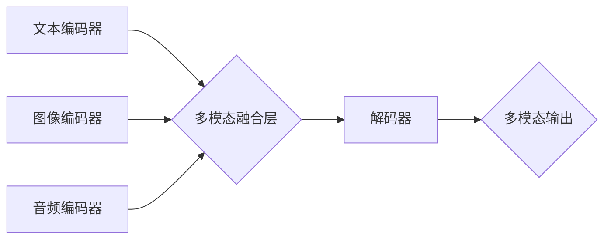

> 多模态大模型、提示学习、指令微调、自然语言处理、计算机视觉、音频处理、跨模态理解、模型训练、应用场景

## 1. 背景介绍

近年来，人工智能领域取得了令人瞩目的进展，其中大模型的涌现尤为引人注目。大模型凭借其强大的学习能力和泛化能力，在自然语言处理、计算机视觉、音频处理等领域取得了突破性成果。然而，传统的单模态大模型仅处理一种类型的输入数据，例如文本或图像，难以捕捉跨模态之间的复杂关系。

多模态大模型 (Multimodal Large Models, MMLMs) 应运而生，旨在融合多种模态数据，例如文本、图像、音频等，实现跨模态理解和生成。MMLMs 能够学习不同模态之间的语义关联，从而更好地理解和生成真实世界的复杂信息。

## 2. 核心概念与联系

**2.1 核心概念**

* **多模态数据:** 指包含多种类型数据的集合，例如文本、图像、音频、视频等。
* **跨模态理解:** 指理解不同模态数据之间的关系和关联，例如从图像中提取文本描述，或从文本中生成相应的图像。
* **多模态生成:** 指根据多种模态输入生成新的多模态输出，例如根据文本和图像生成视频，或根据音频生成文本和图像。

**2.2 架构图**



**2.3 联系**

MMLMs 通常由三个主要部分组成：

* **模态编码器:** 负责将不同模态数据编码成相应的向量表示。
* **多模态融合层:** 负责将不同模态的向量表示融合在一起，形成一个综合的表示。
* **解码器:** 负责根据融合后的表示生成最终的多模态输出。

## 3. 核心算法原理 & 具体操作步骤

**3.1 算法原理概述**

MMLMs 的训练目标是学习不同模态之间的语义关联，并能够根据输入的多模态数据生成相应的输出。常用的训练方法包括：

* **自监督学习:** 利用大量的未标记数据进行训练，例如通过预测图像中的文本描述或文本中的图像标签。
* **半监督学习:** 利用少量标记数据和大量的未标记数据进行训练，例如通过将标记数据用于监督学习，并将未标记数据用于自监督学习。
* **强化学习:** 利用奖励机制训练模型，例如通过奖励模型生成准确的文本描述或图像。

**3.2 算法步骤详解**

1. **数据预处理:** 将多模态数据进行预处理，例如文本分词、图像裁剪、音频降噪等。
2. **模态编码:** 使用不同的编码器将不同模态数据编码成相应的向量表示。
3. **多模态融合:** 使用融合层将不同模态的向量表示融合在一起，形成一个综合的表示。
4. **解码:** 使用解码器根据融合后的表示生成最终的多模态输出。
5. **损失函数:** 使用损失函数衡量模型的预测结果与真实值的差异。
6. **模型优化:** 使用优化算法更新模型参数，降低损失函数的值。

**3.3 算法优缺点**

* **优点:**

    * 能够学习不同模态之间的语义关联，实现跨模态理解和生成。
    * 能够处理多种类型的输入数据，例如文本、图像、音频等。
    * 具有强大的泛化能力，能够应用于多种实际场景。

* **缺点:**

    * 训练成本高，需要大量的计算资源和数据。
    * 模型复杂度高，难以理解和调试。
    * 跨模态融合的难度较大，需要设计有效的融合策略。

**3.4 算法应用领域**

* **图像字幕生成:** 根据图像生成相应的文本描述。
* **文本到图像生成:** 根据文本生成相应的图像。
* **视频理解:** 理解视频内容，例如识别人物、场景和事件。
* **多模态对话系统:** 建立能够理解和生成多种模态数据的对话系统。
* **医疗诊断:** 根据患者的图像和病历信息进行诊断。

## 4. 数学模型和公式 & 详细讲解 & 举例说明

**4.1 数学模型构建**

MMLMs 通常使用 Transformer 架构，其核心是注意力机制，能够学习不同模态数据之间的长距离依赖关系。

**4.2 公式推导过程**

注意力机制的计算公式如下：

$$
Attention(Q, K, V) = softmax(\frac{QK^T}{\sqrt{d_k}})V
$$

其中：

* $Q$：查询矩阵
* $K$：键矩阵
* $V$：值矩阵
* $d_k$：键向量的维度
* $softmax$：softmax 函数

**4.3 案例分析与讲解**

例如，在图像字幕生成任务中，文本编码器将文本序列编码成向量表示，图像编码器将图像编码成向量表示。然后，注意力机制将文本向量和图像向量进行融合，学习图像和文本之间的语义关联。最后，解码器根据融合后的表示生成相应的文本描述。

## 5. 项目实践：代码实例和详细解释说明

**5.1 开发环境搭建**

* Python 3.7+
* PyTorch 1.7+
* CUDA 10.2+

**5.2 源代码详细实现**

```python
import torch
import torch.nn as nn

class MultimodalFusionLayer(nn.Module):
    def __init__(self, text_dim, image_dim):
        super(MultimodalFusionLayer, self).__init__()
        self.text_proj = nn.Linear(text_dim, text_dim)
        self.image_proj = nn.Linear(image_dim, image_dim)
        self.fusion_proj = nn.Linear(text_dim + image_dim, text_dim)

    def forward(self, text_embedding, image_embedding):
        text_embedding = self.text_proj(text_embedding)
        image_embedding = self.image_proj(image_embedding)
        fused_embedding = torch.cat((text_embedding, image_embedding), dim=-1)
        fused_embedding = self.fusion_proj(fused_embedding)
        return fused_embedding

# ... 其他代码 ...
```

**5.3 代码解读与分析**

* `MultimodalFusionLayer` 类定义了一个多模态融合层，它将文本和图像的向量表示进行融合。
* `text_proj` 和 `image_proj` 是两个线性变换层，用于对文本和图像的向量表示进行投影。
* `fusion_proj` 是一个线性变换层，用于将投影后的文本和图像向量表示进行融合。

**5.4 运行结果展示**

通过训练 MMLM 模型，可以实现图像字幕生成、文本到图像生成等多模态任务。

## 6. 实际应用场景

**6.1 图像字幕生成**

MMLMs 可以用于自动生成图像的文本描述，例如为盲人生成图像描述，或为搜索引擎提供图像的文本标签。

**6.2 文本到图像生成**

MMLMs 可以根据文本描述生成相应的图像，例如根据用户输入的文本描述生成一张图片，或根据故事文本生成相应的图像序列。

**6.3 视频理解**

MMLMs 可以用于理解视频内容，例如识别视频中的人物、场景和事件，或生成视频的文本摘要。

**6.4 多模态对话系统**

MMLMs 可以用于构建能够理解和生成多种模态数据的对话系统，例如能够理解文本和语音输入，并生成文本和语音输出的对话系统。

**6.5 未来应用展望**

MMLMs 具有广泛的应用前景，例如：

* **增强现实 (AR) 和虚拟现实 (VR):** 为 AR 和 VR 应用生成多模态内容，例如根据用户输入生成虚拟场景或虚拟物品。
* **教育和培训:** 为教育和培训应用生成多模态内容，例如生成交互式学习材料或虚拟导师。
* **医疗保健:** 用于辅助医疗诊断、治疗方案设计和患者教育。
* **艺术创作:** 用于辅助艺术家创作多模态艺术作品，例如生成音乐、绘画和雕塑。

## 7. 工具和资源推荐

**7.1 学习资源推荐**

* **论文:**

    * "BERT: Pre-training of Deep Bidirectional Transformers for Language Understanding"
    * "Vision Transformer"
    * "DALL-E: Creating Images from Text"

* **博客:**

    * OpenAI Blog
    * Google AI Blog
    * Hugging Face Blog

**7.2 开发工具推荐**

* **PyTorch:** 深度学习框架
* **TensorFlow:** 深度学习框架
* **Hugging Face Transformers:** 预训练模型库

**7.3 相关论文推荐**

* "Exploring the Limits of Transfer Learning with a Unified Text-to-Image Transformer"
* "CLIP: Connecting Text and Images"
* "MAE: Masked Autoencoders Are Scalable Vision Learners"

## 8. 总结：未来发展趋势与挑战

**8.1 研究成果总结**

近年来，MMLMs 取得了显著进展，在跨模态理解和生成任务上取得了突破性成果。

**8.2 未来发展趋势**

* **模型规模和能力的提升:** 随着计算资源的不断发展，MMLMs 的规模和能力将进一步提升，能够处理更复杂的多模态数据。
* **跨模态知识的共享和迁移:** 研究如何更好地共享和迁移不同模态之间的知识，提高模型的泛化能力。
* **多模态数据生成:** 研究如何生成高质量的多模态数据，用于训练和评估 MMLMs。

**8.3 面临的挑战**

* **数据标注成本高:** 多模态数据的标注成本很高，这限制了 MMLMs 的训练规模和性能。
* **跨模态融合的难度:** 不同模态数据的表示方式不同，跨模态融合的难度较大。
* **模型解释性和可解释性:** MMLMs 的模型结构复杂，难以理解和解释模型的决策过程。

**8.4 研究展望**

未来，MMLMs 将在更多领域得到应用，例如医疗保健、教育、艺术创作等。研究者将继续探索 MMLMs 的新应用场景，并解决 MMLMs 面临的挑战，推动 MMLMs 的发展。

## 9. 附录：常见问题与解答

**9.1 如何选择合适的 MMLM 模型？**

选择合适的 MMLM 模型取决于具体的应用场景和数据特点。例如，对于图像字幕生成任务，可以选择预训练的 CLIP 模型；对于文本到图像生成任务，可以选择 DALL-E 模型。

**9.2 如何训练 MMLM 模型？**

训练 MMLM 模型需要大量的计算资源和数据。可以使用预训练的模型进行微调，也可以从头开始训练。

**9.3 如何评估 MMLM 模型的性能？**

MMLM 模型的性能可以根据具体的应用场景进行评估。例如，对于图像字幕生成任务，可以使用 BLEU 分数进行评估；对于文本到图像生成任务，可以使用 FID 分数进行评估。


作者：禅与计算机程序设计艺术 / Zen and the Art of Computer Programming 
<end_of_turn>