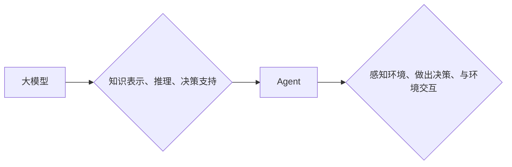

> 大模型，Agent，人工智能，机器学习，自然语言处理，强化学习，决策，交互

## 1. 背景介绍

近年来，人工智能（AI）领域取得了令人瞩目的进展，其中大模型和Agent技术扮演着越来越重要的角色。大模型，指的是拥有庞大参数规模的深度学习模型，例如GPT-3、BERT、LaMDA等，它们在自然语言处理、图像识别、代码生成等领域展现出强大的能力。Agent则是一种能够感知环境、做出决策并与环境交互的智能体。

大模型和Agent的结合，为构建更智能、更具自主性的AI系统提供了新的可能性。大模型可以为Agent提供丰富的知识和理解能力，而Agent则可以利用大模型的输出进行决策和行动，从而实现更复杂的智能行为。

## 2. 核心概念与联系

### 2.1 大模型

大模型是指参数数量庞大的深度学习模型，通常拥有数十亿甚至数千亿个参数。它们通过海量数据进行训练，学习到复杂的模式和关系，从而能够执行各种复杂的任务，例如：

* **自然语言理解和生成:** 翻译、摘要、问答、对话等。
* **图像识别和生成:** 图像分类、物体检测、图像生成等。
* **代码生成和理解:** 代码自动补全、代码翻译、代码错误修复等。

### 2.2 Agent

Agent是一种能够感知环境、做出决策并与环境交互的智能体。它通常具有以下特征：

* **感知能力:** 能够感知环境中的信息，例如传感器数据、文本信息、图像信息等。
* **决策能力:** 能够根据感知到的信息做出决策，选择最优的行动。
* **行动能力:** 能够与环境进行交互，执行决策结果。
* **学习能力:** 能够从经验中学习，不断改进决策策略。

### 2.3 大模型与Agent的关系

大模型可以为Agent提供强大的知识和理解能力，而Agent则可以利用大模型的输出进行决策和行动。

**大模型为Agent提供以下支持:**

* **知识表示:** 大模型可以学习到丰富的知识，并将其表示为可供Agent理解的形式，例如知识图谱、语义网络等。
* **推理和决策支持:** 大模型可以根据Agent的输入信息进行推理和决策支持，提供多种选择方案和评估结果。
* **自然语言交互:** 大模型可以实现自然语言交互，使Agent能够与人类进行更自然的沟通。

**Agent利用大模型进行以下操作:**

* **信息获取:** Agent可以利用大模型从文本、图像等数据中获取所需信息。
* **决策制定:** Agent可以利用大模型的推理和决策支持功能，制定最优的行动策略。
* **行动执行:** Agent可以利用大模型生成的文本、代码等输出，执行相应的行动。

**Mermaid 流程图:**



## 3. 核心算法原理 & 具体操作步骤

### 3.1 算法原理概述

大模型与Agent的结合主要涉及以下核心算法：

* **深度学习:** 用于训练大模型，学习复杂的模式和关系。
* **强化学习:** 用于训练Agent，使其能够学习最优的决策策略。
* **自然语言处理:** 用于实现大模型与Agent之间的自然语言交互。

### 3.2 算法步骤详解

1. **大模型训练:** 使用海量数据训练深度学习模型，使其能够完成预设的任务，例如文本生成、图像识别等。
2. **Agent设计:** 设计Agent的架构和行为策略，例如使用强化学习算法训练Agent，使其能够在特定环境中做出最优决策。
3. **知识表示:** 将大模型学习到的知识表示为Agent可以理解的形式，例如知识图谱、语义网络等。
4. **交互机制:** 设计Agent与大模型之间的交互机制，例如Agent向大模型提出问题，获取所需信息；Agent根据大模型的输出进行决策。
5. **环境模拟:** 建立Agent所处的环境模拟，以便Agent可以进行训练和测试。

### 3.3 算法优缺点

**优点:**

* **强大的知识和理解能力:** 大模型可以为Agent提供丰富的知识和理解能力，使其能够完成更复杂的任务。
* **自主性和适应性:** 强化学习算法可以使Agent具有自主性和适应性，使其能够在不断变化的环境中做出最优决策。
* **自然语言交互:** 自然语言处理技术可以使Agent与人类进行更自然的沟通。

**缺点:**

* **训练成本高:** 大模型的训练需要大量的计算资源和时间。
* **数据依赖性:** 大模型的性能依赖于训练数据的质量和数量。
* **可解释性差:** 大模型的决策过程往往难以解释，这可能导致信任问题。

### 3.4 算法应用领域

大模型与Agent的结合在以下领域具有广泛的应用前景:

* **机器人:** 构建更智能、更具自主性的机器人，例如自动驾驶汽车、服务机器人等。
* **医疗保健:** 辅助医生诊断疾病、制定治疗方案、提供个性化医疗服务等。
* **教育:** 提供个性化学习体验、智能辅导、自动批改作业等。
* **金融:** 进行风险评估、欺诈检测、投资决策等。

## 4. 数学模型和公式 & 详细讲解 & 举例说明

### 4.1 数学模型构建

大模型与Agent的结合可以抽象为一个马尔可夫决策过程（MDP）。

* **状态空间:** Agent所处的环境状态，例如机器人位置、游戏场景等。
* **动作空间:** Agent可以执行的动作，例如移动、攻击、对话等。
* **奖励函数:** 评估Agent动作的优劣，例如获得分数、完成任务等。
* **转移概率:** 描述Agent执行某个动作后状态转移的概率。

### 4.2 公式推导过程

强化学习算法的目标是找到一个最优的策略，使得Agent在MDP中获得最大的累积奖励。常用的强化学习算法包括Q学习、SARSA等。

**Q学习算法:**

$$Q(s,a) = Q(s,a) + \alpha [r + \gamma \max_{a'} Q(s',a') - Q(s,a)]$$

其中:

* $Q(s,a)$: Agent在状态$s$执行动作$a$的价值函数。
* $\alpha$: 学习率。
* $r$: 在状态$s$执行动作$a$后获得的奖励。
* $\gamma$: 折扣因子。
* $s'$: 执行动作$a$后进入的状态。
* $a'$: 在状态$s'$执行的动作。

### 4.3 案例分析与讲解

例如，训练一个机器人玩游戏，我们可以将游戏环境作为MDP，机器人动作包括向上、向下、向左、向右移动，奖励函数为获得分数，转移概率为机器人移动到不同位置的概率。

使用Q学习算法，机器人可以学习到在不同状态下执行不同动作的价值，从而找到最优的策略，获得更高的分数。

## 5. 项目实践：代码实例和详细解释说明

### 5.1 开发环境搭建

* Python 3.x
* TensorFlow 或 PyTorch 深度学习框架
* OpenAI Gym 或其他强化学习环境

### 5.2 源代码详细实现

```python
import gym
import tensorflow as tf

# 定义Q网络
class QNetwork(tf.keras.Model):
    def __init__(self):
        super(QNetwork, self).__init__()
        self.dense1 = tf.keras.layers.Dense(64, activation='relu')
        self.dense2 = tf.keras.layers.Dense(64, activation='relu')
        self.output = tf.keras.layers.Dense(4)

    def call(self, state):
        x = self.dense1(state)
        x = self.dense2(x)
        return self.output(x)

# 定义Q学习算法
def q_learning(env, q_network, alpha=0.1, gamma=0.99, epsilon=0.1):
    # ...

# 创建环境和Q网络
env = gym.make('CartPole-v1')
q_network = QNetwork()

# 训练Q网络
q_learning(env, q_network)

# 测试训练好的Q网络
# ...
```

### 5.3 代码解读与分析

* QNetwork类定义了Q网络的结构，包括两个全连接层和一个输出层。
* q_learning函数实现了Q学习算法的核心逻辑，包括状态更新、奖励更新、策略更新等。
* 代码中使用OpenAI Gym环境CartPole-v1进行训练和测试。

### 5.4 运行结果展示

训练完成后，可以将训练好的Q网络应用于CartPole-v1环境，观察机器人能够持续平衡木杆的时间。

## 6. 实际应用场景

### 6.1 智能客服

大模型可以为智能客服提供丰富的知识库和自然语言理解能力，使客服能够更准确地理解用户需求，并提供更有效的帮助。

### 6.2 个性化推荐

大模型可以根据用户的历史行为和偏好，学习到用户的兴趣，并推荐个性化的商品、服务或内容。

### 6.3 自动化办公

大模型可以帮助自动化办公任务，例如自动回复邮件、整理文档、安排会议等，提高工作效率。

### 6.4 未来应用展望

随着大模型和Agent技术的不断发展，其应用场景将更加广泛，例如：

* **自动驾驶:** 构建更智能、更安全的自动驾驶系统。
* **医疗诊断:** 辅助医生进行疾病诊断，提高诊断准确率。
* **个性化教育:** 提供个性化的学习体验，帮助学生更好地掌握知识。

## 7. 工具和资源推荐

### 7.1 学习资源推荐

* **书籍:**
    * 《深度学习》
    * 《强化学习：原理、算法和应用》
* **在线课程:**
    * Coursera: 深度学习
    * Udacity: 强化学习
* **博客和论坛:**
    * TensorFlow博客
    * PyTorch博客
    * Reddit: r/MachineLearning

### 7.2 开发工具推荐

* **深度学习框架:** TensorFlow, PyTorch
* **强化学习库:** OpenAI Gym, Stable Baselines3
* **自然语言处理库:** NLTK, SpaCy

### 7.3 相关论文推荐

* **大模型:**
    * Attention Is All You Need
    * BERT: Pre-training of Deep Bidirectional Transformers for Language Understanding
* **Agent:**
    * Deep Reinforcement Learning: An Overview
    * Proximal Policy Optimization Algorithms

## 8. 总结：未来发展趋势与挑战

### 8.1 研究成果总结

大模型与Agent技术的结合取得了显著进展，为构建更智能、更具自主性的AI系统提供了新的可能性。

### 8.2 未来发展趋势

* **模型规模和能力的提升:** 大模型的规模和能力将继续提升，能够处理更复杂的任务。
* **多模态学习:** 大模型将能够处理多种模态数据，例如文本、图像、音频等，实现更全面的理解和交互。
* **可解释性和安全性:** 研究将更加注重大模型的可解释性和安全性，使其能够更好地被人类理解和信任。

### 8.3 面临的挑战

* **训练成本高:** 大模型的训练需要大量的计算资源和时间，这仍然是一个挑战。
* **数据依赖性:** 大模型的性能依赖于训练数据的质量和数量，数据获取和标注仍然是一个难题。
* **伦理和社会影响:** 大模型的应用可能带来伦理和社会问题，例如偏见、隐私、失业等，需要引起重视和研究。

### 8.4 研究展望

未来，大模型与Agent技术的融合将继续深入发展，为人类社会带来更多福祉。

## 9. 附录：常见问题与解答

* **Q: 大模型和Agent有什么区别？**

* **A:** 大模型是拥有庞大参数规模的深度学习模型，而Agent是一种能够感知环境、做出决策并与环境交互的智能体。

* **Q: 如何训练