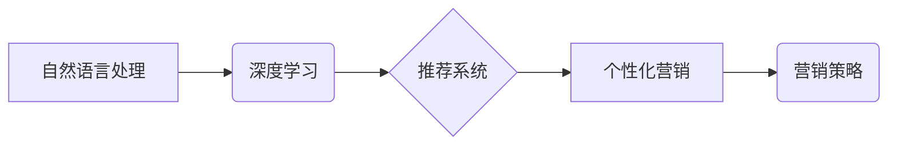

> 大模型、营销策略、自然语言处理、深度学习、推荐系统、个性化营销、客户关系管理

## 1. 背景介绍

在当今数据爆炸的时代，营销领域面临着前所未有的机遇和挑战。传统营销模式越来越难以满足消费者日益个性化的需求。而大模型的出现，为营销领域带来了革命性的变革。大模型，是指参数规模庞大、训练数据海量的人工智能模型，具备强大的泛化能力和学习能力，能够理解和生成人类语言，并进行复杂的逻辑推理。

大模型在营销领域应用的潜力巨大，可以帮助企业实现以下目标：

* **精准营销：** 通过分析用户数据，大模型可以精准识别目标客户群体，并根据他们的兴趣、需求和行为习惯，制定个性化的营销策略。
* **内容创作：** 大模型可以自动生成高质量的营销文案、广告创意、社交媒体内容等，提高营销效率。
* **客户服务：** 大模型可以搭建智能客服系统，24小时在线解答客户疑问，提高客户满意度。
* **市场洞察：** 大模型可以分析海量市场数据，挖掘潜在的市场趋势和客户需求，为企业决策提供支持。

## 2. 核心概念与联系

大模型在营销领域的应用主要基于以下核心概念：

* **自然语言处理 (NLP)：** 大模型可以理解和生成人类语言，这使得它们能够与客户进行自然流畅的对话，并分析用户反馈信息。
* **深度学习 (DL)：** 深度学习算法是训练大模型的关键技术，能够从海量数据中学习复杂的模式和关系。
* **推荐系统：** 推荐系统可以根据用户的历史行为和偏好，推荐他们可能感兴趣的产品或服务，提高转化率。
* **个性化营销：** 个性化营销是指根据用户的不同需求和特征，提供定制化的产品和服务，提升客户体验。

**核心概念架构图:**



## 3. 核心算法原理 & 具体操作步骤

### 3.1  算法原理概述

大模型在营销领域的应用主要基于以下核心算法：

* **Transformer模型:** Transformer模型是一种基于注意力机制的深度学习模型，能够有效处理序列数据，例如文本。它在自然语言处理领域取得了突破性的进展，被广泛应用于机器翻译、文本摘要、问答系统等任务。
* **BERT模型:** BERT模型是一种基于Transformer模型的预训练语言模型，通过在大量的文本数据上进行预训练，能够理解上下文信息，并进行更精准的文本分析。
* **Recurrent Neural Networks (RNN):** RNN模型是一种能够处理序列数据的深度学习模型，能够捕捉文本中的时间依赖关系。

### 3.2  算法步骤详解

**以BERT模型为例，其在营销领域的应用步骤如下：**

1. **数据预处理:** 收集和清洗营销相关的文本数据，例如客户评论、产品描述、广告文案等。
2. **模型训练:** 使用BERT模型进行预训练，训练模型能够理解文本语义和上下文信息。
3. **模型微调:** 将预训练好的BERT模型微调到特定的营销任务，例如客户情感分析、广告创意生成等。
4. **模型部署:** 将微调后的模型部署到生产环境中，用于实际的营销应用。

### 3.3  算法优缺点

**Transformer模型和BERT模型的优缺点:**

**优点:**

* 能够处理长序列数据，捕捉文本中的长距离依赖关系。
* 具有强大的语义理解能力，能够理解上下文信息。
* 在自然语言处理任务中取得了优异的性能。

**缺点:**

* 计算复杂度高，训练成本高。
* 对训练数据质量要求高，需要大量的标注数据。

### 3.4  算法应用领域

* **客户情感分析:** 分析客户评论、社交媒体帖子等文本数据，识别客户的情感倾向，帮助企业了解客户需求和满意度。
* **广告创意生成:** 根据目标客户群体和产品特点，自动生成吸引人的广告文案和创意。
* **内容推荐:** 根据用户的兴趣和行为习惯，推荐他们可能感兴趣的新闻、文章、产品等。
* **智能客服:** 搭建智能客服系统，自动回复客户常见问题，提高客户服务效率。

## 4. 数学模型和公式 & 详细讲解 & 举例说明

### 4.1  数学模型构建

在营销领域，大模型的应用通常涉及到以下数学模型：

* **线性回归模型:** 用于预测连续型变量，例如客户购买概率、广告点击率等。
* **逻辑回归模型:** 用于预测分类型变量，例如客户是否会购买产品、广告是否有效等。
* **支持向量机 (SVM):** 用于分类和回归任务，能够在高维空间中找到最佳的分隔超平面。

### 4.2  公式推导过程

**以线性回归模型为例，其目标函数为：**

$$
\min_{\theta} \frac{1}{2} \sum_{i=1}^{n} (y_i - \theta^T x_i)^2 + \lambda \|\theta\|^2
$$

其中：

* $\theta$ 是模型参数向量。
* $x_i$ 是第 $i$ 个样本的特征向量。
* $y_i$ 是第 $i$ 个样本的真实值。
* $\lambda$ 是正则化参数，用于防止模型过拟合。

### 4.3  案例分析与讲解

**假设我们想要预测客户的购买概率，可以使用线性回归模型。**

* 特征向量 $x_i$ 可以包含客户的年龄、性别、收入、购买历史等信息。
* 真实值 $y_i$ 是客户是否购买产品的二元变量 (0 或 1)。

通过训练线性回归模型，我们可以得到模型参数 $\theta$，并使用该模型预测新客户的购买概率。

## 5. 项目实践：代码实例和详细解释说明

### 5.1  开发环境搭建

* Python 3.x
* TensorFlow 或 PyTorch 深度学习框架
* Numpy、Pandas 等数据处理库

### 5.2  源代码详细实现

```python
import tensorflow as tf

# 定义模型结构
model = tf.keras.Sequential([
    tf.keras.layers.Embedding(input_dim=vocab_size, output_dim=embedding_dim),
    tf.keras.layers.LSTM(units=128),
    tf.keras.layers.Dense(units=1, activation='sigmoid')
])

# 编译模型
model.compile(optimizer='adam', loss='binary_crossentropy', metrics=['accuracy'])

# 训练模型
model.fit(x_train, y_train, epochs=10, batch_size=32)

# 评估模型
loss, accuracy = model.evaluate(x_test, y_test)
print('Loss:', loss)
print('Accuracy:', accuracy)
```

### 5.3  代码解读与分析

* **Embedding层:** 将单词转换为稠密的向量表示。
* **LSTM层:** 处理文本序列数据，捕捉文本中的时间依赖关系。
* **Dense层:** 全连接层，用于输出预测结果。
* **Adam优化器:** 用于更新模型参数。
* **Binary cross-entropy损失函数:** 用于二分类任务的损失函数。

### 5.4  运行结果展示

训练完成后，我们可以使用模型预测新客户的购买概率。

## 6. 实际应用场景

### 6.1  精准营销

大模型可以分析客户的购买历史、浏览记录、社交媒体行为等数据，构建客户画像，并根据客户画像进行精准营销。例如，可以根据客户的兴趣爱好推荐相关的产品，或者根据客户的消费习惯发送个性化的促销信息。

### 6.2  内容创作

大模型可以自动生成营销文案、广告创意、社交媒体内容等，提高营销效率。例如，可以根据产品的特点和目标客户群体，自动生成吸引人的广告文案，或者根据用户的兴趣爱好，自动生成个性化的社交媒体内容。

### 6.3  客户服务

大模型可以搭建智能客服系统，24小时在线解答客户疑问，提高客户满意度。例如，可以利用大模型训练一个能够理解客户问题的智能客服机器人，自动回复客户常见问题，并引导客户解决问题。

### 6.4  未来应用展望

随着大模型技术的不断发展，其在营销领域的应用将更加广泛和深入。例如，未来可能出现以下应用场景：

* **个性化产品推荐:** 根据用户的个性化需求，自动生成定制化的产品推荐。
* **虚拟营销助手:** 利用大模型构建虚拟营销助手，帮助企业进行市场调研、客户沟通、营销活动策划等工作。
* **营销策略优化:** 利用大模型分析市场数据，为企业提供更精准的营销策略建议。

## 7. 工具和资源推荐

### 7.1  学习资源推荐

* **斯坦福大学 CS224N 自然语言处理课程:** https://web.stanford.edu/class/cs224n/
* **Hugging Face Transformers库:** https://huggingface.co/docs/transformers/index
* **TensorFlow官方文档:** https://www.tensorflow.org/

### 7.2  开发工具推荐

* **Jupyter Notebook:** https://jupyter.org/
* **Google Colab:** https://colab.research.google.com/
* **PyCharm:** https://www.jetbrains.com/pycharm/

### 7.3  相关论文推荐

* **BERT: Pre-training of Deep Bidirectional Transformers for Language Understanding:** https://arxiv.org/abs/1810.04805
* **Attention Is All You Need:** https://arxiv.org/abs/1706.03762

## 8. 总结：未来发展趋势与挑战

### 8.1  研究成果总结

大模型在营销领域的应用取得了显著的成果，例如精准营销、内容创作、客户服务等方面都取得了突破性的进展。

### 8.2  未来发展趋势

未来，大模型在营销领域的应用将更加智能化、个性化和自动化。例如，将出现更加精准的客户画像、更加个性化的营销内容、更加智能的营销助手等。

### 8.3  面临的挑战

大模型在营销领域的应用也面临着一些挑战，例如：

* **数据隐私和安全:** 大模型需要大量的数据进行训练，如何保护用户数据隐私和安全是一个重要的挑战。
* **模型解释性和可信度:** 大模型的决策过程往往是复杂的，难以解释，如何提高模型的解释性和可信度是一个重要的研究方向。
* **模型公平性和偏见:** 大模型可能会受到训练数据中的偏见影响，导致不公平的结果，如何保证模型的公平性和公正性是一个重要的挑战。

### 8.4  研究展望

未来，需要进一步研究大模型在营销领域的应用，解决上述挑战，并探索新的应用场景。例如，可以研究如何利用大模型进行更精准的市场预测、更有效的营销策略优化等。

## 9. 附录：常见问题与解答

**Q1: 大模型的训练成本很高吗？**

A1: 确实，大模型的训练成本较高，需要大量的计算资源和时间。但是，随着计算技术的进步和开源模型的普及，大模型的训练成本正在逐渐降低。

**Q2: 如何评估大模型的性能？**

A2: 大模型的性能评估需要根据具体的应用场景进行。例如，对于文本分类任务，可以使用准确率、召回率、F1-score等指标进行评估；对于推荐系统，可以使用点击率、转化率等指标进行评估。

**Q3: 如何防止大模型出现偏见？**

A3: 为了防止大模型出现偏见，需要从以下几个方面进行努力：

* 使用更加公平、更加多样化的训练数据。
* 在模型训练过程中，加入公平性约束。
* 对模型的输出结果进行监控和评估，及时发现和解决偏见问题。


作者：禅与计算机程序设计艺术 / Zen and the Art of Computer Programming 
<end_of_turn>