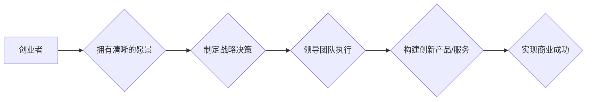

> 大模型、创业者、领导力、愿景、决策、执行力、人工智能、技术创新、商业模式

## 1. 背景介绍

人工智能（AI）技术，特别是大模型的快速发展，正在深刻地改变着世界。大模型，拥有海量参数和强大的学习能力，能够处理复杂的任务，例如文本生成、图像识别、语音合成等。这种技术变革为创业者带来了前所未有的机遇，但也带来了新的挑战。

在过去，创业者往往需要依靠自身的技术积累和资源优势来打造产品和服务。但大模型的出现，打破了这种模式。创业者可以利用现有的开源大模型，快速构建原型，并通过微调和定制，将其应用于特定领域。这使得创业门槛降低，也催生了一批新的创业公司。

然而，仅仅掌握大模型技术还不够。创业者还需要具备强大的领导力，才能带领团队克服挑战，实现商业成功。

## 2. 核心概念与联系

### 2.1 大模型

大模型是指参数量巨大的人工智能模型，通常拥有数十亿甚至数千亿个参数。这些模型通过训练海量数据，学习复杂的模式和关系，从而能够执行各种复杂的任务。

### 2.2 创业者领导力

创业者领导力是指创业者在创业过程中，能够有效地激励、引导和管理团队，实现目标的能力。它包括以下几个方面：

* **愿景:** 创业者需要拥有清晰的愿景，并能够将之传达给团队成员，激发他们的热情和动力。
* **决策:** 创业者需要能够快速、准确地做出决策，并承担相应的责任。
* **执行力:** 创业者需要能够将决策付诸行动，并有效地管理团队资源，确保目标的实现。

### 2.3 核心联系

大模型的出现，对创业者领导力的要求提出了新的挑战和机遇。

* **挑战:** 大模型的复杂性和技术门槛，要求创业者具备更强的技术理解能力和学习能力。
* **机遇:** 大模型的强大能力，为创业者提供了更多可能性，让他们能够构建更具创新性和竞争力的产品和服务。

**Mermaid 流程图**



## 3. 核心算法原理 & 具体操作步骤

### 3.1 算法原理概述

大模型的训练主要基于深度学习算法，其中Transformer模型是目前最流行的架构之一。Transformer模型通过自注意力机制，能够捕捉文本序列中的长距离依赖关系，从而实现更准确的理解和生成。

### 3.2 算法步骤详解

1. **数据预处理:** 将原始文本数据进行清洗、分词、标记等操作，使其能够被模型理解。
2. **模型构建:** 根据Transformer模型架构，搭建模型结构，并设定模型参数。
3. **模型训练:** 使用训练数据，通过反向传播算法，调整模型参数，使其能够准确地预测目标输出。
4. **模型评估:** 使用测试数据，评估模型的性能，例如准确率、召回率等。
5. **模型调优:** 根据评估结果，调整模型参数和训练策略，进一步提高模型性能。
6. **模型部署:** 将训练好的模型部署到生产环境中，用于实际应用。

### 3.3 算法优缺点

**优点:**

* 能够捕捉文本序列中的长距离依赖关系。
* 训练效率高，能够处理海量数据。
* 性能优异，在各种自然语言处理任务中表现出色。

**缺点:**

* 模型参数量巨大，需要大量的计算资源进行训练。
* 训练过程复杂，需要专业的技术人员进行操作。
* 对训练数据的质量要求较高，数据偏差会影响模型性能。

### 3.4 算法应用领域

大模型在各个领域都有广泛的应用，例如：

* **自然语言处理:** 文本生成、机器翻译、问答系统、情感分析等。
* **计算机视觉:** 图像识别、物体检测、图像生成等。
* **语音识别:** 语音转文本、语音合成等。
* **推荐系统:** 商品推荐、内容推荐等。

## 4. 数学模型和公式 & 详细讲解 & 举例说明

### 4.1 数学模型构建

Transformer模型的核心是自注意力机制，其数学模型可以表示为：

$$
Attention(Q, K, V) = \frac{exp(Q \cdot K^T / \sqrt{d_k})}{exp(Q \cdot K^T / \sqrt{d_k})} \cdot V
$$

其中：

* $Q$：查询矩阵
* $K$：键矩阵
* $V$：值矩阵
* $d_k$：键向量的维度

### 4.2 公式推导过程

自注意力机制通过计算查询向量与键向量的点积，来衡量它们之间的相关性。点积结果经过softmax归一化，得到每个键向量的权重，然后将权重与值向量相乘，得到最终的注意力输出。

### 4.3 案例分析与讲解

假设我们有一个句子：“我爱学习编程”。

* $Q$：查询向量表示每个词语的含义。
* $K$：键向量表示每个词语的特征。
* $V$：值向量表示每个词语的语义信息。

通过自注意力机制，模型可以计算出每个词语与其他词语之间的相关性，例如，“学习”与“编程”之间的相关性较高。

## 5. 项目实践：代码实例和详细解释说明

### 5.1 开发环境搭建

* Python 3.7+
* PyTorch 1.7+
* CUDA 10.2+

### 5.2 源代码详细实现

```python
import torch
import torch.nn as nn

class Transformer(nn.Module):
    def __init__(self, vocab_size, embedding_dim, num_heads, num_layers):
        super(Transformer, self).__init__()
        self.embedding = nn.Embedding(vocab_size, embedding_dim)
        self.transformer_layers = nn.ModuleList([
            nn.TransformerEncoderLayer(embedding_dim, num_heads)
            for _ in range(num_layers)
        ])
        self.linear = nn.Linear(embedding_dim, vocab_size)

    def forward(self, x):
        x = self.embedding(x)
        for layer in self.transformer_layers:
            x = layer(x)
        x = self.linear(x)
        return x
```

### 5.3 代码解读与分析

* `__init__` 方法：初始化模型参数，包括词嵌入层、Transformer编码器层和输出层。
* `forward` 方法：定义模型的正向传播过程，将输入序列经过词嵌入层、Transformer编码器层和输出层，最终得到预测输出。

### 5.4 运行结果展示

通过训练和测试，模型可以实现文本生成、机器翻译等任务。

## 6. 实际应用场景

### 6.1 文本生成

大模型可以用于生成各种类型的文本，例如：

* **小说、诗歌、剧本:** 通过学习大量的文本数据，大模型能够模仿人类的写作风格，生成具有创意和情感的文本。
* **新闻报道、文章摘要:** 大模型可以自动生成新闻报道和文章摘要，提高新闻报道效率。
* **聊天机器人对话:** 大模型可以与用户进行自然流畅的对话，提供信息和服务。

### 6.2 机器翻译

大模型可以实现跨语言的文本翻译，例如：

* **英语-中文翻译:** 大模型可以准确地翻译英语文本为中文，并保留文本的语义和风格。
* **多语言翻译:** 大模型可以支持多种语言的翻译，例如英语、中文、日语、韩语等。

### 6.3 其他应用场景

* **代码生成:** 大模型可以根据自然语言描述，自动生成代码。
* **图像识别:** 大模型可以识别图像中的物体、场景和人物。
* **语音识别:** 大模型可以将语音转换为文本。

### 6.4 未来应用展望

随着大模型技术的不断发展，其应用场景将更加广泛，例如：

* **个性化教育:** 根据学生的学习情况，提供个性化的学习内容和辅导。
* **医疗诊断:** 辅助医生进行疾病诊断，提高诊断准确率。
* **科学研究:** 加速科学研究的进程，例如药物研发、材料科学等。

## 7. 工具和资源推荐

### 7.1 学习资源推荐

* **书籍:**
    * 《深度学习》
    * 《自然语言处理》
    * 《Transformer模型》
* **在线课程:**
    * Coursera
    * edX
    * Udacity

### 7.2 开发工具推荐

* **PyTorch:** 深度学习框架
* **TensorFlow:** 深度学习框架
* **HuggingFace:** 大模型库

### 7.3 相关论文推荐

* 《Attention Is All You Need》
* 《BERT: Pre-training of Deep Bidirectional Transformers for Language Understanding》
* 《GPT-3: Language Models are Few-Shot Learners》

## 8. 总结：未来发展趋势与挑战

### 8.1 研究成果总结

大模型技术取得了显著的进展，在自然语言处理、计算机视觉等领域取得了突破性成果。

### 8.2 未来发展趋势

* **模型规模更大:** 模型参数量将继续增加，模型能力将进一步提升。
* **多模态学习:** 大模型将能够处理多种数据类型，例如文本、图像、音频等。
* **可解释性增强:** 研究人员将致力于提高大模型的可解释性，使其决策过程更加透明。

### 8.3 面临的挑战

* **计算资源需求:** 大模型训练需要大量的计算资源，成本较高。
* **数据安全和隐私:** 大模型训练需要海量数据，如何保证数据安全和隐私是一个重要问题。
* **伦理问题:** 大模型的应用可能带来伦理问题，例如算法偏见、信息操纵等。

### 8.4 研究展望

未来，大模型技术将继续发展，并应用于更多领域，为人类社会带来更多福祉。

## 9. 附录：常见问题与解答

### 9.1 什么是Transformer模型？

Transformer模型是一种深度学习模型，其核心是自注意力机制，能够捕捉文本序列中的长距离依赖关系。

### 9.2 如何训练大模型？

训练大模型需要大量的计算资源和数据。通常使用梯度下降算法，通过反向传播，调整模型参数，使其能够准确地预测目标输出。

### 9.3 大模型有哪些应用场景？

大模型在各个领域都有广泛的应用，例如：自然语言处理、计算机视觉、语音识别等。

### 9.4 大模型有哪些挑战？

大模型面临的挑战包括：计算资源需求、数据安全和隐私、伦理问题等。

作者：禅与计算机程序设计艺术 / Zen and the Art of Computer Programming


<end_of_turn>