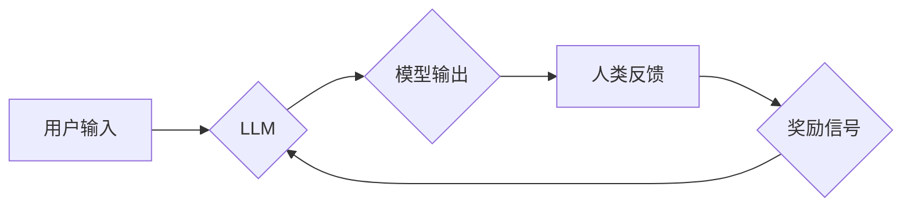

> 大规模语言模型，强化学习，人类反馈，文本生成，自然语言处理，深度学习

## 1. 背景介绍

近年来，深度学习技术取得了飞速发展，特别是大规模语言模型（LLM）的出现，为自然语言处理（NLP）领域带来了革命性的变革。LLM，如GPT-3、LaMDA和BERT等，通过训练海量文本数据，能够生成流畅、连贯的文本，并完成各种复杂的任务，例如文本摘要、机器翻译、对话系统等。

然而，传统的监督学习方法在训练LLM时存在一些局限性。首先，需要大量的标注数据，而标注数据成本高昂且难以获取。其次，传统的监督学习方法难以捕捉到文本的复杂语义关系和上下文依赖性。

基于人类反馈的强化学习（RLHF） emerged as a promising approach to address these challenges. RLHF 结合了强化学习和人类反馈，通过奖励机制引导模型学习生成更符合人类期望的文本。

## 2. 核心概念与联系

**2.1 核心概念**

* **大规模语言模型 (LLM):** 拥有大量参数的深度神经网络，通过训练海量文本数据，学习语言的语法、语义和上下文关系。
* **强化学习 (RL):** 一种机器学习方法，通过奖励机制引导智能体在环境中采取最优行动，以最大化累积奖励。
* **人类反馈 (Human Feedback):** 由人类专家提供对模型输出的评价和反馈，用于指导模型的学习和改进。

**2.2 架构图**



**2.3 联系**

RLHF 将强化学习与人类反馈相结合，构建了一个闭环反馈机制。用户输入文本作为模型的输入，模型生成文本输出。人类专家对模型输出进行评价，并提供反馈信号。这些反馈信号被转化为奖励信号，用于指导模型的训练，使其学习生成更符合人类期望的文本。

## 3. 核心算法原理 & 具体操作步骤

**3.1 算法原理概述**

RLHF 的核心算法原理是利用强化学习的原理，通过奖励机制引导模型学习生成更符合人类期望的文本。

* **状态空间:** 模型的输入文本和当前的模型参数。
* **动作空间:** 模型可以生成的文本输出。
* **奖励函数:** 由人类专家定义，用于评估模型输出的质量和符合人类期望程度。
* **策略网络:** 用于预测模型在给定状态下采取的动作（生成文本）。

**3.2 算法步骤详解**

1. **预训练阶段:** 使用监督学习方法对 LLM 进行预训练，使其具备基本的语言理解和生成能力。
2. **奖励模型训练:** 使用人类反馈数据训练一个奖励模型，该模型能够预测人类对模型输出的评价。
3. **策略网络训练:** 使用强化学习算法，例如 Proximal Policy Optimization (PPO)，训练策略网络。策略网络的训练目标是最大化累积奖励，其中奖励由奖励模型提供。
4. **迭代训练:** 重复步骤 2 和 3，不断优化奖励模型和策略网络，直到模型生成符合人类期望的文本。

**3.3 算法优缺点**

* **优点:**
    * 可以生成更符合人类期望的文本。
    * 不需要大量的标注数据。
    * 可以捕捉到文本的复杂语义关系和上下文依赖性。
* **缺点:**
    * 训练成本较高。
    * 需要大量的专家标注数据进行奖励模型训练。
    * 可能会受到人类偏见的影响。

**3.4 算法应用领域**

* 文本生成：小说、诗歌、剧本等。
* 机器翻译：将一种语言翻译成另一种语言。
* 对话系统：与人类进行自然语言对话。
* 聊天机器人：提供个性化服务和娱乐。
* 内容创作：生成新闻、博客文章、社交媒体内容等。

## 4. 数学模型和公式 & 详细讲解 & 举例说明

**4.1 数学模型构建**

RLHF 的数学模型可以概括为一个马尔可夫决策过程 (MDP)。

* 状态空间: $S = \{s_1, s_2, ..., s_n\}$，其中 $s_i$ 表示模型在第 $i$ 个时间步的状态。
* 动作空间: $A = \{a_1, a_2, ..., a_m\}$，其中 $a_i$ 表示模型在给定状态下可以采取的第 $i$ 个动作。
* 转移概率: $P(s_{t+1}|s_t, a_t)$，表示从状态 $s_t$ 执行动作 $a_t$ 后转移到状态 $s_{t+1}$ 的概率。
* 奖励函数: $R(s_t, a_t)$，表示在状态 $s_t$ 执行动作 $a_t$ 后获得的奖励。
* 策略网络: $\pi(a_t|s_t)$，表示在状态 $s_t$ 下采取动作 $a_t$ 的概率。

**4.2 公式推导过程**

RLHF 的目标是最大化累积奖励，即最大化以下期望值:

$$
\max_{\pi} E_{\pi} \sum_{t=0}^{\infty} \gamma^t R(s_t, a_t)
$$

其中，$\gamma$ 是折扣因子，用于权衡未来奖励的价值。

**4.3 案例分析与讲解**

假设我们训练一个文本生成模型，目标是生成流畅、连贯的英文故事。

* 状态空间: 模型在生成故事的每个时间步的状态，包括当前生成的文本片段和模型的参数。
* 动作空间: 模型可以生成的每个单词。
* 奖励函数: 由人类专家评估故事的流畅度、连贯性和逻辑性，并给予相应的奖励。
* 策略网络: 通过训练学习生成符合人类期望的文本片段。

通过 RLHF 的训练过程，模型会不断学习生成更符合人类期望的故事。

## 5. 项目实践：代码实例和详细解释说明

**5.1 开发环境搭建**

* Python 3.7+
* PyTorch 或 TensorFlow
* CUDA 和 cuDNN (可选，用于 GPU 加速)

**5.2 源代码详细实现**

```python
import torch
import torch.nn as nn

class LanguageModel(nn.Module):
    # ... 模型架构定义 ...

# 初始化模型
model = LanguageModel()

# 定义损失函数和优化器
criterion = nn.CrossEntropyLoss()
optimizer = torch.optim.Adam(model.parameters())

# 训练循环
for epoch in range(num_epochs):
    # ... 数据加载和训练过程 ...
    loss = criterion(model.output, target)
    optimizer.zero_grad()
    loss.backward()
    optimizer.step()

# 保存模型
torch.save(model.state_dict(), 'model.pth')
```

**5.3 代码解读与分析**

* `LanguageModel` 类定义了语言模型的架构。
* `criterion` 和 `optimizer` 分别定义了损失函数和优化器。
* 训练循环中，模型会根据训练数据进行前向传播和反向传播，更新模型参数。
* 最后，训练好的模型参数会被保存到 `model.pth` 文件中。

**5.4 运行结果展示**

训练完成后，可以使用保存的模型生成文本。

```python
# 加载模型
model.load_state_dict(torch.load('model.pth'))

# 生成文本
input_text = "The cat sat on the"
generated_text = model.generate_text(input_text)
print(generated_text)
```

## 6. 实际应用场景

**6.1 文本生成**

* **小说、诗歌、剧本创作:** RLHF 可以帮助作家克服创作瓶颈，生成更具创意和吸引力的文本。
* **新闻、博客文章、社交媒体内容生成:** RLHF 可以帮助自动生成各种类型的文本内容，提高内容生产效率。

**6.2 机器翻译**

* **跨语言文本翻译:** RLHF 可以训练更准确、更流畅的机器翻译模型，突破语言障碍。

**6.3 对话系统**

* **聊天机器人:** RLHF 可以训练更自然、更智能的聊天机器人，提供更人性化的服务体验。
* **虚拟助手:** RLHF 可以帮助虚拟助手更好地理解用户需求，提供更精准的帮助。

**6.4 其他应用场景**

* **代码生成:** RLHF 可以帮助程序员自动生成代码，提高开发效率。
* **音乐创作:** RLHF 可以帮助音乐家创作新的音乐作品。
* **游戏设计:** RLHF 可以帮助游戏设计师设计更具挑战性和趣味性的游戏。

**6.5 未来应用展望**

随着 RLHF 技术的不断发展，其应用场景将会更加广泛。未来，RLHF 有潜力在以下领域发挥重要作用:

* **个性化教育:** 根据学生的学习情况，生成个性化的学习内容和辅导。
* **医疗诊断:** 辅助医生进行疾病诊断，提高诊断准确率。
* **科学研究:** 自动生成科学论文和研究报告，加速科学发现。

## 7. 工具和资源推荐

**7.1 学习资源推荐**

* **论文:**
    * "Language Models are Few-Shot Learners" (Brown et al., 2020)
    * "Reinforcement Learning from Human Feedback" (Amodei et al., 2020)
* **博客文章:**
    * OpenAI Blog: https://openai.com/blog/
    * DeepMind Blog: https://deepmind.com/blog/

**7.2 开发工具推荐**

* **PyTorch:** https://pytorch.org/
* **TensorFlow:** https://www.tensorflow.org/
* **Hugging Face Transformers:** https://huggingface.co/transformers/

**7.3 相关论文推荐**

* "Training Language Models to Follow Instructions" (Raffel et al., 2020)
* "Emergent Abilities in Language Models" (Chen et al., 2020)
* "Scaling Laws for Neural Language Models" (Kaplan et al., 2020)

## 8. 总结：未来发展趋势与挑战

**8.1 研究成果总结**

RLHF 已经取得了显著的成果，在文本生成、机器翻译、对话系统等领域取得了突破性进展。

**8.2 未来发展趋势**

* **模型规模的进一步扩大:** 更大的模型规模能够学习更复杂的语言模式，生成更高质量的文本。
* **算法的不断优化:** 探索更有效的 RL 算法，提高训练效率和模型性能。
* **多模态学习:** 将文本与其他模态（图像、音频、视频）相结合，构建更全面的语言理解和生成能力。

**8.3 面临的挑战**

* **数据标注成本:** RLHF 需要大量的标注数据，数据标注成本高昂且难以获取。
* **模型偏见:** RLHF 模型可能会受到训练数据中的偏见影响，生成不公平或有歧视性的文本。
* **可解释性:** RLHF 模型的决策过程难以解释，这可能会导致模型的应用受到限制。

**8.4 研究展望**

未来，RLHF 研究将继续探索以下方向:

* **降低数据标注成本:** 研究无监督或半监督学习方法，减少对标注数据的依赖。
* **缓解模型偏见:** 开发方法来识别和缓解模型中的偏见，生成更公平、更公正的文本。
* **提高模型可解释性:** 研究方法来解释 RLHF 模型的决策过程，提高模型的透明度和可信度。


## 9. 附录：常见问题与解答

**9.1 Q: RLHF 与监督学习相比有什么优势？**

**A:** RLHF 不需要大量的标注数据，可以学习到更符合人类期望的文本，并且能够捕捉到文本的复杂语义关系和上下文依赖性。

**9