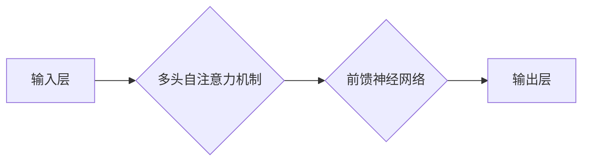

> 大语言模型、Transformer、BERT、GPT、LLM、自然语言处理、深度学习、神经网络

## 1. 背景介绍

近年来，人工智能领域取得了令人瞩目的进展，其中大语言模型（Large Language Model，LLM）作为一种强大的工具，在自然语言处理（Natural Language Processing，NLP）领域展现出巨大的潜力。LLM能够理解和生成人类语言，并完成各种复杂的任务，例如文本生成、翻译、问答、摘要等。

传统的自然语言处理方法主要依赖于手工设计的规则和特征工程，而LLM则通过深度学习的方式，从海量文本数据中学习语言的规律和模式。这使得LLM能够更好地理解语言的语义和上下文，并生成更自然、更流畅的文本。

## 2. 核心概念与联系

大语言模型的核心概念是**Transformer**架构。Transformer是一种新型的神经网络架构，它能够有效地处理序列数据，例如文本。

**Transformer 架构流程图:**



Transformer 架构的核心组件是**多头自注意力机制**，它能够捕捉文本序列中单词之间的长距离依赖关系。

**核心概念联系:**

* **深度学习:** LLM 基于深度学习算法训练，从海量文本数据中学习语言规律。
* **Transformer 架构:** Transformer 架构是 LLM 的基础，能够有效处理序列数据，捕捉长距离依赖关系。
* **多头自注意力机制:** 多头自注意力机制是 Transformer 架构的核心，能够捕捉文本序列中单词之间的关系。

## 3. 核心算法原理 & 具体操作步骤

### 3.1  算法原理概述

大语言模型的训练主要基于**自监督学习**的思想。

自监督学习是指利用无标签数据，通过设计特定的预训练任务，让模型学习到语言的潜在表示。

常见的预训练任务包括：

* **语言建模:** 预测下一个词。
* **掩码语言模型:** 预测被掩盖的词。
* **句子排序:** 判断两个句子是否相似的顺序。

### 3.2  算法步骤详解

1. **数据预处理:** 将文本数据进行清洗、分词、词嵌入等预处理操作。
2. **模型训练:** 使用预训练任务训练 Transformer 模型，例如 BERT 或 GPT。
3. **微调:** 将预训练好的模型微调到特定任务，例如文本分类、问答等。

### 3.3  算法优缺点

**优点:**

* 能够从海量文本数据中学习到语言的丰富表示。
* 能够处理长距离依赖关系，生成更流畅的文本。
* 能够应用于多种自然语言处理任务。

**缺点:**

* 训练成本高，需要大量的计算资源和数据。
* 容易受到训练数据偏差的影响。
* 缺乏对真实世界知识的理解。

### 3.4  算法应用领域

* **文本生成:** 写作、诗歌创作、代码生成等。
* **机器翻译:** 将一种语言翻译成另一种语言。
* **问答系统:** 回答用户提出的问题。
* **文本摘要:** 生成文本的简短摘要。
* **对话系统:** 与用户进行自然语言对话。

## 4. 数学模型和公式 & 详细讲解 & 举例说明

### 4.1  数学模型构建

Transformer 模型的核心是**多头自注意力机制**。

**多头自注意力机制的数学公式:**

$$
Attention(Q, K, V) = \text{softmax}\left(\frac{QK^T}{\sqrt{d_k}}\right)V
$$

其中:

* $Q$, $K$, $V$ 分别是查询矩阵、键矩阵和值矩阵。
* $d_k$ 是键向量的维度。
* $\text{softmax}$ 函数将注意力权重归一化。

### 4.2  公式推导过程

多头自注意力机制通过多个注意力头并行计算，每个注意力头学习不同的方面的信息。

**公式推导过程:**

1. 将输入序列 $X$ 分成 $n$ 个单词，每个单词表示为一个向量 $x_i$。
2. 将 $X$ 转换为查询矩阵 $Q$, 键矩阵 $K$ 和值矩阵 $V$。
3. 计算每个注意力头的注意力权重 $A_i$。
4. 将每个注意力头的输出 $O_i$ 结合起来，得到最终的输出 $O$。

### 4.3  案例分析与讲解

**案例分析:**

假设我们有一个句子 "The cat sat on the mat"。

**注意力权重:**

注意力机制会将 "cat" 和 "sat" 关联起来，因为它们是动作和主语的关系。

**输出结果:**

经过多头自注意力机制的处理，模型能够更好地理解句子的语义，并生成更准确的输出。

## 5. 项目实践：代码实例和详细解释说明

### 5.1  开发环境搭建

* Python 3.7+
* PyTorch 1.7+
* CUDA 10.2+

### 5.2  源代码详细实现

```python
import torch
import torch.nn as nn

class Transformer(nn.Module):
    def __init__(self, vocab_size, embedding_dim, num_heads, num_layers):
        super(Transformer, self).__init__()
        self.embedding = nn.Embedding(vocab_size, embedding_dim)
        self.transformer_layers = nn.ModuleList([
            nn.TransformerEncoderLayer(embedding_dim, num_heads)
            for _ in range(num_layers)
        ])
        self.linear = nn.Linear(embedding_dim, vocab_size)

    def forward(self, x):
        x = self.embedding(x)
        for layer in self.transformer_layers:
            x = layer(x)
        x = self.linear(x)
        return x
```

### 5.3  代码解读与分析

* **embedding:** 将单词转换为向量表示。
* **transformer_layers:** 多个 Transformer Encoder Layer，用于处理序列数据。
* **linear:** 将输出向量映射到词汇表大小。

### 5.4  运行结果展示

训练好的 Transformer 模型可以用于各种自然语言处理任务，例如文本生成、机器翻译等。

## 6. 实际应用场景

### 6.1  文本生成

* **写作辅助:** 帮助用户生成文章、故事、诗歌等。
* **代码生成:** 根据自然语言描述生成代码。
* **聊天机器人:** 与用户进行自然语言对话。

### 6.2  机器翻译

* **跨语言沟通:** 将一种语言翻译成另一种语言，促进跨文化交流。
* **国际化软件:** 将软件界面和文档翻译成多种语言。

### 6.3  问答系统

* **搜索引擎:** 帮助用户找到相关信息。
* **客服机器人:** 自动回答用户的问题。

### 6.4  未来应用展望

* **个性化教育:** 根据学生的学习情况生成个性化的学习内容。
* **医疗诊断:** 辅助医生进行疾病诊断。
* **法律分析:** 分析法律文件，提供法律建议。

## 7. 工具和资源推荐

### 7.1  学习资源推荐

* **书籍:**
    * 《深度学习》
    * 《自然语言处理》
* **在线课程:**
    * Coursera: 自然语言处理
    * Udacity: 深度学习

### 7.2  开发工具推荐

* **PyTorch:** 深度学习框架
* **TensorFlow:** 深度学习框架
* **Hugging Face:** 预训练模型库

### 7.3  相关论文推荐

* **BERT: Pre-training of Deep Bidirectional Transformers for Language Understanding**
* **GPT: Generative Pre-trained Transformer**
* **Attention Is All You Need**

## 8. 总结：未来发展趋势与挑战

### 8.1  研究成果总结

大语言模型在自然语言处理领域取得了显著的进展，能够完成各种复杂的任务，并展现出巨大的应用潜力。

### 8.2  未来发展趋势

* **模型规模更大:** 训练更大的模型，提升模型能力。
* **多模态学习:** 将文本与其他模态数据（图像、音频等）结合起来，构建更全面的理解模型。
* **可解释性增强:** 提高模型的透明度和可解释性，帮助用户理解模型的决策过程。

### 8.3  面临的挑战

* **数据偏见:** 训练数据可能存在偏见，导致模型输出结果不准确或不公平。
* **计算资源:** 训练大型语言模型需要大量的计算资源，成本较高。
* **伦理问题:** 大语言模型可能被用于生成虚假信息或进行恶意攻击，需要关注其伦理问题。

### 8.4  研究展望

未来，大语言模型的研究将继续深入，朝着更强大、更安全、更可解释的方向发展。


## 9. 附录：常见问题与解答

**Q1: 如何选择合适的预训练模型？**

**A1:** 选择预训练模型需要根据具体任务和数据特点进行选择。例如，对于文本分类任务，BERT 模型效果较好；对于文本生成任务，GPT 模型效果较好。

**Q2: 如何微调预训练模型？**

**A2:** 微调预训练模型需要使用少量标记数据，调整模型参数，使其适应特定任务。

**Q3: 如何解决数据偏见问题？**

**A3:** 可以通过数据清洗、数据增强等方法来减轻数据偏见的影响。


作者：禅与计算机程序设计艺术 / Zen and the Art of Computer Programming 


<end_of_turn>