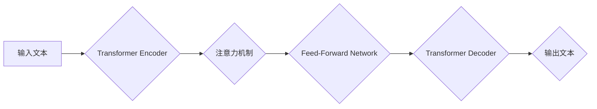

> 大语言模型、Transformer、BERT、GPT、LLM、自然语言处理、深度学习、模型评估

## 1. 背景介绍

近年来，深度学习技术取得了飞速发展，特别是Transformer模型的出现，为自然语言处理（NLP）领域带来了革命性的变革。大语言模型（LLM）作为Transformer模型的升级版，拥有海量参数和强大的文本理解和生成能力，在文本分类、机器翻译、问答系统、代码生成等领域展现出令人瞩目的应用潜力。

然而，LLM的评估是一个复杂且充满挑战的任务。传统的评估指标，例如准确率、F1-score等，难以全面衡量LLM的整体能力，因为LLM需要具备多种能力，例如文本理解、文本生成、逻辑推理、常识知识等。因此，我们需要开发新的评估方法，以更全面地评估LLM的性能。

## 2. 核心概念与联系

大语言模型（LLM）是一种基于深度学习的强大人工智能模型，能够理解和生成人类语言。其核心概念包括：

* **Transformer模型:** Transformer模型是一种新型的神经网络架构，其特点是能够并行处理序列数据，并通过注意力机制捕捉文本中的长距离依赖关系。

* **自回归语言模型:** 自回归语言模型是一种预测下一个词的概率分布的模型，通过训练大量的文本数据，学习语言的语法和语义规律。

* **预训练和微调:** 预训练是指在大量文本数据上训练一个通用语言模型，微调是指在特定任务数据上对预训练模型进行进一步训练，以提高其在该任务上的性能。

**Mermaid 流程图:**



## 3. 核心算法原理 & 具体操作步骤

### 3.1  算法原理概述

LLM的核心算法是Transformer模型，其主要由Encoder和Decoder两个部分组成。Encoder负责对输入文本进行编码，将文本信息转换为向量表示；Decoder负责根据Encoder的输出生成目标文本。Transformer模型的核心机制是注意力机制，它能够捕捉文本中的长距离依赖关系，提高模型的理解能力。

### 3.2  算法步骤详解

1. **输入文本处理:** 将输入文本转换为数字表示，例如词嵌入。
2. **Encoder编码:** 将文本序列输入Encoder，经过多层Transformer编码器，每个编码器层包含多头注意力机制和前馈神经网络。
3. **注意力机制:** 注意力机制能够学习文本中不同词之间的关系，并赋予每个词不同的权重，从而更好地捕捉文本的语义信息。
4. **Decoder解码:** 将Encoder的输出作为输入，输入Decoder，经过多层Transformer解码器，每个解码器层也包含多头注意力机制和前馈神经网络。
5. **输出文本生成:** Decoder的输出是一个概率分布，表示每个词出现的概率，根据这个概率分布生成目标文本。

### 3.3  算法优缺点

**优点:**

* 能够捕捉长距离依赖关系，提高文本理解能力。
* 并行处理能力强，训练速度快。
* 在多种NLP任务上表现出色。

**缺点:**

* 参数量大，训练成本高。
* 容易过拟合，需要大量的训练数据。
* 对硬件资源要求高。

### 3.4  算法应用领域

LLM在以下领域具有广泛的应用前景：

* 文本分类
* 机器翻译
* 问答系统
* 代码生成
* 文本摘要
* 对话系统

## 4. 数学模型和公式 & 详细讲解 & 举例说明

### 4.1  数学模型构建

Transformer模型的核心是注意力机制，其数学模型可以表示为：

$$
Attention(Q, K, V) = softmax(\frac{QK^T}{\sqrt{d_k}})V
$$

其中：

* $Q$：查询矩阵
* $K$：键矩阵
* $V$：值矩阵
* $d_k$：键向量的维度
* $softmax$：softmax函数

### 4.2  公式推导过程

注意力机制的目的是计算每个词与其他词之间的相关性，并根据相关性赋予每个词不同的权重。

1. 计算查询矩阵 $Q$ 与键矩阵 $K$ 的点积，并除以 $\sqrt{d_k}$，以规范化结果。
2. 应用softmax函数对点积结果进行归一化，得到每个词与其他词的相关性分数。
3. 将相关性分数与值矩阵 $V$ 相乘，得到每个词的加权和，即注意力输出。

### 4.3  案例分析与讲解

例如，在翻译句子“The cat sat on the mat”时，注意力机制可以计算每个词与其他词之间的相关性，例如，“cat”与“sat”的相关性较高，因为它们描述了同一个动作。

## 5. 项目实践：代码实例和详细解释说明

### 5.1  开发环境搭建

* Python 3.7+
* PyTorch 1.7+
* CUDA 10.2+

### 5.2  源代码详细实现

```python
import torch
import torch.nn as nn

class Transformer(nn.Module):
    def __init__(self, vocab_size, embedding_dim, num_heads, num_layers):
        super(Transformer, self).__init__()
        self.embedding = nn.Embedding(vocab_size, embedding_dim)
        self.encoder = nn.TransformerEncoder(nn.TransformerEncoderLayer(embedding_dim, num_heads), num_layers)
        self.decoder = nn.TransformerDecoder(nn.TransformerDecoderLayer(embedding_dim, num_heads), num_layers)
        self.linear = nn.Linear(embedding_dim, vocab_size)

    def forward(self, src, tgt):
        src = self.embedding(src)
        tgt = self.embedding(tgt)
        encoder_output = self.encoder(src)
        decoder_output = self.decoder(tgt, encoder_output)
        output = self.linear(decoder_output)
        return output
```

### 5.3  代码解读与分析

* `Transformer`类定义了Transformer模型的结构。
* `embedding`层将词转换为向量表示。
* `encoder`和`decoder`层分别负责对输入文本和目标文本进行编码和解码。
* `linear`层将解码器的输出转换为概率分布。

### 5.4  运行结果展示

训练好的LLM模型可以用于各种NLP任务，例如文本分类、机器翻译等。

## 6. 实际应用场景

LLM在以下实际应用场景中展现出强大的能力：

* **聊天机器人:** LLM可以理解用户自然语言输入，并生成自然流畅的回复，从而构建更智能的聊天机器人。
* **文本摘要:** LLM可以自动生成文本摘要，提取文本的关键信息，节省用户阅读时间。
* **代码生成:** LLM可以根据自然语言描述生成代码，提高开发效率。
* **机器翻译:** LLM可以实现高质量的机器翻译，突破语言障碍。

### 6.4  未来应用展望

LLM的应用前景广阔，未来将应用于更多领域，例如：

* **教育:** 个性化学习、智能辅导
* **医疗:** 疾病诊断、药物研发
* **金融:** 风险评估、欺诈检测

## 7. 工具和资源推荐

### 7.1  学习资源推荐

* **书籍:**
    * 《深度学习》
    * 《自然语言处理》
* **在线课程:**
    * Coursera: 自然语言处理
    * Udacity: 深度学习

### 7.2  开发工具推荐

* **PyTorch:** 深度学习框架
* **TensorFlow:** 深度学习框架
* **HuggingFace:** 预训练模型库

### 7.3  相关论文推荐

* 《Attention Is All You Need》
* 《BERT: Pre-training of Deep Bidirectional Transformers for Language Understanding》
* 《GPT-3: Language Models are Few-Shot Learners》

## 8. 总结：未来发展趋势与挑战

### 8.1  研究成果总结

近年来，LLM取得了显著进展，在文本理解和生成能力方面取得了突破。

### 8.2  未来发展趋势

* **模型规模更大:** 随着计算资源的不断提升，LLM模型规模将进一步扩大，从而提升模型性能。
* **多模态学习:** LLM将与其他模态数据，例如图像、音频等进行融合，实现多模态理解和生成。
* **可解释性增强:** 研究更有效的LLM可解释性方法，提高模型透明度和可信度。

### 8.3  面临的挑战

* **数据获取和标注:** LLM训练需要海量高质量数据，数据获取和标注成本高昂。
* **计算资源需求:** LLM训练需要大量的计算资源，成本高昂。
* **伦理问题:** LLM可能存在偏见、歧视等伦理问题，需要谨慎使用和监管。

### 8.4  研究展望

未来，LLM研究将继续朝着更强大、更安全、更可解释的方向发展，为人类社会带来更多福祉。

## 9. 附录：常见问题与解答

* **什么是LLM？**

LLM是指大语言模型，是一种基于深度学习的强大人工智能模型，能够理解和生成人类语言。

* **LLM的应用场景有哪些？**

LLM在文本分类、机器翻译、问答系统、代码生成等领域具有广泛的应用前景。

* **如何评估LLM的性能？**

LLM的评估是一个复杂的任务，需要考虑多种因素，例如准确率、流畅度、逻辑推理能力等。

* **LLM有哪些挑战？**

LLM面临的数据获取、计算资源、伦理等挑战。


作者：禅与计算机程序设计艺术 / Zen and the Art of Computer Programming 
<end_of_turn>