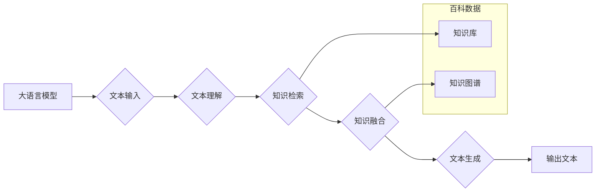

> 大语言模型、百科数据、自然语言处理、Transformer、BERT、知识图谱、深度学习、文本生成

## 1. 背景介绍

大语言模型（Large Language Model，LLM）近年来在人工智能领域取得了突破性进展，展现出强大的文本理解和生成能力。这些模型能够处理和生成人类语言，在自然语言处理（NLP）任务中展现出令人惊叹的性能，例如文本分类、机器翻译、问答系统等。

百科数据作为一种结构化和丰富的知识资源，蕴含着大量的知识和事实信息。将其与大语言模型相结合，可以有效提升模型的知识理解能力和生成高质量文本的能力。

本篇文章将深入探讨大语言模型与百科数据的结合，从核心概念、算法原理、工程实践到实际应用场景，全面分析其原理、技术和应用前景。

## 2. 核心概念与联系

### 2.1 大语言模型

大语言模型是指训练规模庞大、参数数量众多的深度学习模型，能够理解和生成人类语言。它们通常基于Transformer架构，通过大量的文本数据进行预训练，学习到语言的语法、语义和上下文关系。

### 2.2 百科数据

百科数据是指包含大量知识和事实信息的结构化数据，例如维基百科、百科全书等。其特点是：

* **结构化:** 百科数据通常采用表格、知识图谱等结构化形式存储，方便机器理解和检索。
* **丰富:** 包含广泛的主题和知识领域，涵盖历史、地理、科学、文化等多个方面。
* **可信度高:** 百科数据通常经过专业人员的审核和校对，具有较高的可信度。

### 2.3 结合关系

将百科数据与大语言模型相结合，可以实现以下目标：

* **提升模型的知识理解能力:** 通过学习百科数据中的知识和事实，大语言模型可以更好地理解文本语义，提高文本理解和生成能力。
* **增强模型的知识推理能力:** 百科数据中的知识关系可以帮助大语言模型进行知识推理，例如抽取实体关系、进行逻辑推理等。
* **提高模型的可靠性和可信度:** 百科数据中的知识是经过验证和审核的，可以提高大语言模型生成的文本的可靠性和可信度。

**Mermaid 流程图**



## 3. 核心算法原理 & 具体操作步骤

### 3.1 算法原理概述

大语言模型与百科数据结合的算法原理主要基于以下几个方面：

* **文本嵌入:** 将文本转换为向量表示，以便于模型理解和处理。
* **知识图谱构建:** 将百科数据中的知识转换为知识图谱，方便模型进行知识推理和检索。
* **知识融合:** 将文本嵌入和知识图谱信息融合，提升模型的知识理解能力。
* **文本生成:** 基于融合后的知识信息，生成高质量的文本。

### 3.2 算法步骤详解

1. **文本预处理:** 对输入文本进行清洗、分词、词性标注等预处理操作，以便于后续的文本理解和处理。
2. **文本嵌入:** 使用预训练的词嵌入模型（例如Word2Vec、GloVe）将文本转换为向量表示。
3. **知识图谱构建:** 将百科数据中的知识转换为知识图谱，其中节点代表实体，边代表关系。可以使用规则抽取、机器学习等方法构建知识图谱。
4. **知识融合:** 将文本嵌入和知识图谱信息融合，可以使用注意力机制、图神经网络等方法实现知识融合。
5. **文本生成:** 基于融合后的知识信息，使用解码器生成高质量的文本。

### 3.3 算法优缺点

**优点:**

* 提升模型的知识理解能力和生成高质量文本的能力。
* 增强模型的知识推理能力。
* 提高模型的可靠性和可信度。

**缺点:**

* 构建知识图谱需要大量的时间和人力资源。
* 知识融合算法的复杂度较高，需要大量的计算资源。

### 3.4 算法应用领域

* **问答系统:** 基于百科数据和大语言模型构建的问答系统能够提供更准确、更全面的答案。
* **文本摘要:** 利用百科数据和大语言模型可以生成更准确、更简洁的文本摘要。
* **机器翻译:** 将百科数据中的知识融入机器翻译模型，可以提高翻译质量。
* **知识问答:** 基于百科数据和大语言模型构建的知识问答系统能够回答更复杂、更深入的问题。

## 4. 数学模型和公式 & 详细讲解 & 举例说明

### 4.1 数学模型构建

大语言模型通常采用Transformer架构，其核心是注意力机制。注意力机制可以学习文本中不同词语之间的关系，并赋予不同词语不同的权重，从而提高模型的理解能力。

**注意力机制公式:**

$$
Attention(Q, K, V) = softmax(\frac{QK^T}{\sqrt{d_k}})V
$$

其中：

* $Q$：查询矩阵
* $K$：键矩阵
* $V$：值矩阵
* $d_k$：键向量的维度
* $softmax$：softmax函数

### 4.2 公式推导过程

注意力机制的公式可以理解为计算查询向量与键向量的相似度，然后根据相似度对值向量进行加权求和。

* $QK^T$：计算查询向量与键向量的点积，得到一个得分矩阵。
* $\frac{QK^T}{\sqrt{d_k}}$：对得分矩阵进行归一化，使得每个元素的范围在0到1之间。
* $softmax$：对归一化后的得分矩阵进行softmax操作，得到每个键向量的权重。
* $V$：根据权重对值向量进行加权求和，得到最终的输出向量。

### 4.3 案例分析与讲解

例如，在翻译句子“The cat sat on the mat”时，注意力机制可以将“cat”与“sat”联系起来，将“mat”与“on”联系起来，从而更好地理解句子的语义。

## 5. 项目实践：代码实例和详细解释说明

### 5.1 开发环境搭建

* Python 3.7+
* TensorFlow/PyTorch
* NLTK
* SpaCy

### 5.2 源代码详细实现

```python
# 导入必要的库
import tensorflow as tf
from transformers import BertTokenizer, BertModel

# 加载预训练模型和词典
tokenizer = BertTokenizer.from_pretrained('bert-base-uncased')
model = BertModel.from_pretrained('bert-base-uncased')

# 文本预处理
text = "The cat sat on the mat."
inputs = tokenizer(text, return_tensors='tf')

# 模型推理
outputs = model(**inputs)

# 获取文本嵌入
embeddings = outputs.last_hidden_state[:, 0, :]

# ...后续代码用于知识图谱构建、知识融合和文本生成
```

### 5.3 代码解读与分析

* 代码首先导入必要的库，并加载预训练的BERT模型和词典。
* 然后对输入文本进行预处理，将文本转换为模型可以理解的格式。
* 使用预训练模型对文本进行推理，获取文本嵌入。
* 后续代码可以根据具体需求进行修改，例如构建知识图谱、进行知识融合和文本生成。

### 5.4 运行结果展示

运行上述代码后，可以得到文本的嵌入向量。这些向量可以用于后续的知识图谱构建、知识融合和文本生成等任务。

## 6. 实际应用场景

### 6.1 问答系统

将百科数据与大语言模型结合，可以构建更智能、更准确的问答系统。例如，用户提问“中国古代四大发明是什么？”，问答系统可以从百科数据中检索相关信息，并利用大语言模型生成准确的答案：“中国古代四大发明是造纸术、指南针、火药和印刷术。”

### 6.2 文本摘要

利用百科数据和大语言模型可以生成更准确、更简洁的文本摘要。例如，可以将一篇长篇百科文章摘要成几百字的简要内容，方便用户快速了解文章内容。

### 6.3 机器翻译

将百科数据中的知识融入机器翻译模型，可以提高翻译质量。例如，在翻译“苹果”这个词时，机器翻译模型可以根据百科数据中的知识，判断“苹果”指的是水果还是公司，从而选择更准确的翻译词。

### 6.4 未来应用展望

大语言模型与百科数据结合的应用前景十分广阔，未来可能在以下领域得到更广泛的应用：

* **个性化教育:** 根据学生的学习情况，生成个性化的学习内容和练习题。
* **智能客服:** 利用大语言模型和百科数据，构建更智能、更人性化的客服系统。
* **科学研究:** 利用大语言模型和百科数据，辅助科学家进行文献综述、数据分析和知识发现。

## 7. 工具和资源推荐

### 7.1 学习资源推荐

* **书籍:**
    * 《深度学习》
    * 《自然语言处理》
    * 《Transformer模型详解》
* **在线课程:**
    * Coursera: 深度学习
    * Udacity: 自然语言处理
    * fast.ai: 深度学习

### 7.2 开发工具推荐

* **TensorFlow:** 开源深度学习框架
* **PyTorch:** 开源深度学习框架
* **HuggingFace Transformers:** 预训练模型库

### 7.3 相关论文推荐

* Attention Is All You Need
* BERT: Pre-training of Deep Bidirectional Transformers for Language Understanding
* Knowledge Graph Embedding

## 8. 总结：未来发展趋势与挑战

### 8.1 研究成果总结

大语言模型与百科数据结合取得了显著的成果，在文本理解、知识推理、文本生成等方面展现出强大的能力。

### 8.2 未来发展趋势

* **模型规模和能力的提升:** 未来大语言模型的规模和能力将会进一步提升，能够处理更复杂、更长文本，并具备更强的知识理解和推理能力。
* **多模态融合:** 将文本、图像、音频等多模态数据融合到大语言模型中，实现更全面的知识理解和交互。
* **个性化定制:** 基于用户需求，定制化训练大语言模型，使其能够更好地满足用户的个性化需求。

### 8.3 面临的挑战

* **数据质量和规模:** 大语言模型的训练需要大量的优质数据，而高质量数据的获取和标注仍然是一个挑战。
* **计算资源:** 训练大型语言模型需要大量的计算资源，这对于资源有限的机构和个人来说是一个障碍。
* **伦理和安全:** 大语言模型的应用需要考虑伦理和安全问题，例如避免生成虚假信息、防止模型被恶意利用等。

### 8.4 研究展望

未来，大语言模型与百科数据结合的研究将继续深入，探索更先进的算法、模型架构和应用场景，为人工智能的发展做出更大的贡献。

## 9. 附录：常见问题与解答

**Q1: 如何构建知识图谱？**

**A1:** 知识图谱的构建可以采用规则抽取、机器学习等方法。规则抽取需要根据领域知识制定规则，提取文本中的实体和关系。机器学习方法则需要训练模型，学习文本中的知识关系。

**Q2: 如何进行知识融合？**

**A2:** 知识融合可以使用注意力机制、图神经网络等方法。注意力机制可以学习文本嵌入和知识图谱信息之间的关系，赋予不同信息不同的权重。图神经网络可以将文本嵌入和知识图谱信息表示为图结构，并利用图神经网络进行推理和融合。

**Q3: 大语言模型的训练需要多少计算资源？**

**A3:** 大语言模型的训练