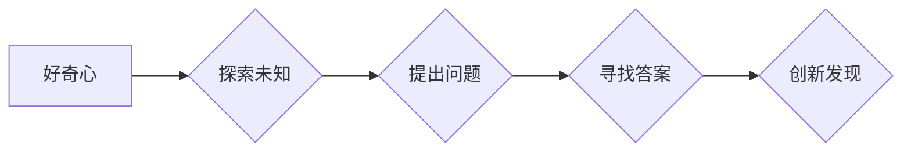

>  好奇心、创新、发现、人工智能、算法、机器学习、深度学习、数据科学

## 1. 背景介绍

在瞬息万变的科技时代，创新和发现是推动社会进步的引擎。而好奇心，作为人类最原始的驱动力之一，正是创新和发现的源泉。它让我们对未知世界充满渴望，不断探索和求知，最终揭开隐藏的奥秘。

人工智能（AI）作为科技发展的重要方向，也离不开好奇心的驱使。从最初的符号逻辑到如今的深度学习，每一次突破都是源于对未知领域的探索和对问题的深入思考。

## 2. 核心概念与联系

好奇心与创新、发现之间存在着密不可分的联系。

* **好奇心**：对未知事物的好奇和探索欲望，是激发创新和发现的初始动力。
* **创新**：创造出新的事物或方法，解决现有问题或满足新的需求。
* **发现**：揭示未知的规律、知识或真相。

好奇心是创新和发现的基石，它让我们勇于探索，敢于尝试，最终实现突破。

**Mermaid 流程图**



## 3. 核心算法原理 & 具体操作步骤

### 3.1  算法原理概述

深度学习算法是人工智能领域的重要组成部分，它能够通过学习大量的样本数据，自动提取特征并构建复杂的模型，从而实现对各种任务的处理，例如图像识别、自然语言处理等。

深度学习算法的核心是多层神经网络，它由多个神经元组成的层级结构组成。每个神经元接收来自上一层的输入信号，并对其进行处理，然后将处理后的信号传递到下一层。通过不断叠加神经网络层数，深度学习算法能够学习到越来越复杂的特征表示。

### 3.2  算法步骤详解

1. **数据预处理**: 将原始数据进行清洗、转换和格式化，使其适合深度学习算法的训练。
2. **模型构建**: 根据具体任务需求，选择合适的深度学习模型架构，例如卷积神经网络（CNN）、循环神经网络（RNN）等。
3. **模型训练**: 使用训练数据对模型进行训练，调整模型参数，使其能够准确地预测或分类数据。
4. **模型评估**: 使用测试数据对模型进行评估，衡量模型的性能，例如准确率、召回率等。
5. **模型部署**: 将训练好的模型部署到实际应用场景中，用于处理新的数据。

### 3.3  算法优缺点

**优点**:

* 能够学习到复杂的特征表示，实现高精度预测。
* 对数据类型适应性强，能够处理文本、图像、音频等多种数据类型。
* 具有强大的泛化能力，能够应用于各种不同的任务。

**缺点**:

* 训练数据量要求高，需要大量的样本数据才能达到较好的效果。
* 计算资源消耗大，训练过程需要大量的计算能力。
* 模型解释性差，难以理解模型的决策过程。

### 3.4  算法应用领域

深度学习算法已广泛应用于各个领域，例如：

* **计算机视觉**: 图像识别、物体检测、图像分割等。
* **自然语言处理**: 文本分类、情感分析、机器翻译等。
* **语音识别**: 语音转文本、语音助手等。
* **医疗诊断**: 疾病预测、图像分析等。
* **金融分析**: 风险评估、欺诈检测等。

## 4. 数学模型和公式 & 详细讲解 & 举例说明

### 4.1  数学模型构建

深度学习算法的核心是多层神经网络，其数学模型可以表示为：

$$
y = f(W^L x^L + b^L)
$$

其中：

* $y$：输出结果
* $x^L$：第 $L$ 层的输入
* $W^L$：第 $L$ 层的权重矩阵
* $b^L$：第 $L$ 层的偏置向量
* $f$：激活函数

### 4.2  公式推导过程

深度学习算法的训练过程是通过反向传播算法来进行的。反向传播算法的核心思想是：

1. 计算输出结果与真实值的误差。
2. 根据误差反向传播，更新各层的权重和偏置。

反向传播算法的具体推导过程较为复杂，涉及到微积分和线性代数等知识。

### 4.3  案例分析与讲解

以图像识别为例，深度学习算法可以学习到图像中不同特征的表示，例如边缘、纹理、形状等。通过训练大量的图像数据，模型能够将这些特征与对应的类别进行关联，从而实现对图像的识别。

## 5. 项目实践：代码实例和详细解释说明

### 5.1  开发环境搭建

深度学习算法的开发环境通常需要安装以下软件：

* Python 语言
* TensorFlow 或 PyTorch 深度学习框架
* NumPy 数值计算库
* Matplotlib 数据可视化库

### 5.2  源代码详细实现

以下是一个简单的图像分类示例代码，使用 TensorFlow 框架实现：

```python
import tensorflow as tf

# 定义模型架构
model = tf.keras.models.Sequential([
    tf.keras.layers.Conv2D(32, (3, 3), activation='relu', input_shape=(28, 28, 1)),
    tf.keras.layers.MaxPooling2D((2, 2)),
    tf.keras.layers.Conv2D(64, (3, 3), activation='relu'),
    tf.keras.layers.MaxPooling2D((2, 2)),
    tf.keras.layers.Flatten(),
    tf.keras.layers.Dense(10, activation='softmax')
])

# 编译模型
model.compile(optimizer='adam',
              loss='sparse_categorical_crossentropy',
              metrics=['accuracy'])

# 训练模型
model.fit(x_train, y_train, epochs=5)

# 评估模型
loss, accuracy = model.evaluate(x_test, y_test)
print('Test loss:', loss)
print('Test accuracy:', accuracy)
```

### 5.3  代码解读与分析

这段代码定义了一个简单的卷积神经网络模型，用于图像分类任务。

* `tf.keras.models.Sequential`：定义一个顺序模型，层级结构清晰。
* `tf.keras.layers.Conv2D`：卷积层，用于提取图像特征。
* `tf.keras.layers.MaxPooling2D`：最大池化层，用于降维和提取更抽象的特征。
* `tf.keras.layers.Flatten`：将多维特征转换为一维向量。
* `tf.keras.layers.Dense`：全连接层，用于分类。
* `model.compile`：编译模型，指定优化器、损失函数和评价指标。
* `model.fit`：训练模型，使用训练数据进行训练。
* `model.evaluate`：评估模型，使用测试数据进行评估。

### 5.4  运行结果展示

训练完成后，模型能够对图像进行分类，并输出相应的类别概率。

## 6. 实际应用场景

深度学习算法已广泛应用于各个领域，例如：

### 6.1  医疗诊断

深度学习算法可以用于辅助医生进行疾病诊断，例如：

* **图像分析**: 识别肿瘤、骨折等病变。
* **病历分析**: 预测疾病风险、辅助制定治疗方案。

### 6.2  金融分析

深度学习算法可以用于金融风险管理、欺诈检测等方面，例如：

* **风险评估**: 评估客户信用风险、投资风险等。
* **欺诈检测**: 识别信用卡欺诈、网络金融诈骗等。

### 6.3  自动驾驶

深度学习算法是自动驾驶的核心技术之一，例如：

* **图像识别**: 识别道路、交通标志、行人等。
* **路径规划**: 规划行驶路线，避开障碍物。

### 6.4  未来应用展望

随着深度学习算法的不断发展，其应用场景将更加广泛，例如：

* **个性化教育**: 根据学生的学习情况，提供个性化的学习方案。
* **智能客服**: 利用自然语言处理技术，提供更加智能的客服服务。
* **科学研究**: 加速科学发现，例如药物研发、材料科学等。

## 7. 工具和资源推荐

### 7.1  学习资源推荐

* **在线课程**: Coursera、edX、Udacity 等平台提供深度学习相关的在线课程。
* **书籍**: 《深度学习》、《动手学深度学习》等书籍。
* **博客**: TensorFlow、PyTorch 官方博客等。

### 7.2  开发工具推荐

* **TensorFlow**: Google 开发的开源深度学习框架。
* **PyTorch**: Facebook 开发的开源深度学习框架。
* **Keras**: TensorFlow 上的深度学习 API，易于使用。

### 7.3  相关论文推荐

* **《ImageNet Classification with Deep Convolutional Neural Networks》**: AlexNet 模型的论文。
* **《Deep Residual Learning for Image Recognition》**: ResNet 模型的论文。
* **《Attention Is All You Need》**: Transformer 模型的论文。

## 8. 总结：未来发展趋势与挑战

### 8.1  研究成果总结

深度学习算法取得了显著的成果，在图像识别、自然语言处理等领域取得了突破性的进展。

### 8.2  未来发展趋势

* **模型效率提升**: 降低模型参数量和计算复杂度，提高模型的效率。
* **数据安全与隐私保护**: 解决深度学习算法对数据安全和隐私的挑战。
* **可解释性增强**: 提高深度学习模型的解释性，使其决策过程更加透明。

### 8.3  面临的挑战

* **数据获取与标注**: 深度学习算法需要大量的标注数据，数据获取和标注成本较高。
* **模型泛化能力**: 深度学习模型容易过拟合，泛化能力不足。
* **伦理问题**: 深度学习算法的应用可能带来伦理问题，例如算法偏见、隐私泄露等。

### 8.4  研究展望

未来，深度学习算法将继续朝着更智能、更安全、更可解释的方向发展，并应用于更多领域，为人类社会带来更多福祉。

## 9. 附录：常见问题与解答

### 9.1  深度学习算法需要多少数据才能训练？

深度学习算法对数据量的要求较高，一般需要几千到几百万甚至更多的数据才能达到较好的效果。

### 9.2  深度学习算法的训练时间有多长？

深度学习算法的训练时间取决于模型复杂度、数据量和计算资源等因素，通常需要数小时到数天甚至更长时间。

### 9.3  如何评估深度学习模型的性能？

常用的评估指标包括准确率、召回率、F1-score等。

### 9.4  如何解决深度学习模型的过拟合问题？

常用的方法包括：

* 增加训练数据量
* 使用正则化技术
* 使用 dropout 技术
* 使用 early stopping 技术


作者：禅与计算机程序设计艺术 / Zen and the Art of Computer Programming 
<end_of_turn>