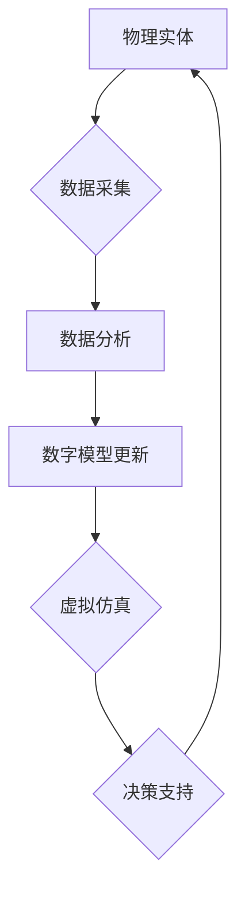

> 数字孪生、数字分身、自我复制、人工智能、虚拟现实、元宇宙、数字永生、生物学、计算机科学

## 1. 背景介绍

21世纪，科技发展日新月异，人工智能、虚拟现实、元宇宙等概念逐渐走进大众视野。其中，数字孪生作为一种将物理世界与数字世界相结合的技术，展现出巨大的潜力，并将在未来深刻地改变我们的生活方式。

数字孪生是指利用传感器、数据分析和人工智能技术，构建与物理实体完全对应的虚拟模型。这个虚拟模型可以实时反映物理实体的状态、行为和运行情况，并可以进行模拟和预测。

目前，数字孪生技术已在多个领域得到应用，例如：

* **制造业：** 用于产品设计、生产过程优化和故障诊断。
* **城市管理：** 用于城市规划、交通管理和环境监测。
* **医疗保健：** 用于疾病诊断、个性化治疗和药物研发。

然而，数字孪生技术的发展还处于早期阶段，未来还有巨大的发展空间。

## 2. 核心概念与联系

数字孪生技术的核心概念包括：

* **物理实体：** 现实世界中的物理对象，例如产品、设备、建筑物等。
* **数字模型：** 与物理实体完全对应的虚拟模型，包含其结构、功能、行为等信息。
* **数据采集：** 通过传感器等设备收集物理实体的实时数据。
* **数据分析：** 利用人工智能和数据分析技术，对收集到的数据进行分析和处理。
* **虚拟仿真：** 基于数字模型，进行虚拟仿真实验和预测。

**数字孪生架构流程图：**



## 3. 核心算法原理 & 具体操作步骤

### 3.1  算法原理概述

数字孪生技术的核心算法包括：

* **数据采集算法：** 用于从物理实体收集实时数据。
* **数据分析算法：** 用于对收集到的数据进行分析和处理，例如机器学习、深度学习等。
* **数字模型构建算法：** 用于根据数据分析结果构建数字模型。
* **虚拟仿真算法：** 用于基于数字模型进行虚拟仿真实验和预测。

### 3.2  算法步骤详解

1. **数据采集：** 通过传感器等设备收集物理实体的实时数据，例如温度、压力、位置等。
2. **数据预处理：** 对收集到的数据进行清洗、转换和格式化，以便于后续分析。
3. **数据分析：** 利用机器学习、深度学习等算法对数据进行分析，例如识别模式、预测趋势等。
4. **数字模型构建：** 根据数据分析结果，构建与物理实体完全对应的虚拟模型。
5. **虚拟仿真：** 基于数字模型，进行虚拟仿真实验和预测，例如模拟产品性能、预测设备故障等。
6. **反馈控制：** 将虚拟仿真结果反馈到物理实体，进行控制和优化。

### 3.3  算法优缺点

**优点：**

* 可以实时反映物理实体的状态和行为。
* 可以进行虚拟仿真实验和预测，降低成本和风险。
* 可以帮助优化生产过程、提高效率和质量。

**缺点：**

* 数据采集和分析需要强大的计算能力和数据处理能力。
* 数字模型的构建需要大量的专业知识和经验。
* 虚拟仿真结果的准确性取决于模型的精度和数据的质量。

### 3.4  算法应用领域

数字孪生技术在多个领域都有广泛的应用前景，例如：

* **制造业：** 产品设计、生产过程优化、故障诊断、远程维护。
* **城市管理：** 城市规划、交通管理、环境监测、公共安全。
* **医疗保健：** 疾病诊断、个性化治疗、药物研发、远程医疗。
* **能源行业：** 电力系统优化、油气田开发、风力发电。

## 4. 数学模型和公式 & 详细讲解 & 举例说明

### 4.1  数学模型构建

数字孪生模型的构建可以基于多种数学模型，例如：

* **状态空间模型：** 用于描述物理实体的状态和行为变化。
* **动力学模型：** 用于描述物理实体的运动和能量变化。
* **概率模型：** 用于描述物理实体的随机性和不确定性。

### 4.2  公式推导过程

例如，一个简单的状态空间模型可以表示为：

$$
\dot{x}(t) = Ax(t) + Bu(t)
$$

$$
y(t) = Cx(t) + Du(t)
$$

其中：

* $x(t)$ 是物理实体的状态向量。
* $u(t)$ 是控制输入向量。
* $y(t)$ 是输出向量。
* $A$, $B$, $C$, $D$ 是系统矩阵。

### 4.3  案例分析与讲解

例如，可以利用状态空间模型来构建一个数字孪生模型，用于模拟汽车的驾驶行为。

* 状态向量 $x(t)$ 可以包含汽车的速度、位置、方向等信息。
* 控制输入向量 $u(t)$ 可以包含油门、刹车、方向盘等信息。
* 输出向量 $y(t)$ 可以包含汽车的加速度、转向角度等信息。

通过收集汽车的实时数据，可以训练状态空间模型的参数，并利用模型进行虚拟仿真实验，例如模拟汽车在不同路况下的驾驶行为。

## 5. 项目实践：代码实例和详细解释说明

### 5.1  开发环境搭建

数字孪生项目开发环境通常包括：

* **操作系统：** Linux、Windows、macOS 等。
* **编程语言：** Python、C++、Java 等。
* **数据分析工具：** Pandas、NumPy、Scikit-learn 等。
* **虚拟仿真工具：** Gazebo、Unity、Unreal Engine 等。

### 5.2  源代码详细实现

以下是一个简单的数字孪生模型的 Python 代码示例：

```python
import numpy as np

# 状态空间模型参数
A = np.array([[0, 1], [0, 0]])
B = np.array([[0], [1]])
C = np.array([[1, 0]])
D = 0

# 时间步长
dt = 0.1

# 初始状态
x = np.array([0, 0])

# 控制输入
u = np.array([1])

# 模拟过程
for i in range(10):
    # 状态更新
    x = A @ x + B @ u
    # 输出
    y = C @ x + D @ u
    print(f"时间步 {i+1}: 状态 {x}, 输出 {y}")
```

### 5.3  代码解读与分析

这段代码实现了简单的状态空间模型，模拟了一个系统的状态变化。

* `A`, `B`, `C`, `D` 是系统矩阵，定义了系统的动力学特性。
* `dt` 是时间步长，控制了模拟过程的精度。
* `x` 是状态向量，表示系统的当前状态。
* `u` 是控制输入，可以改变系统的状态。
* `y` 是输出向量，表示系统的输出结果。

### 5.4  运行结果展示

运行这段代码，可以得到系统的状态和输出随时间的变化曲线。

## 6. 实际应用场景

### 6.1  智能制造

数字孪生技术可以帮助制造企业实现智能化生产，例如：

* **产品设计优化：** 利用数字孪生模型进行虚拟仿真实验，优化产品设计，降低成本和风险。
* **生产过程监控：** 实时监控生产过程，及时发现问题，提高生产效率和质量。
* **设备维护预测：** 利用数据分析预测设备故障，提前进行维护，降低停机时间。

### 6.2  智慧城市

数字孪生技术可以帮助城市管理者构建智慧城市，例如：

* **交通管理优化：** 利用数字孪生模型模拟交通流量，优化交通信号灯控制，缓解交通拥堵。
* **环境监测与控制：** 实时监测空气质量、水质等环境指标，进行环境污染控制。
* **公共安全保障：** 利用数字孪生模型模拟城市安全事件，提高应急预案的制定和执行效率。

### 6.3  医疗保健

数字孪生技术可以帮助医疗机构提供更精准的医疗服务，例如：

* **疾病诊断辅助：** 利用数字孪生模型模拟疾病发展过程，辅助医生进行诊断。
* **个性化治疗方案：** 根据患者的个体差异，构建个性化的数字孪生模型，制定个性化的治疗方案。
* **药物研发加速：** 利用数字孪生模型进行虚拟药物测试，加速药物研发过程。

### 6.4  未来应用展望

数字孪生技术的发展前景广阔，未来将应用于更多领域，例如：

* **教育培训：** 利用数字孪生模型构建虚拟学习环境，提供更沉浸式的学习体验。
* **娱乐休闲：** 利用数字孪生模型构建虚拟世界，提供更逼真的游戏和娱乐体验。
* **科学研究：** 利用数字孪生模型模拟复杂系统，加速科学研究进程。

## 7. 工具和资源推荐

### 7.1  学习资源推荐

* **书籍：**
    * 《数字孪生：从概念到实践》
    * 《数字孪生技术》
* **在线课程：**
    * Coursera 上的数字孪生课程
    * edX 上的数字孪生课程

### 7.2  开发工具推荐

* **数据分析工具：**
    * Python 的 Pandas、NumPy、Scikit-learn 库
    * R 语言
* **虚拟仿真工具：**
    * Gazebo
    * Unity
    * Unreal Engine

### 7.3  相关论文推荐

* **数字孪生概念和架构：**
    * "Digital Twin: Definition, Requirements, and Benefits"
    * "Digital Twin: A Comprehensive Review"
* **数字孪生应用案例：**
    * "Digital Twin Applications in Manufacturing"
    * "Digital Twin Applications in Healthcare"

## 8. 总结：未来发展趋势与挑战

### 8.1  研究成果总结

数字孪生技术近年来取得了显著进展，在多个领域得到了广泛应用。

* **技术成熟度提升：** 数据采集、分析、模型构建等技术不断成熟，数字孪生模型的精度和可靠性不断提高。
* **应用场景拓展：** 数字孪生技术应用场景不断拓展，从制造业、城市管理到医疗保健等领域都有应用。
* **产业生态发展：** 数字孪生产业生态不断完善，涌现出许多相关企业和解决方案。

### 8.2  未来发展趋势

数字孪生技术未来将朝着以下方向发展：

* **更加智能化：** 利用人工智能、机器学习等技术，使数字孪生模型更加智能化，能够自主学习和决策。
* **更加融合化：** 与其他新兴技术，例如虚拟现实、增强现实、区块链等技术融合，构建更加完整的数字孪生生态系统。
* **更加个性化：** 根据用户的需求和场景，构建更加个性化的数字孪生模型，提供更加定制化的服务。

### 8.3  面临的挑战

数字孪生技术发展也面临一些挑战：

* **数据安全和隐私保护：** 数字孪生模型需要收集大量的用户数据，如何保证数据安全和隐私保护是一个重要问题。
* **模型精度和可靠性：** 数字孪生模型的精度和可靠性需要不断提高，才能更好地应用于实际场景。
* **技术标准和规范：** 数字孪生技术还缺乏统一的技术标准和规范，需要行业共同努力，制定相应的标准和规范。

### 8.4  研究展望

未来，数字孪生技术将继续发展壮大，并对我们的生活方式产生深远的影响。

* **数字永生：** 数字孪生技术可以帮助我们实现数字永生，将我们的意识和记忆