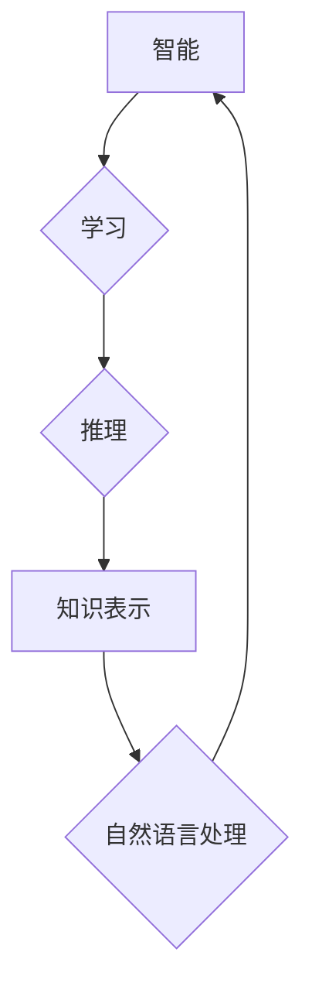

>人工智能、达特茅斯会议、计算机科学、机器学习、深度学习、认知科学、哲学

## 1. 背景介绍

1956年，一群来自美国各地的科学家和工程师聚集在位于新罕布什尔州达特茅斯学院的夏季研讨会上。这个会议被认为是人工智能（AI）的诞生地，它标志着计算机科学的一个重要里程碑。

在那个时代，计算机技术还处于萌芽阶段，人们对机器学习和智能化的概念充满了好奇和憧憬。达特茅斯会议的组织者，麻省理工学院的约翰·麦卡锡（John McCarthy）提出了“人工智能”这个词，并定义了人工智能的本质：让机器能够像人类一样思考和学习。

会议上，来自不同领域的专家们分享了他们的研究成果和想法，探讨了人工智能的可能性和挑战。他们讨论了如何让机器理解自然语言、解决问题、学习新知识，以及如何确保人工智能技术的安全和伦理。

## 2. 核心概念与联系

达特茅斯会议的核心概念包括：

* **智能：** 人工智能的目标是创造能够像人类一样思考和学习的机器。
* **学习：** 机器学习是人工智能的关键技术之一，它允许机器从数据中学习和改进。
* **推理：** 人工智能系统需要能够从已有的知识中进行推理，并做出新的判断。
* **知识表示：** 人工智能系统需要能够有效地表示和处理知识。
* **自然语言处理：** 人工智能系统需要能够理解和生成人类语言。

这些概念相互关联，共同构成了人工智能的理论基础。

**Mermaid 流程图：**



## 3. 核心算法原理 & 具体操作步骤

### 3.1  算法原理概述

达特茅斯会议期间，一些关键的算法原理被提出，为人工智能的发展奠定了基础。其中包括：

* **符号逻辑：** 符号逻辑是一种用于表示和推理的数学系统，它被用于早期的人工智能系统中。
* **搜索算法：** 搜索算法用于在搜索空间中找到最优解，例如在游戏或规划问题中。
* **神经网络：** 神经网络是一种模仿人脑结构的算法，它能够学习复杂的模式和关系。

### 3.2  算法步骤详解

以神经网络为例，其基本步骤如下：

1. **数据预处理：** 将输入数据转换为神经网络可以理解的格式。
2. **网络结构设计：** 确定神经网络的层数、节点数和连接方式。
3. **权值初始化：** 为神经网络的连接赋予初始权值。
4. **前向传播：** 将输入数据通过神经网络传递，并计算输出结果。
5. **反向传播：** 计算输出结果与目标值的误差，并根据误差调整权值。
6. **迭代训练：** 重复前向传播和反向传播步骤，直到模型达到预定的精度。

### 3.3  算法优缺点

**神经网络的优点：**

* 能够学习复杂的模式和关系。
* 具有强大的泛化能力，能够应用于不同的任务。

**神经网络的缺点：**

* 训练时间长，需要大量的计算资源。
* 难以解释模型的决策过程。

### 3.4  算法应用领域

神经网络在许多领域都有广泛的应用，例如：

* **图像识别：** 用于识别物体、场景和人脸。
* **自然语言处理：** 用于机器翻译、文本摘要和对话系统。
* **语音识别：** 用于将语音转换为文本。
* **推荐系统：** 用于推荐产品、电影和音乐。

## 4. 数学模型和公式 & 详细讲解 & 举例说明

### 4.1  数学模型构建

神经网络可以用数学模型来表示。一个神经网络由多个层组成，每层包含多个节点。每个节点接收来自上一层的输入信号，并对其进行处理，然后将处理后的信号传递给下一层。

### 4.2  公式推导过程

神经网络的输出可以表示为：

$$
y = f(W x + b)
$$

其中：

* $y$ 是输出值。
* $f$ 是激活函数。
* $W$ 是权值矩阵。
* $x$ 是输入向量。
* $b$ 是偏置向量。

### 4.3  案例分析与讲解

例如，在图像识别任务中，输入向量 $x$ 包含图像像素的值，权值矩阵 $W$ 存储了图像特征的权重，偏置向量 $b$ 用于调整输出值。激活函数 $f$ 可以是 sigmoid 函数或 ReLU 函数等。

## 5. 项目实践：代码实例和详细解释说明

### 5.1  开发环境搭建

为了实现神经网络，需要搭建一个开发环境。常用的开发环境包括：

* **Python:** Python 是一个流行的编程语言，拥有丰富的机器学习库，例如 TensorFlow 和 PyTorch。
* **Jupyter Notebook:** Jupyter Notebook 是一个交互式笔记本环境，方便进行代码编写和调试。

### 5.2  源代码详细实现

以下是一个使用 TensorFlow 实现简单神经网络的代码示例：

```python
import tensorflow as tf

# 定义模型
model = tf.keras.models.Sequential([
  tf.keras.layers.Dense(128, activation='relu', input_shape=(784,)),
  tf.keras.layers.Dense(10, activation='softmax')
])

# 编译模型
model.compile(optimizer='adam',
              loss='sparse_categorical_crossentropy',
              metrics=['accuracy'])

# 训练模型
model.fit(x_train, y_train, epochs=10)

# 评估模型
loss, accuracy = model.evaluate(x_test, y_test)
print('Test loss:', loss)
print('Test accuracy:', accuracy)
```

### 5.3  代码解读与分析

这段代码定义了一个简单的多层感知机（MLP），它包含两层全连接神经元。第一层有 128 个神经元，使用 ReLU 激活函数。第二层有 10 个神经元，使用 softmax 激活函数，用于分类任务。

模型使用 Adam 优化器，损失函数为稀疏类别交叉熵，评估指标为准确率。

### 5.4  运行结果展示

训练完成后，模型可以用来预测新的数据。

## 6. 实际应用场景

人工智能技术在各个领域都有广泛的应用，例如：

* **医疗保健：** 用于疾病诊断、药物研发和个性化治疗。
* **金融服务：** 用于欺诈检测、风险管理和投资决策。
* **制造业：** 用于预测性维护、质量控制和生产优化。
* **交通运输：** 用于自动驾驶、交通流量管理和物流优化。

### 6.4  未来应用展望

人工智能技术的未来发展充满机遇和挑战。未来，人工智能将更加智能、更加安全、更加可解释。

## 7. 工具和资源推荐

### 7.1  学习资源推荐

* **Coursera:** 提供各种人工智能课程，例如 Andrew Ng 的机器学习课程。
* **edX:** 提供来自世界知名大学的人工智能课程。
* **Udacity:** 提供人工智能相关的职业培训课程。

### 7.2  开发工具推荐

* **TensorFlow:** Google 开发的开源机器学习框架。
* **PyTorch:** Facebook 开发的开源机器学习框架。
* **Keras:** TensorFlow 的高层API，简化了模型构建。

### 7.3  相关论文推荐

* **《人工智能：一种新方法》** (Artificial Intelligence: A Modern Approach)
* **《深度学习》** (Deep Learning)
* **《机器学习》** (Machine Learning)

## 8. 总结：未来发展趋势与挑战

### 8.1  研究成果总结

达特茅斯会议标志着人工智能的诞生，它为人工智能的发展奠定了基础。

### 8.2  未来发展趋势

人工智能技术将继续快速发展，未来将更加智能、更加安全、更加可解释。

### 8.3  面临的挑战

人工智能技术也面临着一些挑战，例如：

* **数据隐私和安全：** 人工智能系统需要大量的数据进行训练，如何保护数据隐私和安全是一个重要问题。
* **算法偏见：** 人工智能算法可能存在偏见，导致不公平的结果。
* **伦理问题：** 人工智能技术的应用可能会引发一些伦理问题，例如自动驾驶汽车的责任问题。

### 8.4  研究展望

未来，人工智能研究需要更加关注数据隐私、算法公平性和伦理问题，以确保人工智能技术能够安全、公平、可持续地发展。

## 9. 附录：常见问题与解答

### 9.1  什么是人工智能？

人工智能是指让机器能够像人类一样思考和学习的能力。

### 9.2  人工智能有哪些应用？

人工智能技术在各个领域都有广泛的应用，例如医疗保健、金融服务、制造业和交通运输。

### 9.3  如何学习人工智能？

可以通过在线课程、书籍和实践项目学习人工智能。

作者：禅与计算机程序设计艺术 / Zen and the Art of Computer Programming


<end_of_turn>