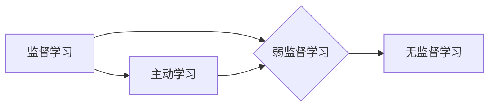

> 弱监督学习，半监督学习，主动学习，数据标注，深度学习，计算机视觉

## 1. 背景介绍

在机器学习领域，训练高质量的模型依赖于大量高质量的标注数据。然而，获取大量标注数据往往成本高昂、耗时费力。弱监督学习 (Weakly Supervised Learning) 应运而生，它利用少量标注数据和大量未标注数据，通过挖掘数据中的隐含结构和模式，训练出高效的机器学习模型。

弱监督学习相对于监督学习 (Supervised Learning) 和无监督学习 (Unsupervised Learning) 而言，具有以下特点：

* **数据标注成本低:** 只需对部分数据进行粗略的标注，例如图像的类别标签、文本的主题标签等，而不是对所有数据进行精细的标注。
* **数据利用率高:** 可以充分利用未标注数据，提高模型的泛化能力。
* **应用场景广泛:** 在图像识别、自然语言处理、语音识别等领域都有广泛的应用。

## 2. 核心概念与联系

弱监督学习的核心思想是利用数据中的**间接信息**来进行模型训练。这些间接信息可以是：

* **图像级标签:**  例如，对一组图像进行类别标签，即使没有对图像中的每个物体进行标注。
* **文本级标签:**  例如，对一篇文本进行主题标签，即使没有对文本中的每个句子进行标注。
* **图像的局部特征:**  例如，利用图像的边缘、纹理等局部特征来进行分类。
* **文本的语法结构:**  例如，利用文本的语法结构来进行情感分析。

**弱监督学习与其他学习方法的关系:**



## 3. 核心算法原理 & 具体操作步骤

### 3.1  算法原理概述

弱监督学习算法通常分为以下几种类型：

* **基于图像级标签的算法:**  例如，利用图像级标签进行图像分类、目标检测等任务。
* **基于文本级标签的算法:**  例如，利用文本级标签进行文本分类、情感分析等任务。
* **基于局部特征的算法:**  例如，利用图像的局部特征进行图像识别、目标检测等任务。
* **基于语法结构的算法:**  例如，利用文本的语法结构进行文本分类、情感分析等任务。

### 3.2  算法步骤详解

以基于图像级标签的弱监督学习算法为例，其具体操作步骤如下：

1. **数据预处理:** 对图像数据进行预处理，例如裁剪、缩放、增强等操作。
2. **图像级标签获取:**  获取图像的类别标签，例如，对一组图像进行类别标签，例如“猫”、“狗”、“鸟”等。
3. **特征提取:**  提取图像的特征，例如，使用卷积神经网络 (CNN) 提取图像的特征。
4. **模型训练:**  利用图像级标签和特征进行模型训练，例如，使用支持向量机 (SVM) 或深度学习模型进行训练。
5. **模型评估:**  利用测试集评估模型的性能，例如，计算准确率、召回率等指标。

### 3.3  算法优缺点

**优点:**

* 数据标注成本低
* 数据利用率高
* 能够训练出高效的机器学习模型

**缺点:**

* 模型性能可能不如监督学习模型
* 需要设计合适的算法和策略

### 3.4  算法应用领域

* **图像识别:**  例如，图像分类、目标检测、场景识别等。
* **自然语言处理:**  例如，文本分类、情感分析、机器翻译等。
* **语音识别:**  例如，语音转文本、语音命令识别等。
* **医疗诊断:**  例如，病灶检测、疾病诊断等。

## 4. 数学模型和公式 & 详细讲解 & 举例说明

### 4.1  数学模型构建

弱监督学习的数学模型通常基于**概率论**和**统计学**。

假设我们有一个数据集 D，包含 N 个样本，每个样本包含特征向量 x 和弱监督标签 y。弱监督标签可以是图像级标签、文本级标签等。

我们的目标是学习一个模型 f(x)，能够将特征向量 x 映射到预测标签 y。

### 4.2  公式推导过程

弱监督学习的损失函数通常是基于**交叉熵损失**或**KL散度**。

**交叉熵损失:**

$$
L = -\sum_{i=1}^{N} y_i \log(f(x_i))
$$

其中，$y_i$ 是真实标签，$f(x_i)$ 是模型预测的概率分布。

**KL散度:**

$$
L = \sum_{i=1}^{N} y_i \log \frac{y_i}{f(x_i)}
$$

其中，$y_i$ 是真实标签，$f(x_i)$ 是模型预测的概率分布。

### 4.3  案例分析与讲解

以基于图像级标签的弱监督学习为例，假设我们有一个数据集包含 1000 张图像，每个图像都有一个类别标签，例如“猫”、“狗”、“鸟”。

我们可以使用 CNN 模型提取图像特征，然后使用交叉熵损失函数训练模型。

在训练过程中，模型会学习到图像特征和类别标签之间的关系，最终能够将新的图像分类到正确的类别。

## 5. 项目实践：代码实例和详细解释说明

### 5.1  开发环境搭建

* Python 3.6+
* TensorFlow 2.0+
* PyTorch 1.0+
* CUDA 10.0+ (可选)

### 5.2  源代码详细实现

```python
import tensorflow as tf

# 定义模型
model = tf.keras.models.Sequential([
    tf.keras.layers.Conv2D(32, (3, 3), activation='relu', input_shape=(224, 224, 3)),
    tf.keras.layers.MaxPooling2D((2, 2)),
    tf.keras.layers.Conv2D(64, (3, 3), activation='relu'),
    tf.keras.layers.MaxPooling2D((2, 2)),
    tf.keras.layers.Flatten(),
    tf.keras.layers.Dense(10, activation='softmax')
])

# 定义损失函数和优化器
loss_fn = tf.keras.losses.CategoricalCrossentropy()
optimizer = tf.keras.optimizers.Adam()

# 训练模型
model.compile(loss=loss_fn, optimizer=optimizer)
model.fit(x_train, y_train, epochs=10)

# 评估模型
loss, accuracy = model.evaluate(x_test, y_test)
print('Loss:', loss)
print('Accuracy:', accuracy)
```

### 5.3  代码解读与分析

* **模型定义:** 使用 TensorFlow 的 Keras API 定义了一个简单的 CNN 模型。
* **损失函数和优化器:** 使用交叉熵损失函数和 Adam 优化器进行模型训练。
* **模型训练:** 使用 `model.fit()` 方法训练模型，输入训练数据和标签，并设置训练轮数。
* **模型评估:** 使用 `model.evaluate()` 方法评估模型在测试集上的性能。

### 5.4  运行结果展示

训练完成后，可以查看模型的损失值和准确率。

## 6. 实际应用场景

* **图像分类:**  例如，自动识别图像中的物体，例如猫、狗、车等。
* **目标检测:**  例如，在图像中定位和识别目标，例如人、车、交通标志等。
* **场景识别:**  例如，识别图像中的场景，例如街道、公园、室内等。
* **文本分类:**  例如，自动分类文本的主题，例如新闻、博客、评论等。
* **情感分析:**  例如，分析文本的情感倾向，例如正面、负面、中性等。

### 6.4  未来应用展望

弱监督学习在未来将有更广泛的应用，例如：

* **医疗诊断:**  利用弱监督学习技术，可以帮助医生更快、更准确地诊断疾病。
* **自动驾驶:**  利用弱监督学习技术，可以帮助自动驾驶汽车更好地理解周围环境。
* **个性化推荐:**  利用弱监督学习技术，可以为用户提供更个性化的产品和服务推荐。

## 7. 工具和资源推荐

### 7.1  学习资源推荐

* **书籍:**
    * "Weakly Supervised Learning" by  **C. Cortes and S. Mohri**
    * "Deep Learning" by **Ian Goodfellow, Yoshua Bengio, and Aaron Courville**
* **在线课程:**
    * **Coursera:**  "Machine Learning" by Andrew Ng
    * **edX:**  "Deep Learning" by Andrew Ng
* **博客:**
    * **Towards Data Science:** https://towardsdatascience.com/
    * **Machine Learning Mastery:** https://machinelearningmastery.com/

### 7.2  开发工具推荐

* **TensorFlow:** https://www.tensorflow.org/
* **PyTorch:** https://pytorch.org/
* **Keras:** https://keras.io/

### 7.3  相关论文推荐

* **"Semi-Supervised Learning" by  **Bengio, S., Grandvalet, Y., &  Schölkopf, B. (2004)**
* **"Weakly Supervised Learning with Deep Neural Networks" by  **Oquab, M., Bottou, L., Laptev, I., & Sivic, J. (2014)**

## 8. 总结：未来发展趋势与挑战

### 8.1  研究成果总结

弱监督学习近年来取得了显著的进展，在图像识别、自然语言处理等领域取得了优异的性能。

### 8.2  未来发展趋势

* **更有效的算法:**  研究更有效的弱监督学习算法，提高模型的性能和泛化能力。
* **更丰富的标注方式:**  探索更丰富的标注方式，例如图像级标签、文本级标签、局部特征标签等。
* **跨模态学习:**  研究跨模态弱监督学习，例如将图像和文本数据结合起来进行训练。

### 8.3  面临的挑战

* **标注数据质量:**  弱监督学习算法对标注数据质量要求较高，标注数据不准确会影响模型性能。
* **模型解释性:**  弱监督学习模型的解释性较差，难以理解模型的决策过程。
* **计算资源:**  训练大型弱监督学习模型需要大量的计算资源。

### 8.4  研究展望

弱监督学习是一个充满挑战和机遇的领域，未来将会有更多的研究和应用。

## 9. 附录：常见问题与解答

* **Q1: 弱监督学习和监督学习有什么区别？**

**A1:** 监督学习需要大量的标注数据，而弱监督学习只需要少量标注数据。

* **Q2: 弱监督学习的应用场景有哪些？**

**A2:** 弱监督学习的应用场景广泛，例如图像识别、自然语言处理、语音识别等。

* **Q3: 弱监督学习的未来发展趋势是什么？**

**A3:** 弱监督学习的未来发展趋势是算法更加高效、标注方式更加丰富、跨模态学习更加深入。


作者：禅与计算机程序设计艺术 / Zen and the Art of Computer Programming 
<end_of_turn>