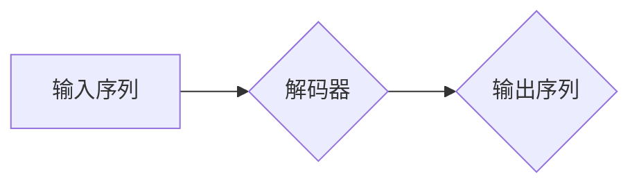

> GPT模型,解码器,Transformer,自回归语言模型,自然语言处理,文本生成

## 1. 背景介绍

近年来，自然语言处理（NLP）领域取得了令人瞩目的进展，其中生成式预训练语言模型（如GPT、BERT、T5等）扮演着越来越重要的角色。这些模型能够理解和生成人类语言，在文本生成、机器翻译、问答系统等领域展现出强大的能力。

GPT（Generative Pre-trained Transformer）模型，由OpenAI开发，是一种基于Transformer架构的自回归语言模型。它通过预训练的方式学习语言的语法和语义知识，能够生成流畅、连贯的文本。

本文将深入探讨GPT模型的解码器部分，详细介绍其核心概念、算法原理、数学模型以及代码实现。

## 2. 核心概念与联系

GPT模型的核心是Transformer架构，它通过多头注意力机制和前馈神经网络来处理序列数据。解码器是GPT模型的关键组成部分，负责根据输入序列生成目标序列。

**Mermaid 流程图：**



**核心概念：**

* **自回归语言模型：** 预测下一个词，基于之前已生成的词序列。
* **Transformer架构：** 使用多头注意力机制和前馈神经网络处理序列数据。
* **解码器：** 负责根据输入序列生成目标序列。
* **多头注意力机制：** 捕捉输入序列中不同词之间的关系。
* **前馈神经网络：** 对每个词进行非线性变换。

## 3. 核心算法原理 & 具体操作步骤

### 3.1  算法原理概述

GPT模型的解码器采用自回归的方式，逐个预测目标序列中的词。它接收一个输入序列，并通过解码器网络生成目标序列。解码器网络由多个Transformer编码器层组成，每个层包含多头注意力机制和前馈神经网络。

### 3.2  算法步骤详解

1. **输入处理：** 将输入序列转换为词嵌入向量。
2. **编码器输出：** 将编码器输出的隐藏状态作为解码器的输入。
3. **解码器层：** 每个解码器层包含多头注意力机制和前馈神经网络。
4. **自注意力机制：** 计算每个词与其他词之间的注意力权重，捕捉词之间的关系。
5. **前馈神经网络：** 对每个词进行非线性变换，生成新的词嵌入向量。
6. **输出层：** 将解码器输出的词嵌入向量转换为概率分布，预测下一个词。
7. **生成目标序列：** 根据概率分布选择下一个词，并将其添加到目标序列中。重复步骤6，直到生成结束标记。

### 3.3  算法优缺点

**优点：**

* **生成流畅的文本：** 自回归的方式能够生成连贯、流畅的文本。
* **捕捉长距离依赖关系：** 多头注意力机制能够捕捉输入序列中不同词之间的长距离依赖关系。
* **预训练能力：** 通过预训练的方式学习语言的语法和语义知识，能够在各种下游任务中取得良好的性能。

**缺点：**

* **训练成本高：** 预训练GPT模型需要大量的计算资源和数据。
* **生成文本可能存在偏差：** 预训练数据可能包含偏差，导致生成的文本也存在偏差。
* **难以控制生成文本的风格和内容：** 难以精确控制生成的文本的风格和内容。

### 3.4  算法应用领域

GPT模型的解码器在以下领域具有广泛的应用：

* **文本生成：** 生成故事、诗歌、文章等文本。
* **机器翻译：** 将一种语言翻译成另一种语言。
* **问答系统：** 回答用户提出的问题。
* **对话系统：** 与用户进行自然语言对话。
* **代码生成：** 生成代码片段。

## 4. 数学模型和公式 & 详细讲解 & 举例说明

### 4.1  数学模型构建

GPT模型的解码器采用自回归的方式，预测下一个词的概率分布。

**输入：**

* $x_1, x_2, ..., x_t$: 输入序列中的前t个词。

**输出：**

* $p(x_{t+1}|x_1, x_2, ..., x_t)$: 给定输入序列，预测下一个词$x_{t+1}$的概率分布。

**解码器网络结构：**

* 多个Transformer编码器层，每个层包含多头注意力机制和前馈神经网络。

### 4.2  公式推导过程

解码器网络的输出是一个词嵌入向量，该向量经过softmax函数处理，得到下一个词的概率分布。

$$
p(x_{t+1}|x_1, x_2, ..., x_t) = \text{softmax}(W_o \cdot h_t)
$$

其中：

* $h_t$: 解码器网络在时间步t的隐藏状态。
* $W_o$: 输出层的权重矩阵。

### 4.3  案例分析与讲解

假设输入序列为“The cat sat on the”，解码器网络需要预测下一个词。

1. 解码器网络接收输入序列，并通过多个Transformer编码器层进行处理，得到隐藏状态$h_t$。
2. 将隐藏状态$h_t$与输出层的权重矩阵$W_o$相乘，得到一个词嵌入向量。
3. 将词嵌入向量经过softmax函数处理，得到下一个词的概率分布。
4. 根据概率分布选择下一个词，例如“mat”，并将其添加到目标序列中。

## 5. 项目实践：代码实例和详细解释说明

### 5.1  开发环境搭建

* Python 3.7+
* PyTorch 1.7+
* CUDA 10.2+

### 5.2  源代码详细实现

```python
import torch
import torch.nn as nn

class Decoder(nn.Module):
    def __init__(self, vocab_size, embedding_dim, hidden_dim, num_layers):
        super(Decoder, self).__init__()
        self.embedding = nn.Embedding(vocab_size, embedding_dim)
        self.rnn = nn.GRU(embedding_dim, hidden_dim, num_layers)
        self.fc = nn.Linear(hidden_dim, vocab_size)

    def forward(self, input, hidden):
        embedded = self.embedding(input)
        output, hidden = self.rnn(embedded, hidden)
        output = self.fc(output)
        return output, hidden
```

### 5.3  代码解读与分析

* `__init__`方法：初始化解码器网络的各个组件，包括词嵌入层、GRU层和全连接层。
* `forward`方法：定义解码器网络的正向传播过程。
    * 首先将输入词转换为词嵌入向量。
    * 然后将词嵌入向量输入GRU层，更新隐藏状态。
    * 最后将隐藏状态输入全连接层，得到下一个词的概率分布。

### 5.4  运行结果展示

运行解码器网络，可以得到下一个词的概率分布。

## 6. 实际应用场景

GPT模型的解码器在以下实际应用场景中发挥着重要作用：

* **聊天机器人：** 

GPT模型的解码器可以生成自然流畅的对话文本，使聊天机器人更加人性化。

* **文本摘要：** 

GPT模型的解码器可以根据输入文本生成简洁的摘要，提取文本的关键信息。

* **机器翻译：** 

GPT模型的解码器可以将一种语言翻译成另一种语言，提高机器翻译的准确性和流畅度。

### 6.4  未来应用展望

随着GPT模型的不断发展，其解码器在未来将有更广泛的应用场景：

* **代码生成：** 

GPT模型的解码器可以根据自然语言描述生成代码，提高软件开发效率。

* **创意写作：** 

GPT模型的解码器可以辅助人类进行创意写作，例如生成诗歌、剧本等。

* **个性化教育：** 

GPT模型的解码器可以根据学生的学习情况生成个性化的学习内容，提高学习效果。

## 7. 工具和资源推荐

### 7.1  学习资源推荐

* **论文：**
    * Attention Is All You Need (Vaswani et al., 2017)
    * Language Models are Few-Shot Learners (Brown et al., 2020)
* **博客：**
    * The Illustrated Transformer (Jay Alammar)
    * OpenAI Blog

### 7.2  开发工具推荐

* **PyTorch:** 深度学习框架
* **Hugging Face Transformers:** 预训练模型库

### 7.3  相关论文推荐

* **BERT:** Pre-training of Deep Bidirectional Transformers for Language Understanding (Devlin et al., 2018)
* **T5:** Exploring the Limits of Transfer Learning with a Unified Text-to-Text Transformer (Raffel et al., 2019)

## 8. 总结：未来发展趋势与挑战

### 8.1  研究成果总结

GPT模型的解码器在自然语言处理领域取得了显著的成果，能够生成流畅、连贯的文本，并应用于多种下游任务。

### 8.2  未来发展趋势

* **模型规模更大：** 预训练模型规模将继续扩大，提升模型的性能和泛化能力。
* **多模态学习：** 将文本与其他模态（如图像、音频）相结合，构建多模态预训练模型。
* **可解释性增强：** 研究GPT模型的决策机制，提高模型的可解释性和可控性。

### 8.3  面临的挑战

* **数据偏见：** 预训练数据可能包含偏见，导致模型生成带有偏见的文本。
* **计算资源消耗：** 训练大型预训练模型需要大量的计算资源。
* **伦理问题：** GPT模型的应用可能引发伦理问题，例如生成虚假信息、侵犯隐私等。

### 8.4  研究展望

未来研究将重点关注解决上述挑战，提升GPT模型的安全性、可靠性和可解释性，使其更好地服务于人类社会。

## 9. 附录：常见问题与解答

* **Q：GPT模型的解码器是如何工作的？**

* **A：** GPT模型的解码器采用自回归的方式，逐个预测目标序列中的词。它接收一个输入序列，并通过解码器网络生成目标序列。解码器网络由多个Transformer编码器层组成，每个层包含多头注意力机制和前馈神经网络。

* **Q：GPT模型的训练数据是什么？**

* **A：** GPT模型的训练数据通常是大量的文本数据，例如书籍、文章、网站内容等。

* **Q：如何使用GPT模型进行文本生成？**

* **A：** 可以使用预训练的GPT模型进行文本生成。可以使用Hugging Face Transformers库加载预训练模型，并根据需要修改模型参数进行微调。

作者：禅与计算机程序设计艺术 / Zen and the Art of Computer Programming


<end_of_turn>