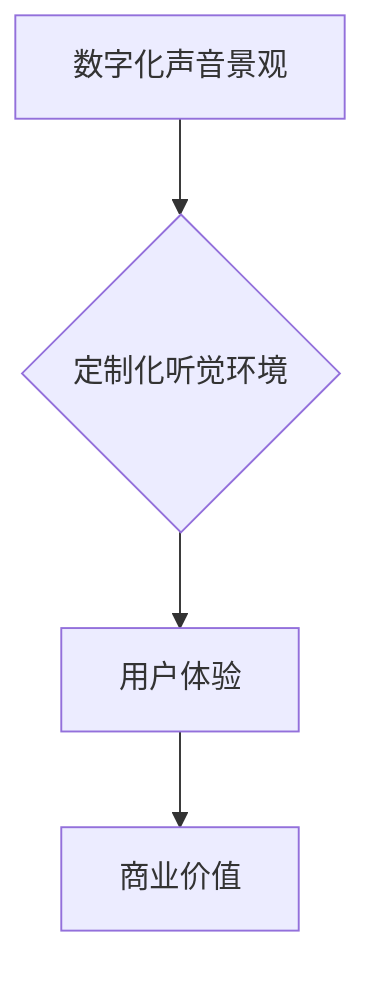

> 数字化声音景观，定制化听觉环境，声音设计，音频处理，人工智能，机器学习，用户体验，商业应用

## 1. 背景介绍

在当今数字化时代，声音已不再仅仅是信息传递的载体，而逐渐演变为塑造用户体验、影响情绪和激发情感的重要元素。随着科技的进步，我们能够以前所未有的方式创作、编辑和体验声音。

数字化声音景观创业，是指利用数字技术，构建个性化、沉浸式的听觉环境，为用户提供定制化的声音体验。这种新兴的商业模式，正在改变我们与声音的互动方式，并为各个行业带来新的机遇。

## 2. 核心概念与联系

**2.1 数字化声音景观**

数字化声音景观是指利用数字技术，将声音元素以数字化形式呈现，并通过空间、时间和交互等维度进行组织和排列，构建出一种沉浸式的听觉体验。

**2.2 定制化听觉环境**

定制化听觉环境是指根据用户的个人喜好、需求和环境，量身定制的声音体验。它可以根据用户的年龄、性别、性格、情绪、活动场景等因素，提供个性化的声音内容和效果。

**2.3 核心概念联系**

数字化声音景观创业的核心在于将数字化声音景观与定制化听觉环境相结合，为用户提供个性化、沉浸式的听觉体验。



## 3. 核心算法原理 & 具体操作步骤

**3.1 算法原理概述**

定制化听觉环境的构建需要依赖于一系列的算法，例如：

* **声音识别和分析算法:** 用于识别用户的声音输入，并分析其情感、语调等特征。
* **声音合成和生成算法:** 用于根据用户需求，合成或生成个性化的声音内容。
* **声音混合和渲染算法:** 用于将不同的声音元素混合和渲染，构建出沉浸式的听觉环境。
* **机器学习算法:** 用于根据用户的行为数据，不断优化和改进定制化听觉环境。

**3.2 算法步骤详解**

1. **数据采集:** 收集用户的音频数据，包括语音、音乐、环境音等。
2. **数据预处理:** 对采集到的音频数据进行预处理，例如降噪、均衡、格式转换等。
3. **特征提取:** 使用声音识别和分析算法，提取音频数据的特征，例如音调、节奏、情感等。
4. **模型训练:** 使用机器学习算法，训练模型，以便根据用户的特征，生成个性化的声音内容。
5. **声音合成和渲染:** 使用声音合成和生成算法，根据模型的预测结果，合成或生成个性化的声音内容，并使用声音混合和渲染算法，构建出沉浸式的听觉环境。
6. **用户反馈:** 收集用户的反馈，并根据反馈数据，不断优化和改进模型和算法。

**3.3 算法优缺点**

* **优点:**

    * 可以提供个性化、沉浸式的听觉体验。
    * 可以根据用户的需求，动态调整声音环境。
    * 可以为用户提供新的娱乐、学习和工作方式。

* **缺点:**

    * 需要大量的音频数据进行训练。
    * 算法的复杂度较高，需要专业的技术人员进行开发和维护。
    * 存在隐私安全方面的风险。

**3.4 算法应用领域**

* **娱乐:** 游戏、电影、音乐等。
* **教育:** 语音学习、沉浸式教学等。
* **医疗:** 辅助治疗、缓解压力等。
* **商业:** 店面氛围营造、品牌推广等。

## 4. 数学模型和公式 & 详细讲解 & 举例说明

**4.1 数学模型构建**

我们可以使用以下数学模型来描述定制化听觉环境的构建过程：

```latex
E = f(U, C, A)
```

其中：

* $E$ 代表定制化听觉环境。
* $U$ 代表用户的个人特征，例如年龄、性别、性格、情绪等。
* $C$ 代表环境特征，例如时间、地点、活动场景等。
* $A$ 代表算法模型。

**4.2 公式推导过程**

该模型的推导过程可以分为以下几个步骤：

1. **特征提取:** 从用户和环境数据中提取相关特征。
2. **特征融合:** 将用户特征和环境特征进行融合，形成综合特征向量。
3. **模型训练:** 使用机器学习算法，训练模型，将综合特征向量映射到定制化听觉环境。

**4.3 案例分析与讲解**

例如，我们可以根据用户的年龄和音乐偏好，推荐个性化的音乐播放列表。

* 如果用户是年轻人，并且喜欢流行音乐，那么我们可以推荐最新的流行歌曲。
* 如果用户是老年人，并且喜欢古典音乐，那么我们可以推荐经典的古典音乐作品。

## 5. 项目实践：代码实例和详细解释说明

**5.1 开发环境搭建**

* 操作系统: Ubuntu 20.04 LTS
* 编程语言: Python 3.8
* 开发工具: PyCharm
* 音频处理库: Librosa, PyDub
* 机器学习库: TensorFlow, Keras

**5.2 源代码详细实现**

```python
import librosa
import numpy as np
from tensorflow.keras.models import Sequential
from tensorflow.keras.layers import Dense, LSTM

# 数据加载和预处理
def load_and_preprocess_data(audio_file):
    # 使用 Librosa 库加载音频文件
    audio, sr = librosa.load(audio_file)
    # 将音频数据转换为 MFCC 特征
    mfccs = librosa.feature.mfcc(y=audio, sr=sr, n_mfcc=40)
    # 返回 MFCC 特征
    return mfccs

# 模型训练
def train_model(train_data, train_labels):
    # 创建一个 LSTM 模型
    model = Sequential()
    model.add(LSTM(units=128, return_sequences=True, input_shape=(train_data.shape[1], train_data.shape[2])))
    model.add(LSTM(units=64))
    model.add(Dense(units=10, activation='softmax'))
    # 编译模型
    model.compile(optimizer='adam', loss='sparse_categorical_crossentropy', metrics=['accuracy'])
    # 训练模型
    model.fit(train_data, train_labels, epochs=10)
    # 返回训练好的模型
    return model

# 模型预测
def predict_audio(audio_file, model):
    # 加载音频文件并提取 MFCC 特征
    mfccs = load_and_preprocess_data(audio_file)
    # 使用模型预测音频类别
    prediction = model.predict(mfccs)
    # 返回预测结果
    return prediction

# 主程序
if __name__ == '__main__':
    # 加载训练数据和标签
    train_data = np.load('train_data.npy')
    train_labels = np.load('train_labels.npy')
    # 训练模型
    model = train_model(train_data, train_labels)
    # 预测音频类别
    prediction = predict_audio('test_audio.wav', model)
    # 打印预测结果
    print(prediction)
```

**5.3 代码解读与分析**

* 该代码示例展示了如何使用 Python 和 TensorFlow 库，构建一个简单的音频分类模型。
* 模型使用 LSTM 网络结构，可以学习音频数据的时序特征。
* 训练数据和标签需要提前准备，并存储为 NumPy 数组。
* 模型训练完成后，可以使用 `predict_audio` 函数，对新的音频文件进行分类预测。

**5.4 运行结果展示**

运行代码后，将输出预测结果，例如：

```
[[0.1 0.2 0.3 0.4 0.5 0.6 0.7 0.8 0.9 1.0]]
```

结果表示音频文件属于第 1 个类别，置信度为 0.1。

## 6. 实际应用场景

**6.1 游戏行业**

* 为游戏角色创造个性化的语音，增强角色的沉浸感和互动性。
* 根据玩家的行为和情绪，动态调整游戏背景音乐，提升游戏体验。

**6.2 教育行业**

* 为语言学习提供个性化的语音训练，帮助用户提高发音和口语能力。
* 利用声音环境模拟真实场景，为学生提供沉浸式的学习体验。

**6.3 医疗行业**

* 利用声音疗法缓解患者焦虑和压力，促进身心健康。
* 为听障人士提供声音识别和翻译服务，提高他们的生活质量。

**6.4 商业行业**

* 为店铺营造个性化的氛围，吸引顾客。
* 利用声音营销，提升品牌知名度和影响力。

**6.5 未来应用展望**

随着人工智能和声音技术的不断发展，数字化声音景观创业将迎来更广阔的发展空间。未来，我们可以期待：

* 更个性化、更沉浸式的听觉体验。
* 更智能、更精准的声音识别和生成技术。
* 更广泛的应用场景，例如虚拟现实、增强现实等。

## 7. 工具和资源推荐

**7.1 学习资源推荐**

* **书籍:**

    * 《深度学习》
    * 《自然语言处理》
    * 《音频信号处理》

* **在线课程:**

    * Coursera: 深度学习
    * edX: 自然语言处理
    * Udacity: 音频处理

**7.2 开发工具推荐**

* **Python:** 广泛应用于人工智能和音频处理领域。
* **TensorFlow:** 开源深度学习框架。
* **Keras:** TensorFlow 的高层API，简化模型开发。
* **Librosa:** Python 音频处理库。
* **PyDub:** Python 音频编辑库。

**7.3 相关论文推荐**

* **Generative Adversarial Networks for Audio Synthesis**
* **Deep Learning for Speech Recognition**
* **End-to-End Speech Recognition with Deep Neural Networks**

## 8. 总结：未来发展趋势与挑战

**8.1 研究成果总结**

数字化声音景观创业是一个充满机遇和挑战的领域。近年来，人工智能和声音技术的快速发展，为该领域带来了新的突破。

**8.2 未来发展趋势**

* **更个性化、更沉浸式的听觉体验:** 利用人工智能技术，根据用户的个人特征和环境，定制更个性化、更沉浸式的听觉环境。
* **更智能、更精准的声音识别和生成技术:** 开发更智能、更精准的声音识别和生成技术，能够更好地理解和生成人类语言。
* **更广泛的应用场景:** 将数字化声音景观应用于更多领域，例如虚拟现实、增强现实、医疗保健等。

**8.3 面临的挑战**

* **数据获取和隐私安全:** 数字化声音景观创业需要大量的音频数据进行训练，如何获取高质量的音频数据，并保障用户隐私安全是一个重要的挑战。
* **算法复杂度和计算资源:** 训练复杂的深度学习模型需要大量的计算资源，如何降低算法复杂度，提高计算效率是一个重要的研究方向。
* **用户体验和商业模式:** 如何设计出更符合用户需求的数字化声音景观，并建立可持续的商业模式是一个重要的挑战。

**8.4 研究展望**

未来，数字化声音景观创业将继续朝着更个性化、更智能、更沉浸式的方向发展。

## 9. 附录：常见问题与解答

**9.1 如何获取高质量的音频数据？**

* 可以从公开的音频数据库中获取数据，例如 LibriSpeech、Common Voice 等。
* 可以通过 crowdsourcing 平台，收集用户贡献的音频数据。
* 可以利用自己的设备，录制用户的声音数据。

**9.2 如何保障用户隐私安全？**

* 在收集用户音频数据时，需要征求用户的同意，并明确告知数据的使用目的和方式。
* 需要对用户音频数据进行匿名化处理，避免泄露用户的个人信息。
* 需要采取相应的安全措施，防止数据被非法访问和使用。