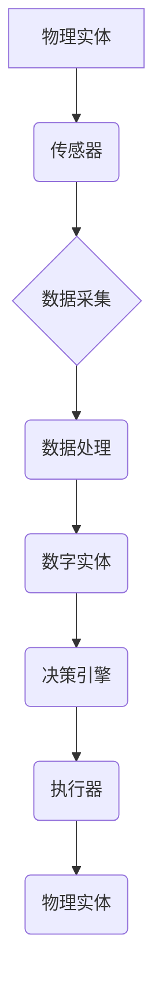

> 数字实体、自动化、人工智能、机器学习、数据驱动、数字孪生、工业互联网、未来趋势

## 1. 背景介绍

数字时代，数据正在成为不可或缺的生产要素。随着物联网、云计算、大数据等技术的蓬勃发展，越来越多的物理实体被数字化，并以数字形式存在于网络空间中。这些数字化的实体被称为“数字实体”。数字实体不仅能够反映物理实体的实时状态，还能模拟物理实体的行为，并进行预测和优化。

数字实体的自动化前景广阔，它将深刻地改变我们的生产生活方式。例如，在工业领域，数字实体可以实现智能制造，提高生产效率和产品质量；在城市管理领域，数字实体可以帮助我们构建智慧城市，优化资源配置和服务效率；在医疗领域，数字实体可以辅助医生诊断疾病，提高医疗水平。

## 2. 核心概念与联系

**2.1 数字实体的概念**

数字实体是指以数字化形式表示物理实体或抽象概念的虚拟模型。它包含了物理实体的结构、功能、行为等信息，并能够与物理实体进行交互。

**2.2 自动化的概念**

自动化是指利用技术手段，使生产或工作过程无需人工干预即可完成。自动化可以提高效率、降低成本、提高质量，并释放人力资源用于更复杂的任务。

**2.3 数字实体自动化的联系**

数字实体自动化是指利用人工智能、机器学习等技术，使数字实体能够自动完成预设的任务，无需人工干预。

**2.4 数字实体自动化架构**



## 3. 核心算法原理 & 具体操作步骤

**3.1 算法原理概述**

数字实体自动化主要依赖于人工智能和机器学习算法。这些算法能够从海量数据中学习，并自动识别模式和规律，从而实现对数字实体的控制和优化。常见的算法包括：

* **监督学习:** 利用标记数据训练模型，预测未知数据。
* **无监督学习:** 从未标记数据中发现模式和结构。
* **强化学习:** 通过试错学习，优化策略以获得最大奖励。

**3.2 算法步骤详解**

1. **数据采集:** 从物理实体收集相关数据，例如传感器数据、图像数据、文本数据等。
2. **数据预处理:** 对采集到的数据进行清洗、转换、特征提取等操作，使其适合算法训练。
3. **模型训练:** 选择合适的算法，利用预处理后的数据训练模型。
4. **模型评估:** 使用测试数据评估模型的性能，并进行调参优化。
5. **模型部署:** 将训练好的模型部署到实际应用场景中，实现对数字实体的自动化控制。

**3.3 算法优缺点**

* **优点:** 能够自动学习和优化，提高效率和精度。
* **缺点:** 需要大量数据进行训练，算法复杂度高，部署成本较高。

**3.4 算法应用领域**

* **工业自动化:** 智能制造、设备预测维护、生产过程优化。
* **城市管理:** 交通流量预测、环境监测、公共安全保障。
* **医疗保健:** 疾病诊断、个性化治疗、药物研发。

## 4. 数学模型和公式 & 详细讲解 & 举例说明

**4.1 数学模型构建**

数字实体自动化的数学模型通常基于统计学、概率论和控制论等学科。例如，可以构建一个状态空间模型来描述数字实体的动态行为，并利用控制理论设计控制策略来实现对数字实体的自动化控制。

**4.2 公式推导过程**

假设一个数字实体的状态可以用一个向量 $x(t)$ 表示，其状态转移方程为：

$$
x(t+1) = f(x(t), u(t))
$$

其中，$u(t)$ 是控制输入，$f$ 是状态转移函数。

目标是设计一个控制策略 $u(t)$，使得数字实体的状态 $x(t)$ 能够达到预设的目标状态 $x_d$。

可以使用最优控制理论来设计控制策略，例如，利用动态规划方法求解最优控制律。

**4.3 案例分析与讲解**

例如，在工业机器人控制中，可以构建一个状态空间模型来描述机器人的运动状态，并利用最优控制理论设计控制策略，使得机器人能够精确地完成预设的任务。

## 5. 项目实践：代码实例和详细解释说明

**5.1 开发环境搭建**

* 操作系统: Ubuntu 20.04
* 编程语言: Python 3.8
* 库依赖: TensorFlow, NumPy, Pandas

**5.2 源代码详细实现**

```python
import tensorflow as tf
from tensorflow.keras.models import Sequential
from tensorflow.keras.layers import Dense

# 构建一个简单的多层感知机模型
model = Sequential()
model.add(Dense(128, activation='relu', input_shape=(10,)))
model.add(Dense(64, activation='relu'))
model.add(Dense(1))

# 编译模型
model.compile(optimizer='adam', loss='mse')

# 训练模型
model.fit(X_train, y_train, epochs=100)

# 评估模型
loss = model.evaluate(X_test, y_test)
print('测试损失:', loss)

# 使用模型进行预测
predictions = model.predict(X_new)
```

**5.3 代码解读与分析**

这段代码实现了数字实体自动化的一个简单例子，利用多层感知机模型预测一个连续变量的值。

* 首先，构建了一个简单的多层感知机模型，包含三个全连接层。
* 然后，使用 Adam 优化器和均方误差损失函数对模型进行编译。
* 接着，使用训练数据对模型进行训练，训练100个 epochs。
* 最后，使用测试数据评估模型的性能，并使用模型对新的数据进行预测。

**5.4 运行结果展示**

运行结果展示了模型的训练过程和预测结果，例如，训练损失随 epochs 的变化趋势，以及模型对测试数据的预测精度。

## 6. 实际应用场景

**6.1 工业自动化**

* **智能制造:** 数字实体可以模拟生产过程，优化生产流程，提高生产效率和产品质量。
* **设备预测维护:** 数字实体可以分析设备运行数据，预测设备故障，提前进行维护，降低设备故障率。

**6.2 城市管理**

* **交通流量预测:** 数字实体可以分析交通数据，预测交通流量，优化交通信号灯控制，缓解交通拥堵。
* **环境监测:** 数字实体可以收集环境数据，监测空气质量、水质等，帮助城市管理者制定环境保护政策。

**6.3 医疗保健**

* **疾病诊断:** 数字实体可以分析患者的医疗数据，辅助医生诊断疾病，提高诊断准确率。
* **个性化治疗:** 数字实体可以根据患者的基因信息、生活习惯等数据，制定个性化的治疗方案。

**6.4 未来应用展望**

数字实体自动化将应用于越来越多的领域，例如：

* **教育:** 数字实体可以提供个性化的学习体验，帮助学生更好地理解知识。
* **金融:** 数字实体可以分析金融数据，识别欺诈行为，提高金融安全。
* **娱乐:** 数字实体可以创建更逼真的虚拟世界，为用户提供更沉浸式的娱乐体验。

## 7. 工具和资源推荐

**7.1 学习资源推荐**

* **书籍:**
    * 《深度学习》
    * 《机器学习》
    * 《人工智能：一种现代方法》
* **在线课程:**
    * Coursera: 深度学习
    * edX: 机器学习
    * Udacity: 人工智能工程师

**7.2 开发工具推荐**

* **编程语言:** Python
* **机器学习库:** TensorFlow, PyTorch, scikit-learn
* **数据可视化工具:** Matplotlib, Seaborn

**7.3 相关论文推荐**

* **数字孪生:**
    * "Digital Twin: A Comprehensive Review"
    * "Digital Twin: Concepts, Methodologies, Tools, and Applications"
* **工业互联网:**
    * "Industrial Internet of Things: A Survey"
    * "Industrial Internet of Things: Architecture, Technologies, and Applications"

## 8. 总结：未来发展趋势与挑战

**8.1 研究成果总结**

数字实体自动化技术取得了显著进展，在工业、城市管理、医疗保健等领域取得了成功应用。

**8.2 未来发展趋势**

* **更智能的算法:** 研究更智能、更鲁棒的机器学习算法，提高数字实体的自动化能力。
* **更强大的计算能力:** 利用云计算、边缘计算等技术，提供更强大的计算能力，支持更复杂的数字实体模型。
* **更广泛的应用场景:** 将数字实体自动化技术应用于更多领域，例如教育、金融、娱乐等。

**8.3 面临的挑战**

* **数据安全:** 数字实体需要处理大量敏感数据，数据安全是一个重要的挑战。
* **算法可解释性:** 许多机器学习算法是黑箱模型，难以解释其决策过程，这可能会导致信任问题。
* **伦理问题:** 数字实体的自动化可能会带来一些伦理问题，例如，算法偏见、工作岗位替代等。

**8.4 研究展望**

未来，数字实体自动化技术将继续发展，并对我们的生活产生更深远的影响。我们需要加强对该技术的研究，并积极应对其带来的挑战，确保其安全、可持续发展。

## 9. 附录：常见问题与解答

**9.1 什么是数字孪生？**

数字孪生是指一个与物理实体具有相同结构、功能和行为的虚拟模型。它可以实时反映物理实体的状态，并进行模拟和预测。

**9.2 数字实体自动化有哪些应用场景？**

数字实体自动化可以应用于工业自动化、城市管理、医疗保健等多个领域。

**9.3 数字实体自动化的未来发展趋势是什么？**

数字实体自动化的未来发展趋势包括更智能的算法、更强大的计算能力和更广泛的应用场景。

作者：禅与计算机程序设计艺术 / Zen and the Art of Computer Programming


<end_of_turn>