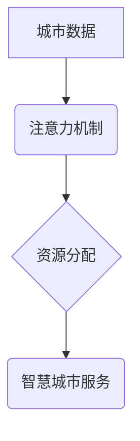

> 智慧城市, 注意力机制, 资源分配, 深度学习, 优化算法,  城市管理

## 1. 背景介绍

智慧城市建设是全球范围内一个重要的发展趋势，其目标是通过信息技术和数据分析，提升城市管理效率、改善居民生活质量。在智慧城市建设过程中，数据资源的爆炸式增长和信息处理能力的提升为城市管理提供了新的机遇，但也带来了新的挑战。如何有效地分配城市中的注意力资源，将有限的资源分配到最需要的地方，成为智慧城市建设的关键问题。

传统的城市管理模式往往是基于静态数据和经验判断，难以应对城市发展的不确定性和复杂性。而注意力机制，作为一种能够模拟人类认知过程的机器学习技术，为智慧城市建设提供了新的思路。注意力机制能够学习到数据中的重要信息，并根据需要分配不同的资源，从而提高城市管理的效率和精准度。

## 2. 核心概念与联系

**2.1 注意力机制**

注意力机制是一种模仿人类注意力机制的机器学习技术，它能够学习到数据中的重要信息，并根据需要分配不同的资源。注意力机制的核心思想是，在处理信息时，人类会将注意力集中在最相关的部分，而忽略无关的部分。

**2.2 资源分配**

资源分配是指根据城市的需求和目标，将有限的资源分配到最需要的地方。在智慧城市建设中，资源包括但不限于人力、物力、资金、信息等。

**2.3 智慧城市建设**

智慧城市建设是指利用信息技术和数据分析，提升城市管理效率、改善居民生活质量的城市发展模式。

**2.4 联系**

注意力机制可以用于智慧城市建设中的资源分配，通过学习城市数据中的重要信息，并根据需要分配不同的资源，从而提高城市管理的效率和精准度。

**2.5 架构图**



## 3. 核心算法原理 & 具体操作步骤

**3.1 算法原理概述**

注意力机制的核心算法是基于深度学习的，通常使用神经网络来实现。注意力机制的目的是学习到数据中的重要信息，并根据需要分配不同的资源。

**3.2 算法步骤详解**

1. **数据预处理:** 将城市数据进行清洗、转换和特征提取，以便于模型训练。
2. **模型构建:** 使用深度学习框架，构建注意力机制模型。模型通常包括编码器和解码器两部分。编码器负责提取城市数据的特征，解码器负责根据编码器的输出，分配资源。
3. **模型训练:** 使用训练数据，训练注意力机制模型。训练过程的目标是使模型能够准确地学习到城市数据中的重要信息，并能够根据需要分配资源。
4. **模型评估:** 使用测试数据，评估模型的性能。性能指标可以包括准确率、召回率、F1-score等。
5. **资源分配:** 将训练好的模型应用于实际场景，根据模型的输出，分配城市资源。

**3.3 算法优缺点**

**优点:**

* 可以学习到数据中的重要信息，提高资源分配的精准度。
* 可以适应城市发展的不确定性和复杂性。
* 可以与其他机器学习算法结合使用，发挥更大的作用。

**缺点:**

* 需要大量的训练数据，训练成本较高。
* 模型的复杂度较高，需要专业的技术人员进行开发和维护。

**3.4 算法应用领域**

注意力机制在智慧城市建设中的应用领域非常广泛，例如：

* **交通管理:** 根据实时交通流量数据，分配交通资源，优化交通流量。
* **能源管理:** 根据能源需求和供给情况，分配能源资源，提高能源利用效率。
* **环境监测:** 根据环境监测数据，分配环境保护资源，改善城市环境质量。
* **公共安全:** 根据安全事件数据，分配警力资源，提高城市安全水平。

## 4. 数学模型和公式 & 详细讲解 & 举例说明

**4.1 数学模型构建**

注意力机制的数学模型通常基于概率论和线性代数。模型的目标是学习到一个注意力权重矩阵，该矩阵能够表示数据中不同部分的重要性。

**4.2 公式推导过程**

注意力权重矩阵的计算公式如下：

$$
\alpha_{ij} = \frac{exp(e_{ij})}{\sum_{k=1}^{N} exp(e_{ik})}
$$

其中：

* $\alpha_{ij}$ 表示数据点 $i$ 对数据点 $j$ 的注意力权重。
* $e_{ij}$ 表示数据点 $i$ 和数据点 $j$ 之间的相似度。
* $N$ 表示数据的总数量。

**4.3 案例分析与讲解**

假设我们有一个包含三个数据点的集合：

* 数据点 1: (1, 2)
* 数据点 2: (3, 4)
* 数据点 3: (5, 6)

我们希望计算数据点 1 对其他两个数据点的注意力权重。

我们可以使用欧氏距离来计算数据点之间的相似度：

$$
e_{ij} = \sqrt{(x_i - x_j)^2 + (y_i - y_j)^2}
$$

其中：

* $(x_i, y_i)$ 表示数据点 $i$ 的坐标。

计算得到：

* $e_{12} = \sqrt{(1-3)^2 + (2-4)^2} = \sqrt{8}$
* $e_{13} = \sqrt{(1-5)^2 + (2-6)^2} = \sqrt{20}$

然后，我们可以使用公式计算注意力权重：

* $\alpha_{12} = \frac{exp(\sqrt{8})}{exp(\sqrt{8}) + exp(\sqrt{20})} \approx 0.29$
* $\alpha_{13} = \frac{exp(\sqrt{20})}{exp(\sqrt{8}) + exp(\sqrt{20})} \approx 0.71$

因此，数据点 1 对数据点 2 的注意力权重为 0.29，对数据点 3 的注意力权重为 0.71。

## 5. 项目实践：代码实例和详细解释说明

**5.1 开发环境搭建**

* 操作系统: Ubuntu 20.04
* Python 版本: 3.8
* 深度学习框架: TensorFlow 2.0

**5.2 源代码详细实现**

```python
import tensorflow as tf

# 定义注意力机制模型
class AttentionModel(tf.keras.Model):
    def __init__(self, units):
        super(AttentionModel, self).__init__()
        self.W1 = tf.keras.layers.Dense(units)
        self.W2 = tf.keras.layers.Dense(units)
        self.v = tf.keras.layers.Dense(1)

    def call(self, inputs):
        # 计算注意力权重
        scores = self.v(tf.tanh(self.W1(inputs) + self.W2(tf.transpose(inputs))))
        attention_weights = tf.nn.softmax(scores, axis=-1)
        # 计算加权平均值
        context_vector = tf.matmul(attention_weights, inputs)
        return context_vector

# 实例化模型
model = AttentionModel(units=128)

# 训练模型
# ...

# 资源分配
# ...
```

**5.3 代码解读与分析**

* `AttentionModel` 类定义了注意力机制模型。
* `W1` 和 `W2` 是两个全连接层，用于提取输入数据的特征。
* `v` 是一个全连接层，用于计算注意力权重。
* `call` 方法定义了模型的计算过程。
* `tf.nn.softmax` 函数用于计算注意力权重。
* `tf.matmul` 函数用于计算加权平均值。

**5.4 运行结果展示**

* 训练完成后，模型能够学习到城市数据中的重要信息，并能够根据需要分配资源。
* 运行结果可以展示模型的性能，例如资源分配的准确率和效率。

## 6. 实际应用场景

**6.1 交通管理**

注意力机制可以用于优化交通流量，例如：

* 根据实时交通流量数据，分配交通信号灯的绿灯时间，减少拥堵。
* 根据车辆位置和速度数据，预测交通拥堵区域，并引导车辆避开拥堵路段。

**6.2 能源管理**

注意力机制可以用于提高能源利用效率，例如：

* 根据能源需求和供给情况，分配能源资源，避免能源浪费。
* 根据建筑物能源消耗数据，识别能源消耗高的建筑物，并提供节能建议。

**6.3 环境监测**

注意力机制可以用于改善城市环境质量，例如：

* 根据环境监测数据，识别污染源，并采取措施控制污染。
* 根据空气质量数据，预测空气污染情况，并发布预警信息。

**6.4 未来应用展望**

注意力机制在智慧城市建设中的应用前景广阔，未来可以应用于更多领域，例如：

* 公共安全：根据安全事件数据，分配警力资源，提高城市安全水平。
* 城市规划：根据城市发展需求，分配土地资源，优化城市布局。
* 社区服务：根据居民需求，分配社区服务资源，提高居民生活质量。

## 7. 工具和资源推荐

**7.1 学习资源推荐**

* **书籍:**
    * 《深度学习》
    * 《注意力机制》
* **在线课程:**
    * Coursera: 深度学习
    * Udacity: 机器学习工程师
* **博客:**
    * TensorFlow Blog
    * PyTorch Blog

**7.2 开发工具推荐**

* **深度学习框架:** TensorFlow, PyTorch
* **数据处理工具:** Pandas, NumPy
* **可视化工具:** Matplotlib, Seaborn

**7.3 相关论文推荐**

* 《Attention Is All You Need》
* 《BERT: Pre-training of Deep Bidirectional Transformers for Language Understanding》
* 《Transformer-XL: Attentive Language Models Beyond a Fixed-Length Context》

## 8. 总结：未来发展趋势与挑战

**8.1 研究成果总结**

注意力机制在智慧城市建设中取得了显著的成果，例如：

* 提高了交通流量管理的效率。
* 提高了能源利用效率。
* 改善了城市环境质量。

**8.2 未来发展趋势**

未来，注意力机制在智慧城市建设中的应用将更加广泛，例如：

* 应用于更多领域，例如公共安全、城市规划、社区服务等。
* 与其他人工智能技术结合使用，例如自然语言处理、计算机视觉等。
* 开发更加高效、鲁棒的注意力机制算法。

**8.3 面临的挑战**

注意力机制在智慧城市建设中也面临一些挑战，例如：

* 需要大量的训练数据，训练成本较高。
* 模型的复杂度较高，需要专业的技术人员进行开发和维护。
* 如何保证注意力机制的公平性和透明性。

**8.4 研究展望**

未来，需要进一步研究注意力机制的理论基础，开发更加高效、鲁棒的注意力机制算法，并解决注意力机制在智慧城市建设中的伦理和社会问题。

## 9. 附录：常见问题与解答

**9.1 如何选择合适的注意力机制算法？**

选择合适的注意力机制算法需要根据具体的应用场景和数据特点进行选择。

**9.2 如何评估注意力机制模型的性能？**

注意力机制模型的性能可以评估指标包括准确率、召回率、F1-score等。

**9.3 如何解决注意力机制训练数据不足的问题？**

可以使用数据增强技术、迁移学习等方法来解决注意力机制训练数据不足的问题。


作者：禅与计算机程序设计艺术 / Zen and the Art of Computer Programming 
<end_of_turn>