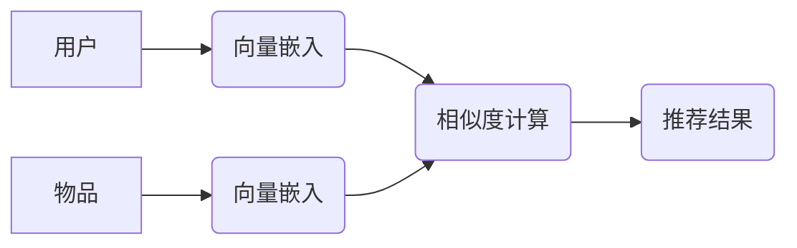

> 推荐系统，向量嵌入，协同过滤，内容过滤，深度学习，个性化推荐

## 1. 背景介绍

在信息爆炸的时代，海量数据和个性化需求共同催生了推荐系统的蓬勃发展。推荐系统旨在根据用户的历史行为、偏好和上下文信息，预测用户对特定物品的兴趣，并提供个性化的推荐结果。传统的基于内容的过滤和基于协同过滤的推荐方法，虽然取得了一定的成功，但随着数据规模的扩大和用户行为的复杂化，其效果逐渐趋于饱和。

近年来，基于向量的推荐系统凭借其强大的表达能力和泛化能力，成为推荐系统领域的研究热点。向量嵌入技术能够将用户和物品映射到一个低维的向量空间中，通过计算向量之间的相似度，实现精准的推荐。

## 2. 核心概念与联系

### 2.1 向量嵌入

向量嵌入是一种将离散型数据映射到连续向量空间的技术。每个离散数据点（如用户、物品、标签等）都对应一个唯一的向量，向量中的每个元素代表数据点的特征或属性。通过训练模型，学习到用户和物品的向量表示，使得相似的用户或物品在向量空间中距离较近。

### 2.2 协同过滤

协同过滤是一种基于用户行为模式的推荐方法。它假设，喜欢相同物品的用户可能具有相似的兴趣，并推荐用户可能感兴趣但尚未接触过的物品。协同过滤可以分为基于用户的协同过滤和基于物品的协同过滤。

### 2.3 内容过滤

内容过滤是一种基于物品特征的推荐方法。它根据用户的历史偏好和物品的属性，预测用户对特定物品的兴趣。例如，如果用户喜欢阅读科幻小说，则系统会推荐其他科幻小说。

**基于向量的推荐系统架构**



## 3. 核心算法原理 & 具体操作步骤

### 3.1 算法原理概述

基于向量的推荐系统主要利用向量嵌入技术和相似度计算方法实现推荐。

1. **向量嵌入:** 将用户和物品映射到一个低维的向量空间中，每个向量代表用户的兴趣或物品的特征。

2. **相似度计算:** 计算用户向量和物品向量之间的相似度，例如余弦相似度、欧氏距离等。

3. **推荐结果:** 根据相似度排序，推荐与用户向量最相似的物品。

### 3.2 算法步骤详解

1. **数据预处理:** 清洗和处理用户行为数据，例如评分、浏览记录、购买记录等。

2. **特征提取:** 从用户行为数据中提取特征，例如用户年龄、性别、兴趣标签、物品类别、价格等。

3. **向量嵌入模型训练:** 使用深度学习模型，例如Word2Vec、GloVe、BERT等，训练用户和物品的向量嵌入模型。

4. **相似度计算:** 使用余弦相似度、欧氏距离等方法计算用户向量和物品向量之间的相似度。

5. **推荐结果生成:** 根据相似度排序，推荐与用户向量最相似的物品。

6. **结果评估:** 使用指标，例如准确率、召回率、NDCG等，评估推荐系统的性能。

### 3.3 算法优缺点

**优点:**

* 表达能力强：能够捕捉用户和物品之间的复杂关系。
* 泛化能力强：能够对新用户和新物品进行推荐。
* 可扩展性强：能够处理海量数据。

**缺点:**

* 训练成本高：需要大量的计算资源和训练数据。
* 冷启动问题：对于新用户和新物品，难以进行推荐。
* 数据稀疏性问题：用户行为数据往往是稀疏的，难以训练有效的模型。

### 3.4 算法应用领域

基于向量的推荐系统广泛应用于以下领域：

* 电子商务：商品推荐、用户画像
* 内容推荐：新闻推荐、视频推荐、音乐推荐
* 社交网络：好友推荐、兴趣小组推荐
* 搜索引擎：搜索结果排序、个性化搜索

## 4. 数学模型和公式 & 详细讲解 & 举例说明

### 4.1 数学模型构建

假设用户集合为U，物品集合为I，用户u对物品i的评分为r(u,i)。

**用户向量:**  u ∈ R^d，表示用户u的兴趣特征，d为向量维度。

**物品向量:** i ∈ R^d，表示物品i的特征，d为向量维度。

**相似度函数:** sim(u,i) 计算用户u和物品i之间的相似度。

### 4.2 公式推导过程

**余弦相似度:**

$$
sim(u,i) = \frac{u \cdot i}{||u|| ||i||}
$$

其中，u ⋅ i 为用户向量和物品向量的点积，||u|| 和 ||i|| 分别为用户向量和物品向量的模长。

**欧氏距离:**

$$
sim(u,i) = \frac{1}{1 + ||u - i||^2}
$$

其中，||u - i|| 为用户向量和物品向量之间的欧氏距离。

### 4.3 案例分析与讲解

**举例说明:**

假设用户A的兴趣向量为 [0.2, 0.5, 0.8], 用户B的兴趣向量为 [0.3, 0.4, 0.7], 则用户A和用户B之间的余弦相似度为:

$$
sim(A,B) = \frac{[0.2, 0.5, 0.8] \cdot [0.3, 0.4, 0.7]}{\sqrt{0.2^2 + 0.5^2 + 0.8^2} \sqrt{0.3^2 + 0.4^2 + 0.7^2}}
$$

## 5. 项目实践：代码实例和详细解释说明

### 5.1 开发环境搭建

* Python 3.x
* TensorFlow 或 PyTorch
* scikit-learn

### 5.2 源代码详细实现

```python
import tensorflow as tf

# 定义用户和物品的向量嵌入模型
user_embedding = tf.keras.layers.Embedding(input_dim=num_users, output_dim=embedding_dim)
item_embedding = tf.keras.layers.Embedding(input_dim=num_items, output_dim=embedding_dim)

# 计算用户和物品之间的相似度
def calculate_similarity(user_id, item_id):
    user_vector = user_embedding(tf.expand_dims(user_id, axis=0))
    item_vector = item_embedding(tf.expand_dims(item_id, axis=0))
    similarity = tf.reduce_sum(user_vector * item_vector, axis=1)
    return similarity

# 获取推荐结果
def get_recommendations(user_id, top_n=10):
    item_similarities = calculate_similarity(user_id, tf.range(num_items))
    top_items = tf.argsort(item_similarities, direction='DESCENDING')[:top_n]
    return top_items
```

### 5.3 代码解读与分析

* 用户和物品的向量嵌入模型使用 `Embedding` 层实现，将离散的用户ID和物品ID映射到连续的向量空间。
* `calculate_similarity` 函数计算用户向量和物品向量之间的余弦相似度。
* `get_recommendations` 函数根据用户ID和相似度排序，获取推荐结果。

### 5.4 运行结果展示

运行代码后，可以获取用户ID对应的推荐物品列表。

## 6. 实际应用场景

### 6.1 电子商务

* 商品推荐：根据用户的浏览历史、购买记录和评分，推荐用户可能感兴趣的商品。
* 用户画像：构建用户的兴趣画像，为个性化营销提供支持。

### 6.2 内容推荐

* 新闻推荐：根据用户的阅读历史和兴趣标签，推荐用户可能感兴趣的新闻。
* 视频推荐：根据用户的观看历史和点赞记录，推荐用户可能感兴趣的视频。
* 音乐推荐：根据用户的播放历史和收藏记录，推荐用户可能感兴趣的音乐。

### 6.3 社交网络

* 好友推荐：根据用户的社交关系和兴趣标签，推荐用户可能认识的朋友。
* 兴趣小组推荐：根据用户的兴趣标签和参与记录，推荐用户可能感兴趣的兴趣小组。

### 6.4 未来应用展望

* 基于多模态数据的推荐系统：融合文本、图像、音频等多模态数据，提供更精准的推荐。
* 基于强化学习的推荐系统：利用强化学习算法，优化推荐策略，提高推荐效果。
* 个性化推荐的伦理问题：关注推荐系统的公平性、透明度和可解释性，避免算法歧视和偏见。

## 7. 工具和资源推荐

### 7.1 学习资源推荐

* **书籍:**
    * 《推荐系统》
    * 《深度学习》
* **在线课程:**
    * Coursera: Recommender Systems
    * Udacity: Deep Learning Nanodegree

### 7.2 开发工具推荐

* **Python:** 
    * TensorFlow
    * PyTorch
    * scikit-learn
* **数据库:**
    * MySQL
    * MongoDB

### 7.3 相关论文推荐

* **论文:**
    * "Collaborative Filtering for Implicit Feedback Datasets"
    * "Deep Learning for Recommender Systems"

## 8. 总结：未来发展趋势与挑战

### 8.1 研究成果总结

基于向量的推荐系统取得了显著的成果，在推荐精度、泛化能力和可扩展性方面表现优异。

### 8.2 未来发展趋势

* 多模态数据融合
* 强化学习优化
* 算法可解释性
* 个性化推荐伦理

### 8.3 面临的挑战

* 数据稀疏性问题
* 冷启动问题
* 算法复杂度
* 伦理问题

### 8.4 研究展望

未来研究将重点关注解决上述挑战，探索更精准、更个性化、更可解释的推荐系统。

## 9. 附录：常见问题与解答

* **Q1: 如何处理数据稀疏性问题？**

* **A1:** 可以使用矩阵分解、协同过滤等方法进行数据填充，或者使用深度学习模型进行特征提取。

* **Q2: 如何解决冷启动问题？**

* **A2:** 可以利用用户画像、物品属性、社会关系等信息进行推荐，或者使用迁移学习技术。

* **Q3: 如何评估推荐系统的性能？**

* **A3:** 可以使用准确率、召回率、NDCG等指标进行评估。


作者：禅与计算机程序设计艺术 / Zen and the Art of Computer Programming 
<end_of_turn>