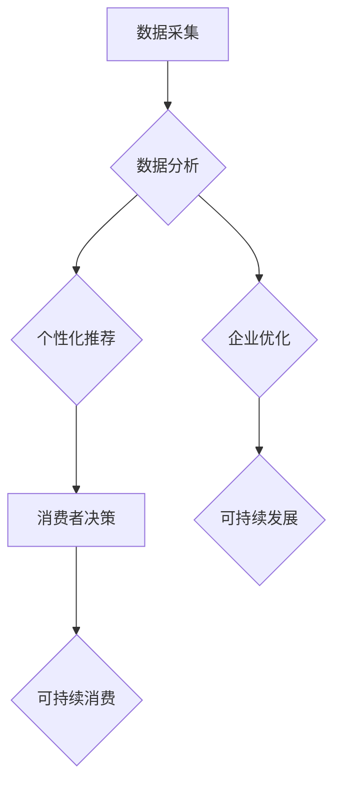

> AI、可持续消费、欲望、生态意识、机器学习、数据分析、个性化推荐、行为预测

## 1. 背景介绍

在当今全球化和信息化的时代，消费主义已经成为一种普遍现象，人们对物质享受的追求日益强烈。然而，这种无节制的消费模式却带来了严重的生态环境问题，资源枯竭、污染加剧、气候变化等挑战日益严峻。可持续消费，即在满足自身需求的同时，兼顾环境保护和社会责任，成为解决这一问题的关键。

人工智能（AI）作为一种新兴技术，正在深刻地改变着我们的生活方式，包括消费行为。AI技术能够通过数据分析、机器学习等手段，洞察消费者的需求和行为模式，为个性化推荐、精准营销等提供强大的支持。同时，AI也为推动可持续消费提供了新的机遇。

## 2. 核心概念与联系

**2.1 可持续消费**

可持续消费是指在满足自身需求的同时，兼顾环境保护和社会责任的消费模式。它强调资源的合理利用、废弃物的减少、环境污染的控制以及社会公平正义。

**2.2 AI驱动的可持续消费**

AI驱动的可持续消费是指利用人工智能技术，帮助消费者做出更环保、更负责任的消费决策。

**2.3 核心概念联系**

AI技术可以帮助消费者了解产品的生命周期、环保性能、社会影响等信息，从而做出更明智的消费选择。同时，AI还可以帮助企业优化生产流程、减少资源浪费、降低碳排放，实现可持续发展。

**2.4  AI驱动的可持续消费架构**



## 3. 核心算法原理 & 具体操作步骤

**3.1 算法原理概述**

AI驱动的可持续消费主要依赖于以下核心算法：

* **机器学习算法**: 用于分析消费者的消费行为、偏好和需求，预测未来的消费趋势。
* **自然语言处理算法**: 用于理解和分析消费者对产品和服务的评价、评论和反馈，识别出与可持续性相关的关键词和主题。
* **推荐系统算法**: 用于根据消费者的历史行为和偏好，推荐更环保、更可持续的产品和服务。

**3.2 算法步骤详解**

1. **数据采集**: 收集消费者购买历史、浏览记录、评价反馈等数据，以及产品生命周期、环保性能、社会影响等信息。
2. **数据预处理**: 对收集到的数据进行清洗、转换、整合等处理，使其能够被算法模型所使用。
3. **模型训练**: 利用机器学习算法，对预处理后的数据进行训练，建立预测消费行为、识别可持续性信息、推荐可持续产品等模型。
4. **模型评估**: 对训练好的模型进行评估，测试其准确性和有效性，并进行必要的调整和优化。
5. **模型部署**: 将经过评估的模型部署到实际应用场景中，例如电商平台、搜索引擎、社交媒体等。

**3.3 算法优缺点**

* **优点**: 能够精准地识别消费者需求，提供个性化推荐，提高可持续消费的效率和效果。
* **缺点**: 需要大量的数据支持，算法模型的训练和优化需要专业技术，存在数据隐私和算法偏见等问题。

**3.4 算法应用领域**

* **电商平台**: 为消费者推荐环保产品，提供可持续消费指南。
* **搜索引擎**: 在搜索结果中突出可持续产品和服务。
* **社交媒体**: 推广可持续消费理念，鼓励用户分享环保生活方式。
* **物流运输**: 优化物流路线，减少碳排放。

## 4. 数学模型和公式 & 详细讲解 & 举例说明

**4.1 数学模型构建**

可持续消费决策模型可以构建为一个多目标优化问题，目标函数包括消费者满意度、环境影响和社会效益等多个指标。

**4.2 公式推导过程**

假设消费者有 $n$ 种可选产品，每个产品的环境影响和社会效益可以用相应的指标 $e_i$ 和 $s_i$ 来表示，其中 $i = 1, 2, ..., n$。消费者的满意度可以用产品质量、价格等指标来衡量，可以用 $q_i$ 来表示。

消费者满意度最大化目标函数：

$$
\max \sum_{i=1}^{n} q_i \cdot x_i
$$

受制于以下约束条件：

* 环境影响约束：

$$
\sum_{i=1}^{n} e_i \cdot x_i \leq E_{max}
$$

* 社会效益约束：

$$
\sum_{i=1}^{n} s_i \cdot x_i \geq S_{min}
$$

其中，$x_i$ 是消费者选择产品 $i$ 的数量，$E_{max}$ 是允许的环境影响上限，$S_{min}$ 是最低的社会效益要求。

**4.3 案例分析与讲解**

例如，消费者需要购买一台笔记本电脑，可以选择两种产品：

* 产品 A：环境影响 $e_A = 0.5$，社会效益 $s_A = 0.8$，满意度 $q_A = 0.9$。
* 产品 B：环境影响 $e_B = 0.2$，社会效益 $s_B = 0.6$，满意度 $q_B = 0.8$。

假设允许的环境影响上限为 $E_{max} = 0.7$，最低的社会效益要求为 $S_{min} = 0.5$。

通过求解上述优化问题，可以得到消费者选择的产品组合和数量，以最大化其满意度，同时满足环境影响和社会效益的约束条件。

## 5. 项目实践：代码实例和详细解释说明

**5.1 开发环境搭建**

* 操作系统：Ubuntu 20.04 LTS
* Python 版本：3.8.10
* 必要的库：pandas, numpy, scikit-learn, matplotlib

**5.2 源代码详细实现**

```python
import pandas as pd
from sklearn.model_selection import train_test_split
from sklearn.linear_model import LogisticRegression

# 数据加载
data = pd.read_csv('sustainable_consumption_data.csv')

# 特征选择和数据预处理
features = ['product_category', 'price', 'environmental_impact', 'social_impact']
X = data[features]
y = data['sustainable_choice']

# 数据分割
X_train, X_test, y_train, y_test = train_test_split(X, y, test_size=0.2, random_state=42)

# 模型训练
model = LogisticRegression()
model.fit(X_train, y_train)

# 模型评估
accuracy = model.score(X_test, y_test)
print(f'模型准确率: {accuracy}')

# 预测
new_data = pd.DataFrame({
    'product_category': ['electronics', 'clothing'],
    'price': [1000, 50],
    'environmental_impact': [0.6, 0.2],
    'social_impact': [0.7, 0.5]
})
predictions = model.predict(new_data)
print(f'预测结果: {predictions}')
```

**5.3 代码解读与分析**

* 代码首先加载数据，并选择相关的特征和目标变量。
* 然后使用 `train_test_split` 函数将数据分割成训练集和测试集。
* 接着使用 `LogisticRegression` 模型训练，并评估模型的准确率。
* 最后使用训练好的模型对新数据进行预测。

**5.4 运行结果展示**

运行代码后，会输出模型的准确率和对新数据的预测结果。

## 6. 实际应用场景

**6.1 电商平台**

电商平台可以利用 AI 驱动的可持续消费模型，为消费者推荐环保产品，提供可持续消费指南，并根据消费者的行为数据，个性化推荐更符合其环保理念的产品。

**6.2 搜索引擎**

搜索引擎可以将可持续性信息融入到搜索结果中，例如突出环保产品的排名，提供产品的生命周期和环保性能信息，帮助用户做出更明智的消费选择。

**6.3 社交媒体**

社交媒体平台可以利用 AI 技术，识别和推广可持续消费相关的内容，鼓励用户分享环保生活方式，形成可持续消费的社会氛围。

**6.4 未来应用展望**

未来，AI 驱动的可持续消费将更加深入地融入到我们的生活，例如：

* **智能家居**: 通过 AI 控制家电的能源消耗，实现节能减排。
* **个性化碳足迹追踪**: 利用 AI 分析用户的消费行为，计算其碳足迹，并提供个性化的减碳建议。
* **可持续供应链**: 利用 AI 优化供应链管理，减少资源浪费和环境污染。

## 7. 工具和资源推荐

**7.1 学习资源推荐**

* **书籍**:
    * 《AI驱动的可持续发展》
    * 《人工智能与可持续消费》
* **在线课程**:
    * Coursera: AI for Sustainability
    * edX: Sustainable Development with AI

**7.2 开发工具推荐**

* **Python**: 广泛应用于 AI 开发，拥有丰富的库和工具。
* **TensorFlow**: 开源深度学习框架，用于训练和部署 AI 模型。
* **PyTorch**: 另一个流行的深度学习框架，以其灵活性和易用性而闻名。

**7.3 相关论文推荐**

* **AI for Sustainable Consumption: A Review**
* **Towards Sustainable Consumption: A Data-Driven Approach with AI**

## 8. 总结：未来发展趋势与挑战

**8.1 研究成果总结**

AI 驱动的可持续消费是一个新兴领域，取得了一些重要的研究成果，例如：

* 建立了可持续消费决策模型，能够帮助消费者做出更环保的选择。
* 开发了 AI 驱动的推荐系统，能够为消费者推荐更符合其环保理念的产品。
* 利用 AI 技术，优化了供应链管理，减少了资源浪费和环境污染。

**8.2 未来发展趋势**

未来，AI 驱动的可持续消费将朝着以下方向发展：

* **更精准的个性化推荐**: 利用更丰富的用户数据和更先进的算法，为消费者提供更精准的个性化推荐。
* **更全面的可持续性评估**: 将更多可持续性指标纳入到产品评估中，例如碳排放、资源消耗、社会影响等。
* **更智能的供应链管理**: 利用 AI 技术，优化供应链各个环节，减少资源浪费和环境污染。

**8.3 面临的挑战**

AI 驱动的可持续消费也面临一些挑战：

* **数据隐私**: AI 模型需要大量的数据支持，如何保护用户数据隐私是一个重要问题。
* **算法偏见**: AI 模型可能存在算法偏见，导致推荐结果不公平。
* **技术可访问性**: AI 技术的应用需要一定的技术门槛，如何让更多人能够使用 AI 驱动的可持续消费工具是一个挑战。

**8.4 研究展望**

未来，需要进一步研究以下问题：

* 如何开发更安全、更可靠的 AI 模型，保障用户数据隐私和算法公平性。
* 如何将 AI 技术应用到更广泛的领域，推动可持续消费的普及。
* 如何促进政府、企业和个人的合作，共同构建可持续的消费生态系统。

## 9. 附录：常见问题与解答

**9.1 如何选择更环保的产品？**

可以使用 AI 驱动的可持续消费工具，例如电商平台的环保产品推荐、搜索引擎的绿色搜索等，获取产品的环保信息，并根据自己的需求和预算进行选择。

**9.2 如何减少自己的碳足迹？**

可以通过以下方式减少碳足迹：

* 选择公共交通、骑自行车或步行出行。
