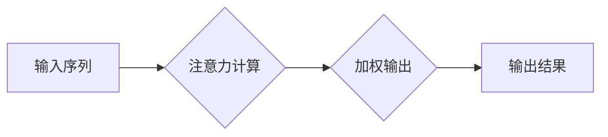

>  注意力管理、创造力、专注、头脑风暴、深度学习、神经网络、认知科学、效率提升

## 1. 背景介绍

在当今信息爆炸的时代，我们面临着前所未有的信息洪流。来自邮件、社交媒体、新闻推送的各种信息不断冲击着我们的注意力，使得专注力变得稀缺，创造力也随之受到影响。如何有效地管理注意力，激发创造力，成为当今社会面临的共同挑战。

从认知科学的角度来看，注意力是认知过程的核心，它决定了我们能够有效地处理信息的能力。创造力则是通过对已有知识的重新组合和创新，产生新颖的思想和解决方案的能力。两者之间存在着密切的联系，注意力是创造力的基础，而创造力则需要注意力进行引导和聚焦。

## 2. 核心概念与联系

### 2.1 注意力机制

注意力机制是近年来深度学习领域取得的重要突破，它能够模拟人类的注意力机制，学习到哪些信息对任务的完成最为重要。

**注意力机制的原理:**

注意力机制的核心思想是通过一个加权机制，将输入序列中的不同元素赋予不同的权重，从而突出重要信息，抑制无关信息。

**注意力机制的应用:**

注意力机制已广泛应用于自然语言处理、计算机视觉、语音识别等领域，取得了显著的成果。

**Mermaid 流程图:**



### 2.2 创造力模型

创造力模型试图从认知科学的角度解释创造力的产生机制。

**创造力模型的类型:**

常见的创造力模型包括：

* **发散思维模型:** 强调从多个角度思考问题，生成多种可能性。
* **收敛思维模型:** 强调对多种可能性进行筛选和评估，选择最佳方案。
* **启发式模型:** 强调利用已有知识和经验，寻找解决问题的灵感。

**创造力模型的应用:**

创造力模型可以用于指导创造力训练，帮助人们提高创造力。

## 3. 核心算法原理 & 具体操作步骤

### 3.1 算法原理概述

注意力机制的核心算法是**自注意力机制(Self-Attention)**。

自注意力机制通过计算每个词与所有其他词之间的相关性，学习到每个词在句子中的重要性。

**自注意力机制的公式:**

```latex
Attention(Q, K, V) = softmax(Q K^T / \sqrt{d_k}) V
```

其中：

* Q: 查询矩阵
* K: 键矩阵
* V: 值矩阵
* $d_k$: 键向量的维度

### 3.2 算法步骤详解

1. 将输入序列转换为查询矩阵(Q)、键矩阵(K)和值矩阵(V)。
2. 计算每个词与所有其他词之间的相关性，得到注意力权重。
3. 将注意力权重与值矩阵相乘，得到加权输出。
4. 将加权输出作为新的输入，进行后续处理。

### 3.3 算法优缺点

**优点:**

* 可以学习到句子中每个词的语义信息。
* 可以捕捉到长距离依赖关系。

**缺点:**

* 计算复杂度较高。
* 训练数据量较大。

### 3.4 算法应用领域

自注意力机制已广泛应用于自然语言处理领域，例如：

* 机器翻译
* 文本摘要
* 问答系统
* 情感分析

## 4. 数学模型和公式 & 详细讲解 & 举例说明

### 4.1 数学模型构建

注意力机制可以看作是一个加权求和模型，其目标是学习到每个输入元素的权重，从而得到一个加权后的输出。

**数学模型:**

```latex
y = \sum_{i=1}^{n} w_i x_i
```

其中：

* $y$: 输出
* $x_i$: 输入元素
* $w_i$: 权重

### 4.2 公式推导过程

注意力机制的权重计算通常使用softmax函数，其公式如下：

```latex
w_i = \frac{exp(s_i)}{\sum_{j=1}^{n} exp(s_j)}
```

其中：

* $s_i$: 输入元素 $x_i$ 与其他元素之间的相关性

### 4.3 案例分析与讲解

**举例说明:**

假设我们有一个句子 "The cat sat on the mat"，我们想要计算每个词的注意力权重。

1. 将句子转换为词向量表示。
2. 计算每个词与所有其他词之间的相关性，例如使用余弦相似度。
3. 将相关性值作为 $s_i$，使用softmax函数计算注意力权重。

最终，每个词的注意力权重会反映其在句子中的重要性。

## 5. 项目实践：代码实例和详细解释说明

### 5.1 开发环境搭建

* Python 3.6+
* TensorFlow 2.0+
* PyTorch 1.0+

### 5.2 源代码详细实现

```python
import tensorflow as tf

# 定义自注意力机制
def self_attention(query, key, value, mask=None):
    # 计算注意力权重
    attention_weights = tf.matmul(query, key, transpose_b=True) / tf.math.sqrt(tf.cast(key.shape[-1], tf.float32))
    if mask is not None:
        attention_weights += (mask * -1e9)
    attention_weights = tf.nn.softmax(attention_weights, axis=-1)
    # 计算加权输出
    output = tf.matmul(attention_weights, value)
    return output

# 示例代码
query = tf.random.normal([3, 4, 64])
key = tf.random.normal([3, 4, 64])
value = tf.random.normal([3, 4, 64])

output = self_attention(query, key, value)
print(output.shape)
```

### 5.3 代码解读与分析

* `self_attention` 函数实现了一个基本的自注意力机制。
* `query`, `key`, `value` 分别代表查询矩阵、键矩阵和值矩阵。
* `mask` 用于屏蔽某些词之间的关系，例如在机器翻译中，屏蔽源语言中的词与目标语言中的词之间的关系。
* `tf.matmul` 函数用于计算矩阵乘法。
* `tf.nn.softmax` 函数用于计算注意力权重。

### 5.4 运行结果展示

运行上述代码，输出结果为 `(3, 4, 64)`，表示注意力机制的输出维度与输入维度相同。

## 6. 实际应用场景

### 6.1 自然语言处理

* **机器翻译:** 注意力机制可以帮助机器翻译模型更好地理解句子结构和语义，从而提高翻译质量。
* **文本摘要:** 注意力机制可以帮助文本摘要模型识别句子中最关键的信息，从而生成更简洁的摘要。
* **问答系统:** 注意力机制可以帮助问答系统更好地理解问题和上下文，从而给出更准确的答案。

### 6.2 图像识别

* **目标检测:** 注意力机制可以帮助目标检测模型聚焦于图像中的目标区域，从而提高检测精度。
* **图像分割:** 注意力机制可以帮助图像分割模型识别图像中的不同区域，从而生成更精确的分割结果。

### 6.3 其他领域

* **语音识别:** 注意力机制可以帮助语音识别模型更好地理解语音信号，从而提高识别准确率。
* **推荐系统:** 注意力机制可以帮助推荐系统更好地理解用户的兴趣，从而推荐更相关的商品或服务。

### 6.4 未来应用展望

随着深度学习技术的不断发展，注意力机制的应用场景将会更加广泛。

* **多模态学习:** 注意力机制可以帮助模型理解不同模态的数据，例如文本、图像、音频等。
* **个性化学习:** 注意力机制可以帮助模型根据用户的个性化需求，提供定制化的学习体验。
* **自动代码生成:** 注意力机制可以帮助模型理解代码结构和语义，从而自动生成代码。

## 7. 工具和资源推荐

### 7.1 学习资源推荐

* **书籍:**
    * "深度学习" by Ian Goodfellow, Yoshua Bengio, and Aaron Courville
    * "Attention Is All You Need" by Vaswani et al.
* **在线课程:**
    * Coursera: Deep Learning Specialization
    * Udacity: Deep Learning Nanodegree

### 7.2 开发工具推荐

* **TensorFlow:** https://www.tensorflow.org/
* **PyTorch:** https://pytorch.org/

### 7.3 相关论文推荐

* "Attention Is All You Need"
* "BERT: Pre-training of Deep Bidirectional Transformers for Language Understanding"
* "Transformer-XL: Attentive Language Models Beyond a Fixed-Length Context"

## 8. 总结：未来发展趋势与挑战

### 8.1 研究成果总结

注意力机制是深度学习领域取得的重要突破，它为自然语言处理、计算机视觉等领域带来了革命性的进展。

### 8.2 未来发展趋势

* **更强大的注意力机制:** 研究人员将继续探索更强大的注意力机制，例如自回归注意力机制、动态注意力机制等。
* **多模态注意力机制:** 研究人员将尝试将注意力机制应用于多模态数据，例如文本、图像、音频等。
* **可解释性注意力机制:** 研究人员将致力于开发更可解释的注意力机制，以便更好地理解模型的决策过程。

### 8.3 面临的挑战

* **计算复杂度:** 传统的注意力机制计算复杂度较高，难以应用于大规模数据。
* **训练数据:** 训练注意力机制需要大量的标注数据，这在某些领域仍然是一个挑战。
* **可解释性:** 目前注意力机制的决策过程仍然难以解释，这限制了其在一些应用场景中的应用。

### 8.4 研究展望

未来，注意力机制将继续在人工智能领域发挥重要作用，并推动人工智能技术的进一步发展。


## 9. 附录：常见问题与解答

**常见问题:**

* **注意力机制的原理是什么？**
* **注意力机制有哪些应用场景？**
* **如何训练注意力机制？**
* **注意力机制的优缺点是什么？**

**解答:**

* **注意力机制的原理:** 注意力机制通过计算每个输入元素与其他元素之间的相关性，学习到每个元素的重要性，从而突出重要信息，抑制无关信息。
* **注意力机制的应用场景:** 注意力机制已广泛应用于自然语言处理、计算机视觉、语音识别等领域。
* **如何训练注意力机制:** 训练注意力机制需要大量的标注数据，可以使用梯度下降算法进行训练。
* **注意力机制的优缺点:** 注意力机制的优点是能够学习到句子中每个词的语义信息，并捕捉到长距离依赖关系。缺点是计算复杂度较高，训练数据量较大。


作者：禅与计算机程序设计艺术 / Zen and the Art of Computer Programming 
<end_of_turn>