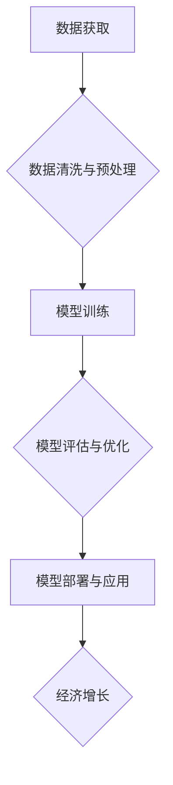

>人工智能、经济增长、瓶颈、深度学习、算法、数据、可持续发展

## 1. 背景介绍

在当今数字时代，人工智能（AI）技术飞速发展，正在深刻地改变着我们的生活和工作方式。从自动驾驶汽车到个性化医疗，AI的应用领域日益广泛，其潜力也越来越受到重视。然而，随着AI技术的进步，我们也开始思考一个重要的问题：AI技术能否真正推动经济增长，并解决人类面临的深层次问题？

经济增长一直是各国政府和企业追求的目标，但近年来，全球经济增长速度放缓，许多国家面临着经济增长瓶颈。传统经济增长模式依赖于资源消耗和人口增长，但这些模式已经难以持续发展。因此，寻找新的经济增长引擎成为当务之急。

AI技术作为一种颠覆性的创新力量，被认为有潜力成为推动经济增长的关键驱动力。AI可以自动化许多重复性任务，提高生产效率，创造新的商业模式和价值。然而，AI技术也面临着一些挑战，例如数据获取、算法训练、伦理道德等问题，这些问题可能会阻碍AI技术的广泛应用，从而影响其对经济增长的贡献。

## 2. 核心概念与联系

**2.1 深度学习与经济增长**

深度学习是人工智能领域的一个重要分支，它利用多层神经网络来模拟人类大脑的学习过程，能够从海量数据中提取复杂特征，并进行精准预测和决策。深度学习技术在图像识别、自然语言处理、语音识别等领域取得了突破性进展，为经济增长提供了新的可能性。

**2.2 数据驱动与经济增长**

数据是深度学习技术的关键要素，海量数据可以训练更精准的模型，从而提高AI技术的应用效果。经济增长也离不开数据的驱动，数据可以帮助企业了解市场需求、优化生产流程、提升客户体验等。

**2.3 算法创新与经济增长**

算法是深度学习技术的核心，算法的创新可以提高模型的性能，拓展应用场景。算法创新也是经济增长的重要驱动力，新的算法可以创造新的产品和服务，推动产业升级。

**2.4 伦理道德与经济增长**

AI技术的应用也面临着伦理道德的挑战，例如算法偏见、数据隐私等问题。解决这些问题对于确保AI技术安全、可持续发展至关重要。

**2.5  Mermaid 流程图**



## 3. 核心算法原理 & 具体操作步骤

### 3.1  算法原理概述

深度学习算法的核心是多层神经网络，它由多个神经元组成的层级结构组成。每个神经元接收来自上一层的输入信号，并通过激活函数进行处理，输出到下一层。通过多层神经网络的叠加，可以学习到数据的复杂特征，并进行精准预测或决策。

常见的深度学习算法包括卷积神经网络（CNN）、循环神经网络（RNN）和生成对抗网络（GAN）。CNN擅长处理图像数据，RNN擅长处理序列数据，GAN可以生成新的数据。

### 3.2  算法步骤详解

1. **数据收集与预处理:** 收集相关数据，并进行清洗、格式化、归一化等预处理操作，以确保数据质量和算法训练效果。
2. **模型选择与搭建:** 根据任务需求选择合适的深度学习算法，并搭建相应的模型结构。
3. **模型训练:** 使用训练数据训练模型，调整模型参数，使模型能够准确地预测或决策。
4. **模型评估与优化:** 使用测试数据评估模型性能，并根据评估结果调整模型参数或结构，优化模型性能。
5. **模型部署与应用:** 将训练好的模型部署到实际应用场景中，并进行监控和维护。

### 3.3  算法优缺点

**优点:**

* 能够学习到数据的复杂特征，提高预测精度。
* 适用范围广，可以应用于图像识别、自然语言处理、语音识别等多个领域。
* 随着数据量的增加，模型性能会不断提升。

**缺点:**

* 训练数据量大，需要大量的计算资源和时间。
* 模型解释性差，难以理解模型的决策过程。
* 容易受到数据偏差的影响，导致模型产生偏见。

### 3.4  算法应用领域

深度学习算法已广泛应用于各个领域，例如：

* **图像识别:** 人脸识别、物体检测、图像分类等。
* **自然语言处理:** 机器翻译、文本摘要、情感分析等。
* **语音识别:** 语音转文本、语音助手等。
* **医疗诊断:** 疾病预测、影像分析等。
* **金融风险控制:** 欺诈检测、信用评估等。

## 4. 数学模型和公式 & 详细讲解 & 举例说明

### 4.1  数学模型构建

深度学习模型可以看作是一个复杂的数学模型，其核心是神经网络的结构和激活函数。

**4.1.1 神经网络结构:**

神经网络由多个层级组成，每一层包含多个神经元。每个神经元接收来自上一层的输入信号，并通过权重进行加权求和，然后通过激活函数进行非线性变换，输出到下一层。

**4.1.2 激活函数:**

激活函数是神经网络中一个重要的组成部分，它决定了神经元的输出特性。常见的激活函数包括 sigmoid 函数、ReLU 函数、tanh 函数等。

**4.1.3 损失函数:**

损失函数用于衡量模型预测结果与真实值的差距。常见的损失函数包括均方误差（MSE）、交叉熵损失（Cross-Entropy Loss）等。

### 4.2  公式推导过程

**4.2.1 前向传播:**

前向传播是指输入数据通过神经网络层级结构进行计算，最终输出预测结果的过程。

**公式:**

$$
y = f(W^L x^L + b^L)
$$

其中：

* $y$ 是输出结果
* $f$ 是激活函数
* $W^L$ 是第 L 层的权重矩阵
* $x^L$ 是第 L 层的输入向量
* $b^L$ 是第 L 层的偏置向量

**4.2.2 反向传播:**

反向传播是指根据损失函数的梯度，调整神经网络参数的过程。

**公式:**

$$
\Delta W = \eta \frac{\partial L}{\partial W}
$$

其中：

* $\Delta W$ 是权重更新量
* $\eta$ 是学习率
* $\frac{\partial L}{\partial W}$ 是损失函数对权重的梯度

### 4.3  案例分析与讲解

**4.3.1 图像分类:**

使用 CNN 对图像进行分类，例如识别猫和狗的图片。

**4.3.2 机器翻译:**

使用 RNN 对文本进行机器翻译，例如将英文翻译成中文。

## 5. 项目实践：代码实例和详细解释说明

### 5.1  开发环境搭建

使用 Python 语言和 TensorFlow 或 PyTorch 深度学习框架进行开发。

### 5.2  源代码详细实现

```python
import tensorflow as tf

# 定义模型结构
model = tf.keras.models.Sequential([
    tf.keras.layers.Conv2D(32, (3, 3), activation='relu', input_shape=(28, 28, 1)),
    tf.keras.layers.MaxPooling2D((2, 2)),
    tf.keras.layers.Conv2D(64, (3, 3), activation='relu'),
    tf.keras.layers.MaxPooling2D((2, 2)),
    tf.keras.layers.Flatten(),
    tf.keras.layers.Dense(10, activation='softmax')
])

# 编译模型
model.compile(optimizer='adam',
              loss='sparse_categorical_crossentropy',
              metrics=['accuracy'])

# 训练模型
model.fit(x_train, y_train, epochs=5)

# 评估模型
loss, accuracy = model.evaluate(x_test, y_test)
print('Test loss:', loss)
print('Test accuracy:', accuracy)
```

### 5.3  代码解读与分析

这段代码定义了一个简单的 CNN 模型，用于识别 MNIST 手写数字数据集中的数字。

* `tf.keras.models.Sequential` 创建了一个顺序模型，层级结构按照顺序连接。
* `tf.keras.layers.Conv2D` 定义了一个卷积层，用于提取图像特征。
* `tf.keras.layers.MaxPooling2D` 定义了一个最大池化层，用于降低特征图尺寸。
* `tf.keras.layers.Flatten` 将多维特征图转换为一维向量。
* `tf.keras.layers.Dense` 定义了一个全连接层，用于分类。
* `model.compile` 编译模型，指定优化器、损失函数和评价指标。
* `model.fit` 训练模型，使用训练数据进行训练。
* `model.evaluate` 评估模型，使用测试数据评估模型性能。

### 5.4  运行结果展示

训练完成后，模型可以用于预测新的手写数字图像。

## 6. 实际应用场景

### 6.1  医疗诊断

AI技术可以辅助医生进行疾病诊断，例如通过分析医学影像数据识别肿瘤、肺炎等疾病。

### 6.2  金融风险控制

AI技术可以帮助金融机构识别欺诈交易、评估信用风险、预测市场波动等。

### 6.3  个性化推荐

AI技术可以根据用户的行为数据和偏好，提供个性化的商品推荐、内容推荐等服务。

### 6.4  未来应用展望

随着AI技术的不断发展，其应用场景将更加广泛，例如：

* 自动驾驶汽车
* 智能机器人
* 虚拟助手
* 个性化教育

## 7. 工具和资源推荐

### 7.1  学习资源推荐

* **在线课程:** Coursera、edX、Udacity 等平台提供深度学习相关的在线课程。
* **书籍:** 《深度学习》、《动手学深度学习》等书籍。
* **博客:** TensorFlow、PyTorch 等框架的官方博客。

### 7.2  开发工具推荐

* **TensorFlow:** Google 开发的开源深度学习框架。
* **PyTorch:** Facebook 开发的开源深度学习框架。
* **Keras:** TensorFlow 上的深度学习 API。

### 7.3  相关论文推荐

* **《ImageNet Classification with Deep Convolutional Neural Networks》**
* **《Attention Is All You Need》**
* **《Generative Adversarial Nets》**

## 8. 总结：未来发展趋势与挑战

### 8.1  研究成果总结

深度学习技术取得了显著的进展，在图像识别、自然语言处理等领域取得了突破性成果。

### 8.2  未来发展趋势

* **模型规模和复杂度提升:** 模型参数量和层数将继续增加，以提高模型性能。
* **算法创新:** 新的深度学习算法将不断涌现，例如强化学习、自监督学习等。
* **跨模态学习:** 模型将能够处理多种模态数据，例如文本、图像、音频等。
* **边缘计算:** 深度学习模型将部署到边缘设备，实现更快速的推理和响应。

### 8.3  面临的挑战

* **数据获取和隐私保护:** 深度学习模型需要大量数据进行训练，如何获取高质量数据并保护用户隐私是一个重要挑战。
* **模型解释性和可信度:** 深度学习模型的决策过程难以解释，如何提高模型的透明度和可信度是一个关键问题。
* **算法公平性和偏见:** 深度学习模型容易受到数据偏差的影响，导致算法产生偏见，如何确保算法公平性和公正性是一个重要挑战。

### 8.4  研究展望

未来，深度学习技术将继续发展，并应用于更多领域，为人类社会带来更多福祉。

## 9. 附录：常见问题与解答

**9.1  深度学习模型训练需要多少数据？**

深度学习模型的训练数据