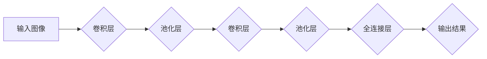

> 深度学习，卷积神经网络，人脸识别，图像分类，特征提取

## 1. 背景介绍

人脸识别技术作为计算机视觉领域的重要分支，近年来取得了显著进展，并广泛应用于安全监控、身份验证、人脸搜索等领域。传统的基于特征工程的人脸识别方法依赖于人工设计的特征，难以应对复杂的光照、姿态、表情等变化。深度卷积神经网络 (Deep Convolutional Neural Networks, CNN) 的出现为人脸识别带来了革命性的变革。

CNN 是一种专门设计用于处理图像数据的深度神经网络，其结构灵感来源于生物视觉系统。CNN 通过卷积层、池化层和全连接层等结构，能够自动学习图像中的特征，并提取出具有判别性的特征表示。

## 2. 核心概念与联系

### 2.1 卷积神经网络 (CNN)

CNN 是一种专门用于处理图像数据的深度神经网络，其结构灵感来源于生物视觉系统。CNN 主要由以下几个部分组成：

* **卷积层 (Convolutional Layer):** 卷积层是 CNN 的核心组成部分，其作用是通过卷积核 (Filter) 对输入图像进行卷积运算，提取图像中的局部特征。卷积核可以看作是学习图像特征的模板，通过滑动在图像上，提取不同位置的特征信息。
* **池化层 (Pooling Layer):** 池化层的作用是降低图像的维度，同时保留图像最重要的特征信息。常见的池化操作包括最大池化和平均池化。
* **全连接层 (Fully Connected Layer):** 全连接层将卷积层和池化层提取的特征进行组合，并最终输出分类结果。

**CNN 架构流程图:**

### 2.2 人脸识别

人脸识别是指通过分析人脸图像或视频，识别和验证个体身份的技术。人脸识别系统通常包括以下几个步骤：

1. **人脸检测:** 首先需要检测图像或视频中的人脸区域。
2. **人脸特征提取:** 将检测到的脸部区域进行特征提取，提取出人脸的独特特征。
3. **特征匹配:** 将提取的特征与数据库中的特征进行匹配，识别身份。

## 3. 核心算法原理 & 具体操作步骤

### 3.1 算法原理概述

深度卷积神经网络在人脸识别中发挥着关键作用，其核心原理在于自动学习图像特征。通过多层卷积和池化操作，CNN 可以逐层提取图像的抽象特征，最终学习到具有判别性的人脸特征。

### 3.2 算法步骤详解

1. **数据预处理:** 人脸图像需要进行预处理，例如调整大小、归一化等操作，以适应 CNN 的输入要求。
2. **模型训练:** 使用训练数据训练 CNN 模型，通过反向传播算法调整模型参数，使模型能够准确地识别人脸。
3. **模型评估:** 使用测试数据评估模型的性能，例如准确率、召回率等指标。
4. **模型部署:** 将训练好的模型部署到实际应用场景中，用于人脸识别任务。

### 3.3 算法优缺点

**优点:**

* 自动学习特征，无需人工设计特征。
* 能够处理复杂的光照、姿态、表情等变化。
* 识别精度高，性能优异。

**缺点:**

* 训练数据量大，训练时间长。
* 模型参数量大，计算资源需求高。
* 对数据质量要求高，容易受到噪声和干扰的影响。

### 3.4 算法应用领域

深度卷积神经网络在人脸识别领域有着广泛的应用，例如：

* **身份验证:** 用于解锁手机、验证身份信息等。
* **安全监控:** 用于监控人员进出、识别嫌疑人等。
* **人脸搜索:** 用于搜索数据库中的人脸图像。
* **人脸表情识别:** 用于识别人的情绪和情感。

## 4. 数学模型和公式 & 详细讲解 & 举例说明

### 4.1 数学模型构建

深度卷积神经网络的数学模型主要包括卷积层、池化层和全连接层的数学公式。

**卷积层:**

卷积操作的数学公式如下：

$$
y_{i,j} = \sum_{m=0}^{M-1} \sum_{n=0}^{N-1} x_{i+m,j+n} * w_{m,n} + b
$$

其中：

* $x_{i,j}$ 是输入图像的像素值。
* $w_{m,n}$ 是卷积核的权重值。
* $b$ 是卷积层的偏置值。
* $y_{i,j}$ 是卷积层的输出值。

**池化层:**

池化操作的数学公式取决于具体的池化方法，例如最大池化和平均池化。

**全连接层:**

全连接层的数学公式如下：

$$
y_i = \sum_{j=0}^{J-1} x_j * w_{ij} + b_i
$$

其中：

* $x_j$ 是上一层的输出值。
* $w_{ij}$ 是全连接层的权重值。
* $b_i$ 是全连接层的偏置值。
* $y_i$ 是全连接层的输出值。

### 4.2 公式推导过程

卷积层、池化层和全连接层的数学公式的推导过程涉及到线性代数、微积分等数学知识。

### 4.3 案例分析与讲解

通过具体的案例分析，可以更好地理解深度卷积神经网络的数学模型和工作原理。例如，可以分析一个简单的 CNN 模型，并通过计算公式，分析模型的输出结果。

## 5. 项目实践：代码实例和详细解释说明

### 5.1 开发环境搭建

使用 Python 语言和深度学习框架 TensorFlow 或 PyTorch 搭建开发环境。

### 5.2 源代码详细实现

使用 TensorFlow 或 PyTorch 框架，实现一个简单的 CNN 模型，用于人脸识别任务。

### 5.3 代码解读与分析

详细解读代码，解释每个模块的功能和作用。

### 5.4 运行结果展示

使用测试数据运行模型，并展示模型的识别结果。

## 6. 实际应用场景

### 6.1 安全监控

在安全监控系统中，人脸识别技术可以用于识别嫌疑人、记录人员进出情况等。

### 6.2 身份验证

人脸识别技术可以用于解锁手机、验证身份信息等场景，提高安全性。

### 6.3 人脸搜索

人脸识别技术可以用于搜索数据库中的人脸图像，例如查找失散人员。

### 6.4 未来应用展望

人脸识别技术在未来将有更广泛的应用场景，例如：

* **医疗领域:** 用于患者身份识别、病历管理等。
* **教育领域:** 用于学生考勤、身份验证等。
* **零售领域:** 用于个性化推荐、会员服务等。

## 7. 工具和资源推荐

### 7.1 学习资源推荐

* **书籍:**
    * 《深度学习》
    * 《动手学深度学习》
* **在线课程:**
    * Coursera 上的深度学习课程
    * Udacity 上的深度学习课程

### 7.2 开发工具推荐

* **TensorFlow:** 开源深度学习框架
* **PyTorch:** 开源深度学习框架
* **Keras:** 高级深度学习API

### 7.3 相关论文推荐

* 《ImageNet Classification with Deep Convolutional Neural Networks》
* 《AlexNet》
* 《VGGNet》

## 8. 总结：未来发展趋势与挑战

### 8.1 研究成果总结

深度卷积神经网络在人脸识别领域取得了显著进展，识别精度大幅提升，应用场景不断扩展。

### 8.2 未来发展趋势

* **模型更深更复杂:** 研究更深层次、更复杂的 CNN 模型，提高识别精度和鲁棒性。
* **跨模态人脸识别:** 将人脸识别与其他模态信息（例如语音、指纹等）融合，提高识别准确率。
* **隐私保护:** 研究人脸识别技术的隐私保护方法，确保个人信息安全。

### 8.3 面临的挑战

* **数据标注:** 人脸识别需要大量标注数据，数据标注成本高，效率低。
* **模型解释性:** 深度学习模型的决策过程难以解释，缺乏透明度。
* **公平性与偏见:** 人脸识别模型可能存在公平性问题和偏见，需要进行公平性评估和改进。

### 8.4 研究展望

未来，人脸识别技术将朝着更智能、更安全、更公平的方向发展，并应用于更多领域，为人类社会带来更多便利。

## 9. 附录：常见问题与解答

### 9.1 什么是深度卷积神经网络？

深度卷积神经网络 (CNN) 是一种专门设计用于处理图像数据的深度神经网络，其结构灵感来源于生物视觉系统。CNN 通过卷积层、池化层和全连接层等结构，能够自动学习图像中的特征，并提取出具有判别性的特征表示。

### 9.2 人脸识别技术有哪些？

人脸识别技术主要包括：

* **基于特征工程的人脸识别:** 依赖于人工设计的特征，例如 PCA、LDA 等。
* **基于深度学习的人脸识别:** 使用深度卷积神经网络自动学习人脸特征。

### 9.3 深度卷积神经网络在人脸识别中的应用有哪些？

深度卷积神经网络在人脸识别领域有着广泛的应用，例如：

* **身份验证:** 用于解锁手机、验证身份信息等。
* **安全监控:** 用于监控人员进出、识别嫌疑人等。
* **人脸搜索:** 用于搜索数据库中的人脸图像。
* **人脸表情识别:** 用于识别人的情绪和情感。

### 9.4 深度卷积神经网络的人脸识别技术有哪些优势？

深度卷积神经网络在人脸识别领域具有以下优势：

* 自动学习特征，无需人工设计特征。
* 能够处理复杂的光照、姿态、表情等变化。
* 识别精度高，性能优异。

### 9.5 深度卷积神经网络的人脸识别技术有哪些挑战？

深度卷积神经网络在人脸识别领域也面临一些挑战：

* 训练数据量大，训练时间长。
* 模型参数量大，计算资源需求高。
* 对数据质量要求高，容易受到噪声和干扰的影响。

作者：禅与计算机程序设计艺术 / Zen and the Art of Computer Programming 
<end_of_turn>