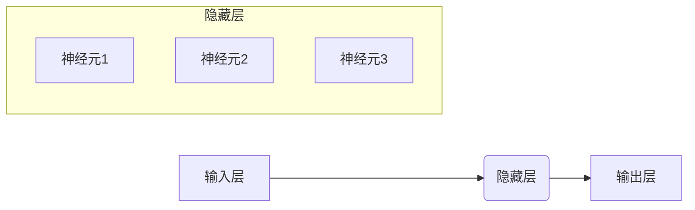

> 激活函数、神经网络、深度学习、线性整流函数 (ReLU)、 sigmoid 函数、tanh 函数、softmax 函数、梯度消失问题、过拟合

## 1. 背景介绍

激活函数是神经网络中不可或缺的组成部分，它决定了神经网络的非线性特性，从而赋予神经网络强大的学习能力。 

在深度学习的浪潮中，激活函数扮演着至关重要的角色。它决定了神经网络的表达能力，影响着模型的训练速度和最终的性能。 

传统的机器学习算法通常处理线性关系，而现实世界中的问题往往是复杂的非线性关系。激活函数的引入，使得神经网络能够学习和处理这些非线性关系，从而提升了模型的表达能力。

## 2. 核心概念与联系

激活函数的作用是将神经元的输入信号转换为输出信号，并引入非线性因素。 

**激活函数的原理：**

* **输入信号：** 神经元接收来自前一层神经元的输入信号，这些信号经过加权求和后形成一个总和。
* **激活函数应用：** 激活函数将这个总和作为输入，并将其转换为输出信号。
* **输出信号：** 输出信号传递到下一层神经元，参与下一层神经元的计算。

**激活函数的类型：**

* **线性激活函数：**  输出信号与输入信号成线性关系，例如 y = x。
* **非线性激活函数：** 输出信号与输入信号之间存在非线性关系，例如 sigmoid 函数、tanh 函数、ReLU 函数等。

**激活函数的架构：**



## 3. 核心算法原理 & 具体操作步骤

### 3.1  算法原理概述

激活函数的算法原理简单，其核心是将输入信号经过非线性变换后输出。 不同的激活函数具有不同的非线性特性，从而影响着神经网络的学习能力和性能。

### 3.2  算法步骤详解

1. **计算加权求和：** 将前一层神经元的输出信号与当前神经元的权重相乘，并求和。
2. **应用激活函数：** 将加权求和的结果作为激活函数的输入，并计算输出信号。
3. **传递输出信号：** 将计算得到的输出信号传递到下一层神经元。

### 3.3  算法优缺点

* **优点：**
    * 引入非线性特性，提升模型的表达能力。
    * 能够学习复杂的非线性关系。
* **缺点：**
    * 不同的激活函数具有不同的性能，需要根据具体任务选择合适的激活函数。
    * 一些激活函数可能存在梯度消失或梯度爆炸的问题。

### 3.4  算法应用领域

激活函数广泛应用于各种深度学习领域，例如：

* **图像识别：** 用于识别图像中的物体、场景等。
* **自然语言处理：** 用于文本分类、机器翻译、情感分析等。
* **语音识别：** 用于识别语音中的单词、句子等。
* **推荐系统：** 用于推荐用户感兴趣的内容。

## 4. 数学模型和公式 & 详细讲解 & 举例说明

### 4.1  数学模型构建

激活函数的数学模型通常是一个非线性函数，其输入是神经元的加权求和，输出是神经元的激活值。

### 4.2  公式推导过程

激活函数的公式推导过程取决于具体的激活函数类型。 

例如，sigmoid 函数的公式如下：

$$
f(x) = \frac{1}{1 + e^{-x}}
$$

其中，x 是神经元的加权求和。

### 4.3  案例分析与讲解

**Sigmoid 函数：**

Sigmoid 函数的输出值范围在 0 到 1 之间，常用于二分类问题。

**ReLU 函数：**

ReLU 函数的输出值是输入值大于 0 的部分，否则输出 0。

**tanh 函数：**

tanh 函数的输出值范围在 -1 到 1 之间，常用于处理连续值。

## 5. 项目实践：代码实例和详细解释说明

### 5.1  开发环境搭建

使用 Python 语言和 TensorFlow 或 PyTorch 深度学习框架进行开发。

### 5.2  源代码详细实现

```python
import tensorflow as tf

# 定义一个简单的 ReLU 激活函数
def relu(x):
  return tf.maximum(0, x)

# 定义一个简单的神经网络模型
model = tf.keras.models.Sequential([
  tf.keras.layers.Dense(128, activation=relu),
  tf.keras.layers.Dense(10, activation='softmax')
])

# 编译模型
model.compile(optimizer='adam',
              loss='sparse_categorical_crossentropy',
              metrics=['accuracy'])

# 训练模型
model.fit(x_train, y_train, epochs=10)
```

### 5.3  代码解读与分析

* `relu(x)` 函数定义了一个 ReLU 激活函数，将输入值大于 0 的部分保留，否则输出 0。
* `tf.keras.models.Sequential` 创建了一个顺序模型，其中包含两层全连接层。
* `tf.keras.layers.Dense` 定义了全连接层，第一层有 128 个神经元，使用 ReLU 激活函数；第二层有 10 个神经元，使用 softmax 激活函数。
* `model.compile` 编译模型，指定优化器、损失函数和评估指标。
* `model.fit` 训练模型，使用训练数据 `x_train` 和标签 `y_train` 进行训练，训练 10 个 epochs。

### 5.4  运行结果展示

训练完成后，可以评估模型的性能，例如在测试数据上计算准确率。

## 6. 实际应用场景

激活函数在深度学习领域有着广泛的应用场景，例如：

* **图像分类：** 使用 CNNs 进行图像分类，ReLU 函数常用于隐藏层激活。
* **自然语言处理：** 使用 RNNs 进行文本分类、机器翻译等任务，tanh 函数或 ReLU 函数常用于隐藏层激活。
* **语音识别：** 使用 RNNs 或 CNNs 进行语音识别，ReLU 函数常用于隐藏层激活。

### 6.4  未来应用展望

随着深度学习技术的不断发展，新的激活函数将会不断涌现，并应用于更广泛的领域。

## 7. 工具和资源推荐

### 7.1  学习资源推荐

* **深度学习书籍：**
    * 《深度学习》
    * 《动手学深度学习》
* **在线课程：**
    * Coursera 深度学习课程
    * Udacity 深度学习课程

### 7.2  开发工具推荐

* **TensorFlow:** https://www.tensorflow.org/
* **PyTorch:** https://pytorch.org/

### 7.3  相关论文推荐

* **《Rectified Linear Units Improve Restricted Boltzmann Machines》**
* **《Gradient-Based Learning Applied to Document Recognition》**

## 8. 总结：未来发展趋势与挑战

### 8.1  研究成果总结

激活函数是深度学习中不可或缺的一部分，其发展推动了深度学习的进步。

### 8.2  未来发展趋势

* **探索新的激活函数：** 研究更有效的激活函数，例如自适应激活函数、可微分激活函数等。
* **激活函数的组合：** 研究不同激活函数的组合，以提高模型的性能。
* **激活函数的动态调整：** 研究根据任务和数据动态调整激活函数的方法。

### 8.3  面临的挑战

* **梯度消失或梯度爆炸问题：** 一些激活函数可能导致梯度消失或梯度爆炸问题，影响模型的训练。
* **过拟合问题：** 过复杂的激活函数可能导致模型过拟合，降低模型的泛化能力。

### 8.4  研究展望

未来，激活函数的研究将继续深入，探索更有效的激活函数，并解决现有激活函数的挑战，从而推动深度学习技术的进一步发展。

## 9. 附录：常见问题与解答

* **为什么需要激活函数？**

激活函数引入非线性特性，使得神经网络能够学习复杂的非线性关系。

* **常见的激活函数有哪些？**

常见的激活函数包括 sigmoid 函数、tanh 函数、ReLU 函数、softmax 函数等。

* **如何选择合适的激活函数？**

选择合适的激活函数取决于具体的任务和数据。

* **如何解决梯度消失或梯度爆炸问题？**

可以使用 Batch Normalization、ReLU 函数等方法来解决梯度消失或梯度爆炸问题。


作者：禅与计算机程序设计艺术 / Zen and the Art of Computer Programming 
<end_of_turn>